# Manipulator URDF Cross-Simulator Render Dataset

This repository contains paired canonical-view renderings of **131 fixed-base manipulator URDF bundles** in two simulation environments:

- **MuJoCo**
- **PyBullet TinyRenderer**

The same robot set is rendered in both environments at **1024 × 1024** resolution using four canonical viewpoints:

- `iso.png`
- `front.png`
- `side.png`
- `top.png`

The paired renders support sim-to-sim visual comparison and retrieval experiments across simulation pipelines.

## Repository layout

```text
repo/
├── README.md
├── mujoco/
│   └── images/
│       └── ...
└── pybullet/
    └── images/
        └── ...
```

The directory hierarchy below `mujoco/images/` and `pybullet/images/` is identical, so corresponding robot renders can be matched by relative path.

## Dataset summary

| Item | Value |
|---|---:|
| Paired manipulators | 131 |
| Renderers | 2 |
| Views per robot per renderer | 4 |
| Image resolution | 1024 × 1024 |
| Total paired render images | 1048 |

## Source composition

| Source | Count |
|---|---:|
| ROS-Industrial | 86 |
| MATLAB Robotics | 15 |
| Robotics Toolbox | 13 |
| Drake | 7 |
| Others | 10 |
| **Total** | **131** |

`Others` combines the smaller source groups stored under `random/` and `oems/`.

## Gallery

# Combined Manipulator Render Gallery

This gallery pairs the same 131 fixed-base manipulator URDF bundles rendered in **MuJoCo** and **PyBullet TinyRenderer**.

Assumed repository layout:

```text
repo/
├── README.md
├── GALLERY.md
├── mujoco/
│   └── images/
└── pybullet/
    └── images/
```

Each robot is shown using the isometric render. Click either image for the full-size file.  
The `front`, `side`, and `top` links are also provided for both renderers.

| Name | Source | Manufacturer | MuJoCo | PyBullet |
|---|---|---|---|---|
| crb15000_<wbr>5_<wbr>95 | ROS-Industrial | ABB | <a href="mujoco/images/ros-industrial/xacro_generated/abb/abb_crb15000_support/crb15000_5_95/iso.png">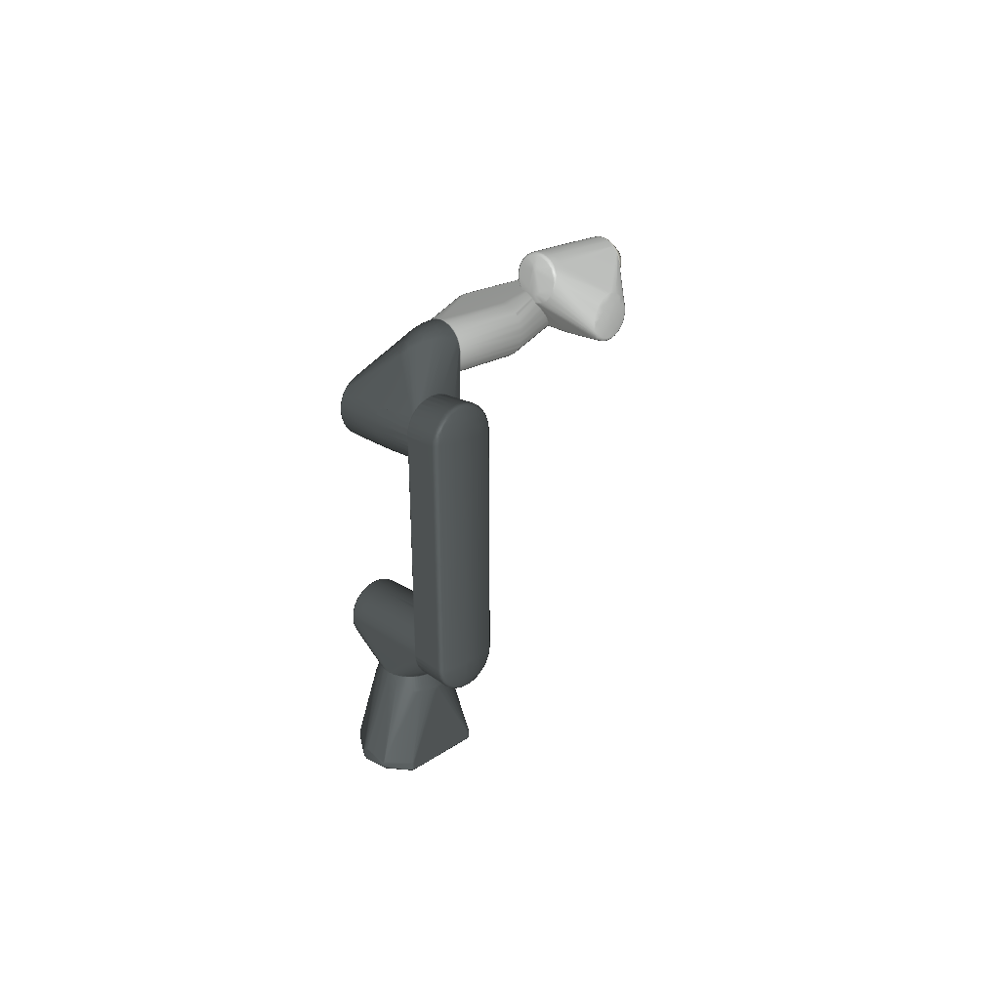</a><br>[front](mujoco/images/ros-industrial/xacro_generated/abb/abb_crb15000_support/crb15000_5_95/front.png) · [side](mujoco/images/ros-industrial/xacro_generated/abb/abb_crb15000_support/crb15000_5_95/side.png) · [top](mujoco/images/ros-industrial/xacro_generated/abb/abb_crb15000_support/crb15000_5_95/top.png) | <a href="pybullet/images/ros-industrial/xacro_generated/abb/abb_crb15000_support/crb15000_5_95/iso.png">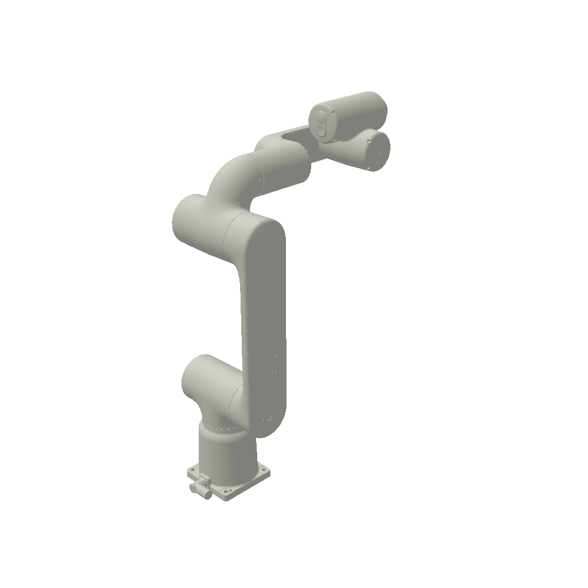</a><br>[front](pybullet/images/ros-industrial/xacro_generated/abb/abb_crb15000_support/crb15000_5_95/front.png) · [side](pybullet/images/ros-industrial/xacro_generated/abb/abb_crb15000_support/crb15000_5_95/side.png) · [top](pybullet/images/ros-industrial/xacro_generated/abb/abb_crb15000_support/crb15000_5_95/top.png) |
| irb1200_<wbr>5_<wbr>90 | ROS-Industrial | ABB | <a href="mujoco/images/ros-industrial/xacro_generated/abb/abb_irb1200_support/irb1200_5_90/iso.png">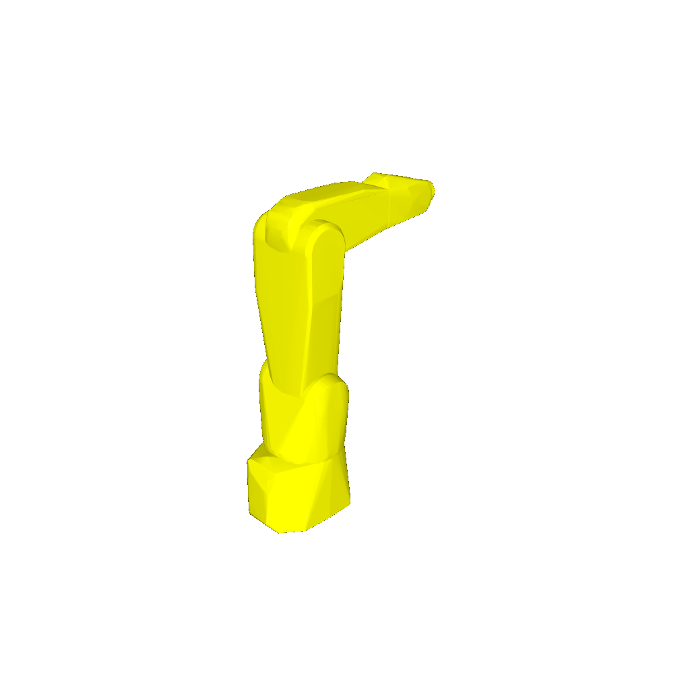</a><br>[front](mujoco/images/ros-industrial/xacro_generated/abb/abb_irb1200_support/irb1200_5_90/front.png) · [side](mujoco/images/ros-industrial/xacro_generated/abb/abb_irb1200_support/irb1200_5_90/side.png) · [top](mujoco/images/ros-industrial/xacro_generated/abb/abb_irb1200_support/irb1200_5_90/top.png) | <a href="pybullet/images/ros-industrial/xacro_generated/abb/abb_irb1200_support/irb1200_5_90/iso.png">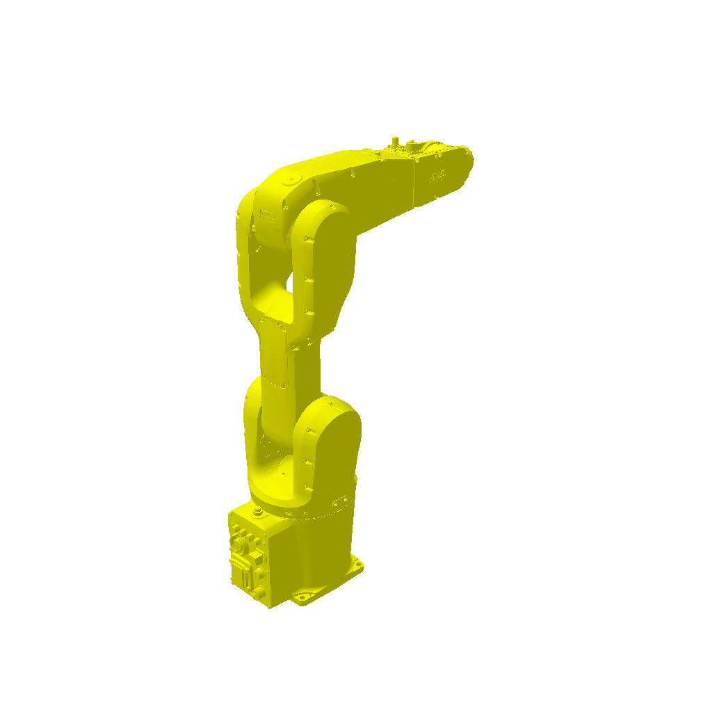</a><br>[front](pybullet/images/ros-industrial/xacro_generated/abb/abb_irb1200_support/irb1200_5_90/front.png) · [side](pybullet/images/ros-industrial/xacro_generated/abb/abb_irb1200_support/irb1200_5_90/side.png) · [top](pybullet/images/ros-industrial/xacro_generated/abb/abb_irb1200_support/irb1200_5_90/top.png) |
| irb1200_<wbr>7_<wbr>70 | ROS-Industrial | ABB | <a href="mujoco/images/ros-industrial/xacro_generated/abb/abb_irb1200_support/irb1200_7_70/iso.png">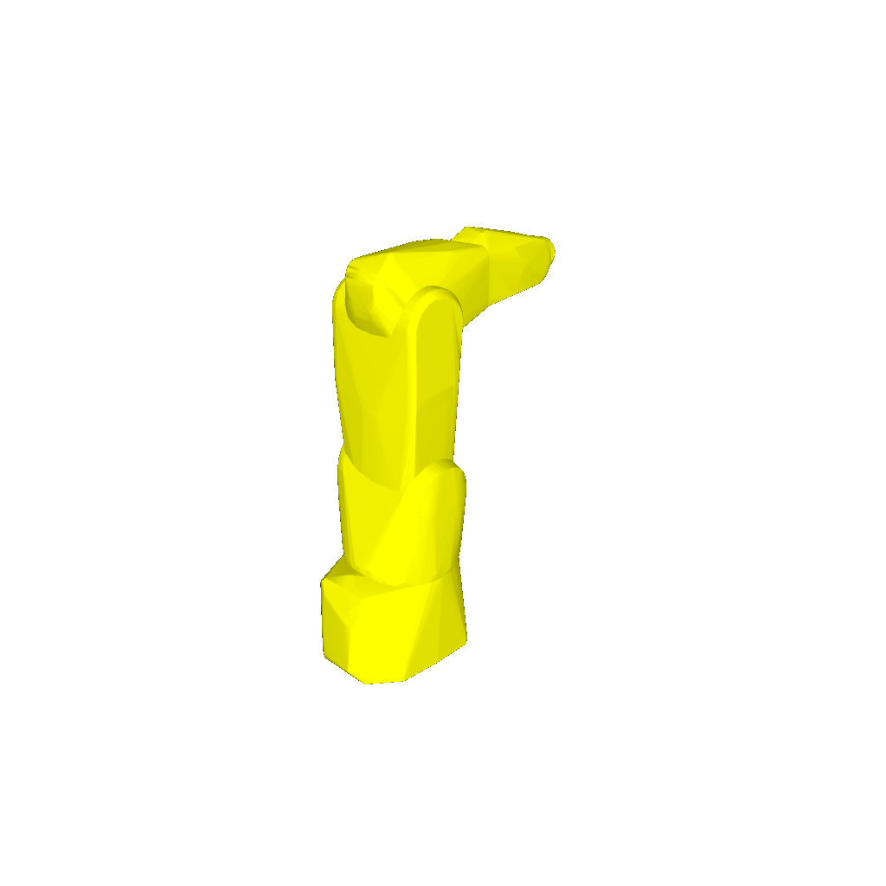</a><br>[front](mujoco/images/ros-industrial/xacro_generated/abb/abb_irb1200_support/irb1200_7_70/front.png) · [side](mujoco/images/ros-industrial/xacro_generated/abb/abb_irb1200_support/irb1200_7_70/side.png) · [top](mujoco/images/ros-industrial/xacro_generated/abb/abb_irb1200_support/irb1200_7_70/top.png) | <a href="pybullet/images/ros-industrial/xacro_generated/abb/abb_irb1200_support/irb1200_7_70/iso.png">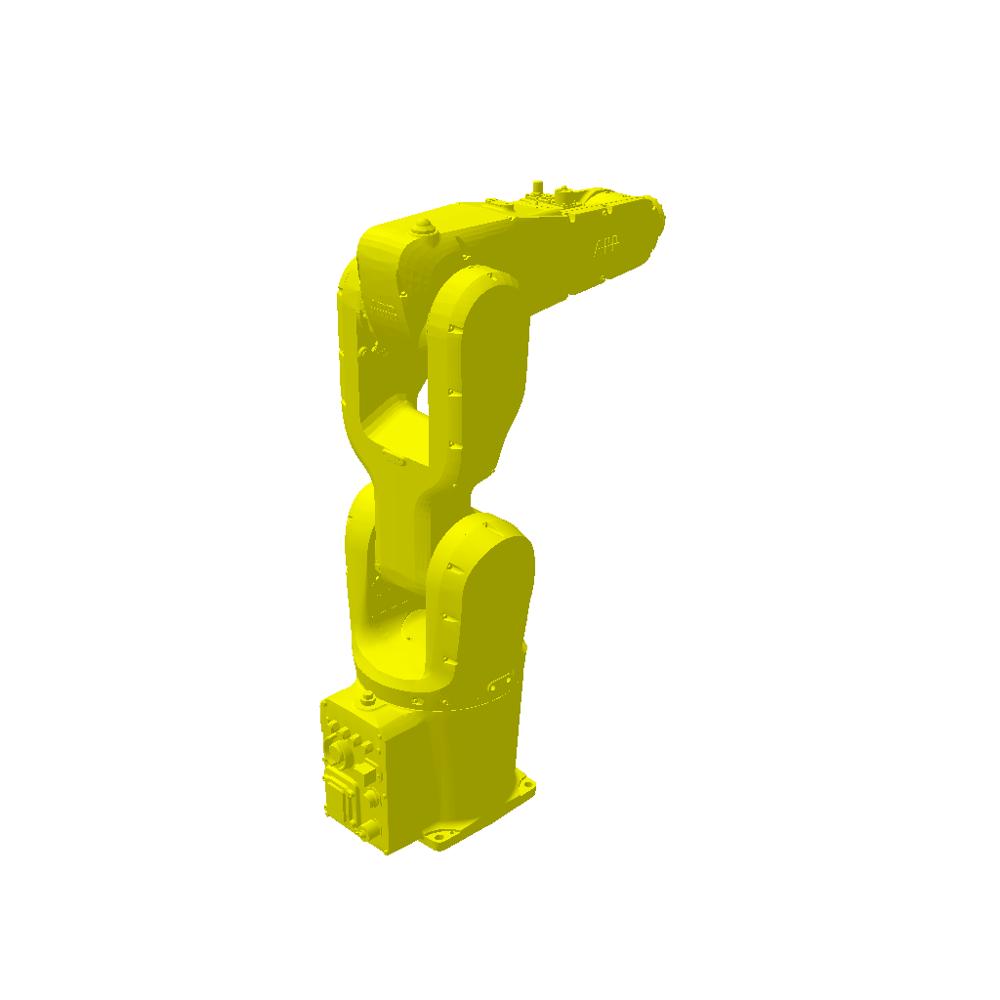</a><br>[front](pybullet/images/ros-industrial/xacro_generated/abb/abb_irb1200_support/irb1200_7_70/front.png) · [side](pybullet/images/ros-industrial/xacro_generated/abb/abb_irb1200_support/irb1200_7_70/side.png) · [top](pybullet/images/ros-industrial/xacro_generated/abb/abb_irb1200_support/irb1200_7_70/top.png) |
| irb120_<wbr>3_<wbr>58 | ROS-Industrial | ABB | <a href="mujoco/images/ros-industrial/xacro_generated/abb/abb_irb120_support/irb120_3_58/iso.png"></a><br>[front](mujoco/images/ros-industrial/xacro_generated/abb/abb_irb120_support/irb120_3_58/front.png) · [side](mujoco/images/ros-industrial/xacro_generated/abb/abb_irb120_support/irb120_3_58/side.png) · [top](mujoco/images/ros-industrial/xacro_generated/abb/abb_irb120_support/irb120_3_58/top.png) | <a href="pybullet/images/ros-industrial/xacro_generated/abb/abb_irb120_support/irb120_3_58/iso.png"></a><br>[front](pybullet/images/ros-industrial/xacro_generated/abb/abb_irb120_support/irb120_3_58/front.png) · [side](pybullet/images/ros-industrial/xacro_generated/abb/abb_irb120_support/irb120_3_58/side.png) · [top](pybullet/images/ros-industrial/xacro_generated/abb/abb_irb120_support/irb120_3_58/top.png) |
| irb120t_<wbr>3_<wbr>58 | ROS-Industrial | ABB | <a href="mujoco/images/ros-industrial/xacro_generated/abb/abb_irb120_support/irb120t_3_58/iso.png"></a><br>[front](mujoco/images/ros-industrial/xacro_generated/abb/abb_irb120_support/irb120t_3_58/front.png) · [side](mujoco/images/ros-industrial/xacro_generated/abb/abb_irb120_support/irb120t_3_58/side.png) · [top](mujoco/images/ros-industrial/xacro_generated/abb/abb_irb120_support/irb120t_3_58/top.png) | <a href="pybullet/images/ros-industrial/xacro_generated/abb/abb_irb120_support/irb120t_3_58/iso.png"></a><br>[front](pybullet/images/ros-industrial/xacro_generated/abb/abb_irb120_support/irb120t_3_58/front.png) · [side](pybullet/images/ros-industrial/xacro_generated/abb/abb_irb120_support/irb120t_3_58/side.png) · [top](pybullet/images/ros-industrial/xacro_generated/abb/abb_irb120_support/irb120t_3_58/top.png) |
| irb1600_<wbr>6_<wbr>12 | ROS-Industrial | ABB | <a href="mujoco/images/ros-industrial/xacro_generated/abb/abb_irb1600_support/irb1600_6_12/iso.png"></a><br>[front](mujoco/images/ros-industrial/xacro_generated/abb/abb_irb1600_support/irb1600_6_12/front.png) · [side](mujoco/images/ros-industrial/xacro_generated/abb/abb_irb1600_support/irb1600_6_12/side.png) · [top](mujoco/images/ros-industrial/xacro_generated/abb/abb_irb1600_support/irb1600_6_12/top.png) | <a href="pybullet/images/ros-industrial/xacro_generated/abb/abb_irb1600_support/irb1600_6_12/iso.png">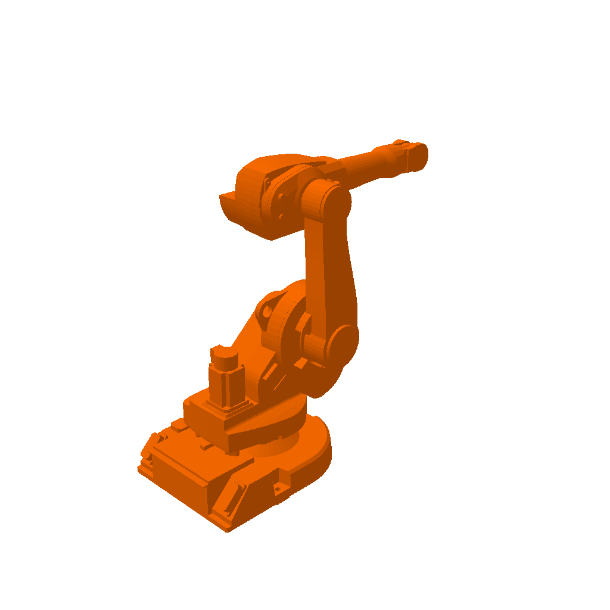</a><br>[front](pybullet/images/ros-industrial/xacro_generated/abb/abb_irb1600_support/irb1600_6_12/front.png) · [side](pybullet/images/ros-industrial/xacro_generated/abb/abb_irb1600_support/irb1600_6_12/side.png) · [top](pybullet/images/ros-industrial/xacro_generated/abb/abb_irb1600_support/irb1600_6_12/top.png) |
| irb1600_<wbr>8_<wbr>145 | ROS-Industrial | ABB | <a href="mujoco/images/ros-industrial/xacro_generated/abb/abb_irb1600_support/irb1600_8_145/iso.png">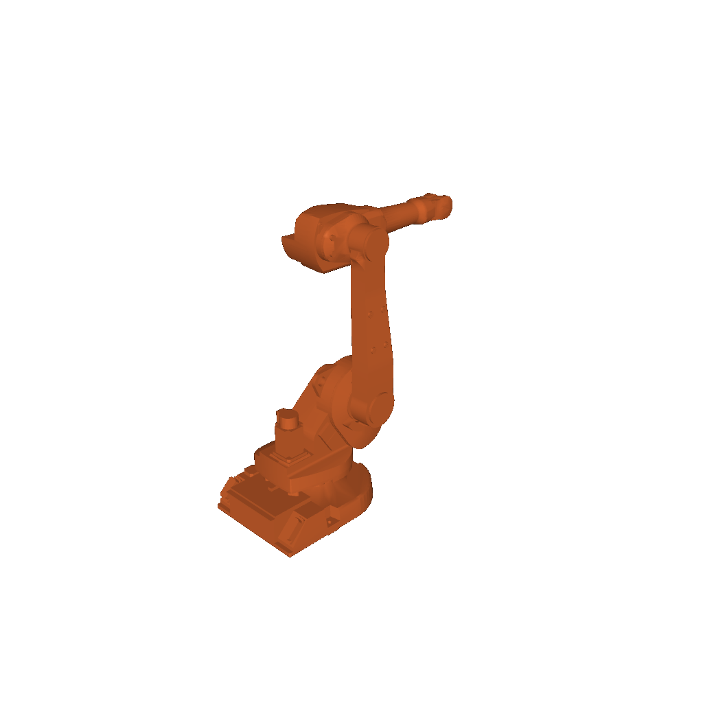</a><br>[front](mujoco/images/ros-industrial/xacro_generated/abb/abb_irb1600_support/irb1600_8_145/front.png) · [side](mujoco/images/ros-industrial/xacro_generated/abb/abb_irb1600_support/irb1600_8_145/side.png) · [top](mujoco/images/ros-industrial/xacro_generated/abb/abb_irb1600_support/irb1600_8_145/top.png) | <a href="pybullet/images/ros-industrial/xacro_generated/abb/abb_irb1600_support/irb1600_8_145/iso.png">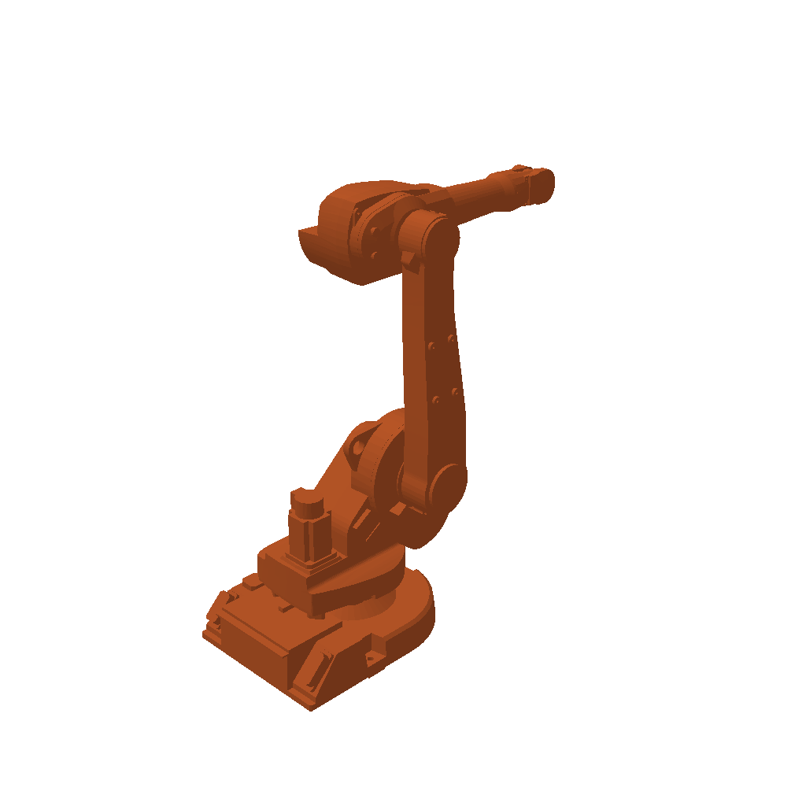</a><br>[front](pybullet/images/ros-industrial/xacro_generated/abb/abb_irb1600_support/irb1600_8_145/front.png) · [side](pybullet/images/ros-industrial/xacro_generated/abb/abb_irb1600_support/irb1600_8_145/side.png) · [top](pybullet/images/ros-industrial/xacro_generated/abb/abb_irb1600_support/irb1600_8_145/top.png) |
| irb2400 | ROS-Industrial | ABB | <a href="mujoco/images/ros-industrial/abb/abb_irb2400_support/irb2400/iso.png">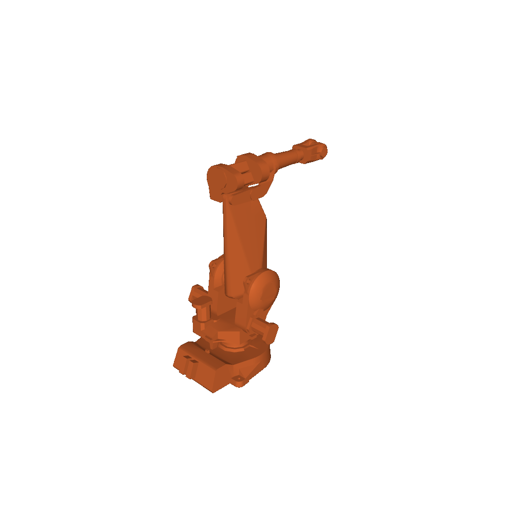</a><br>[front](mujoco/images/ros-industrial/abb/abb_irb2400_support/irb2400/front.png) · [side](mujoco/images/ros-industrial/abb/abb_irb2400_support/irb2400/side.png) · [top](mujoco/images/ros-industrial/abb/abb_irb2400_support/irb2400/top.png) | <a href="pybullet/images/ros-industrial/abb/abb_irb2400_support/irb2400/iso.png">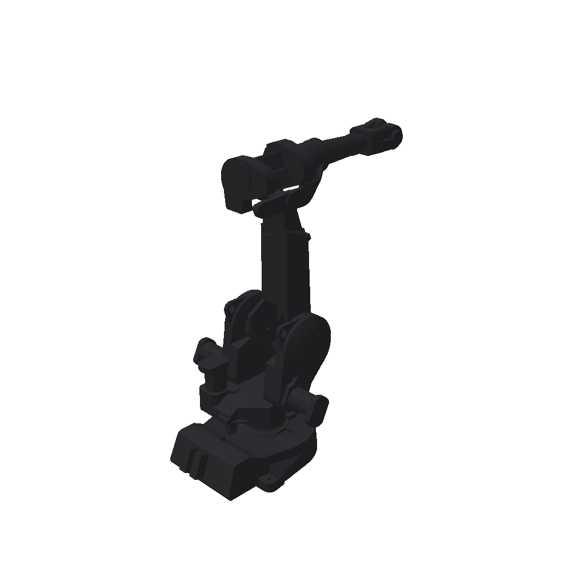</a><br>[front](pybullet/images/ros-industrial/abb/abb_irb2400_support/irb2400/front.png) · [side](pybullet/images/ros-industrial/abb/abb_irb2400_support/irb2400/side.png) · [top](pybullet/images/ros-industrial/abb/abb_irb2400_support/irb2400/top.png) |
| irb2600_<wbr>12_<wbr>165 | ROS-Industrial | ABB | <a href="mujoco/images/ros-industrial/xacro_generated/abb/abb_irb2600_support/irb2600_12_165/iso.png">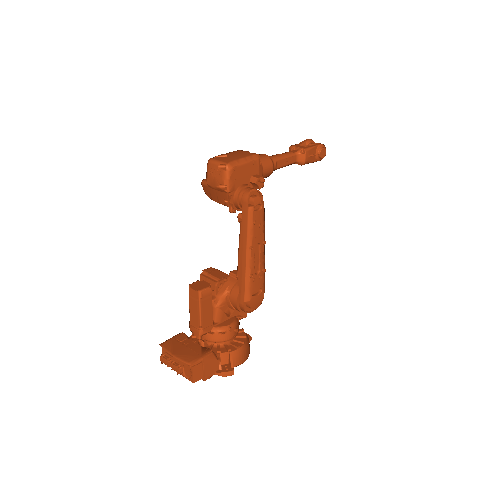</a><br>[front](mujoco/images/ros-industrial/xacro_generated/abb/abb_irb2600_support/irb2600_12_165/front.png) · [side](mujoco/images/ros-industrial/xacro_generated/abb/abb_irb2600_support/irb2600_12_165/side.png) · [top](mujoco/images/ros-industrial/xacro_generated/abb/abb_irb2600_support/irb2600_12_165/top.png) | <a href="pybullet/images/ros-industrial/xacro_generated/abb/abb_irb2600_support/irb2600_12_165/iso.png">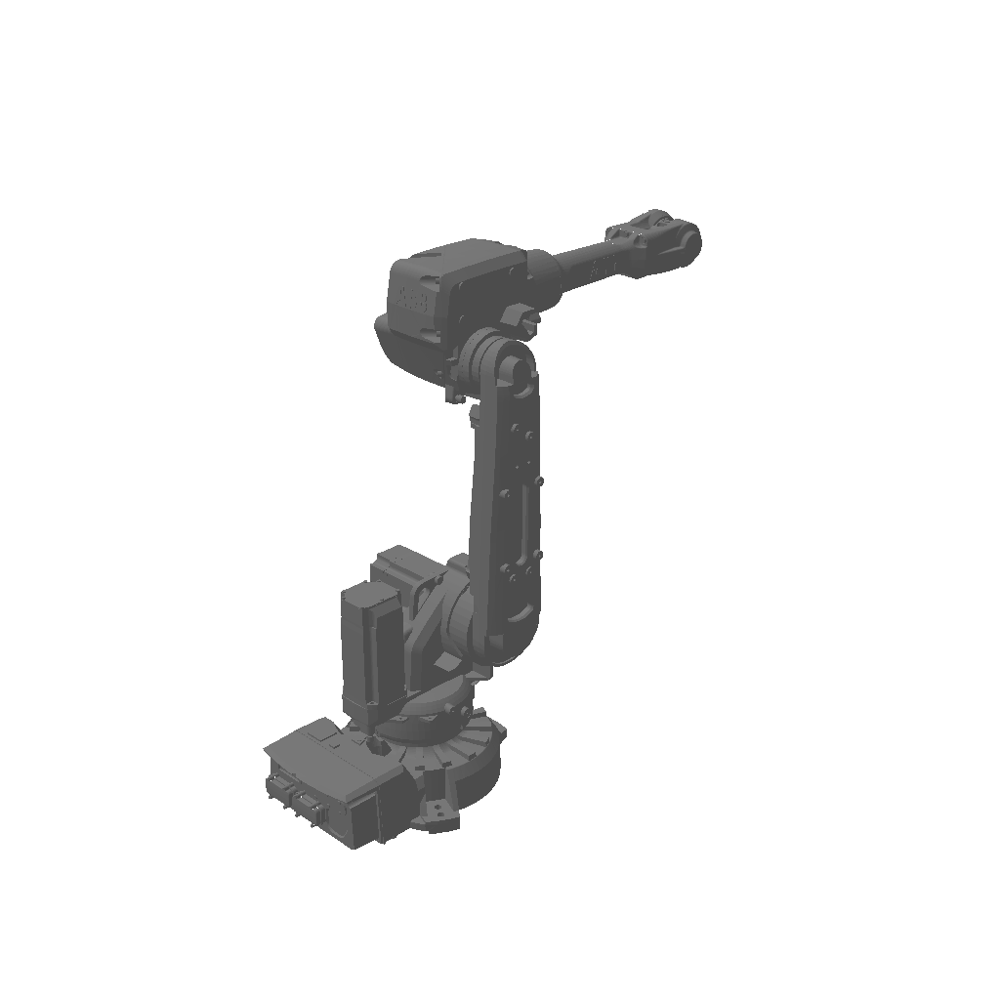</a><br>[front](pybullet/images/ros-industrial/xacro_generated/abb/abb_irb2600_support/irb2600_12_165/front.png) · [side](pybullet/images/ros-industrial/xacro_generated/abb/abb_irb2600_support/irb2600_12_165/side.png) · [top](pybullet/images/ros-industrial/xacro_generated/abb/abb_irb2600_support/irb2600_12_165/top.png) |
| irb4400l_<wbr>30_<wbr>243 | ROS-Industrial | ABB | <a href="mujoco/images/ros-industrial/xacro_generated/abb/abb_irb4400_support/irb4400l_30_243/iso.png">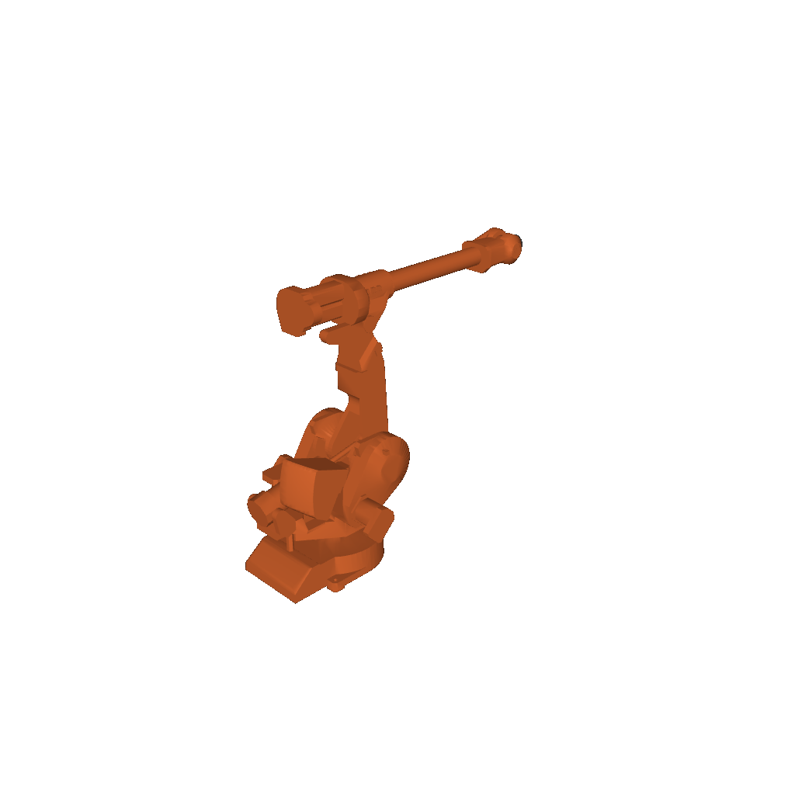</a><br>[front](mujoco/images/ros-industrial/xacro_generated/abb/abb_irb4400_support/irb4400l_30_243/front.png) · [side](mujoco/images/ros-industrial/xacro_generated/abb/abb_irb4400_support/irb4400l_30_243/side.png) · [top](mujoco/images/ros-industrial/xacro_generated/abb/abb_irb4400_support/irb4400l_30_243/top.png) | <a href="pybullet/images/ros-industrial/xacro_generated/abb/abb_irb4400_support/irb4400l_30_243/iso.png">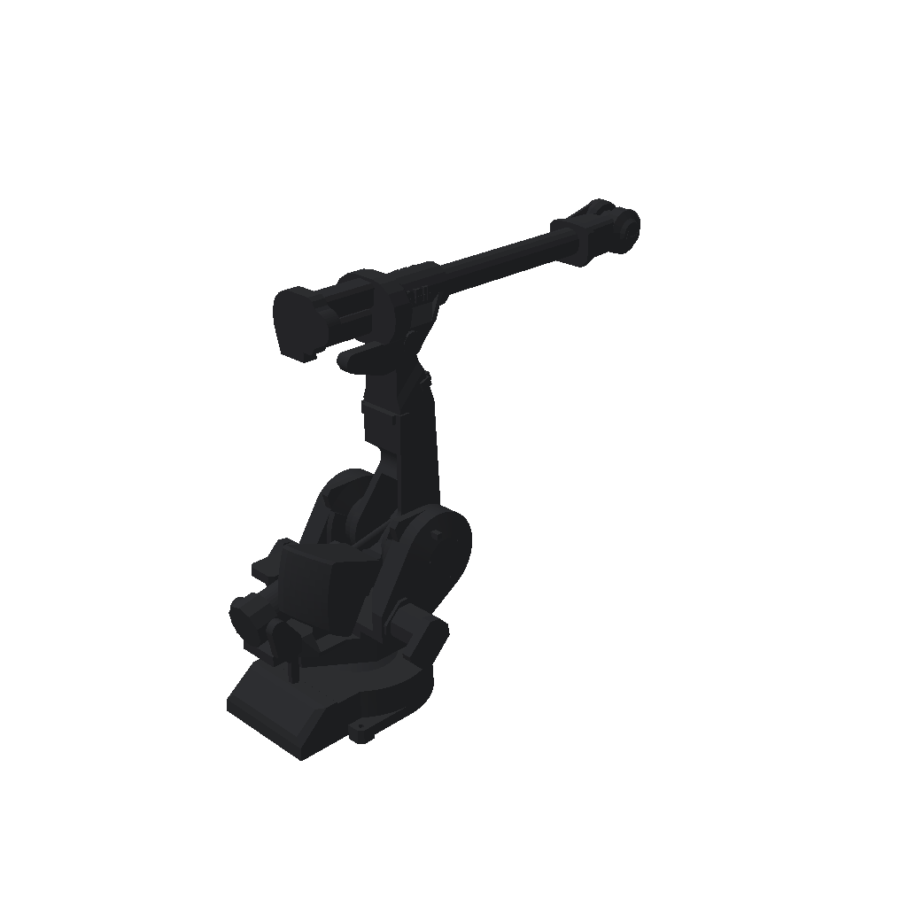</a><br>[front](pybullet/images/ros-industrial/xacro_generated/abb/abb_irb4400_support/irb4400l_30_243/front.png) · [side](pybullet/images/ros-industrial/xacro_generated/abb/abb_irb4400_support/irb4400l_30_243/side.png) · [top](pybullet/images/ros-industrial/xacro_generated/abb/abb_irb4400_support/irb4400l_30_243/top.png) |
| irb4600_<wbr>60_<wbr>205 | ROS-Industrial | ABB | <a href="mujoco/images/ros-industrial/xacro_generated/abb/abb_irb4600_support/irb4600_60_205/iso.png">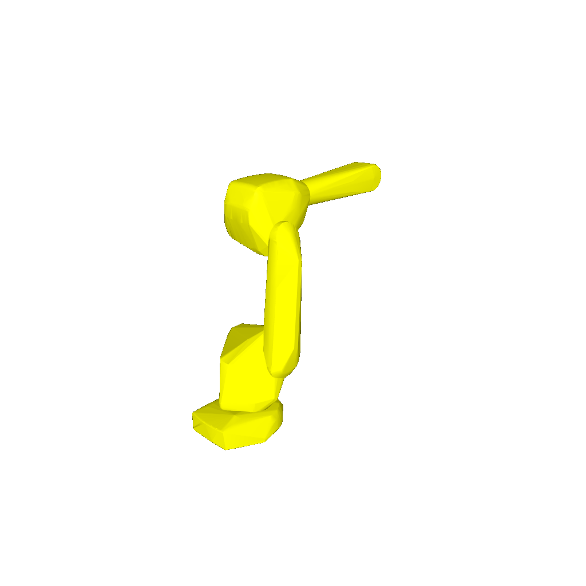</a><br>[front](mujoco/images/ros-industrial/xacro_generated/abb/abb_irb4600_support/irb4600_60_205/front.png) · [side](mujoco/images/ros-industrial/xacro_generated/abb/abb_irb4600_support/irb4600_60_205/side.png) · [top](mujoco/images/ros-industrial/xacro_generated/abb/abb_irb4600_support/irb4600_60_205/top.png) | <a href="pybullet/images/ros-industrial/xacro_generated/abb/abb_irb4600_support/irb4600_60_205/iso.png">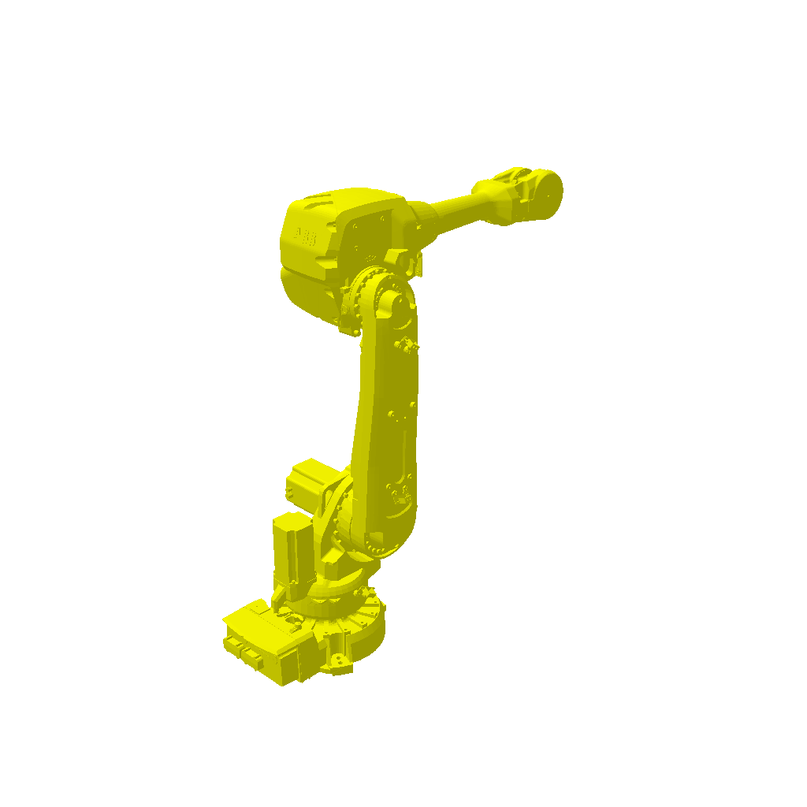</a><br>[front](pybullet/images/ros-industrial/xacro_generated/abb/abb_irb4600_support/irb4600_60_205/front.png) · [side](pybullet/images/ros-industrial/xacro_generated/abb/abb_irb4600_support/irb4600_60_205/side.png) · [top](pybullet/images/ros-industrial/xacro_generated/abb/abb_irb4600_support/irb4600_60_205/top.png) |
| irb52_<wbr>7_<wbr>120 | ROS-Industrial | ABB | <a href="mujoco/images/ros-industrial/xacro_generated/abb/abb_irb52_support/irb52_7_120/iso.png">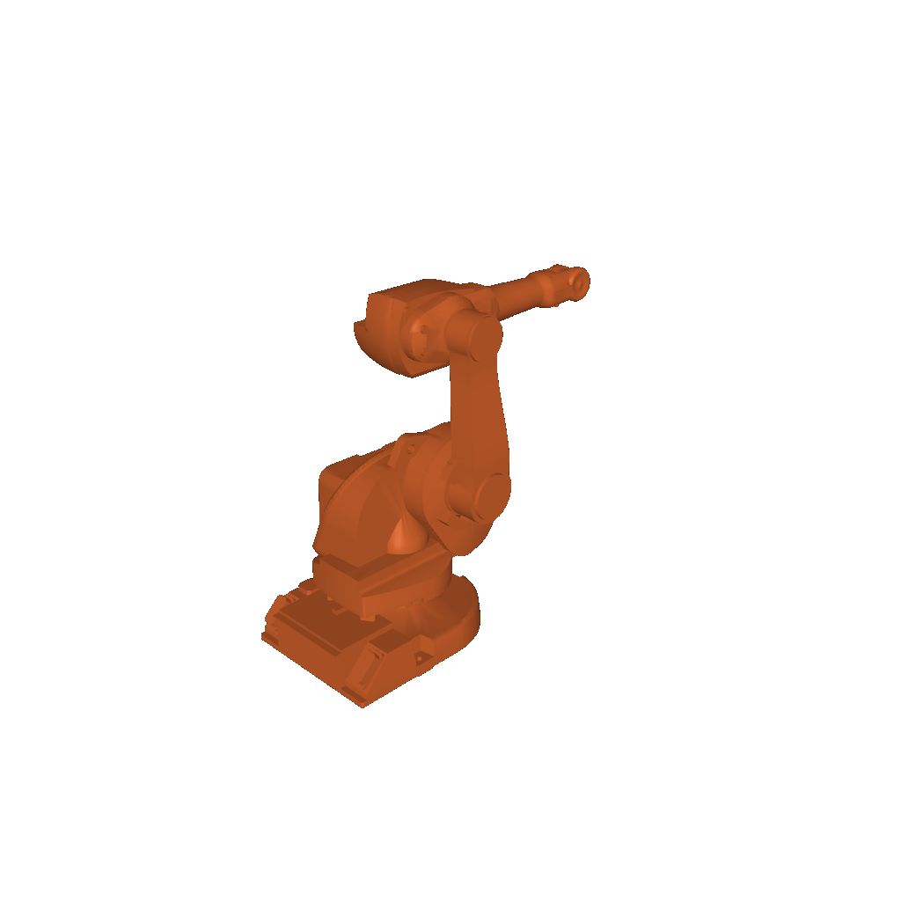</a><br>[front](mujoco/images/ros-industrial/xacro_generated/abb/abb_irb52_support/irb52_7_120/front.png) · [side](mujoco/images/ros-industrial/xacro_generated/abb/abb_irb52_support/irb52_7_120/side.png) · [top](mujoco/images/ros-industrial/xacro_generated/abb/abb_irb52_support/irb52_7_120/top.png) | <a href="pybullet/images/ros-industrial/xacro_generated/abb/abb_irb52_support/irb52_7_120/iso.png">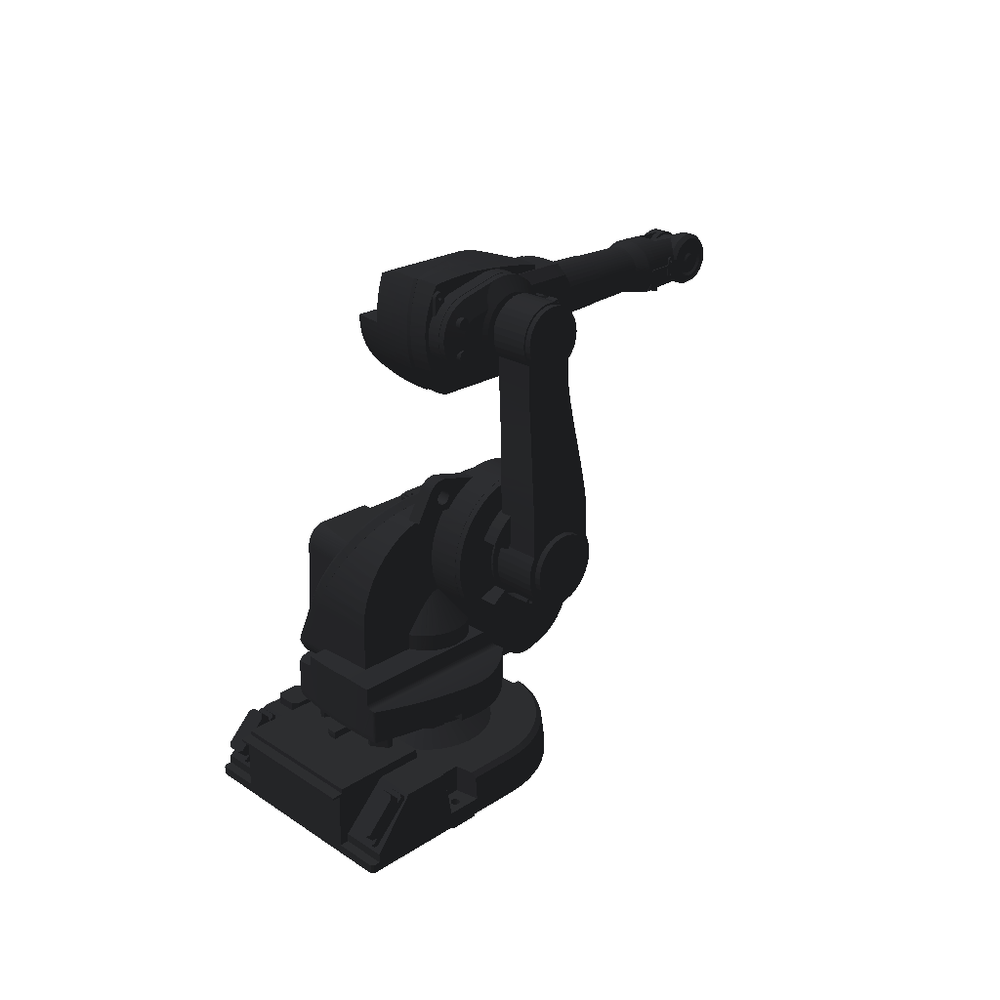</a><br>[front](pybullet/images/ros-industrial/xacro_generated/abb/abb_irb52_support/irb52_7_120/front.png) · [side](pybullet/images/ros-industrial/xacro_generated/abb/abb_irb52_support/irb52_7_120/side.png) · [top](pybullet/images/ros-industrial/xacro_generated/abb/abb_irb52_support/irb52_7_120/top.png) |
| irb52_<wbr>7_<wbr>145 | ROS-Industrial | ABB | <a href="mujoco/images/ros-industrial/xacro_generated/abb/abb_irb52_support/irb52_7_145/iso.png">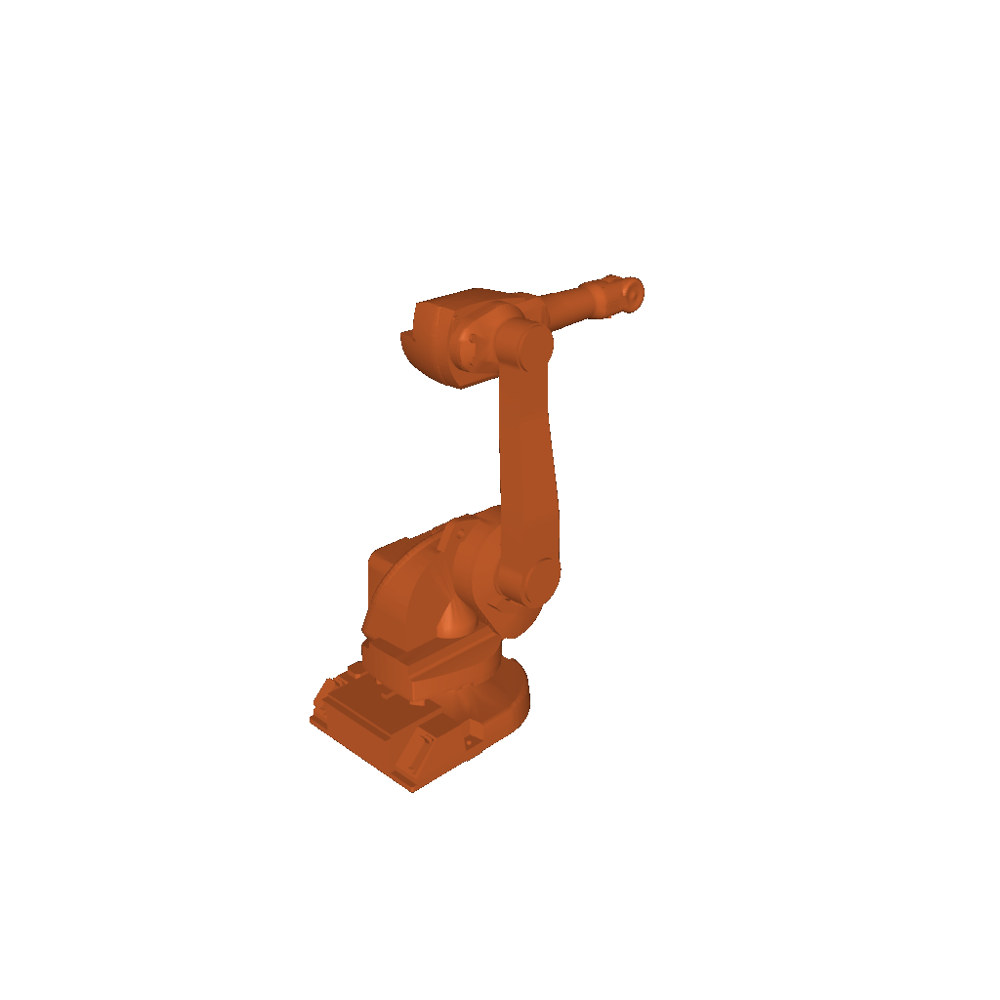</a><br>[front](mujoco/images/ros-industrial/xacro_generated/abb/abb_irb52_support/irb52_7_145/front.png) · [side](mujoco/images/ros-industrial/xacro_generated/abb/abb_irb52_support/irb52_7_145/side.png) · [top](mujoco/images/ros-industrial/xacro_generated/abb/abb_irb52_support/irb52_7_145/top.png) | <a href="pybullet/images/ros-industrial/xacro_generated/abb/abb_irb52_support/irb52_7_145/iso.png">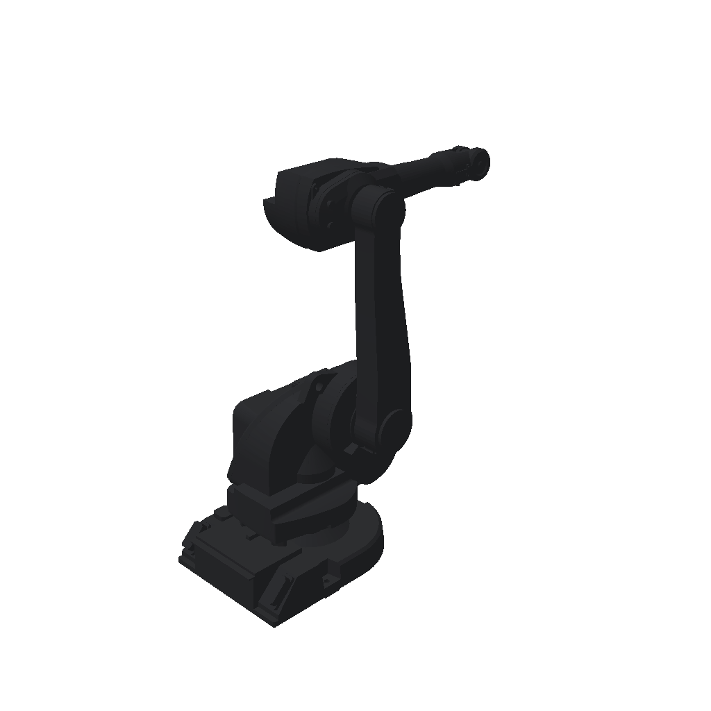</a><br>[front](pybullet/images/ros-industrial/xacro_generated/abb/abb_irb52_support/irb52_7_145/front.png) · [side](pybullet/images/ros-industrial/xacro_generated/abb/abb_irb52_support/irb52_7_145/side.png) · [top](pybullet/images/ros-industrial/xacro_generated/abb/abb_irb52_support/irb52_7_145/top.png) |
| irb6600_<wbr>225_<wbr>255 | ROS-Industrial | ABB | <a href="mujoco/images/ros-industrial/xacro_generated/abb/abb_irb6600_support/irb6600_225_255/iso.png">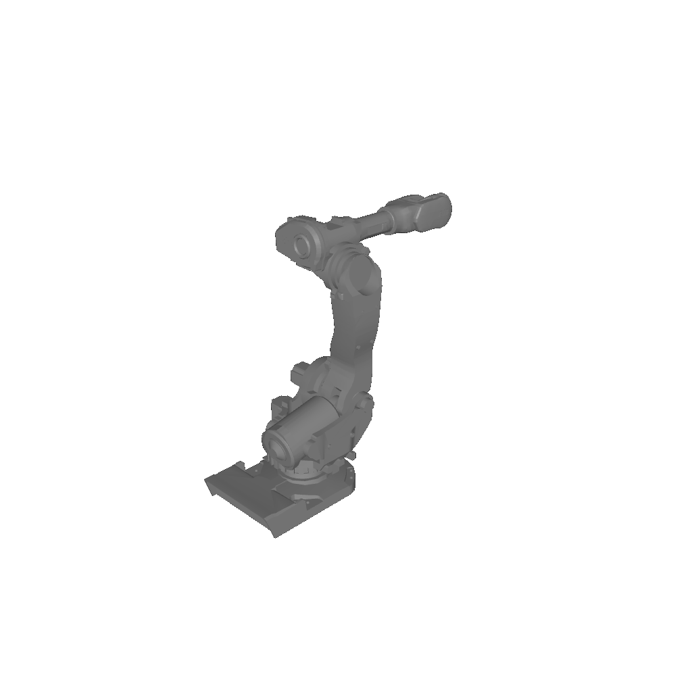</a><br>[front](mujoco/images/ros-industrial/xacro_generated/abb/abb_irb6600_support/irb6600_225_255/front.png) · [side](mujoco/images/ros-industrial/xacro_generated/abb/abb_irb6600_support/irb6600_225_255/side.png) · [top](mujoco/images/ros-industrial/xacro_generated/abb/abb_irb6600_support/irb6600_225_255/top.png) | <a href="pybullet/images/ros-industrial/xacro_generated/abb/abb_irb6600_support/irb6600_225_255/iso.png">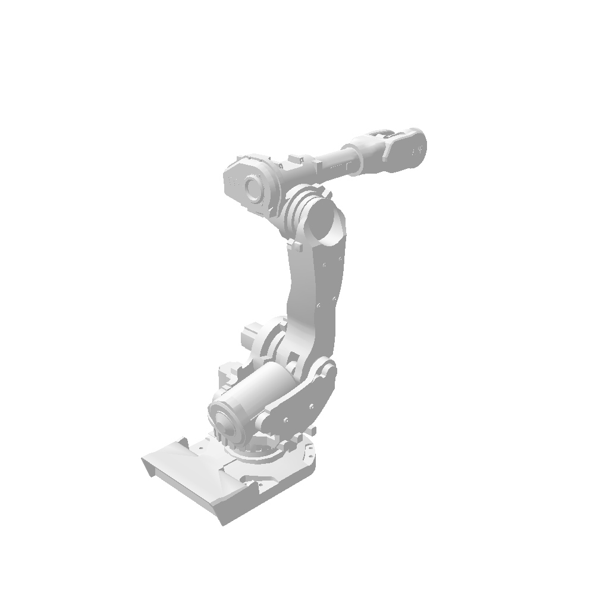</a><br>[front](pybullet/images/ros-industrial/xacro_generated/abb/abb_irb6600_support/irb6600_225_255/front.png) · [side](pybullet/images/ros-industrial/xacro_generated/abb/abb_irb6600_support/irb6600_225_255/side.png) · [top](pybullet/images/ros-industrial/xacro_generated/abb/abb_irb6600_support/irb6600_225_255/top.png) |
| irb6650s_<wbr>125_<wbr>350 | ROS-Industrial | ABB | <a href="mujoco/images/ros-industrial/xacro_generated/abb/abb_irb6650s_support/irb6650s_125_350/iso.png">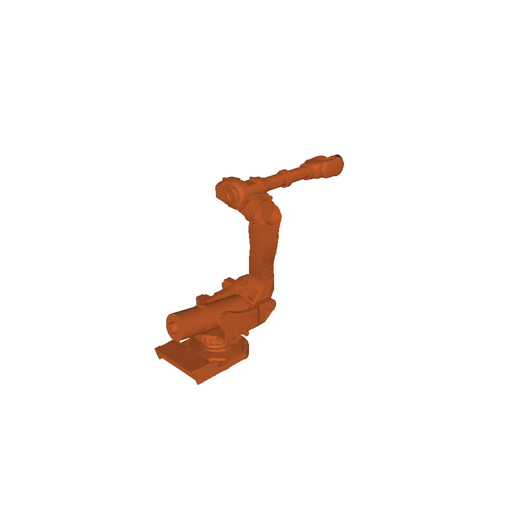</a><br>[front](mujoco/images/ros-industrial/xacro_generated/abb/abb_irb6650s_support/irb6650s_125_350/front.png) · [side](mujoco/images/ros-industrial/xacro_generated/abb/abb_irb6650s_support/irb6650s_125_350/side.png) · [top](mujoco/images/ros-industrial/xacro_generated/abb/abb_irb6650s_support/irb6650s_125_350/top.png) | <a href="pybullet/images/ros-industrial/xacro_generated/abb/abb_irb6650s_support/irb6650s_125_350/iso.png">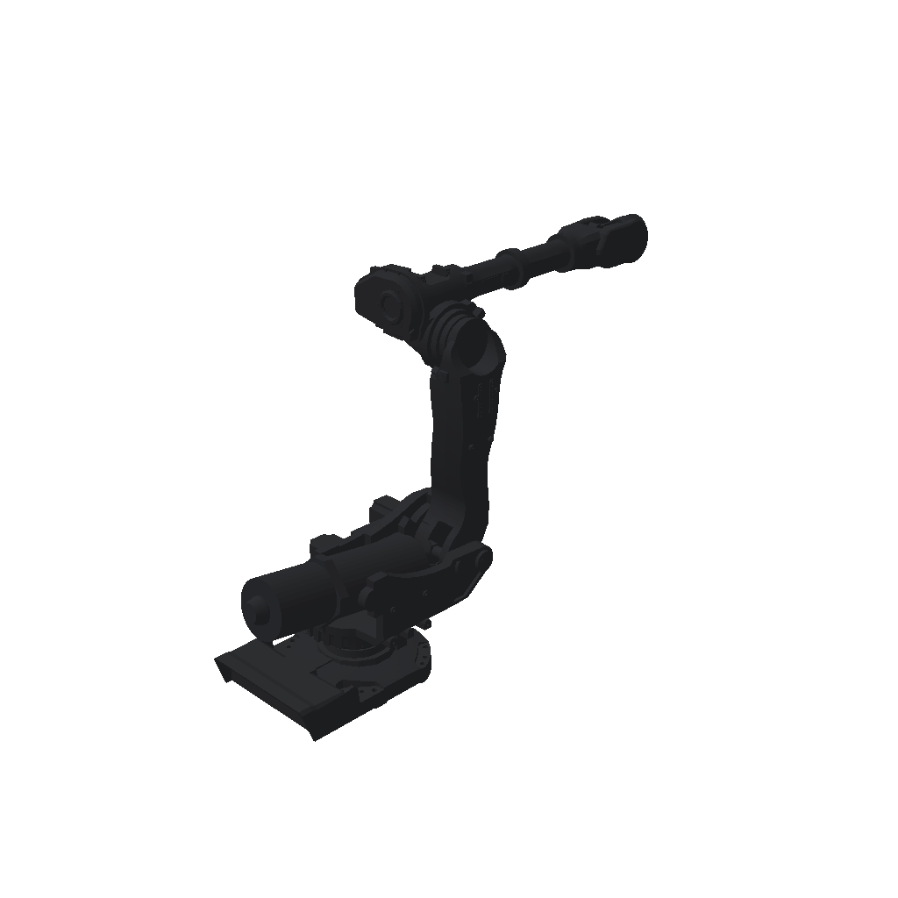</a><br>[front](pybullet/images/ros-industrial/xacro_generated/abb/abb_irb6650s_support/irb6650s_125_350/front.png) · [side](pybullet/images/ros-industrial/xacro_generated/abb/abb_irb6650s_support/irb6650s_125_350/side.png) · [top](pybullet/images/ros-industrial/xacro_generated/abb/abb_irb6650s_support/irb6650s_125_350/top.png) |
| irb6650s_<wbr>90_<wbr>390 | ROS-Industrial | ABB | <a href="mujoco/images/ros-industrial/xacro_generated/abb/abb_irb6650s_support/irb6650s_90_390/iso.png">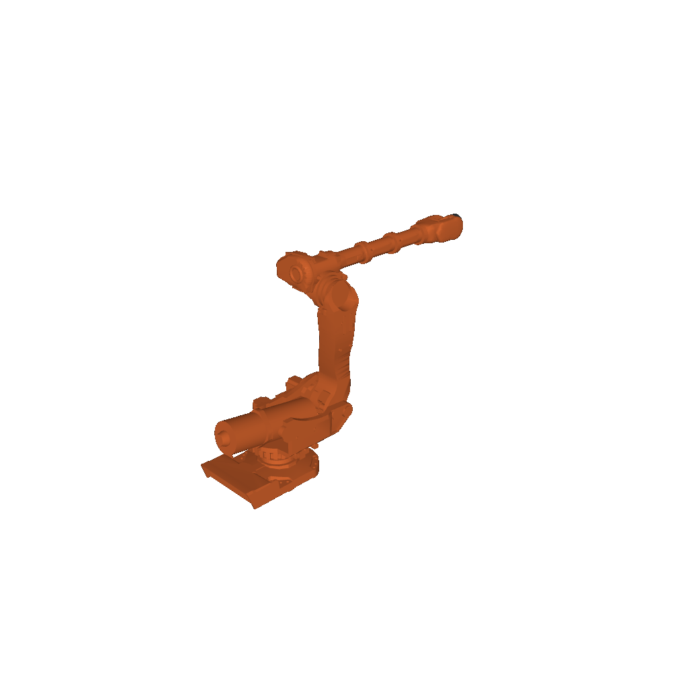</a><br>[front](mujoco/images/ros-industrial/xacro_generated/abb/abb_irb6650s_support/irb6650s_90_390/front.png) · [side](mujoco/images/ros-industrial/xacro_generated/abb/abb_irb6650s_support/irb6650s_90_390/side.png) · [top](mujoco/images/ros-industrial/xacro_generated/abb/abb_irb6650s_support/irb6650s_90_390/top.png) | <a href="pybullet/images/ros-industrial/xacro_generated/abb/abb_irb6650s_support/irb6650s_90_390/iso.png">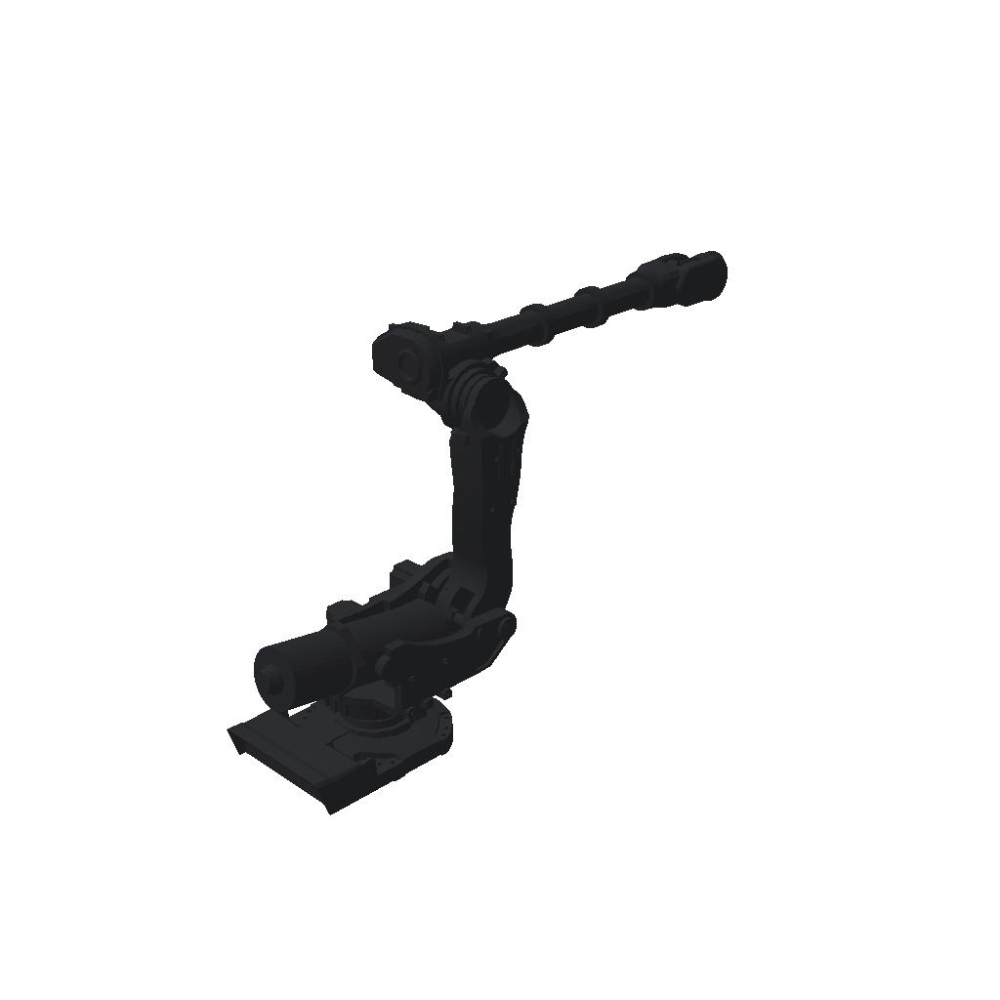</a><br>[front](pybullet/images/ros-industrial/xacro_generated/abb/abb_irb6650s_support/irb6650s_90_390/front.png) · [side](pybullet/images/ros-industrial/xacro_generated/abb/abb_irb6650s_support/irb6650s_90_390/side.png) · [top](pybullet/images/ros-industrial/xacro_generated/abb/abb_irb6650s_support/irb6650s_90_390/top.png) |
| irb6700_<wbr>200_<wbr>260 | ROS-Industrial | ABB | <a href="mujoco/images/ros-industrial/xacro_generated/abb/abb_irb6700_support/irb6700_200_260/iso.png">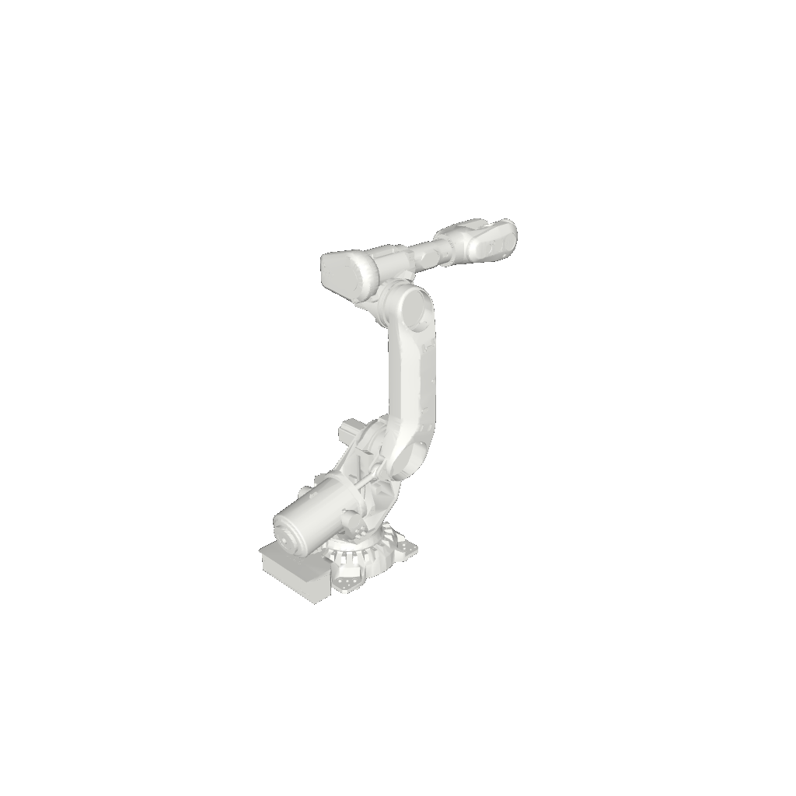</a><br>[front](mujoco/images/ros-industrial/xacro_generated/abb/abb_irb6700_support/irb6700_200_260/front.png) · [side](mujoco/images/ros-industrial/xacro_generated/abb/abb_irb6700_support/irb6700_200_260/side.png) · [top](mujoco/images/ros-industrial/xacro_generated/abb/abb_irb6700_support/irb6700_200_260/top.png) | <a href="pybullet/images/ros-industrial/xacro_generated/abb/abb_irb6700_support/irb6700_200_260/iso.png">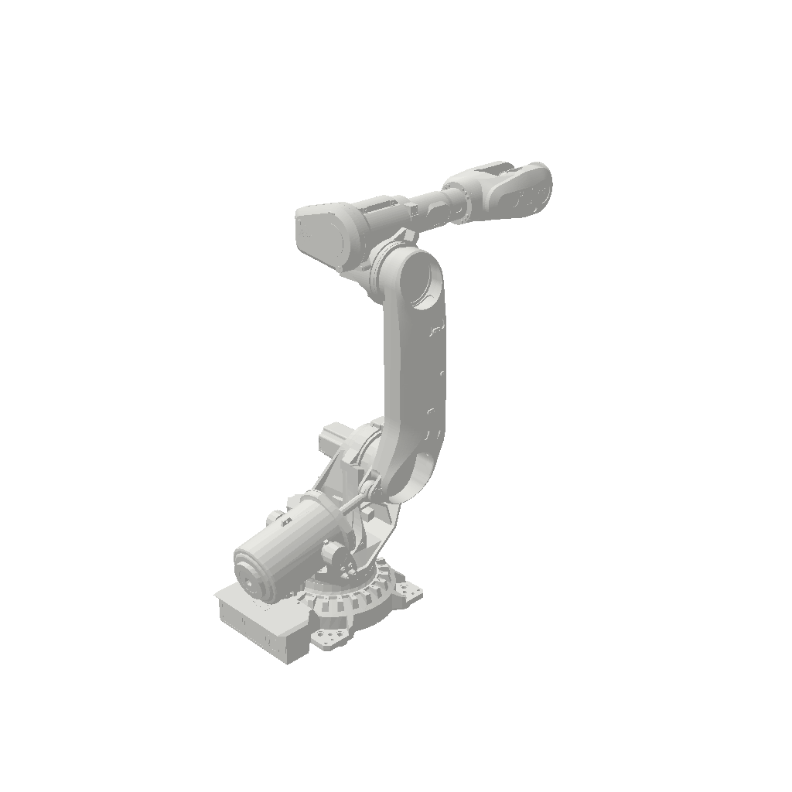</a><br>[front](pybullet/images/ros-industrial/xacro_generated/abb/abb_irb6700_support/irb6700_200_260/front.png) · [side](pybullet/images/ros-industrial/xacro_generated/abb/abb_irb6700_support/irb6700_200_260/side.png) · [top](pybullet/images/ros-industrial/xacro_generated/abb/abb_irb6700_support/irb6700_200_260/top.png) |
| irb6700_<wbr>235_<wbr>265 | ROS-Industrial | ABB | <a href="mujoco/images/ros-industrial/xacro_generated/abb/abb_irb6700_support/irb6700_235_265/iso.png">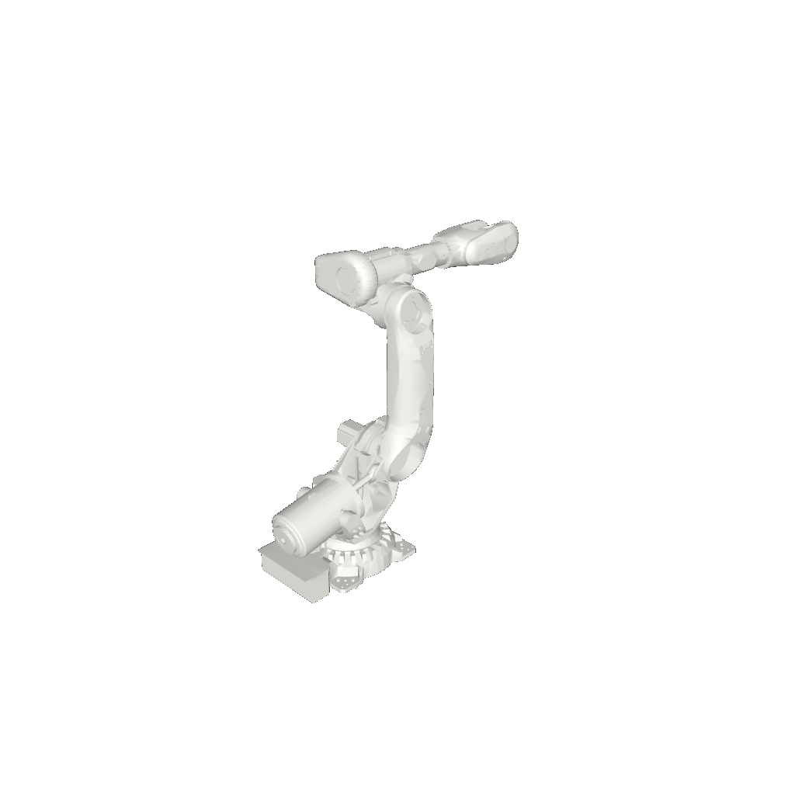</a><br>[front](mujoco/images/ros-industrial/xacro_generated/abb/abb_irb6700_support/irb6700_235_265/front.png) · [side](mujoco/images/ros-industrial/xacro_generated/abb/abb_irb6700_support/irb6700_235_265/side.png) · [top](mujoco/images/ros-industrial/xacro_generated/abb/abb_irb6700_support/irb6700_235_265/top.png) | <a href="pybullet/images/ros-industrial/xacro_generated/abb/abb_irb6700_support/irb6700_235_265/iso.png">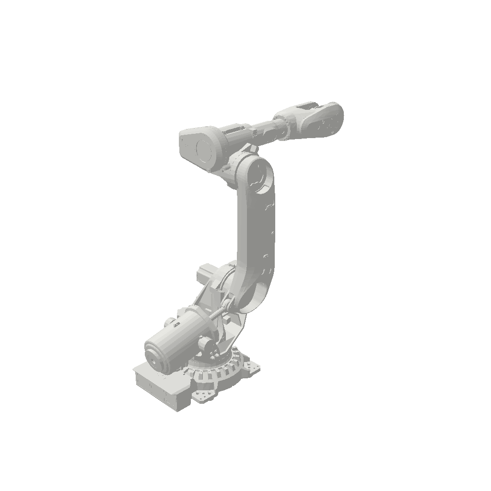</a><br>[front](pybullet/images/ros-industrial/xacro_generated/abb/abb_irb6700_support/irb6700_235_265/front.png) · [side](pybullet/images/ros-industrial/xacro_generated/abb/abb_irb6700_support/irb6700_235_265/side.png) · [top](pybullet/images/ros-industrial/xacro_generated/abb/abb_irb6700_support/irb6700_235_265/top.png) |
| irb7600_<wbr>150_<wbr>350 | ROS-Industrial | ABB | <a href="mujoco/images/ros-industrial/xacro_generated/abb/abb_irb7600_support/irb7600_150_350/iso.png">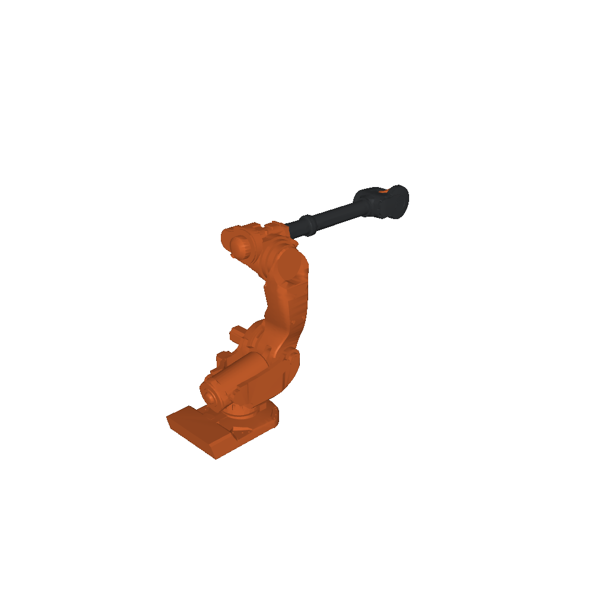</a><br>[front](mujoco/images/ros-industrial/xacro_generated/abb/abb_irb7600_support/irb7600_150_350/front.png) · [side](mujoco/images/ros-industrial/xacro_generated/abb/abb_irb7600_support/irb7600_150_350/side.png) · [top](mujoco/images/ros-industrial/xacro_generated/abb/abb_irb7600_support/irb7600_150_350/top.png) | <a href="pybullet/images/ros-industrial/xacro_generated/abb/abb_irb7600_support/irb7600_150_350/iso.png">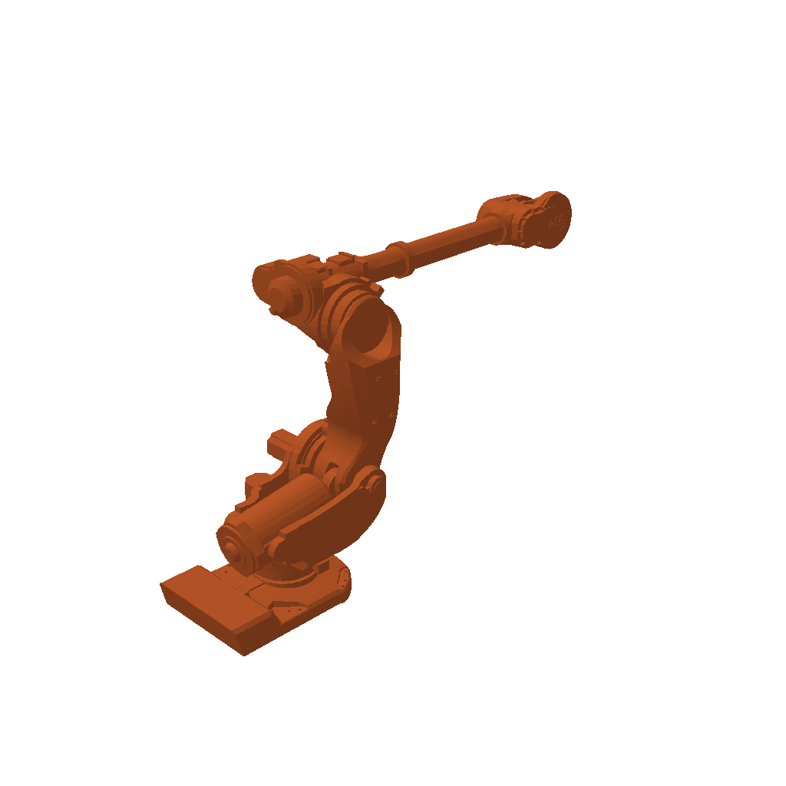</a><br>[front](pybullet/images/ros-industrial/xacro_generated/abb/abb_irb7600_support/irb7600_150_350/front.png) · [side](pybullet/images/ros-industrial/xacro_generated/abb/abb_irb7600_support/irb7600_150_350/side.png) · [top](pybullet/images/ros-industrial/xacro_generated/abb/abb_irb7600_support/irb7600_150_350/top.png) |
| cr35ia | ROS-Industrial | FANUC | <a href="mujoco/images/ros-industrial/xacro_generated/fanuc/fanuc_cr35ia_support/cr35ia/iso.png">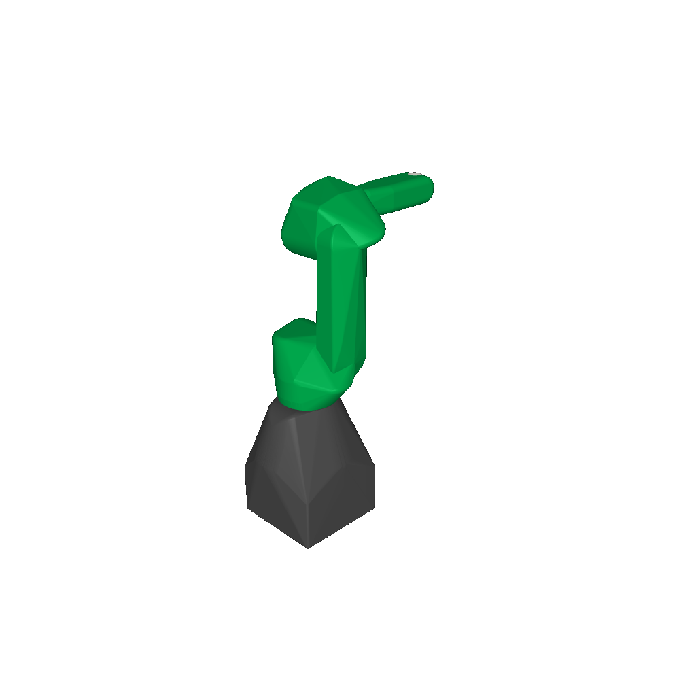</a><br>[front](mujoco/images/ros-industrial/xacro_generated/fanuc/fanuc_cr35ia_support/cr35ia/front.png) · [side](mujoco/images/ros-industrial/xacro_generated/fanuc/fanuc_cr35ia_support/cr35ia/side.png) · [top](mujoco/images/ros-industrial/xacro_generated/fanuc/fanuc_cr35ia_support/cr35ia/top.png) | <a href="pybullet/images/ros-industrial/xacro_generated/fanuc/fanuc_cr35ia_support/cr35ia/iso.png">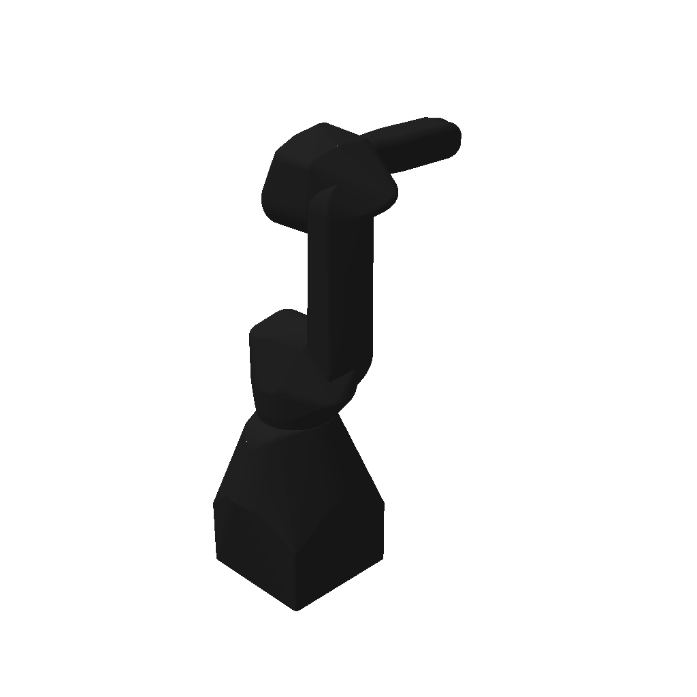</a><br>[front](pybullet/images/ros-industrial/xacro_generated/fanuc/fanuc_cr35ia_support/cr35ia/front.png) · [side](pybullet/images/ros-industrial/xacro_generated/fanuc/fanuc_cr35ia_support/cr35ia/side.png) · [top](pybullet/images/ros-industrial/xacro_generated/fanuc/fanuc_cr35ia_support/cr35ia/top.png) |
| cr7ia | ROS-Industrial | FANUC | <a href="mujoco/images/ros-industrial/xacro_generated/fanuc/fanuc_cr7ia_support/cr7ia/iso.png">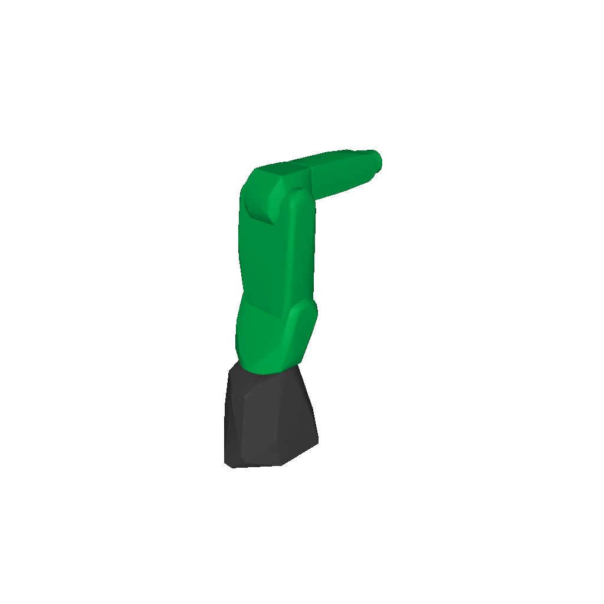</a><br>[front](mujoco/images/ros-industrial/xacro_generated/fanuc/fanuc_cr7ia_support/cr7ia/front.png) · [side](mujoco/images/ros-industrial/xacro_generated/fanuc/fanuc_cr7ia_support/cr7ia/side.png) · [top](mujoco/images/ros-industrial/xacro_generated/fanuc/fanuc_cr7ia_support/cr7ia/top.png) | <a href="pybullet/images/ros-industrial/xacro_generated/fanuc/fanuc_cr7ia_support/cr7ia/iso.png">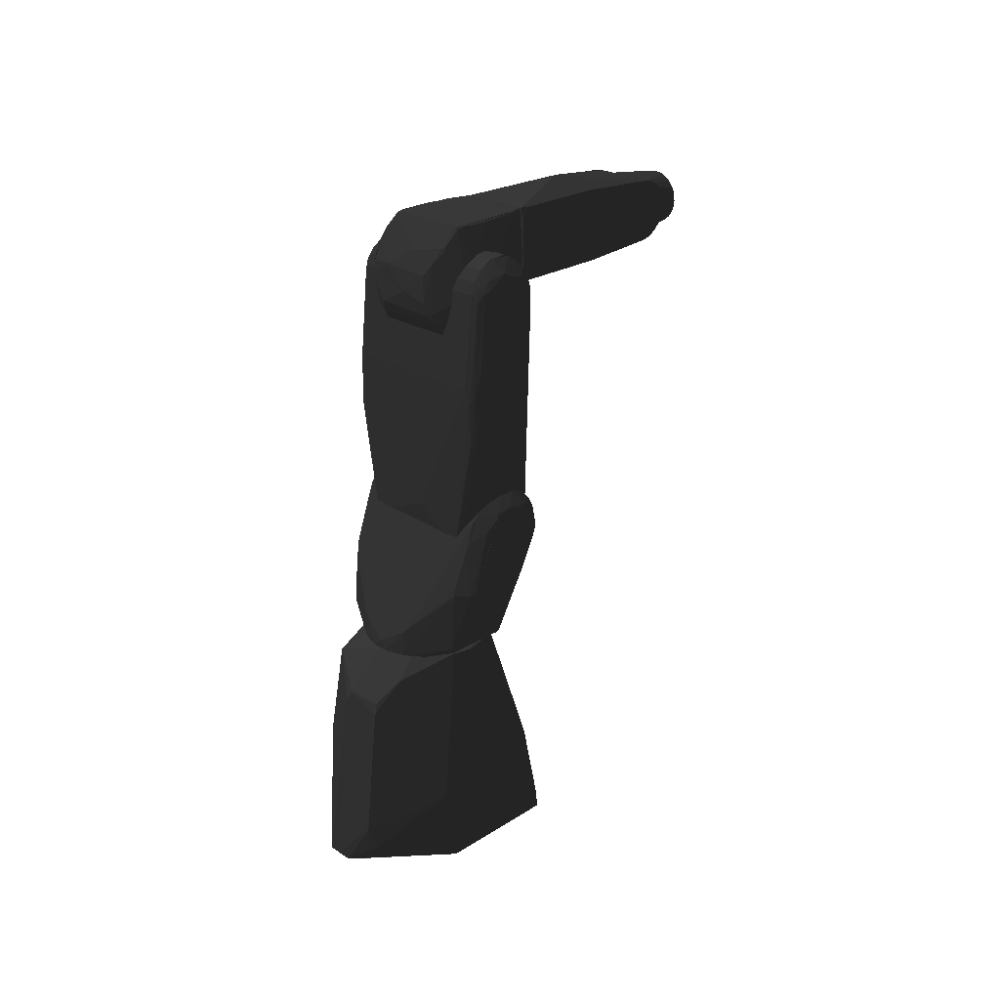</a><br>[front](pybullet/images/ros-industrial/xacro_generated/fanuc/fanuc_cr7ia_support/cr7ia/front.png) · [side](pybullet/images/ros-industrial/xacro_generated/fanuc/fanuc_cr7ia_support/cr7ia/side.png) · [top](pybullet/images/ros-industrial/xacro_generated/fanuc/fanuc_cr7ia_support/cr7ia/top.png) |
| cr7ial | ROS-Industrial | FANUC | <a href="mujoco/images/ros-industrial/xacro_generated/fanuc/fanuc_cr7ia_support/cr7ial/iso.png">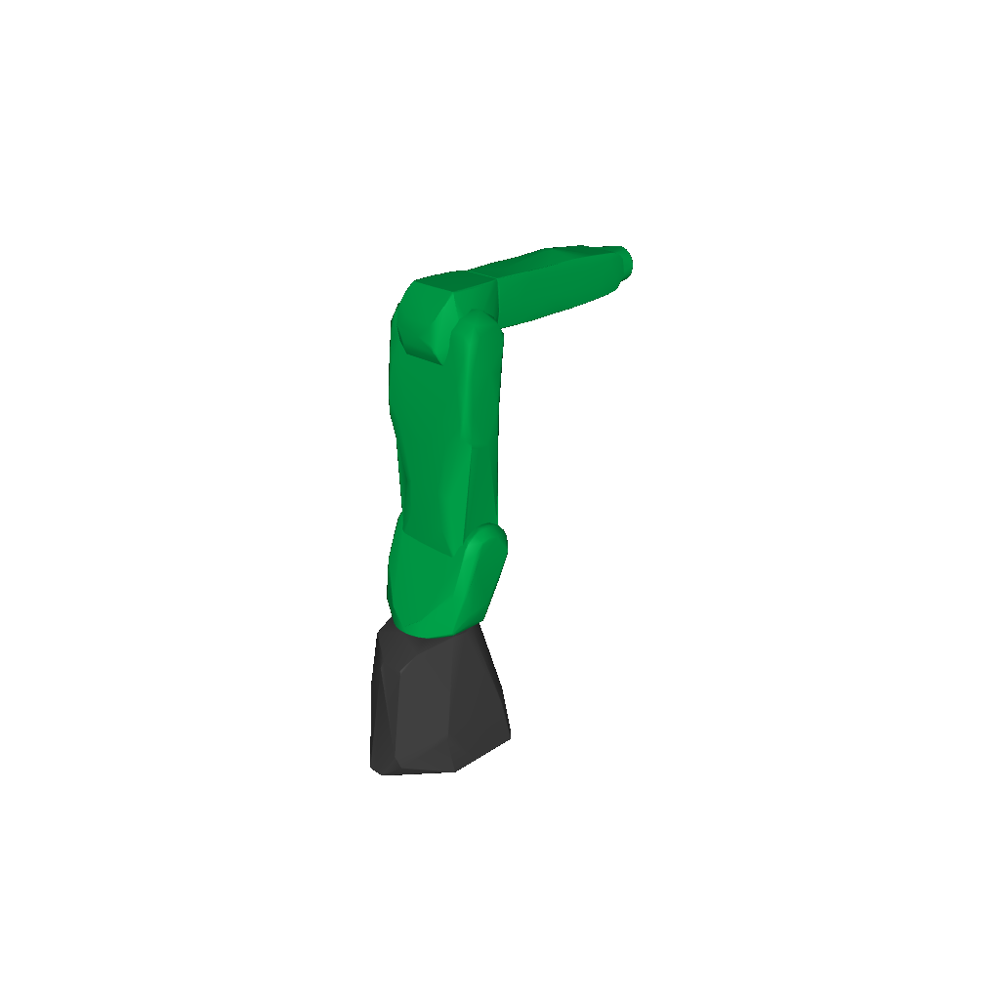</a><br>[front](mujoco/images/ros-industrial/xacro_generated/fanuc/fanuc_cr7ia_support/cr7ial/front.png) · [side](mujoco/images/ros-industrial/xacro_generated/fanuc/fanuc_cr7ia_support/cr7ial/side.png) · [top](mujoco/images/ros-industrial/xacro_generated/fanuc/fanuc_cr7ia_support/cr7ial/top.png) | <a href="pybullet/images/ros-industrial/xacro_generated/fanuc/fanuc_cr7ia_support/cr7ial/iso.png">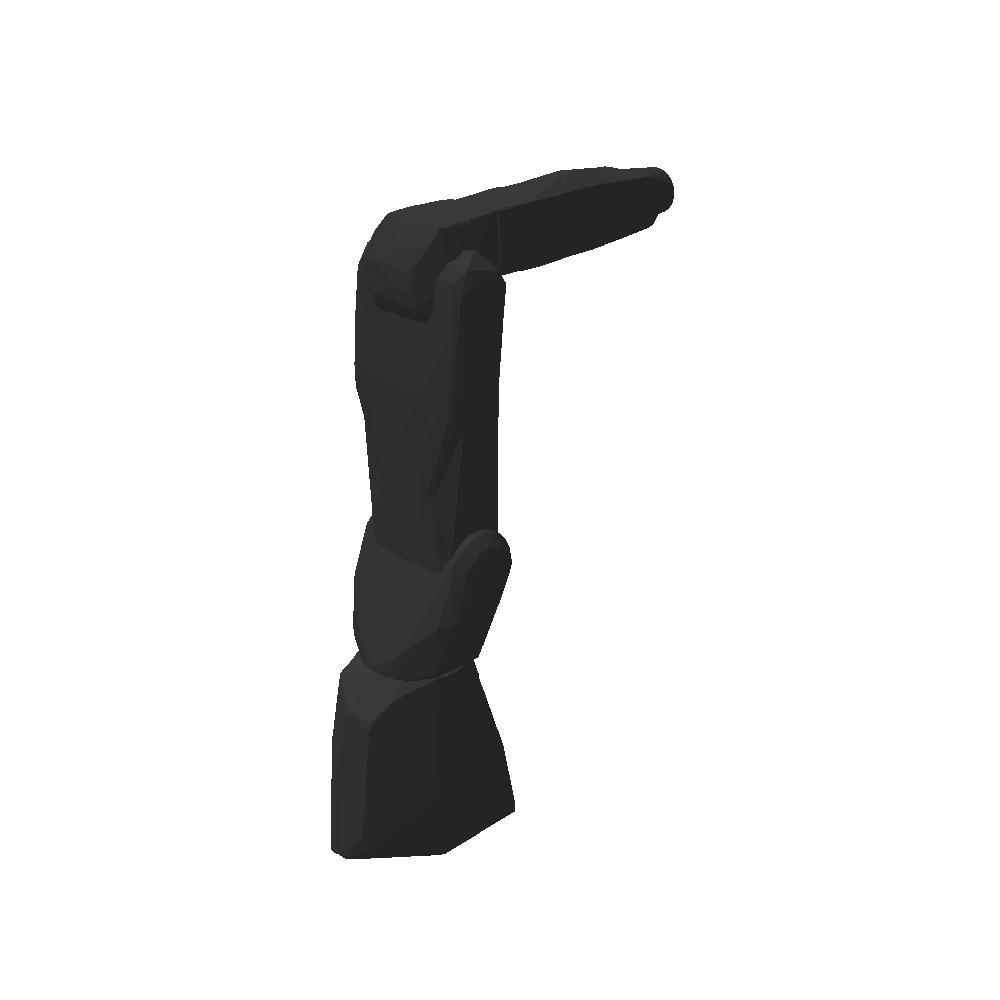</a><br>[front](pybullet/images/ros-industrial/xacro_generated/fanuc/fanuc_cr7ia_support/cr7ial/front.png) · [side](pybullet/images/ros-industrial/xacro_generated/fanuc/fanuc_cr7ia_support/cr7ial/side.png) · [top](pybullet/images/ros-industrial/xacro_generated/fanuc/fanuc_cr7ia_support/cr7ial/top.png) |
| crx10ial | ROS-Industrial | FANUC | <a href="mujoco/images/ros-industrial/xacro_generated/fanuc/fanuc_crx10ia_support/crx10ial/iso.png">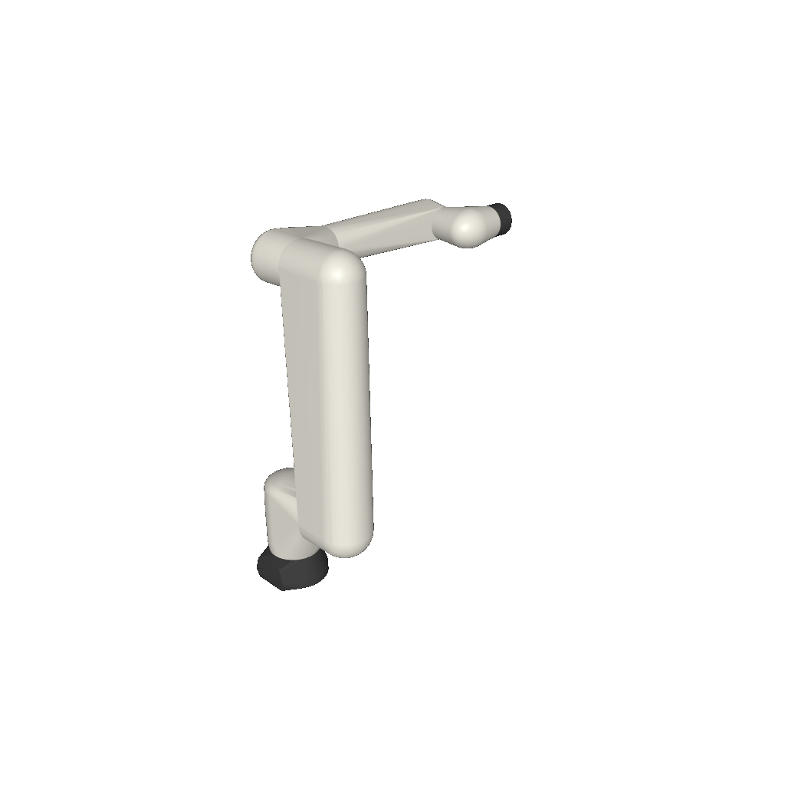</a><br>[front](mujoco/images/ros-industrial/xacro_generated/fanuc/fanuc_crx10ia_support/crx10ial/front.png) · [side](mujoco/images/ros-industrial/xacro_generated/fanuc/fanuc_crx10ia_support/crx10ial/side.png) · [top](mujoco/images/ros-industrial/xacro_generated/fanuc/fanuc_crx10ia_support/crx10ial/top.png) | <a href="pybullet/images/ros-industrial/xacro_generated/fanuc/fanuc_crx10ia_support/crx10ial/iso.png">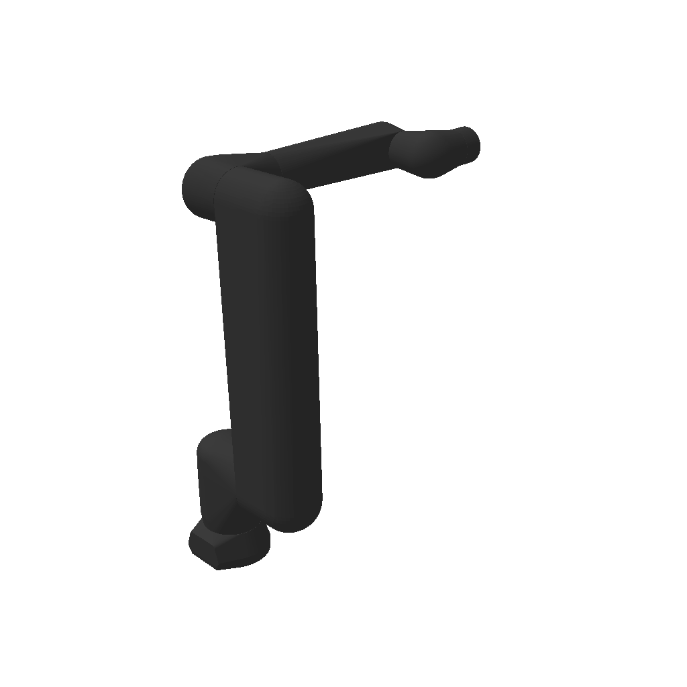</a><br>[front](pybullet/images/ros-industrial/xacro_generated/fanuc/fanuc_crx10ia_support/crx10ial/front.png) · [side](pybullet/images/ros-industrial/xacro_generated/fanuc/fanuc_crx10ia_support/crx10ial/side.png) · [top](pybullet/images/ros-industrial/xacro_generated/fanuc/fanuc_crx10ia_support/crx10ial/top.png) |
| lrmate200i | ROS-Industrial | FANUC | <a href="mujoco/images/ros-industrial/xacro_generated/fanuc/fanuc_lrmate200i_support/lrmate200i/iso.png">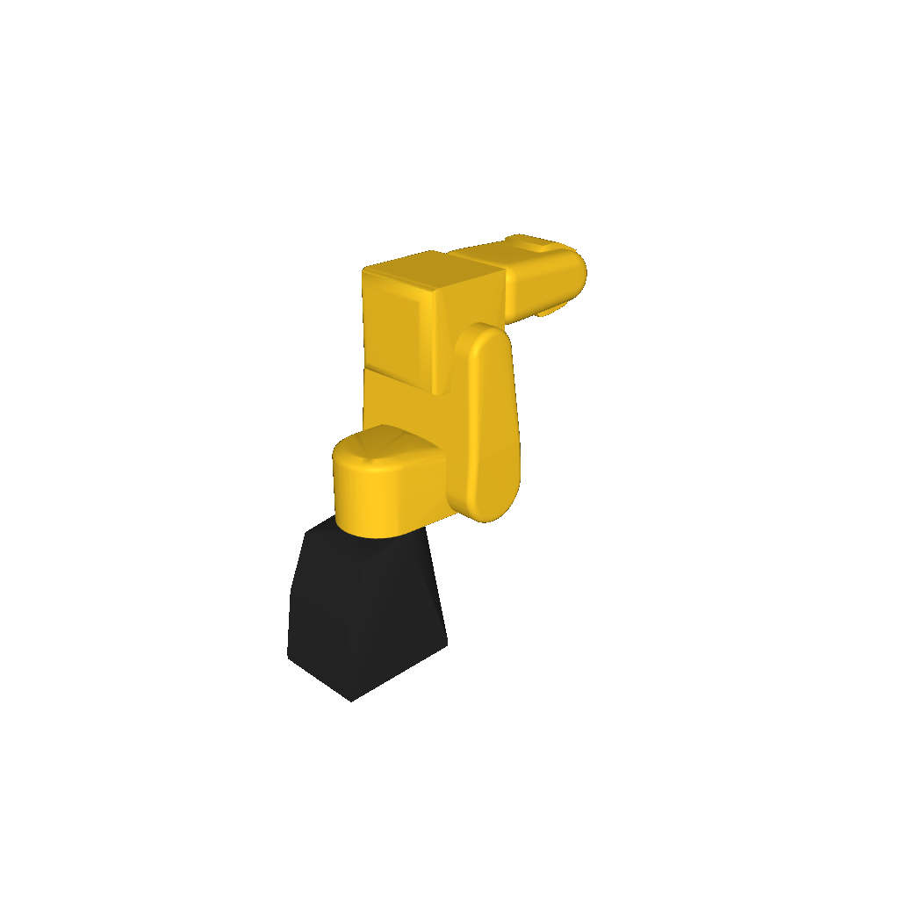</a><br>[front](mujoco/images/ros-industrial/xacro_generated/fanuc/fanuc_lrmate200i_support/lrmate200i/front.png) · [side](mujoco/images/ros-industrial/xacro_generated/fanuc/fanuc_lrmate200i_support/lrmate200i/side.png) · [top](mujoco/images/ros-industrial/xacro_generated/fanuc/fanuc_lrmate200i_support/lrmate200i/top.png) | <a href="pybullet/images/ros-industrial/xacro_generated/fanuc/fanuc_lrmate200i_support/lrmate200i/iso.png">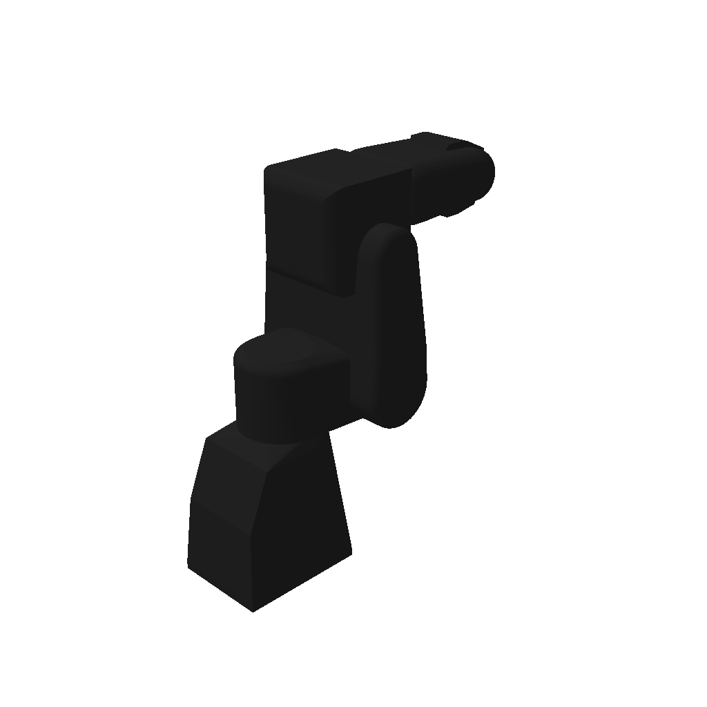</a><br>[front](pybullet/images/ros-industrial/xacro_generated/fanuc/fanuc_lrmate200i_support/lrmate200i/front.png) · [side](pybullet/images/ros-industrial/xacro_generated/fanuc/fanuc_lrmate200i_support/lrmate200i/side.png) · [top](pybullet/images/ros-industrial/xacro_generated/fanuc/fanuc_lrmate200i_support/lrmate200i/top.png) |
| lrmate200ib | ROS-Industrial | FANUC | <a href="mujoco/images/ros-industrial/xacro_generated/fanuc/fanuc_lrmate200ib_support/lrmate200ib/iso.png">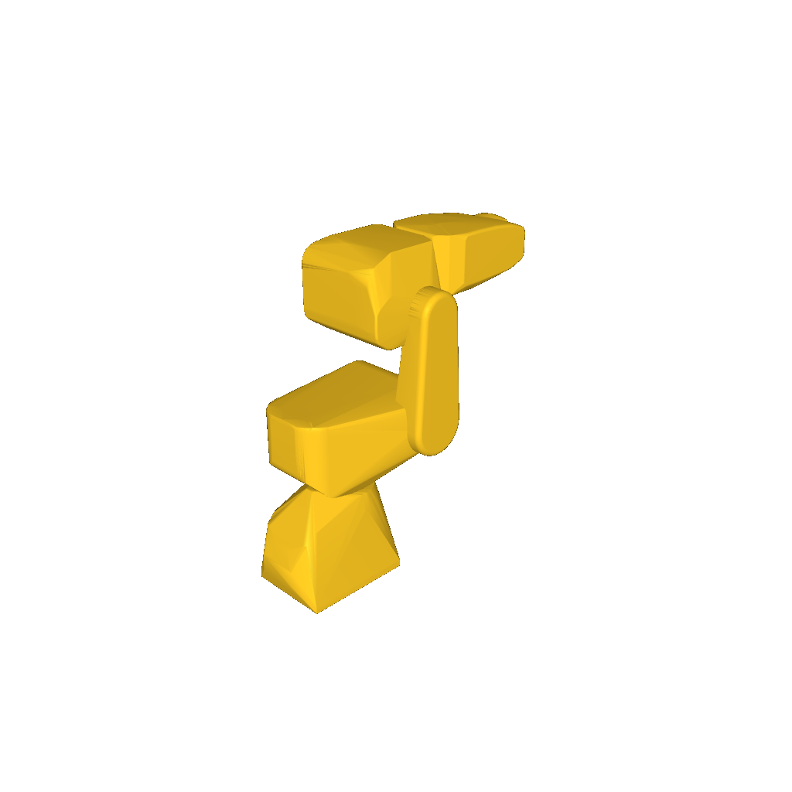</a><br>[front](mujoco/images/ros-industrial/xacro_generated/fanuc/fanuc_lrmate200ib_support/lrmate200ib/front.png) · [side](mujoco/images/ros-industrial/xacro_generated/fanuc/fanuc_lrmate200ib_support/lrmate200ib/side.png) · [top](mujoco/images/ros-industrial/xacro_generated/fanuc/fanuc_lrmate200ib_support/lrmate200ib/top.png) | <a href="pybullet/images/ros-industrial/xacro_generated/fanuc/fanuc_lrmate200ib_support/lrmate200ib/iso.png"></a><br>[front](pybullet/images/ros-industrial/xacro_generated/fanuc/fanuc_lrmate200ib_support/lrmate200ib/front.png) · [side](pybullet/images/ros-industrial/xacro_generated/fanuc/fanuc_lrmate200ib_support/lrmate200ib/side.png) · [top](pybullet/images/ros-industrial/xacro_generated/fanuc/fanuc_lrmate200ib_support/lrmate200ib/top.png) |
| lrmate200ib3l | ROS-Industrial | FANUC | <a href="mujoco/images/ros-industrial/xacro_generated/fanuc/fanuc_lrmate200ib_support/lrmate200ib3l/iso.png">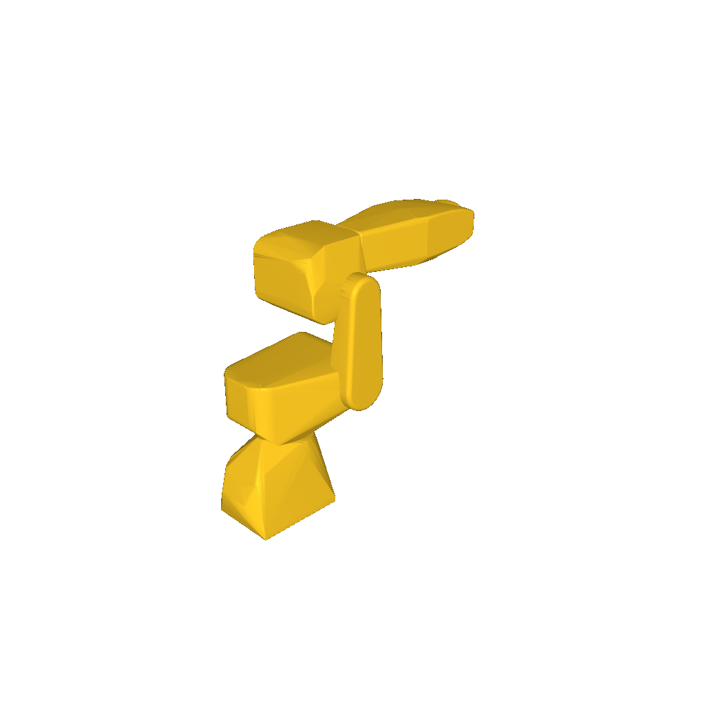</a><br>[front](mujoco/images/ros-industrial/xacro_generated/fanuc/fanuc_lrmate200ib_support/lrmate200ib3l/front.png) · [side](mujoco/images/ros-industrial/xacro_generated/fanuc/fanuc_lrmate200ib_support/lrmate200ib3l/side.png) · [top](mujoco/images/ros-industrial/xacro_generated/fanuc/fanuc_lrmate200ib_support/lrmate200ib3l/top.png) | <a href="pybullet/images/ros-industrial/xacro_generated/fanuc/fanuc_lrmate200ib_support/lrmate200ib3l/iso.png">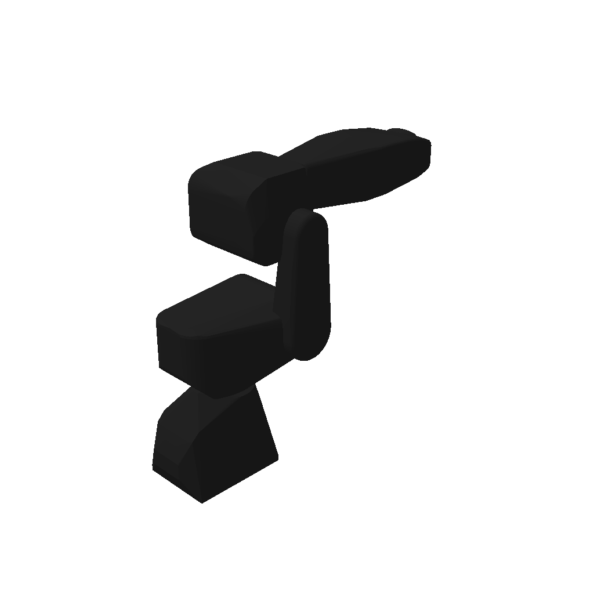</a><br>[front](pybullet/images/ros-industrial/xacro_generated/fanuc/fanuc_lrmate200ib_support/lrmate200ib3l/front.png) · [side](pybullet/images/ros-industrial/xacro_generated/fanuc/fanuc_lrmate200ib_support/lrmate200ib3l/side.png) · [top](pybullet/images/ros-industrial/xacro_generated/fanuc/fanuc_lrmate200ib_support/lrmate200ib3l/top.png) |
| lrmate200ic | ROS-Industrial | FANUC | <a href="mujoco/images/ros-industrial/xacro_generated/fanuc/fanuc_lrmate200ic_support/lrmate200ic/iso.png">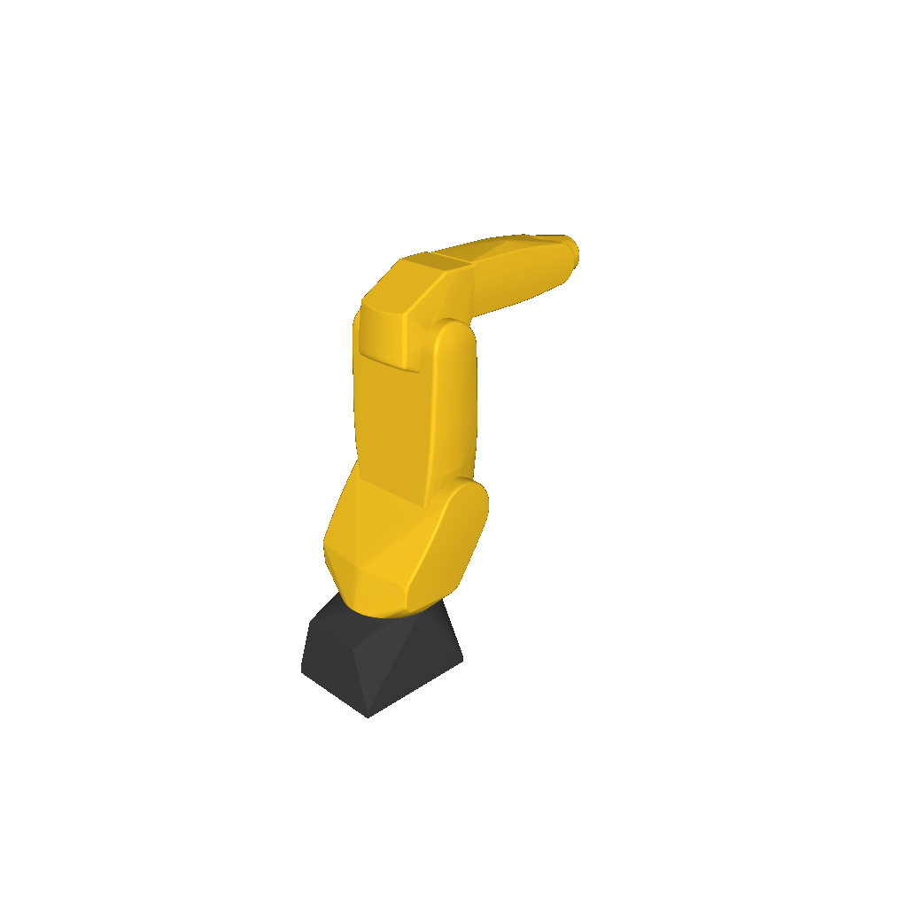</a><br>[front](mujoco/images/ros-industrial/xacro_generated/fanuc/fanuc_lrmate200ic_support/lrmate200ic/front.png) · [side](mujoco/images/ros-industrial/xacro_generated/fanuc/fanuc_lrmate200ic_support/lrmate200ic/side.png) · [top](mujoco/images/ros-industrial/xacro_generated/fanuc/fanuc_lrmate200ic_support/lrmate200ic/top.png) | <a href="pybullet/images/ros-industrial/xacro_generated/fanuc/fanuc_lrmate200ic_support/lrmate200ic/iso.png">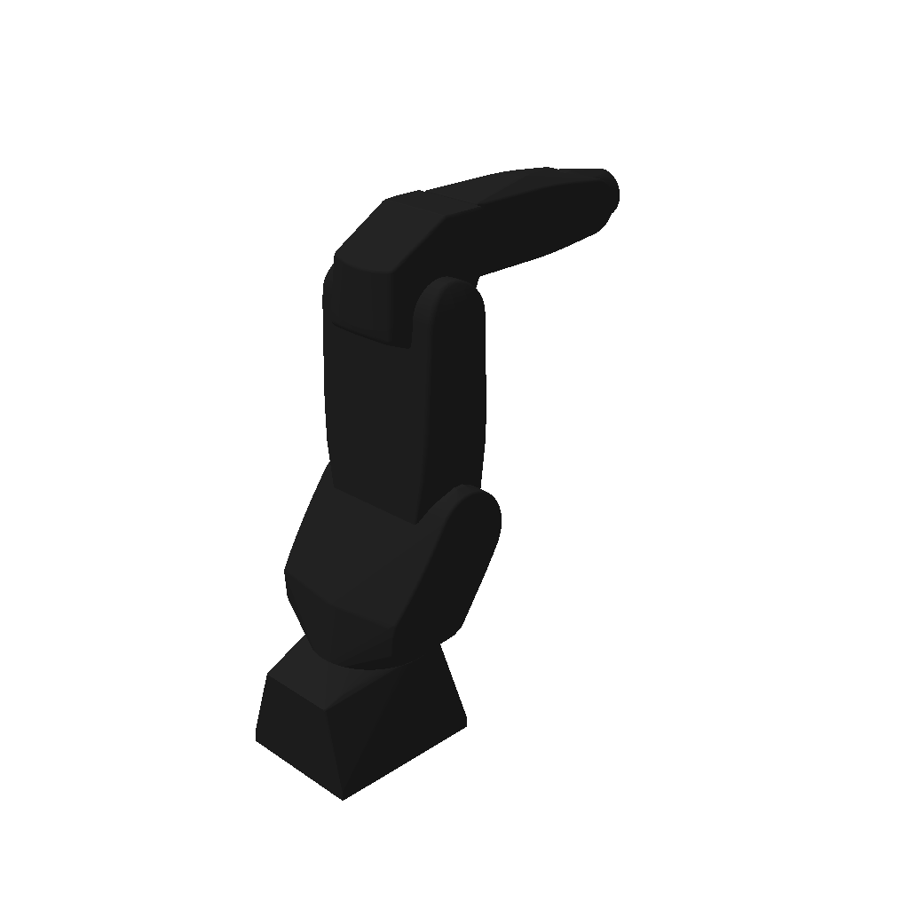</a><br>[front](pybullet/images/ros-industrial/xacro_generated/fanuc/fanuc_lrmate200ic_support/lrmate200ic/front.png) · [side](pybullet/images/ros-industrial/xacro_generated/fanuc/fanuc_lrmate200ic_support/lrmate200ic/side.png) · [top](pybullet/images/ros-industrial/xacro_generated/fanuc/fanuc_lrmate200ic_support/lrmate200ic/top.png) |
| lrmate200ic5f | ROS-Industrial | FANUC | <a href="mujoco/images/ros-industrial/xacro_generated/fanuc/fanuc_lrmate200ic_support/lrmate200ic5f/iso.png"></a><br>[front](mujoco/images/ros-industrial/xacro_generated/fanuc/fanuc_lrmate200ic_support/lrmate200ic5f/front.png) · [side](mujoco/images/ros-industrial/xacro_generated/fanuc/fanuc_lrmate200ic_support/lrmate200ic5f/side.png) · [top](mujoco/images/ros-industrial/xacro_generated/fanuc/fanuc_lrmate200ic_support/lrmate200ic5f/top.png) | <a href="pybullet/images/ros-industrial/xacro_generated/fanuc/fanuc_lrmate200ic_support/lrmate200ic5f/iso.png">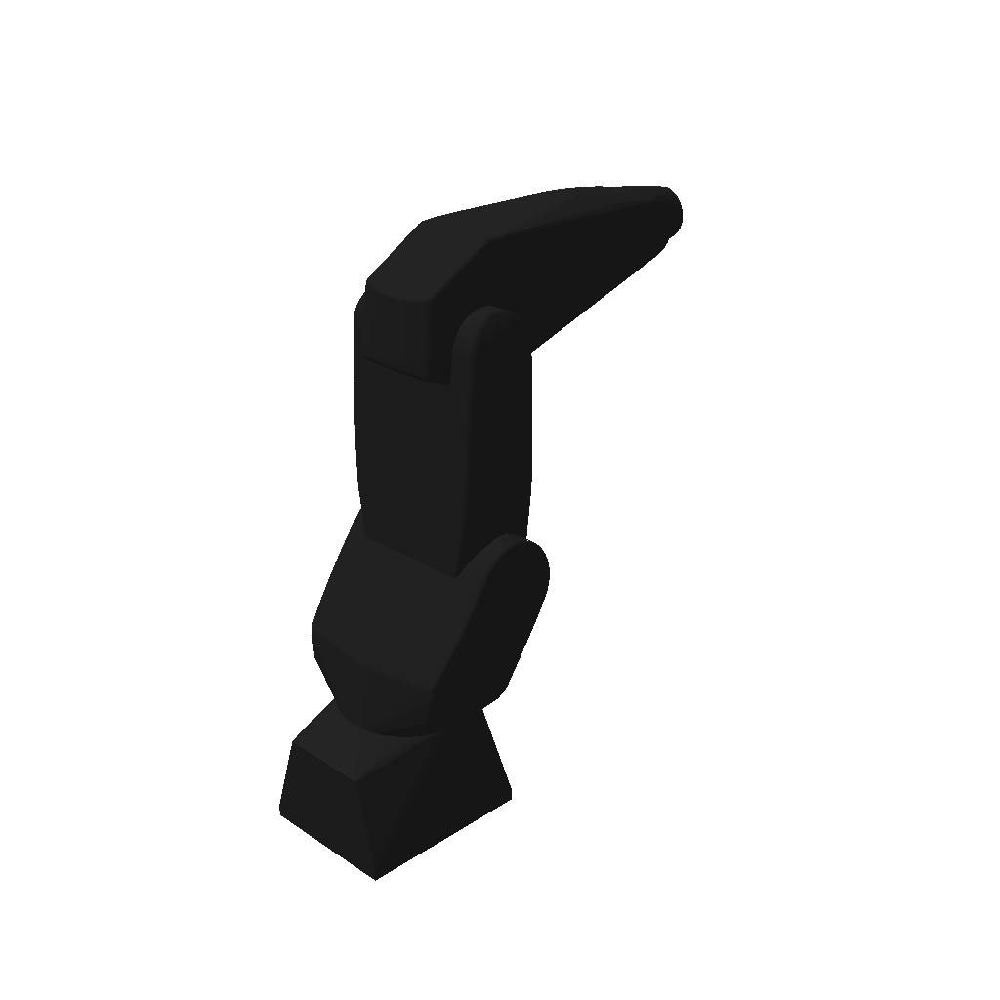</a><br>[front](pybullet/images/ros-industrial/xacro_generated/fanuc/fanuc_lrmate200ic_support/lrmate200ic5f/front.png) · [side](pybullet/images/ros-industrial/xacro_generated/fanuc/fanuc_lrmate200ic_support/lrmate200ic5f/side.png) · [top](pybullet/images/ros-industrial/xacro_generated/fanuc/fanuc_lrmate200ic_support/lrmate200ic5f/top.png) |
| lrmate200ic5h | ROS-Industrial | FANUC | <a href="mujoco/images/ros-industrial/xacro_generated/fanuc/fanuc_lrmate200ic_support/lrmate200ic5h/iso.png">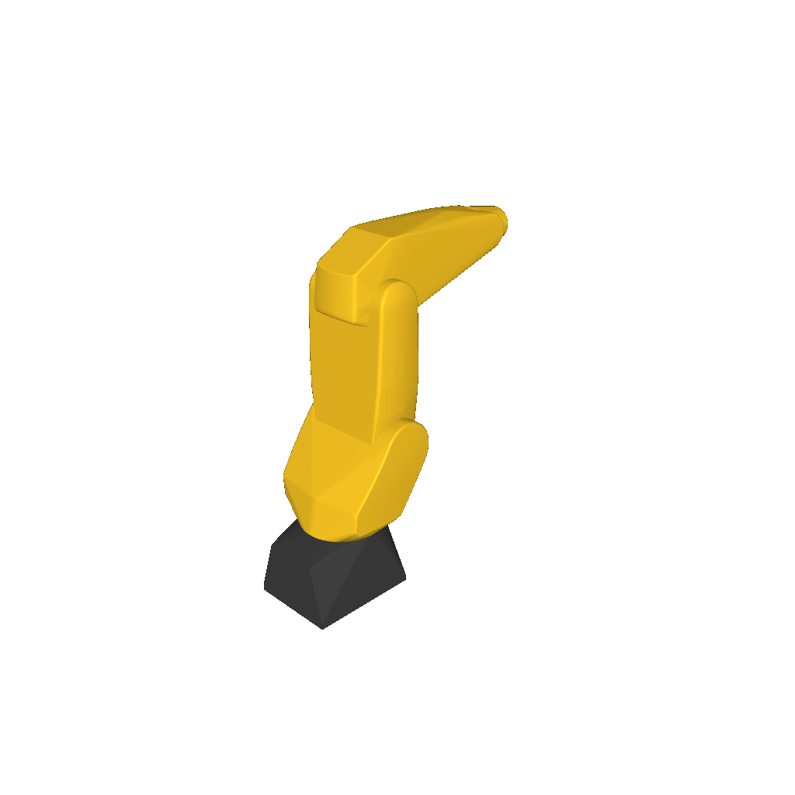</a><br>[front](mujoco/images/ros-industrial/xacro_generated/fanuc/fanuc_lrmate200ic_support/lrmate200ic5h/front.png) · [side](mujoco/images/ros-industrial/xacro_generated/fanuc/fanuc_lrmate200ic_support/lrmate200ic5h/side.png) · [top](mujoco/images/ros-industrial/xacro_generated/fanuc/fanuc_lrmate200ic_support/lrmate200ic5h/top.png) | <a href="pybullet/images/ros-industrial/xacro_generated/fanuc/fanuc_lrmate200ic_support/lrmate200ic5h/iso.png"></a><br>[front](pybullet/images/ros-industrial/xacro_generated/fanuc/fanuc_lrmate200ic_support/lrmate200ic5h/front.png) · [side](pybullet/images/ros-industrial/xacro_generated/fanuc/fanuc_lrmate200ic_support/lrmate200ic5h/side.png) · [top](pybullet/images/ros-industrial/xacro_generated/fanuc/fanuc_lrmate200ic_support/lrmate200ic5h/top.png) |
| lrmate200ic5hs | ROS-Industrial | FANUC | <a href="mujoco/images/ros-industrial/xacro_generated/fanuc/fanuc_lrmate200ic_support/lrmate200ic5hs/iso.png"></a><br>[front](mujoco/images/ros-industrial/xacro_generated/fanuc/fanuc_lrmate200ic_support/lrmate200ic5hs/front.png) · [side](mujoco/images/ros-industrial/xacro_generated/fanuc/fanuc_lrmate200ic_support/lrmate200ic5hs/side.png) · [top](mujoco/images/ros-industrial/xacro_generated/fanuc/fanuc_lrmate200ic_support/lrmate200ic5hs/top.png) | <a href="pybullet/images/ros-industrial/xacro_generated/fanuc/fanuc_lrmate200ic_support/lrmate200ic5hs/iso.png"></a><br>[front](pybullet/images/ros-industrial/xacro_generated/fanuc/fanuc_lrmate200ic_support/lrmate200ic5hs/front.png) · [side](pybullet/images/ros-industrial/xacro_generated/fanuc/fanuc_lrmate200ic_support/lrmate200ic5hs/side.png) · [top](pybullet/images/ros-industrial/xacro_generated/fanuc/fanuc_lrmate200ic_support/lrmate200ic5hs/top.png) |
| lrmate200ic5l | ROS-Industrial | FANUC | <a href="mujoco/images/ros-industrial/xacro_generated/fanuc/fanuc_lrmate200ic_support/lrmate200ic5l/iso.png"></a><br>[front](mujoco/images/ros-industrial/xacro_generated/fanuc/fanuc_lrmate200ic_support/lrmate200ic5l/front.png) · [side](mujoco/images/ros-industrial/xacro_generated/fanuc/fanuc_lrmate200ic_support/lrmate200ic5l/side.png) · [top](mujoco/images/ros-industrial/xacro_generated/fanuc/fanuc_lrmate200ic_support/lrmate200ic5l/top.png) | <a href="pybullet/images/ros-industrial/xacro_generated/fanuc/fanuc_lrmate200ic_support/lrmate200ic5l/iso.png">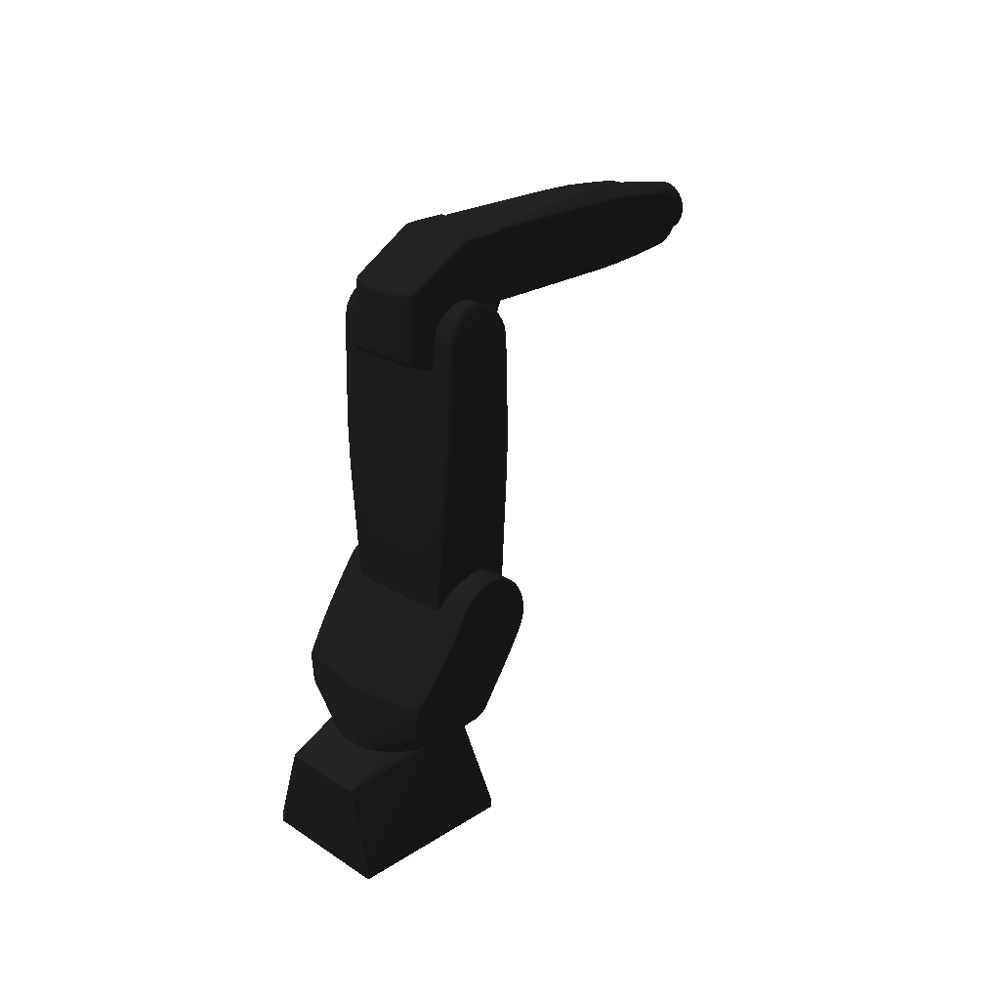</a><br>[front](pybullet/images/ros-industrial/xacro_generated/fanuc/fanuc_lrmate200ic_support/lrmate200ic5l/front.png) · [side](pybullet/images/ros-industrial/xacro_generated/fanuc/fanuc_lrmate200ic_support/lrmate200ic5l/side.png) · [top](pybullet/images/ros-industrial/xacro_generated/fanuc/fanuc_lrmate200ic_support/lrmate200ic5l/top.png) |
| lrmate200id | ROS-Industrial | FANUC | <a href="mujoco/images/ros-industrial/xacro_generated/fanuc/fanuc_lrmate200id_support/lrmate200id/iso.png"></a><br>[front](mujoco/images/ros-industrial/xacro_generated/fanuc/fanuc_lrmate200id_support/lrmate200id/front.png) · [side](mujoco/images/ros-industrial/xacro_generated/fanuc/fanuc_lrmate200id_support/lrmate200id/side.png) · [top](mujoco/images/ros-industrial/xacro_generated/fanuc/fanuc_lrmate200id_support/lrmate200id/top.png) | <a href="pybullet/images/ros-industrial/xacro_generated/fanuc/fanuc_lrmate200id_support/lrmate200id/iso.png">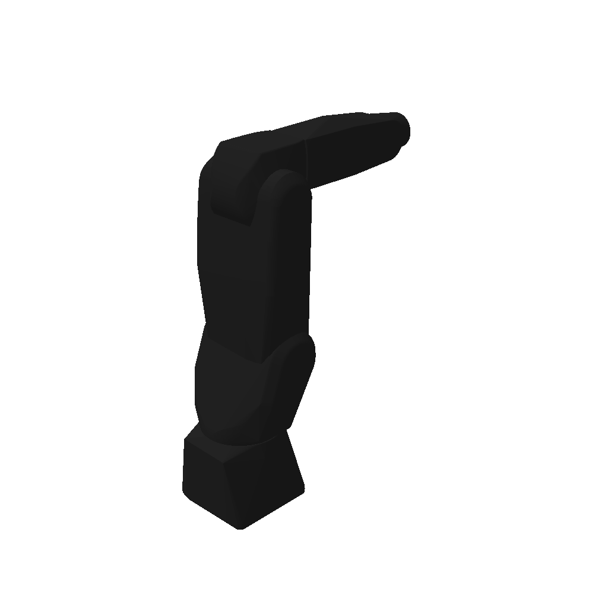</a><br>[front](pybullet/images/ros-industrial/xacro_generated/fanuc/fanuc_lrmate200id_support/lrmate200id/front.png) · [side](pybullet/images/ros-industrial/xacro_generated/fanuc/fanuc_lrmate200id_support/lrmate200id/side.png) · [top](pybullet/images/ros-industrial/xacro_generated/fanuc/fanuc_lrmate200id_support/lrmate200id/top.png) |
| lrmate200id4s | ROS-Industrial | FANUC | <a href="mujoco/images/ros-industrial/xacro_generated/fanuc/fanuc_lrmate200id_support/lrmate200id4s/iso.png">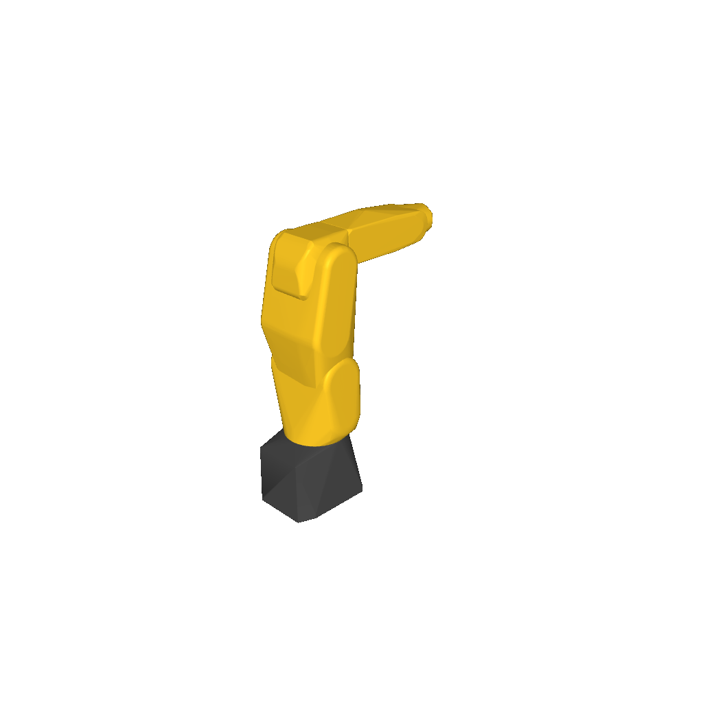</a><br>[front](mujoco/images/ros-industrial/xacro_generated/fanuc/fanuc_lrmate200id_support/lrmate200id4s/front.png) · [side](mujoco/images/ros-industrial/xacro_generated/fanuc/fanuc_lrmate200id_support/lrmate200id4s/side.png) · [top](mujoco/images/ros-industrial/xacro_generated/fanuc/fanuc_lrmate200id_support/lrmate200id4s/top.png) | <a href="pybullet/images/ros-industrial/xacro_generated/fanuc/fanuc_lrmate200id_support/lrmate200id4s/iso.png">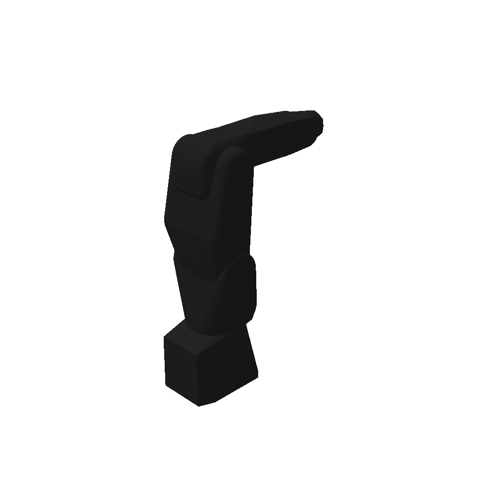</a><br>[front](pybullet/images/ros-industrial/xacro_generated/fanuc/fanuc_lrmate200id_support/lrmate200id4s/front.png) · [side](pybullet/images/ros-industrial/xacro_generated/fanuc/fanuc_lrmate200id_support/lrmate200id4s/side.png) · [top](pybullet/images/ros-industrial/xacro_generated/fanuc/fanuc_lrmate200id_support/lrmate200id4s/top.png) |
| lrmate200id4sc | ROS-Industrial | FANUC | <a href="mujoco/images/ros-industrial/xacro_generated/fanuc/fanuc_lrmate200id_support/lrmate200id4sc/iso.png"></a><br>[front](mujoco/images/ros-industrial/xacro_generated/fanuc/fanuc_lrmate200id_support/lrmate200id4sc/front.png) · [side](mujoco/images/ros-industrial/xacro_generated/fanuc/fanuc_lrmate200id_support/lrmate200id4sc/side.png) · [top](mujoco/images/ros-industrial/xacro_generated/fanuc/fanuc_lrmate200id_support/lrmate200id4sc/top.png) | <a href="pybullet/images/ros-industrial/xacro_generated/fanuc/fanuc_lrmate200id_support/lrmate200id4sc/iso.png"></a><br>[front](pybullet/images/ros-industrial/xacro_generated/fanuc/fanuc_lrmate200id_support/lrmate200id4sc/front.png) · [side](pybullet/images/ros-industrial/xacro_generated/fanuc/fanuc_lrmate200id_support/lrmate200id4sc/side.png) · [top](pybullet/images/ros-industrial/xacro_generated/fanuc/fanuc_lrmate200id_support/lrmate200id4sc/top.png) |
| lrmate200id4sh | ROS-Industrial | FANUC | <a href="mujoco/images/ros-industrial/xacro_generated/fanuc/fanuc_lrmate200id_support/lrmate200id4sh/iso.png"></a><br>[front](mujoco/images/ros-industrial/xacro_generated/fanuc/fanuc_lrmate200id_support/lrmate200id4sh/front.png) · [side](mujoco/images/ros-industrial/xacro_generated/fanuc/fanuc_lrmate200id_support/lrmate200id4sh/side.png) · [top](mujoco/images/ros-industrial/xacro_generated/fanuc/fanuc_lrmate200id_support/lrmate200id4sh/top.png) | <a href="pybullet/images/ros-industrial/xacro_generated/fanuc/fanuc_lrmate200id_support/lrmate200id4sh/iso.png">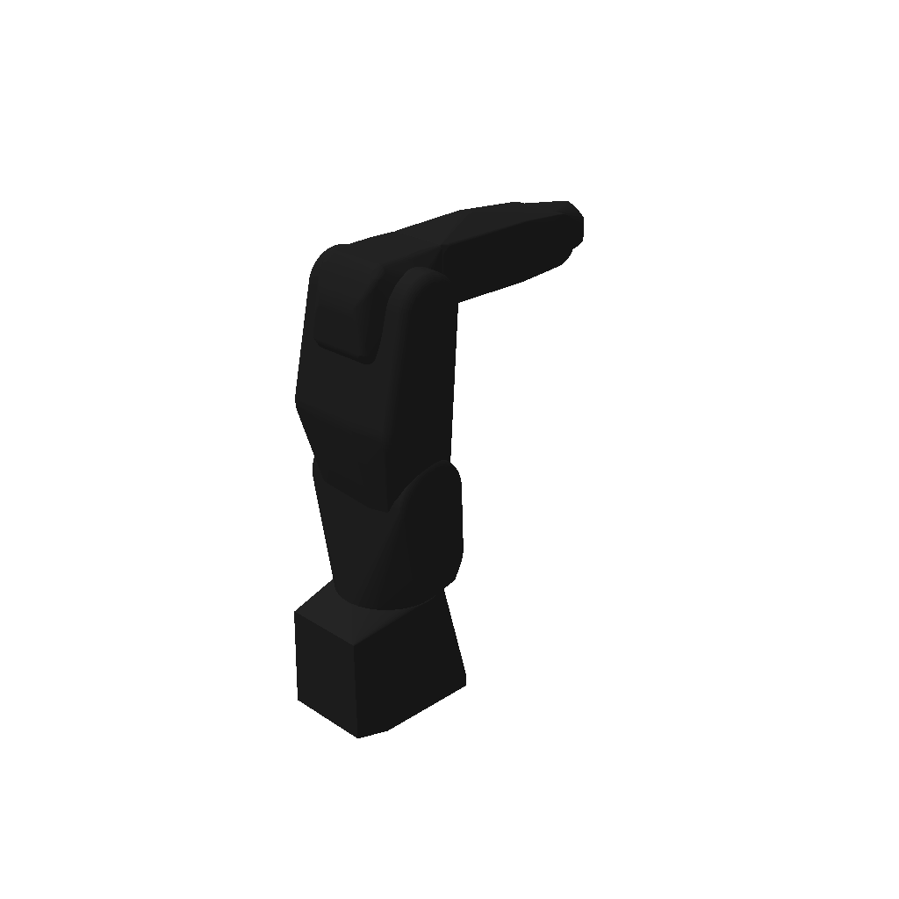</a><br>[front](pybullet/images/ros-industrial/xacro_generated/fanuc/fanuc_lrmate200id_support/lrmate200id4sh/front.png) · [side](pybullet/images/ros-industrial/xacro_generated/fanuc/fanuc_lrmate200id_support/lrmate200id4sh/side.png) · [top](pybullet/images/ros-industrial/xacro_generated/fanuc/fanuc_lrmate200id_support/lrmate200id4sh/top.png) |
| lrmate200id7h | ROS-Industrial | FANUC | <a href="mujoco/images/ros-industrial/xacro_generated/fanuc/fanuc_lrmate200id_support/lrmate200id7h/iso.png"></a><br>[front](mujoco/images/ros-industrial/xacro_generated/fanuc/fanuc_lrmate200id_support/lrmate200id7h/front.png) · [side](mujoco/images/ros-industrial/xacro_generated/fanuc/fanuc_lrmate200id_support/lrmate200id7h/side.png) · [top](mujoco/images/ros-industrial/xacro_generated/fanuc/fanuc_lrmate200id_support/lrmate200id7h/top.png) | <a href="pybullet/images/ros-industrial/xacro_generated/fanuc/fanuc_lrmate200id_support/lrmate200id7h/iso.png"></a><br>[front](pybullet/images/ros-industrial/xacro_generated/fanuc/fanuc_lrmate200id_support/lrmate200id7h/front.png) · [side](pybullet/images/ros-industrial/xacro_generated/fanuc/fanuc_lrmate200id_support/lrmate200id7h/side.png) · [top](pybullet/images/ros-industrial/xacro_generated/fanuc/fanuc_lrmate200id_support/lrmate200id7h/top.png) |
| lrmate200id7l | ROS-Industrial | FANUC | <a href="mujoco/images/ros-industrial/xacro_generated/fanuc/fanuc_lrmate200id_support/lrmate200id7l/iso.png">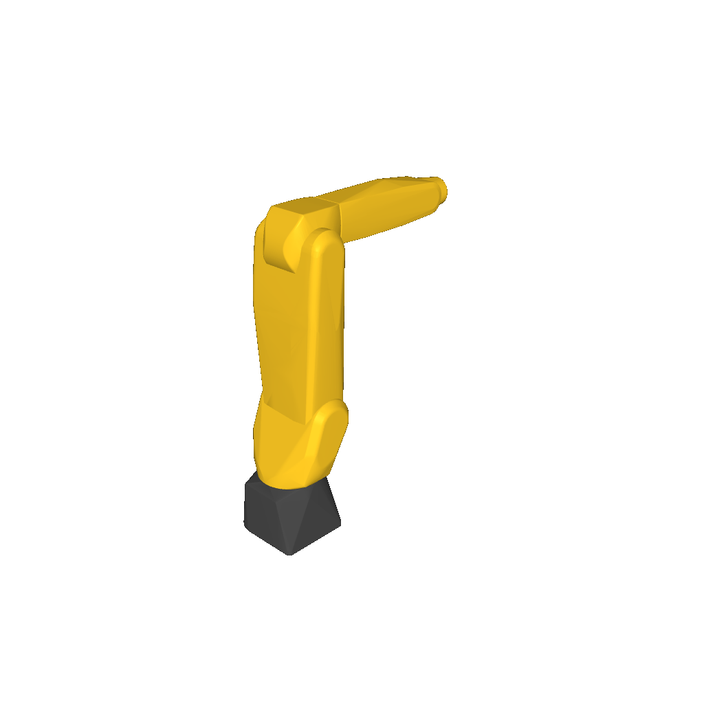</a><br>[front](mujoco/images/ros-industrial/xacro_generated/fanuc/fanuc_lrmate200id_support/lrmate200id7l/front.png) · [side](mujoco/images/ros-industrial/xacro_generated/fanuc/fanuc_lrmate200id_support/lrmate200id7l/side.png) · [top](mujoco/images/ros-industrial/xacro_generated/fanuc/fanuc_lrmate200id_support/lrmate200id7l/top.png) | <a href="pybullet/images/ros-industrial/xacro_generated/fanuc/fanuc_lrmate200id_support/lrmate200id7l/iso.png">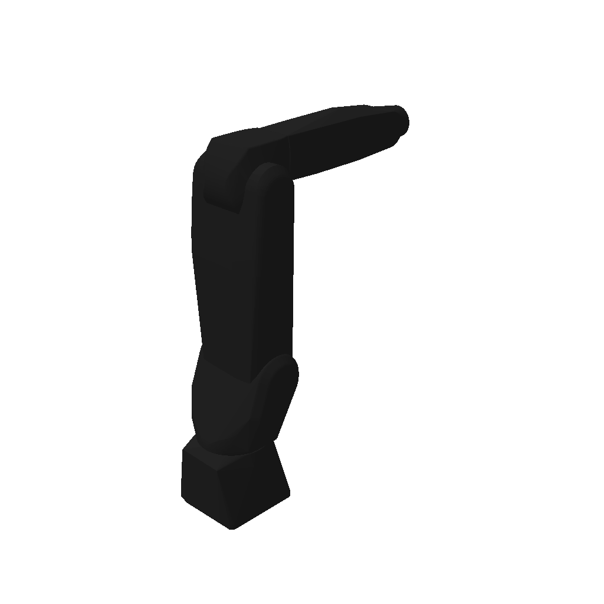</a><br>[front](pybullet/images/ros-industrial/xacro_generated/fanuc/fanuc_lrmate200id_support/lrmate200id7l/front.png) · [side](pybullet/images/ros-industrial/xacro_generated/fanuc/fanuc_lrmate200id_support/lrmate200id7l/side.png) · [top](pybullet/images/ros-industrial/xacro_generated/fanuc/fanuc_lrmate200id_support/lrmate200id7l/top.png) |
| lrmate200id7lc | ROS-Industrial | FANUC | <a href="mujoco/images/ros-industrial/xacro_generated/fanuc/fanuc_lrmate200id_support/lrmate200id7lc/iso.png"></a><br>[front](mujoco/images/ros-industrial/xacro_generated/fanuc/fanuc_lrmate200id_support/lrmate200id7lc/front.png) · [side](mujoco/images/ros-industrial/xacro_generated/fanuc/fanuc_lrmate200id_support/lrmate200id7lc/side.png) · [top](mujoco/images/ros-industrial/xacro_generated/fanuc/fanuc_lrmate200id_support/lrmate200id7lc/top.png) | <a href="pybullet/images/ros-industrial/xacro_generated/fanuc/fanuc_lrmate200id_support/lrmate200id7lc/iso.png"></a><br>[front](pybullet/images/ros-industrial/xacro_generated/fanuc/fanuc_lrmate200id_support/lrmate200id7lc/front.png) · [side](pybullet/images/ros-industrial/xacro_generated/fanuc/fanuc_lrmate200id_support/lrmate200id7lc/side.png) · [top](pybullet/images/ros-industrial/xacro_generated/fanuc/fanuc_lrmate200id_support/lrmate200id7lc/top.png) |
| m10ia | ROS-Industrial | FANUC | <a href="mujoco/images/ros-industrial/xacro_generated/fanuc/fanuc_m10ia_support/m10ia/iso.png">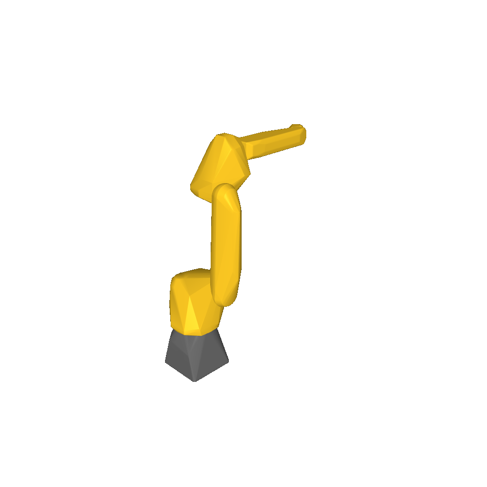</a><br>[front](mujoco/images/ros-industrial/xacro_generated/fanuc/fanuc_m10ia_support/m10ia/front.png) · [side](mujoco/images/ros-industrial/xacro_generated/fanuc/fanuc_m10ia_support/m10ia/side.png) · [top](mujoco/images/ros-industrial/xacro_generated/fanuc/fanuc_m10ia_support/m10ia/top.png) | <a href="pybullet/images/ros-industrial/xacro_generated/fanuc/fanuc_m10ia_support/m10ia/iso.png">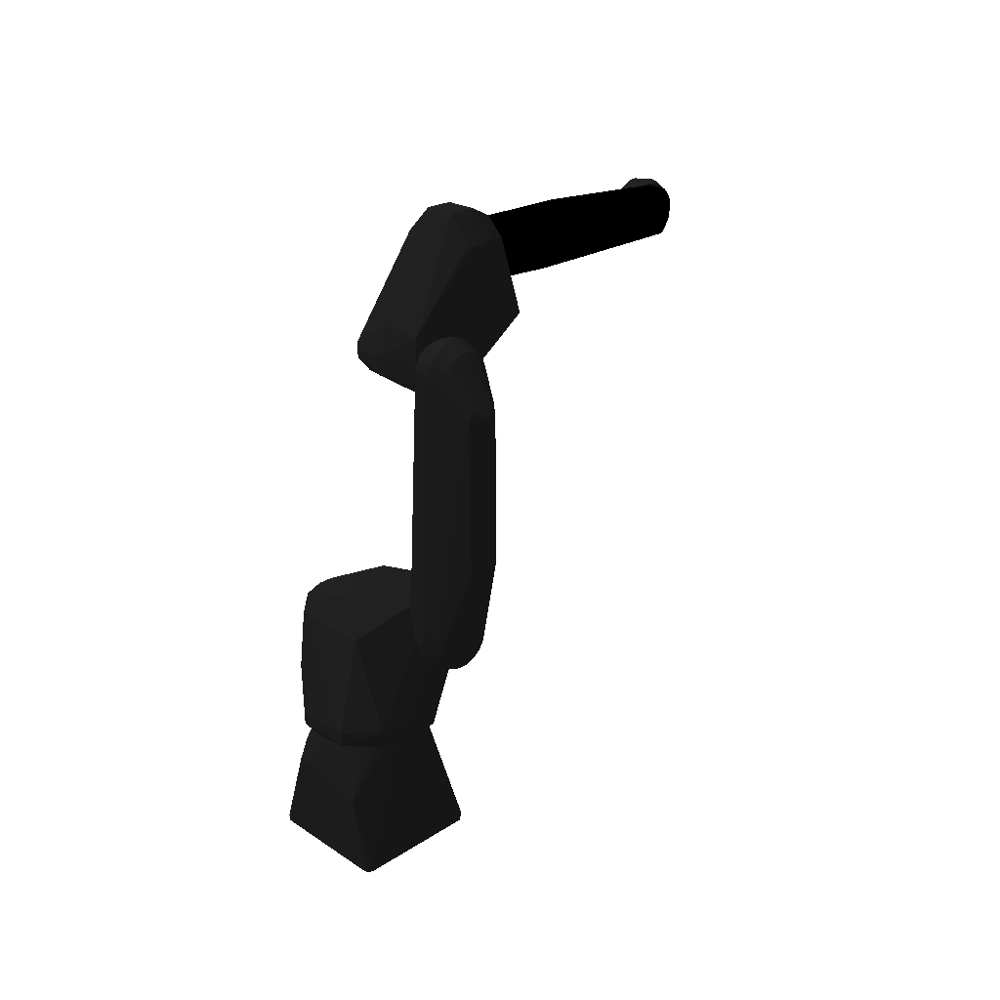</a><br>[front](pybullet/images/ros-industrial/xacro_generated/fanuc/fanuc_m10ia_support/m10ia/front.png) · [side](pybullet/images/ros-industrial/xacro_generated/fanuc/fanuc_m10ia_support/m10ia/side.png) · [top](pybullet/images/ros-industrial/xacro_generated/fanuc/fanuc_m10ia_support/m10ia/top.png) |
| m10ia7l | ROS-Industrial | FANUC | <a href="mujoco/images/ros-industrial/xacro_generated/fanuc/fanuc_m10ia_support/m10ia7l/iso.png">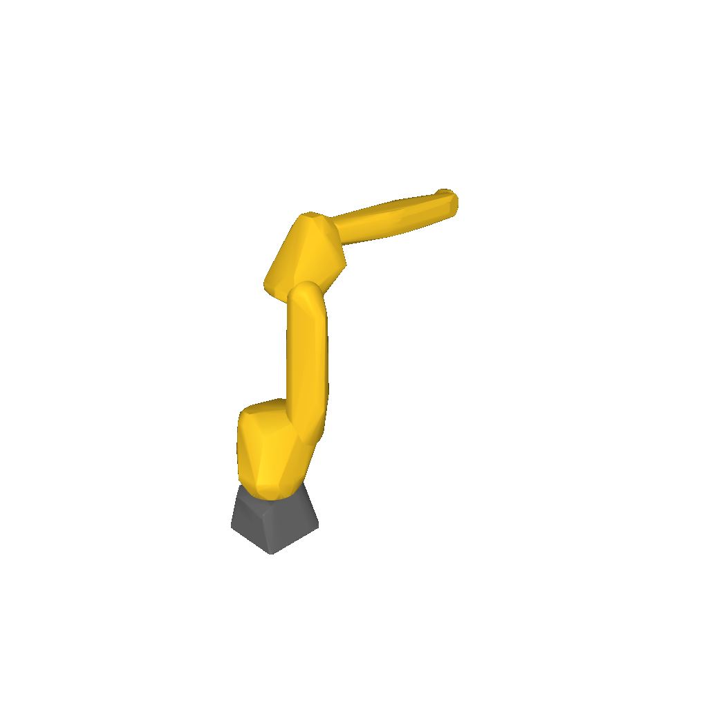</a><br>[front](mujoco/images/ros-industrial/xacro_generated/fanuc/fanuc_m10ia_support/m10ia7l/front.png) · [side](mujoco/images/ros-industrial/xacro_generated/fanuc/fanuc_m10ia_support/m10ia7l/side.png) · [top](mujoco/images/ros-industrial/xacro_generated/fanuc/fanuc_m10ia_support/m10ia7l/top.png) | <a href="pybullet/images/ros-industrial/xacro_generated/fanuc/fanuc_m10ia_support/m10ia7l/iso.png">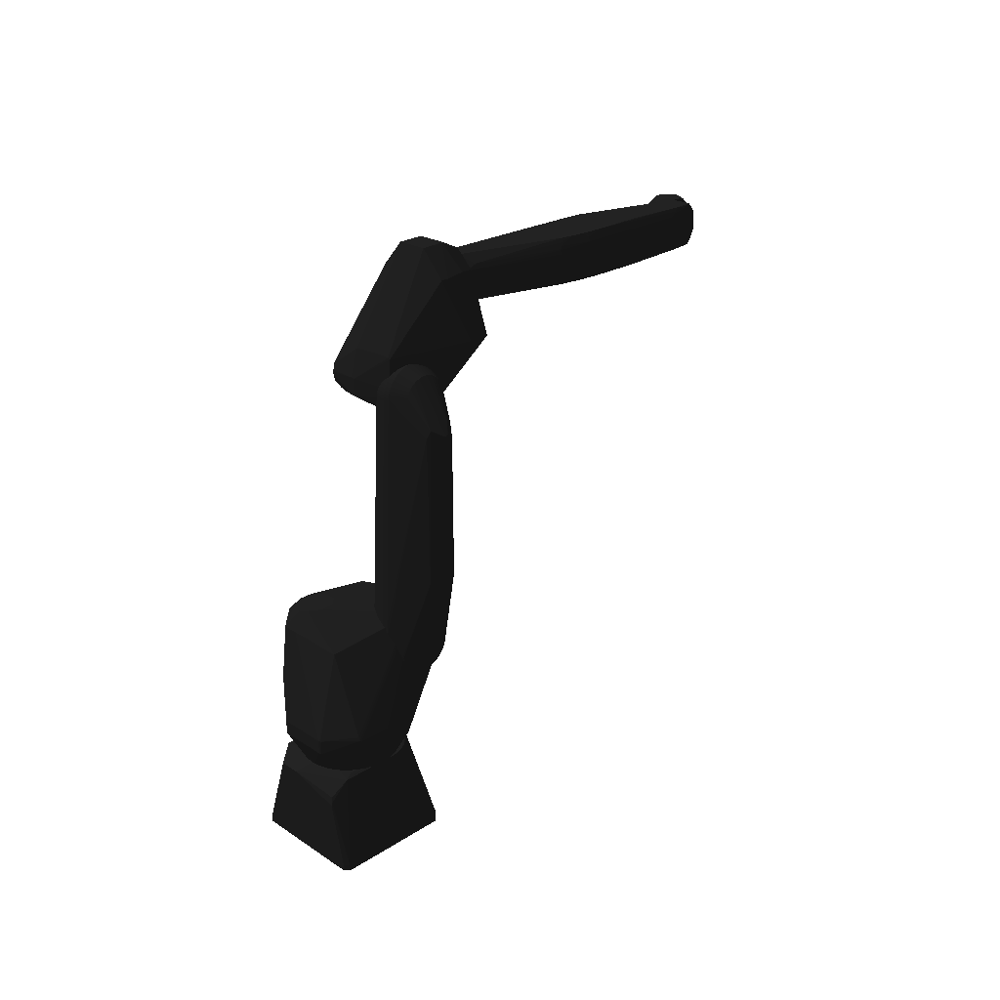</a><br>[front](pybullet/images/ros-industrial/xacro_generated/fanuc/fanuc_m10ia_support/m10ia7l/front.png) · [side](pybullet/images/ros-industrial/xacro_generated/fanuc/fanuc_m10ia_support/m10ia7l/side.png) · [top](pybullet/images/ros-industrial/xacro_generated/fanuc/fanuc_m10ia_support/m10ia7l/top.png) |
| m16ib20 | ROS-Industrial | FANUC | <a href="mujoco/images/ros-industrial/xacro_generated/fanuc/fanuc_m16ib_support/m16ib20/iso.png"></a><br>[front](mujoco/images/ros-industrial/xacro_generated/fanuc/fanuc_m16ib_support/m16ib20/front.png) · [side](mujoco/images/ros-industrial/xacro_generated/fanuc/fanuc_m16ib_support/m16ib20/side.png) · [top](mujoco/images/ros-industrial/xacro_generated/fanuc/fanuc_m16ib_support/m16ib20/top.png) | <a href="pybullet/images/ros-industrial/xacro_generated/fanuc/fanuc_m16ib_support/m16ib20/iso.png"></a><br>[front](pybullet/images/ros-industrial/xacro_generated/fanuc/fanuc_m16ib_support/m16ib20/front.png) · [side](pybullet/images/ros-industrial/xacro_generated/fanuc/fanuc_m16ib_support/m16ib20/side.png) · [top](pybullet/images/ros-industrial/xacro_generated/fanuc/fanuc_m16ib_support/m16ib20/top.png) |
| m20ia | ROS-Industrial | FANUC | <a href="mujoco/images/ros-industrial/xacro_generated/fanuc/fanuc_m20ia_support/m20ia/iso.png">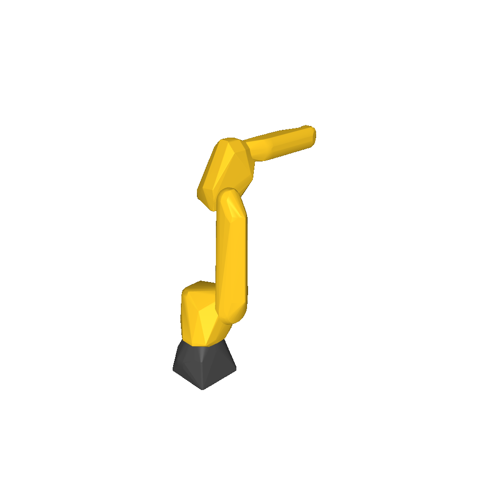</a><br>[front](mujoco/images/ros-industrial/xacro_generated/fanuc/fanuc_m20ia_support/m20ia/front.png) · [side](mujoco/images/ros-industrial/xacro_generated/fanuc/fanuc_m20ia_support/m20ia/side.png) · [top](mujoco/images/ros-industrial/xacro_generated/fanuc/fanuc_m20ia_support/m20ia/top.png) | <a href="pybullet/images/ros-industrial/xacro_generated/fanuc/fanuc_m20ia_support/m20ia/iso.png">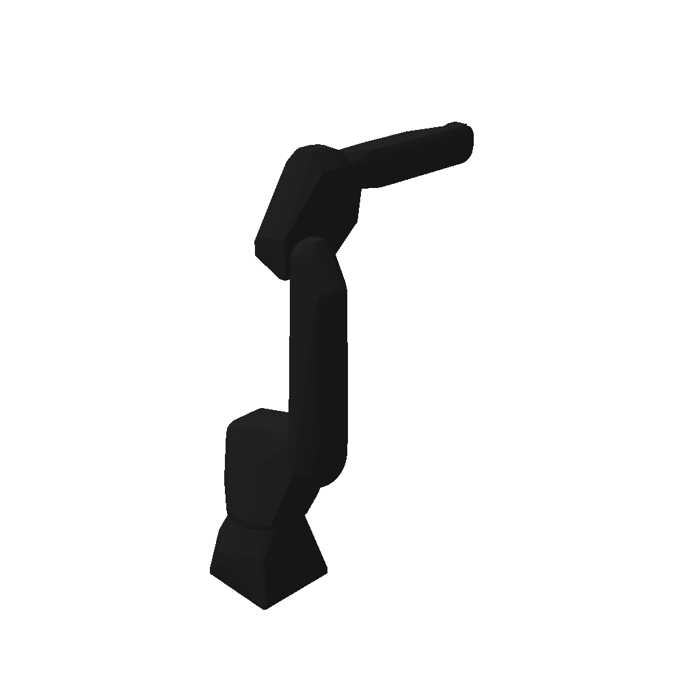</a><br>[front](pybullet/images/ros-industrial/xacro_generated/fanuc/fanuc_m20ia_support/m20ia/front.png) · [side](pybullet/images/ros-industrial/xacro_generated/fanuc/fanuc_m20ia_support/m20ia/side.png) · [top](pybullet/images/ros-industrial/xacro_generated/fanuc/fanuc_m20ia_support/m20ia/top.png) |
| m20ia10l | ROS-Industrial | FANUC | <a href="mujoco/images/ros-industrial/xacro_generated/fanuc/fanuc_m20ia_support/m20ia10l/iso.png">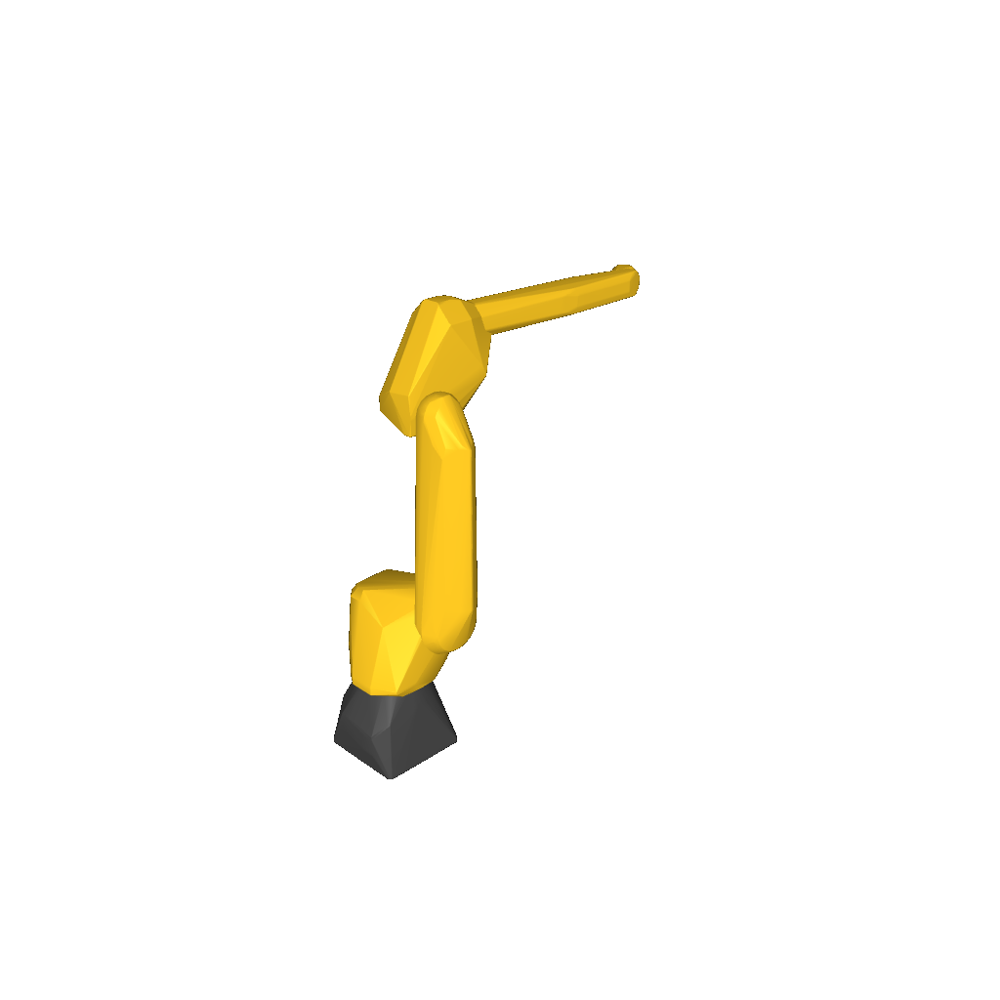</a><br>[front](mujoco/images/ros-industrial/xacro_generated/fanuc/fanuc_m20ia_support/m20ia10l/front.png) · [side](mujoco/images/ros-industrial/xacro_generated/fanuc/fanuc_m20ia_support/m20ia10l/side.png) · [top](mujoco/images/ros-industrial/xacro_generated/fanuc/fanuc_m20ia_support/m20ia10l/top.png) | <a href="pybullet/images/ros-industrial/xacro_generated/fanuc/fanuc_m20ia_support/m20ia10l/iso.png">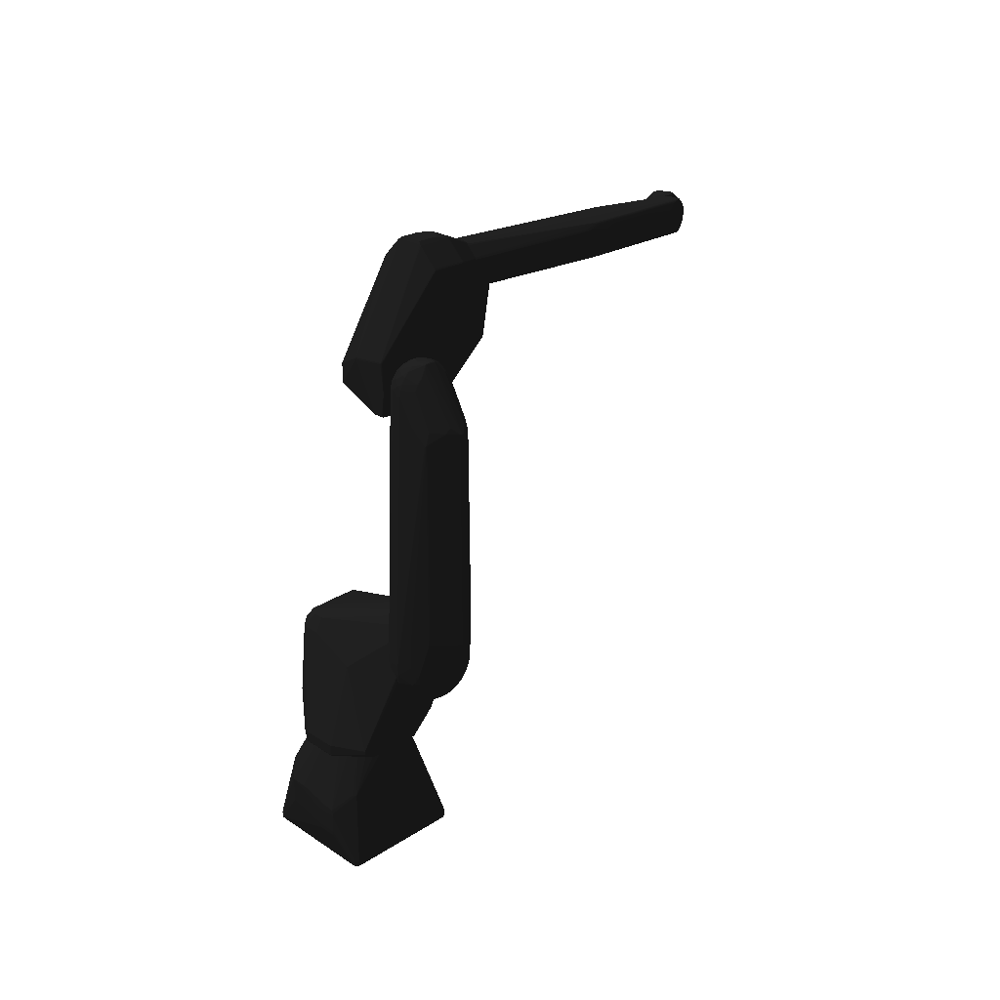</a><br>[front](pybullet/images/ros-industrial/xacro_generated/fanuc/fanuc_m20ia_support/m20ia10l/front.png) · [side](pybullet/images/ros-industrial/xacro_generated/fanuc/fanuc_m20ia_support/m20ia10l/side.png) · [top](pybullet/images/ros-industrial/xacro_generated/fanuc/fanuc_m20ia_support/m20ia10l/top.png) |
| m20ib25 | ROS-Industrial | FANUC | <a href="mujoco/images/ros-industrial/xacro_generated/fanuc/fanuc_m20ib_support/m20ib25/iso.png">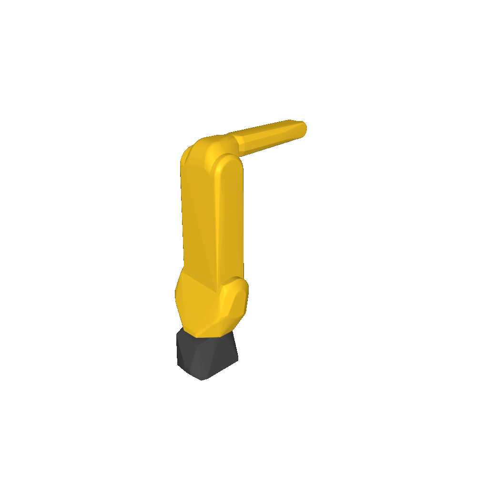</a><br>[front](mujoco/images/ros-industrial/xacro_generated/fanuc/fanuc_m20ib_support/m20ib25/front.png) · [side](mujoco/images/ros-industrial/xacro_generated/fanuc/fanuc_m20ib_support/m20ib25/side.png) · [top](mujoco/images/ros-industrial/xacro_generated/fanuc/fanuc_m20ib_support/m20ib25/top.png) | <a href="pybullet/images/ros-industrial/xacro_generated/fanuc/fanuc_m20ib_support/m20ib25/iso.png">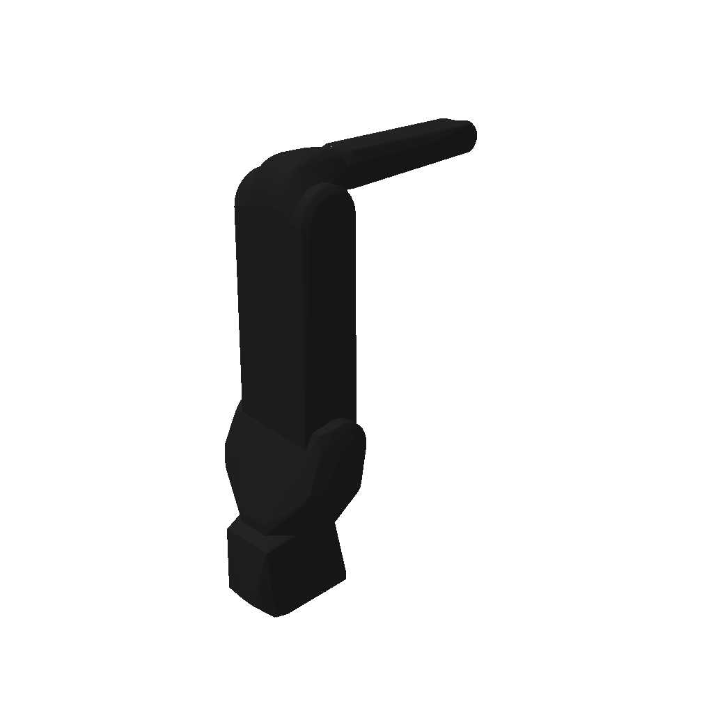</a><br>[front](pybullet/images/ros-industrial/xacro_generated/fanuc/fanuc_m20ib_support/m20ib25/front.png) · [side](pybullet/images/ros-industrial/xacro_generated/fanuc/fanuc_m20ib_support/m20ib25/side.png) · [top](pybullet/images/ros-industrial/xacro_generated/fanuc/fanuc_m20ib_support/m20ib25/top.png) |
| m430ia2f | ROS-Industrial | FANUC | <a href="mujoco/images/ros-industrial/xacro_generated/fanuc/fanuc_m430ia_support/m430ia2f/iso.png">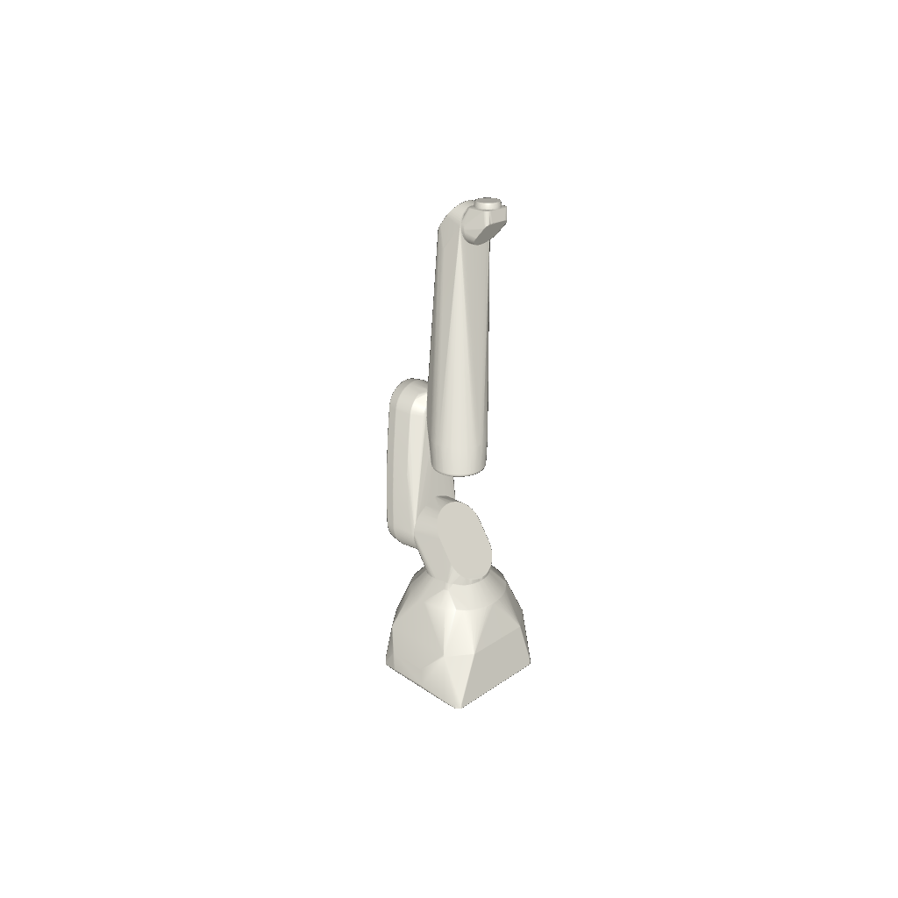</a><br>[front](mujoco/images/ros-industrial/xacro_generated/fanuc/fanuc_m430ia_support/m430ia2f/front.png) · [side](mujoco/images/ros-industrial/xacro_generated/fanuc/fanuc_m430ia_support/m430ia2f/side.png) · [top](mujoco/images/ros-industrial/xacro_generated/fanuc/fanuc_m430ia_support/m430ia2f/top.png) | <a href="pybullet/images/ros-industrial/xacro_generated/fanuc/fanuc_m430ia_support/m430ia2f/iso.png">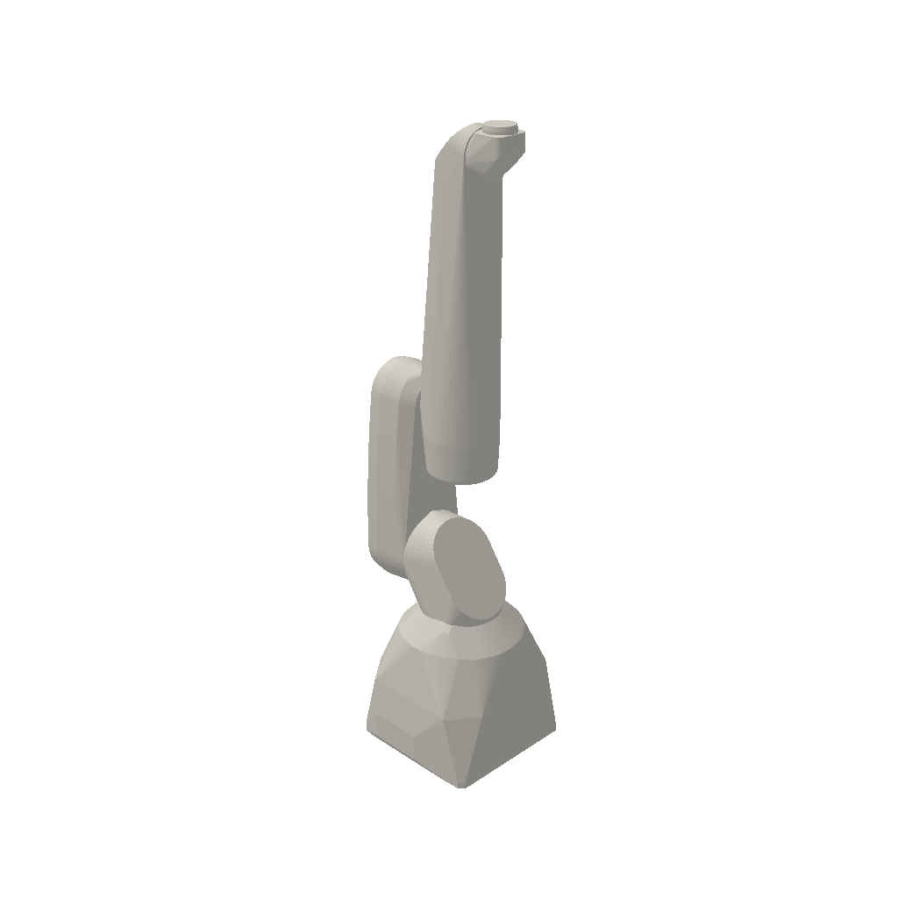</a><br>[front](pybullet/images/ros-industrial/xacro_generated/fanuc/fanuc_m430ia_support/m430ia2f/front.png) · [side](pybullet/images/ros-industrial/xacro_generated/fanuc/fanuc_m430ia_support/m430ia2f/side.png) · [top](pybullet/images/ros-industrial/xacro_generated/fanuc/fanuc_m430ia_support/m430ia2f/top.png) |
| m430ia2p | ROS-Industrial | FANUC | <a href="mujoco/images/ros-industrial/xacro_generated/fanuc/fanuc_m430ia_support/m430ia2p/iso.png">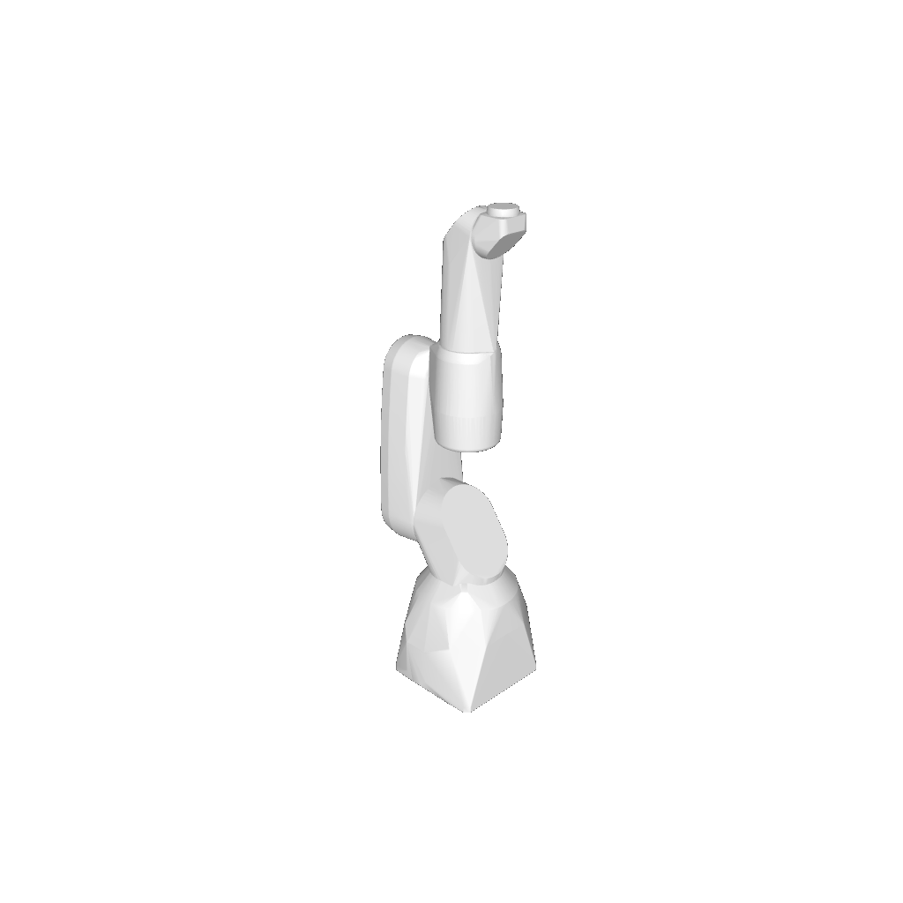</a><br>[front](mujoco/images/ros-industrial/xacro_generated/fanuc/fanuc_m430ia_support/m430ia2p/front.png) · [side](mujoco/images/ros-industrial/xacro_generated/fanuc/fanuc_m430ia_support/m430ia2p/side.png) · [top](mujoco/images/ros-industrial/xacro_generated/fanuc/fanuc_m430ia_support/m430ia2p/top.png) | <a href="pybullet/images/ros-industrial/xacro_generated/fanuc/fanuc_m430ia_support/m430ia2p/iso.png">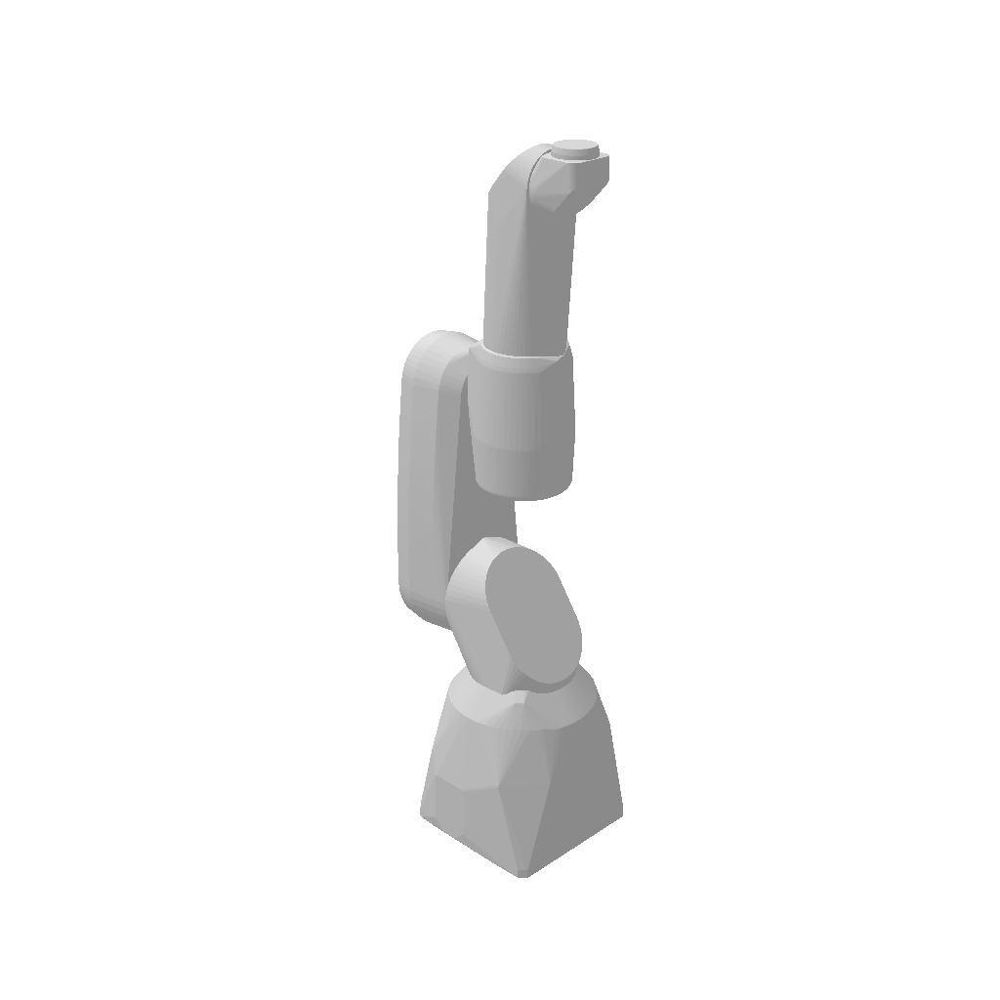</a><br>[front](pybullet/images/ros-industrial/xacro_generated/fanuc/fanuc_m430ia_support/m430ia2p/front.png) · [side](pybullet/images/ros-industrial/xacro_generated/fanuc/fanuc_m430ia_support/m430ia2p/side.png) · [top](pybullet/images/ros-industrial/xacro_generated/fanuc/fanuc_m430ia_support/m430ia2p/top.png) |
| m6ib | ROS-Industrial | FANUC | <a href="mujoco/images/ros-industrial/xacro_generated/fanuc/fanuc_m6ib_support/m6ib/iso.png">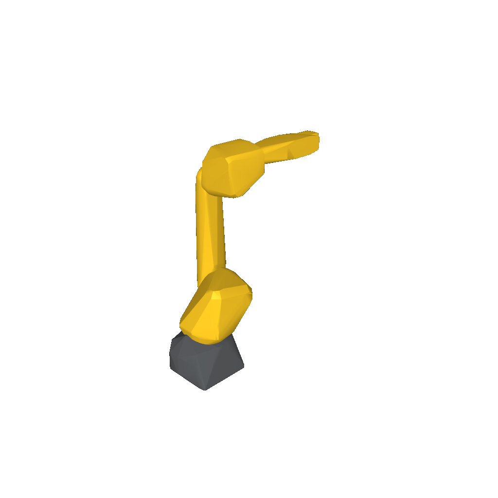</a><br>[front](mujoco/images/ros-industrial/xacro_generated/fanuc/fanuc_m6ib_support/m6ib/front.png) · [side](mujoco/images/ros-industrial/xacro_generated/fanuc/fanuc_m6ib_support/m6ib/side.png) · [top](mujoco/images/ros-industrial/xacro_generated/fanuc/fanuc_m6ib_support/m6ib/top.png) | <a href="pybullet/images/ros-industrial/xacro_generated/fanuc/fanuc_m6ib_support/m6ib/iso.png">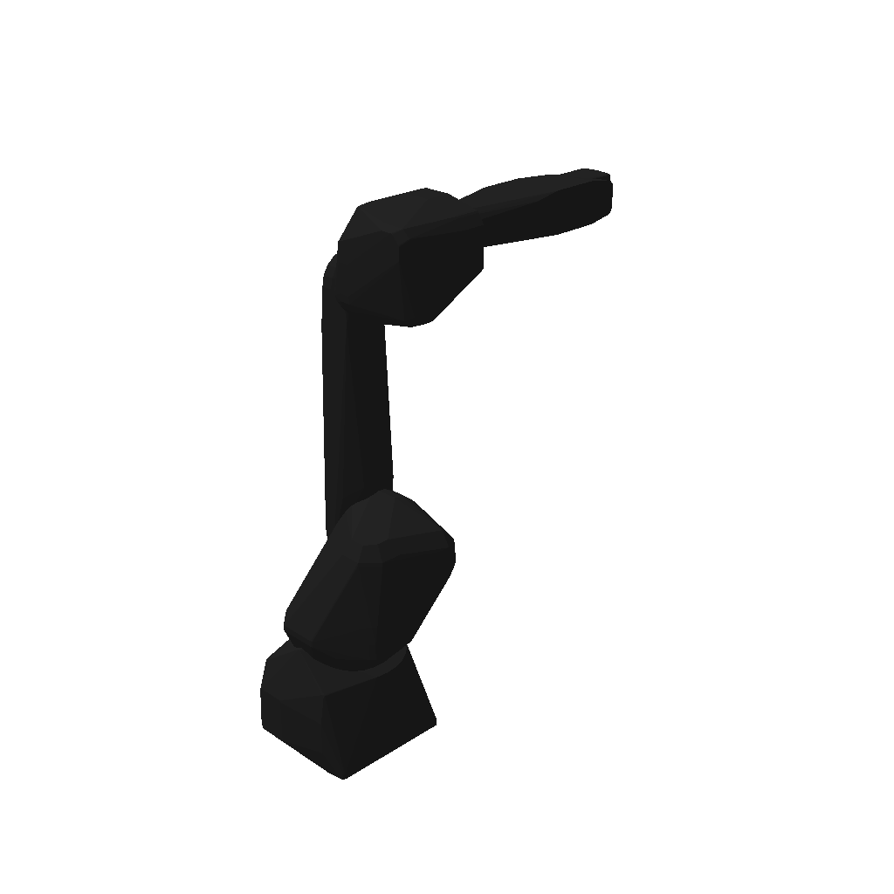</a><br>[front](pybullet/images/ros-industrial/xacro_generated/fanuc/fanuc_m6ib_support/m6ib/front.png) · [side](pybullet/images/ros-industrial/xacro_generated/fanuc/fanuc_m6ib_support/m6ib/side.png) · [top](pybullet/images/ros-industrial/xacro_generated/fanuc/fanuc_m6ib_support/m6ib/top.png) |
| m6ib6s | ROS-Industrial | FANUC | <a href="mujoco/images/ros-industrial/xacro_generated/fanuc/fanuc_m6ib_support/m6ib6s/iso.png">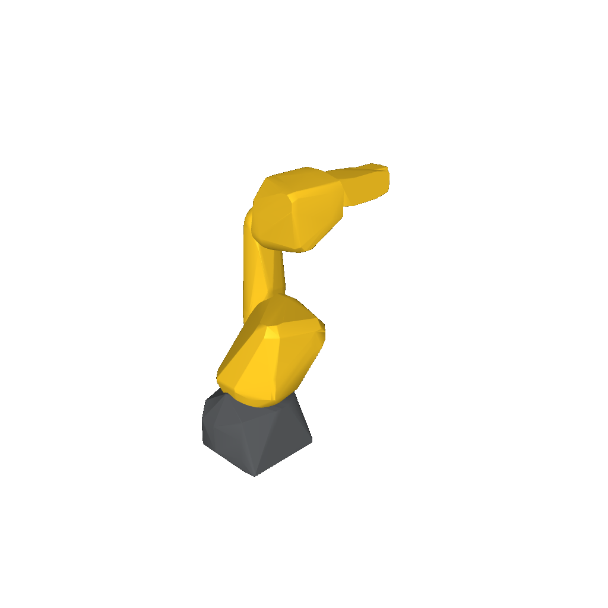</a><br>[front](mujoco/images/ros-industrial/xacro_generated/fanuc/fanuc_m6ib_support/m6ib6s/front.png) · [side](mujoco/images/ros-industrial/xacro_generated/fanuc/fanuc_m6ib_support/m6ib6s/side.png) · [top](mujoco/images/ros-industrial/xacro_generated/fanuc/fanuc_m6ib_support/m6ib6s/top.png) | <a href="pybullet/images/ros-industrial/xacro_generated/fanuc/fanuc_m6ib_support/m6ib6s/iso.png">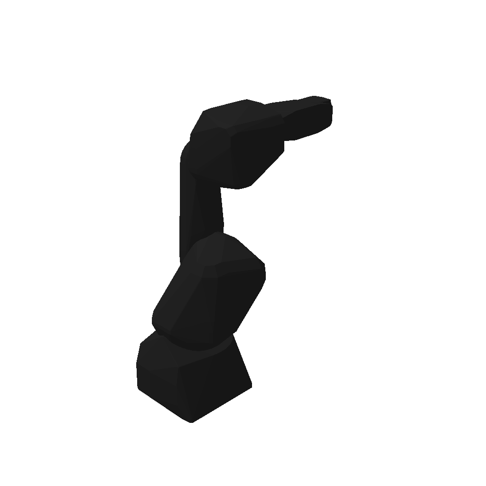</a><br>[front](pybullet/images/ros-industrial/xacro_generated/fanuc/fanuc_m6ib_support/m6ib6s/front.png) · [side](pybullet/images/ros-industrial/xacro_generated/fanuc/fanuc_m6ib_support/m6ib6s/side.png) · [top](pybullet/images/ros-industrial/xacro_generated/fanuc/fanuc_m6ib_support/m6ib6s/top.png) |
| m710ic45m | ROS-Industrial | FANUC | <a href="mujoco/images/ros-industrial/xacro_generated/fanuc/fanuc_m710ic_support/m710ic45m/iso.png">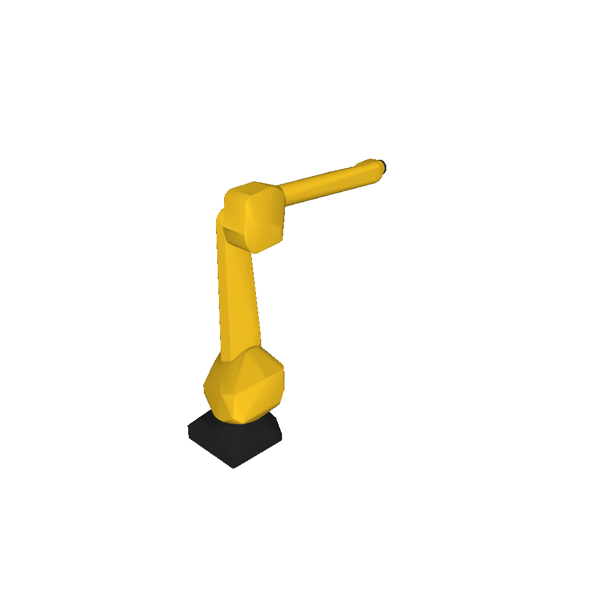</a><br>[front](mujoco/images/ros-industrial/xacro_generated/fanuc/fanuc_m710ic_support/m710ic45m/front.png) · [side](mujoco/images/ros-industrial/xacro_generated/fanuc/fanuc_m710ic_support/m710ic45m/side.png) · [top](mujoco/images/ros-industrial/xacro_generated/fanuc/fanuc_m710ic_support/m710ic45m/top.png) | <a href="pybullet/images/ros-industrial/xacro_generated/fanuc/fanuc_m710ic_support/m710ic45m/iso.png">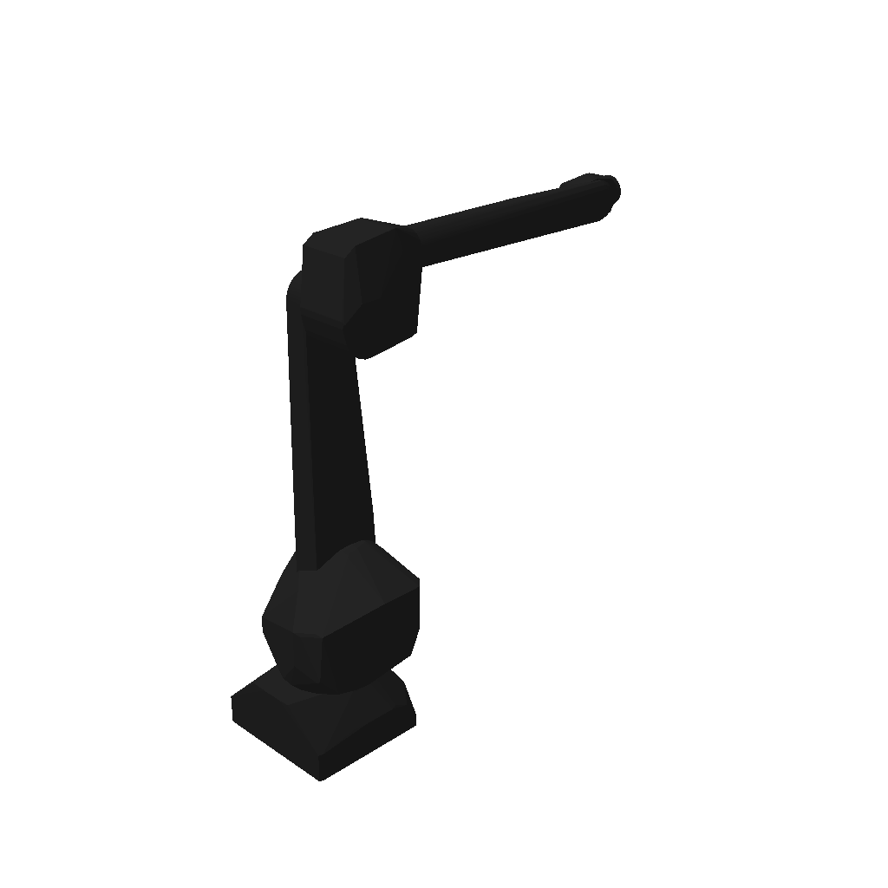</a><br>[front](pybullet/images/ros-industrial/xacro_generated/fanuc/fanuc_m710ic_support/m710ic45m/front.png) · [side](pybullet/images/ros-industrial/xacro_generated/fanuc/fanuc_m710ic_support/m710ic45m/side.png) · [top](pybullet/images/ros-industrial/xacro_generated/fanuc/fanuc_m710ic_support/m710ic45m/top.png) |
| m710ic50 | ROS-Industrial | FANUC | <a href="mujoco/images/ros-industrial/xacro_generated/fanuc/fanuc_m710ic_support/m710ic50/iso.png">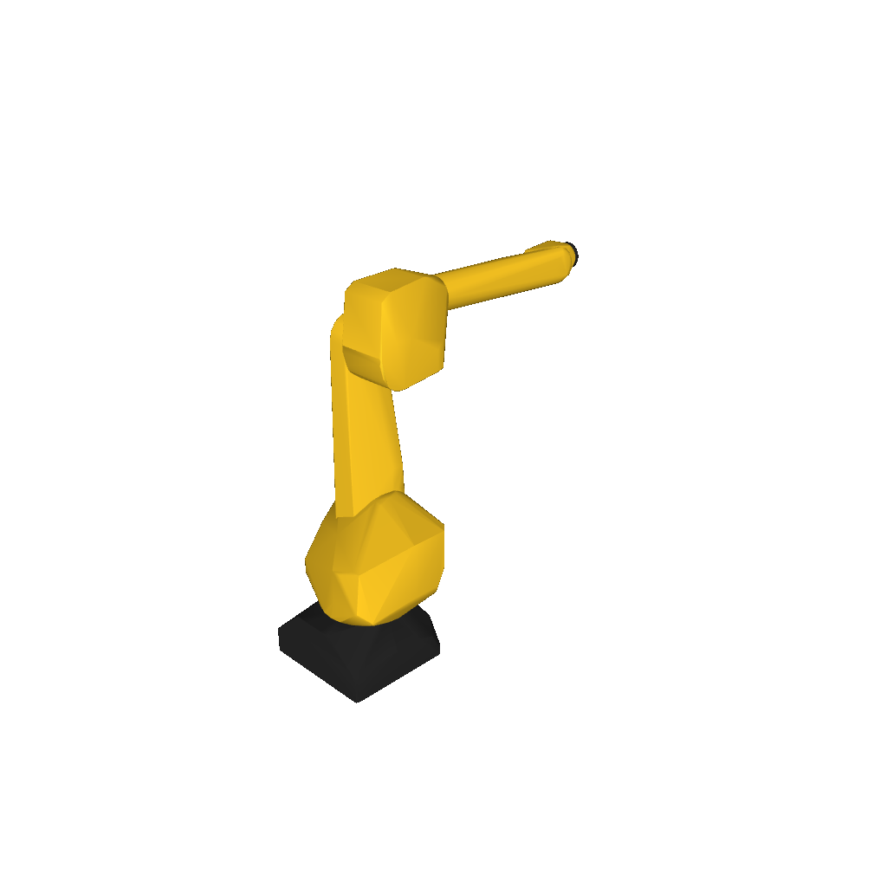</a><br>[front](mujoco/images/ros-industrial/xacro_generated/fanuc/fanuc_m710ic_support/m710ic50/front.png) · [side](mujoco/images/ros-industrial/xacro_generated/fanuc/fanuc_m710ic_support/m710ic50/side.png) · [top](mujoco/images/ros-industrial/xacro_generated/fanuc/fanuc_m710ic_support/m710ic50/top.png) | <a href="pybullet/images/ros-industrial/xacro_generated/fanuc/fanuc_m710ic_support/m710ic50/iso.png">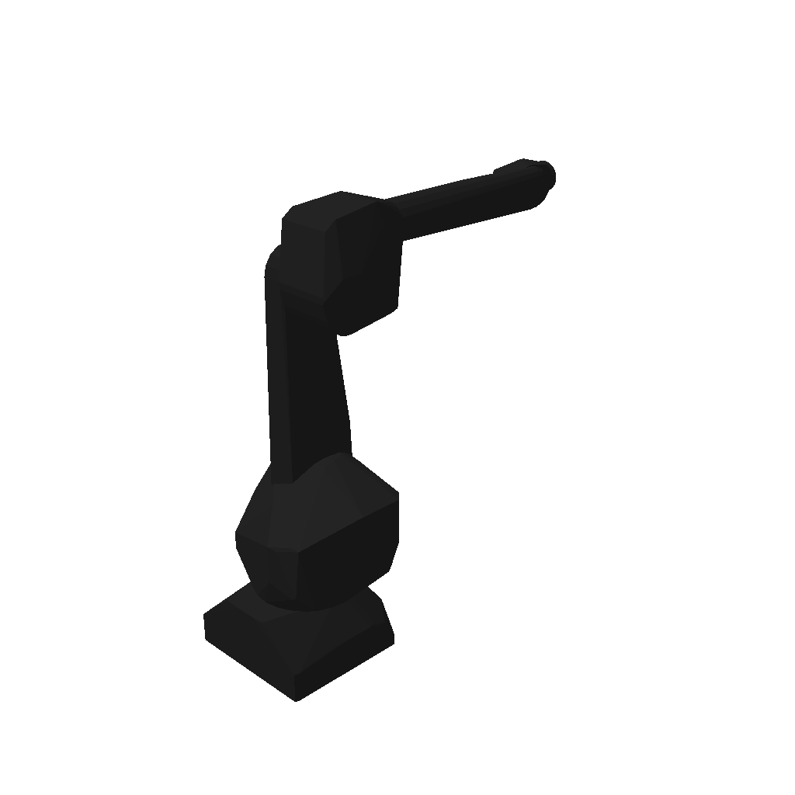</a><br>[front](pybullet/images/ros-industrial/xacro_generated/fanuc/fanuc_m710ic_support/m710ic50/front.png) · [side](pybullet/images/ros-industrial/xacro_generated/fanuc/fanuc_m710ic_support/m710ic50/side.png) · [top](pybullet/images/ros-industrial/xacro_generated/fanuc/fanuc_m710ic_support/m710ic50/top.png) |
| m900ia260l | ROS-Industrial | FANUC | <a href="mujoco/images/ros-industrial/xacro_generated/fanuc/fanuc_m900ia_support/m900ia260l/iso.png">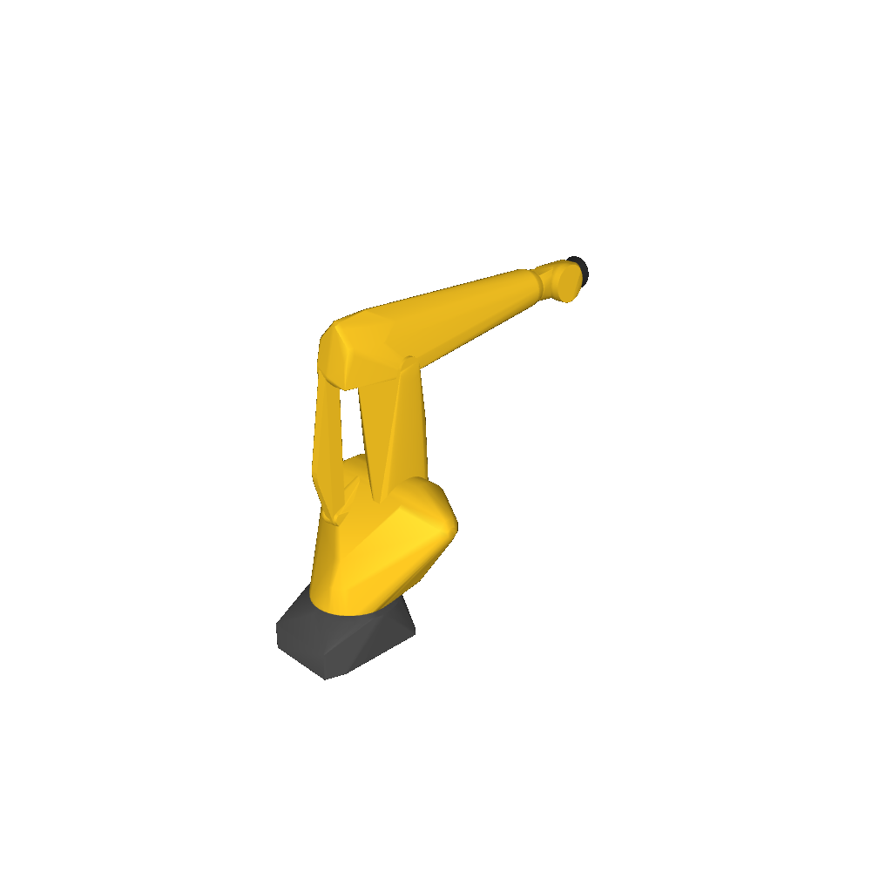</a><br>[front](mujoco/images/ros-industrial/xacro_generated/fanuc/fanuc_m900ia_support/m900ia260l/front.png) · [side](mujoco/images/ros-industrial/xacro_generated/fanuc/fanuc_m900ia_support/m900ia260l/side.png) · [top](mujoco/images/ros-industrial/xacro_generated/fanuc/fanuc_m900ia_support/m900ia260l/top.png) | <a href="pybullet/images/ros-industrial/xacro_generated/fanuc/fanuc_m900ia_support/m900ia260l/iso.png">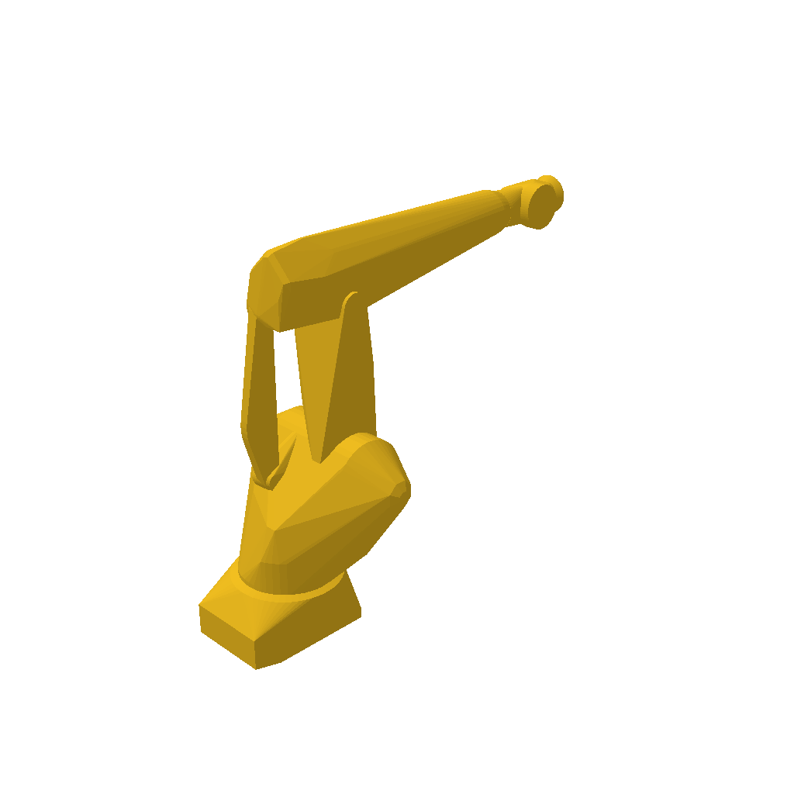</a><br>[front](pybullet/images/ros-industrial/xacro_generated/fanuc/fanuc_m900ia_support/m900ia260l/front.png) · [side](pybullet/images/ros-industrial/xacro_generated/fanuc/fanuc_m900ia_support/m900ia260l/side.png) · [top](pybullet/images/ros-industrial/xacro_generated/fanuc/fanuc_m900ia_support/m900ia260l/top.png) |
| m900ib700 | ROS-Industrial | FANUC | <a href="mujoco/images/ros-industrial/xacro_generated/fanuc/fanuc_m900ib_support/m900ib700/iso.png">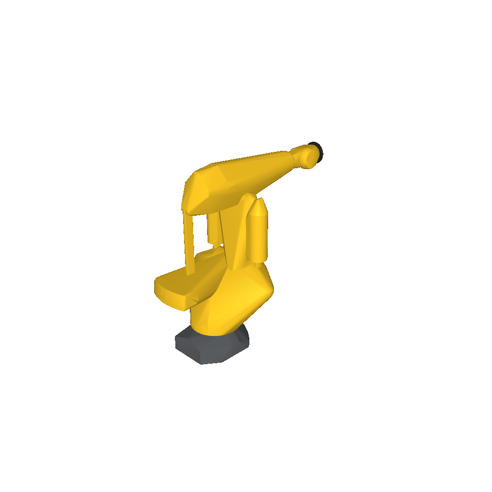</a><br>[front](mujoco/images/ros-industrial/xacro_generated/fanuc/fanuc_m900ib_support/m900ib700/front.png) · [side](mujoco/images/ros-industrial/xacro_generated/fanuc/fanuc_m900ib_support/m900ib700/side.png) · [top](mujoco/images/ros-industrial/xacro_generated/fanuc/fanuc_m900ib_support/m900ib700/top.png) | <a href="pybullet/images/ros-industrial/xacro_generated/fanuc/fanuc_m900ib_support/m900ib700/iso.png">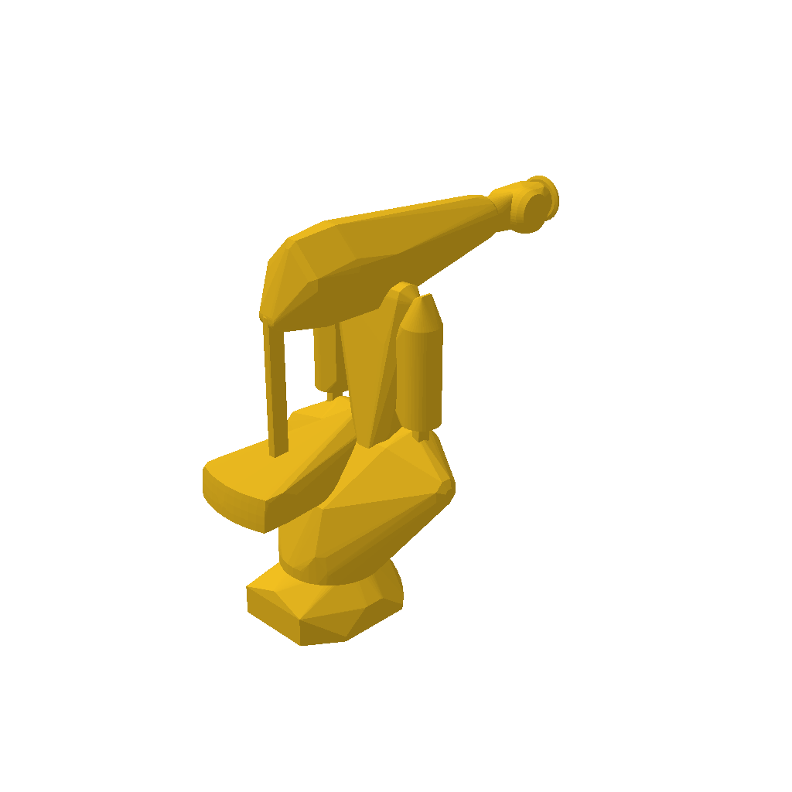</a><br>[front](pybullet/images/ros-industrial/xacro_generated/fanuc/fanuc_m900ib_support/m900ib700/front.png) · [side](pybullet/images/ros-industrial/xacro_generated/fanuc/fanuc_m900ib_support/m900ib700/side.png) · [top](pybullet/images/ros-industrial/xacro_generated/fanuc/fanuc_m900ib_support/m900ib700/top.png) |
| r1000ia80f | ROS-Industrial | FANUC | <a href="mujoco/images/ros-industrial/xacro_generated/fanuc/fanuc_r1000ia_support/r1000ia80f/iso.png">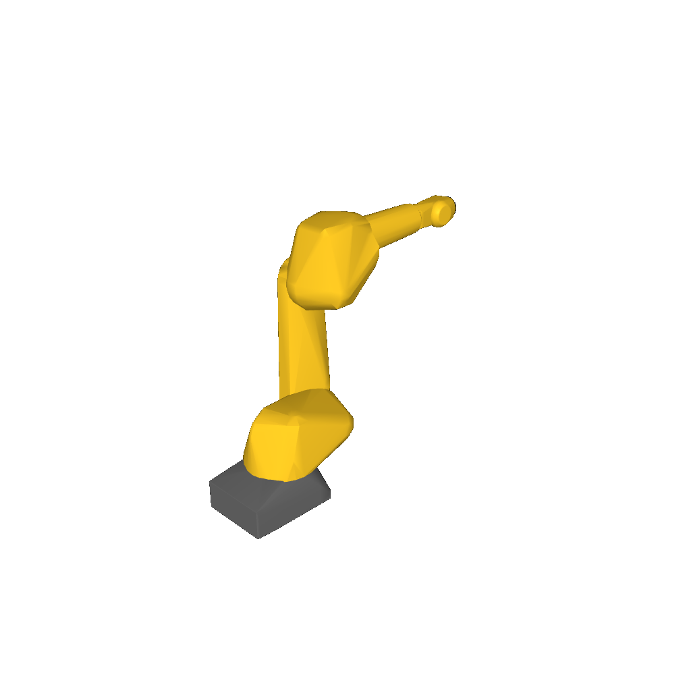</a><br>[front](mujoco/images/ros-industrial/xacro_generated/fanuc/fanuc_r1000ia_support/r1000ia80f/front.png) · [side](mujoco/images/ros-industrial/xacro_generated/fanuc/fanuc_r1000ia_support/r1000ia80f/side.png) · [top](mujoco/images/ros-industrial/xacro_generated/fanuc/fanuc_r1000ia_support/r1000ia80f/top.png) | <a href="pybullet/images/ros-industrial/xacro_generated/fanuc/fanuc_r1000ia_support/r1000ia80f/iso.png">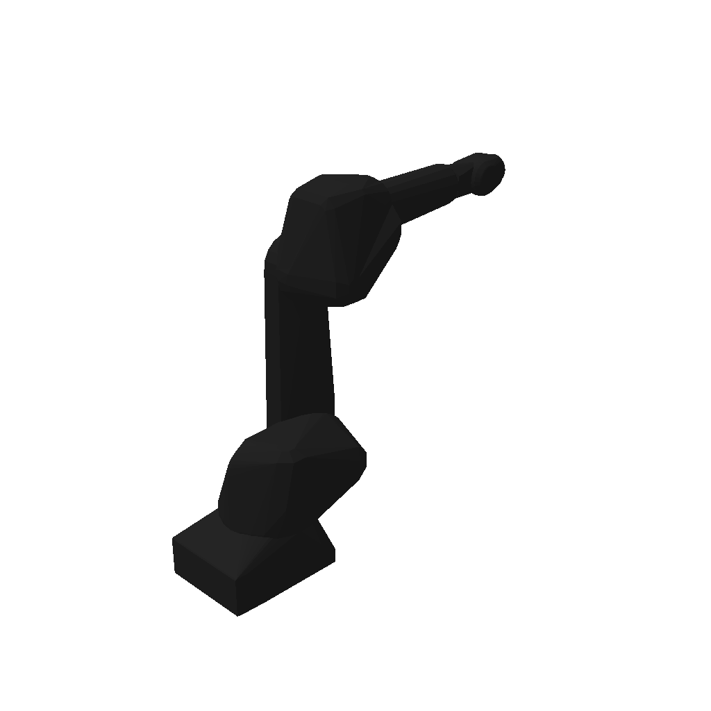</a><br>[front](pybullet/images/ros-industrial/xacro_generated/fanuc/fanuc_r1000ia_support/r1000ia80f/front.png) · [side](pybullet/images/ros-industrial/xacro_generated/fanuc/fanuc_r1000ia_support/r1000ia80f/side.png) · [top](pybullet/images/ros-industrial/xacro_generated/fanuc/fanuc_r1000ia_support/r1000ia80f/top.png) |
| r2000ib210f | ROS-Industrial | FANUC | <a href="mujoco/images/ros-industrial/xacro_generated/fanuc/fanuc_r2000ib_support/r2000ib210f/iso.png"></a><br>[front](mujoco/images/ros-industrial/xacro_generated/fanuc/fanuc_r2000ib_support/r2000ib210f/front.png) · [side](mujoco/images/ros-industrial/xacro_generated/fanuc/fanuc_r2000ib_support/r2000ib210f/side.png) · [top](mujoco/images/ros-industrial/xacro_generated/fanuc/fanuc_r2000ib_support/r2000ib210f/top.png) | <a href="pybullet/images/ros-industrial/xacro_generated/fanuc/fanuc_r2000ib_support/r2000ib210f/iso.png"></a><br>[front](pybullet/images/ros-industrial/xacro_generated/fanuc/fanuc_r2000ib_support/r2000ib210f/front.png) · [side](pybullet/images/ros-industrial/xacro_generated/fanuc/fanuc_r2000ib_support/r2000ib210f/side.png) · [top](pybullet/images/ros-industrial/xacro_generated/fanuc/fanuc_r2000ib_support/r2000ib210f/top.png) |
| r2000ic125l | ROS-Industrial | FANUC | <a href="mujoco/images/ros-industrial/xacro_generated/fanuc/fanuc_r2000ic_support/r2000ic125l/iso.png">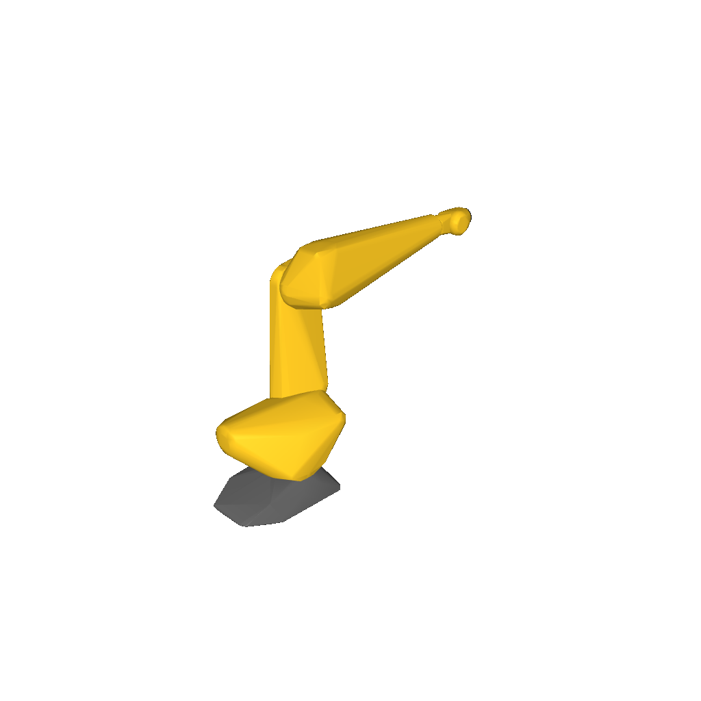</a><br>[front](mujoco/images/ros-industrial/xacro_generated/fanuc/fanuc_r2000ic_support/r2000ic125l/front.png) · [side](mujoco/images/ros-industrial/xacro_generated/fanuc/fanuc_r2000ic_support/r2000ic125l/side.png) · [top](mujoco/images/ros-industrial/xacro_generated/fanuc/fanuc_r2000ic_support/r2000ic125l/top.png) | <a href="pybullet/images/ros-industrial/xacro_generated/fanuc/fanuc_r2000ic_support/r2000ic125l/iso.png">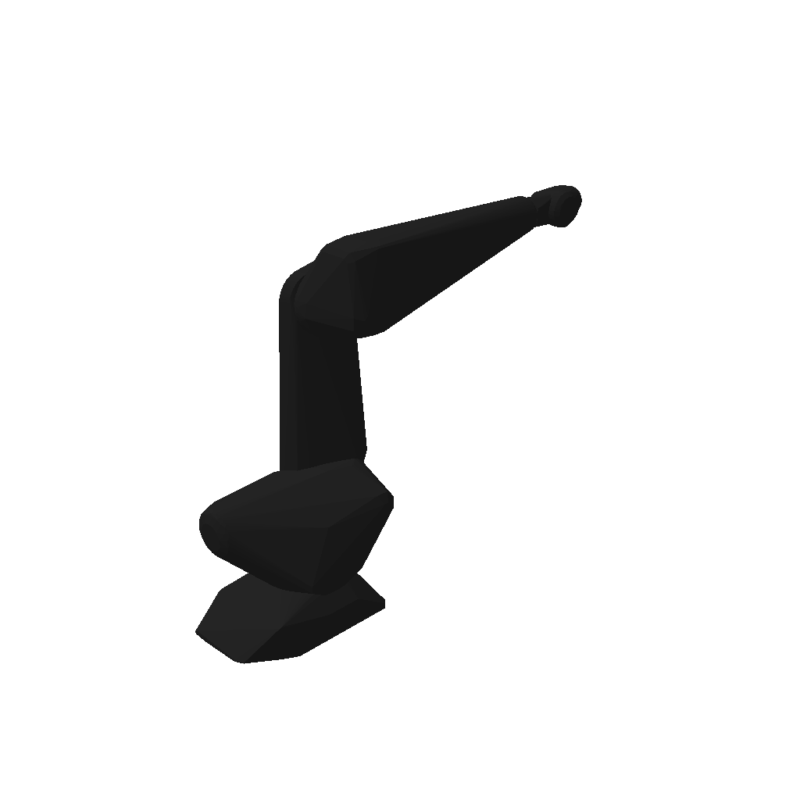</a><br>[front](pybullet/images/ros-industrial/xacro_generated/fanuc/fanuc_r2000ic_support/r2000ic125l/front.png) · [side](pybullet/images/ros-industrial/xacro_generated/fanuc/fanuc_r2000ic_support/r2000ic125l/side.png) · [top](pybullet/images/ros-industrial/xacro_generated/fanuc/fanuc_r2000ic_support/r2000ic125l/top.png) |
| r2000ic165f | ROS-Industrial | FANUC | <a href="mujoco/images/ros-industrial/xacro_generated/fanuc/fanuc_r2000ic_support/r2000ic165f/iso.png"></a><br>[front](mujoco/images/ros-industrial/xacro_generated/fanuc/fanuc_r2000ic_support/r2000ic165f/front.png) · [side](mujoco/images/ros-industrial/xacro_generated/fanuc/fanuc_r2000ic_support/r2000ic165f/side.png) · [top](mujoco/images/ros-industrial/xacro_generated/fanuc/fanuc_r2000ic_support/r2000ic165f/top.png) | <a href="pybullet/images/ros-industrial/xacro_generated/fanuc/fanuc_r2000ic_support/r2000ic165f/iso.png">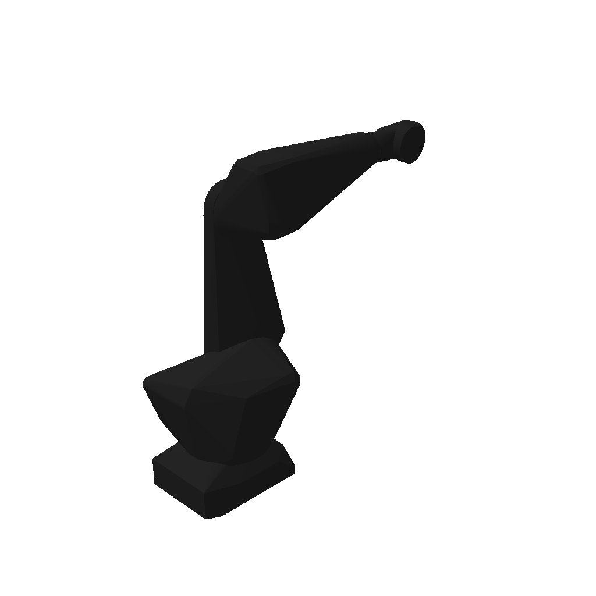</a><br>[front](pybullet/images/ros-industrial/xacro_generated/fanuc/fanuc_r2000ic_support/r2000ic165f/front.png) · [side](pybullet/images/ros-industrial/xacro_generated/fanuc/fanuc_r2000ic_support/r2000ic165f/side.png) · [top](pybullet/images/ros-industrial/xacro_generated/fanuc/fanuc_r2000ic_support/r2000ic165f/top.png) |
| r2000ic210f | ROS-Industrial | FANUC | <a href="mujoco/images/ros-industrial/xacro_generated/fanuc/fanuc_r2000ic_support/r2000ic210f/iso.png">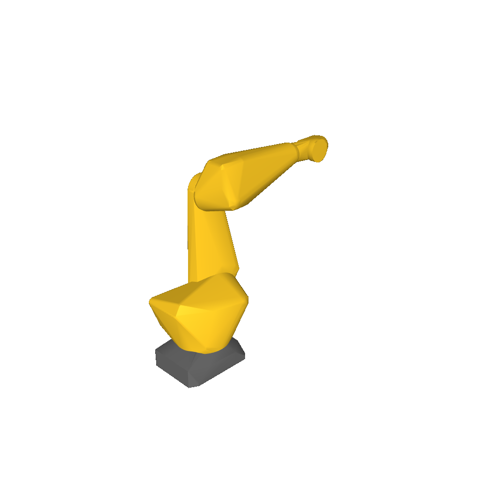</a><br>[front](mujoco/images/ros-industrial/xacro_generated/fanuc/fanuc_r2000ic_support/r2000ic210f/front.png) · [side](mujoco/images/ros-industrial/xacro_generated/fanuc/fanuc_r2000ic_support/r2000ic210f/side.png) · [top](mujoco/images/ros-industrial/xacro_generated/fanuc/fanuc_r2000ic_support/r2000ic210f/top.png) | <a href="pybullet/images/ros-industrial/xacro_generated/fanuc/fanuc_r2000ic_support/r2000ic210f/iso.png"></a><br>[front](pybullet/images/ros-industrial/xacro_generated/fanuc/fanuc_r2000ic_support/r2000ic210f/front.png) · [side](pybullet/images/ros-industrial/xacro_generated/fanuc/fanuc_r2000ic_support/r2000ic210f/side.png) · [top](pybullet/images/ros-industrial/xacro_generated/fanuc/fanuc_r2000ic_support/r2000ic210f/top.png) |
| r2000ic210l | ROS-Industrial | FANUC | <a href="mujoco/images/ros-industrial/xacro_generated/fanuc/fanuc_r2000ic_support/r2000ic210l/iso.png">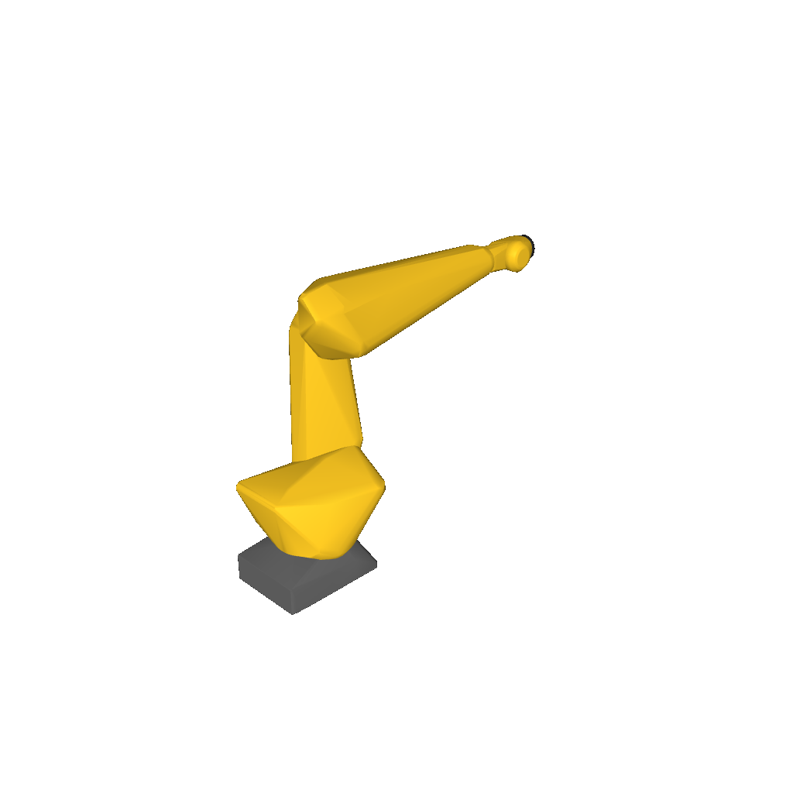</a><br>[front](mujoco/images/ros-industrial/xacro_generated/fanuc/fanuc_r2000ic_support/r2000ic210l/front.png) · [side](mujoco/images/ros-industrial/xacro_generated/fanuc/fanuc_r2000ic_support/r2000ic210l/side.png) · [top](mujoco/images/ros-industrial/xacro_generated/fanuc/fanuc_r2000ic_support/r2000ic210l/top.png) | <a href="pybullet/images/ros-industrial/xacro_generated/fanuc/fanuc_r2000ic_support/r2000ic210l/iso.png">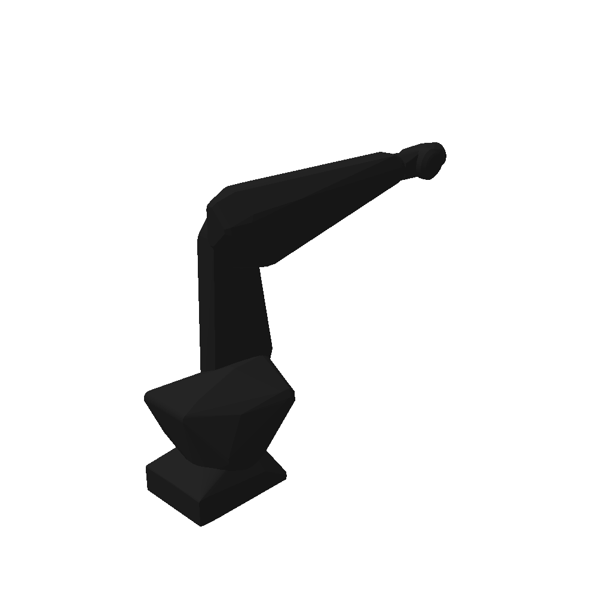</a><br>[front](pybullet/images/ros-industrial/xacro_generated/fanuc/fanuc_r2000ic_support/r2000ic210l/front.png) · [side](pybullet/images/ros-industrial/xacro_generated/fanuc/fanuc_r2000ic_support/r2000ic210l/side.png) · [top](pybullet/images/ros-industrial/xacro_generated/fanuc/fanuc_r2000ic_support/r2000ic210l/top.png) |
| r2000ic270f | ROS-Industrial | FANUC | <a href="mujoco/images/ros-industrial/xacro_generated/fanuc/fanuc_r2000ic_support/r2000ic270f/iso.png">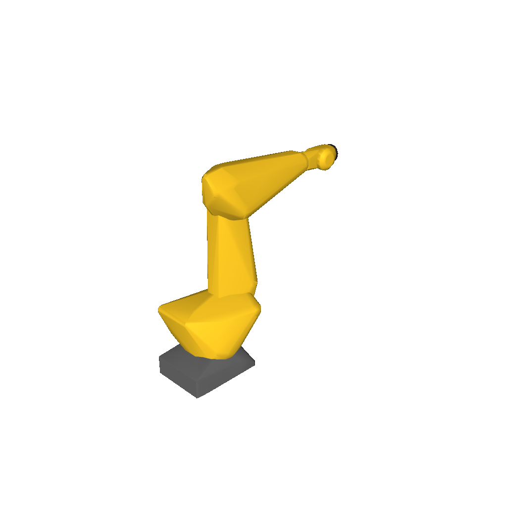</a><br>[front](mujoco/images/ros-industrial/xacro_generated/fanuc/fanuc_r2000ic_support/r2000ic270f/front.png) · [side](mujoco/images/ros-industrial/xacro_generated/fanuc/fanuc_r2000ic_support/r2000ic270f/side.png) · [top](mujoco/images/ros-industrial/xacro_generated/fanuc/fanuc_r2000ic_support/r2000ic270f/top.png) | <a href="pybullet/images/ros-industrial/xacro_generated/fanuc/fanuc_r2000ic_support/r2000ic270f/iso.png">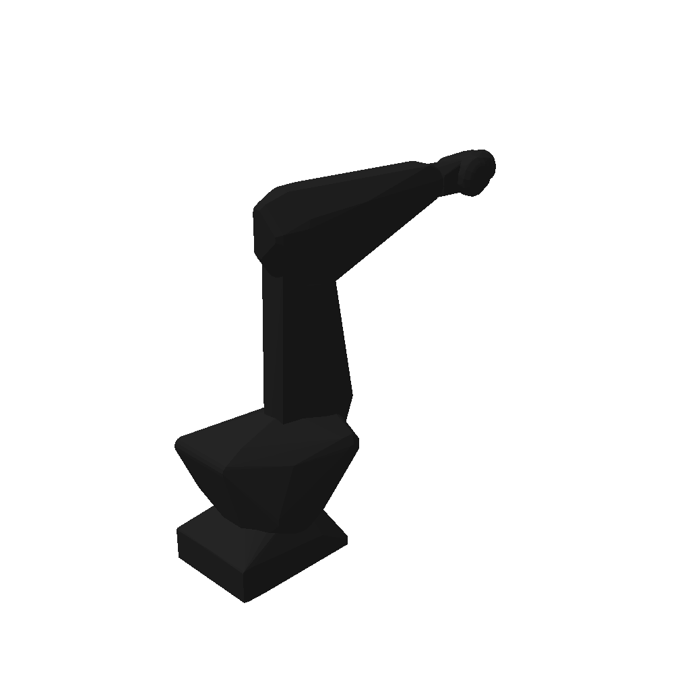</a><br>[front](pybullet/images/ros-industrial/xacro_generated/fanuc/fanuc_r2000ic_support/r2000ic270f/front.png) · [side](pybullet/images/ros-industrial/xacro_generated/fanuc/fanuc_r2000ic_support/r2000ic270f/side.png) · [top](pybullet/images/ros-industrial/xacro_generated/fanuc/fanuc_r2000ic_support/r2000ic270f/top.png) |
| kr10r1100sixx | ROS-Industrial | KUKA | <a href="mujoco/images/ros-industrial/xacro_generated/kuka/kuka_kr10_support/kr10r1100sixx/iso.png">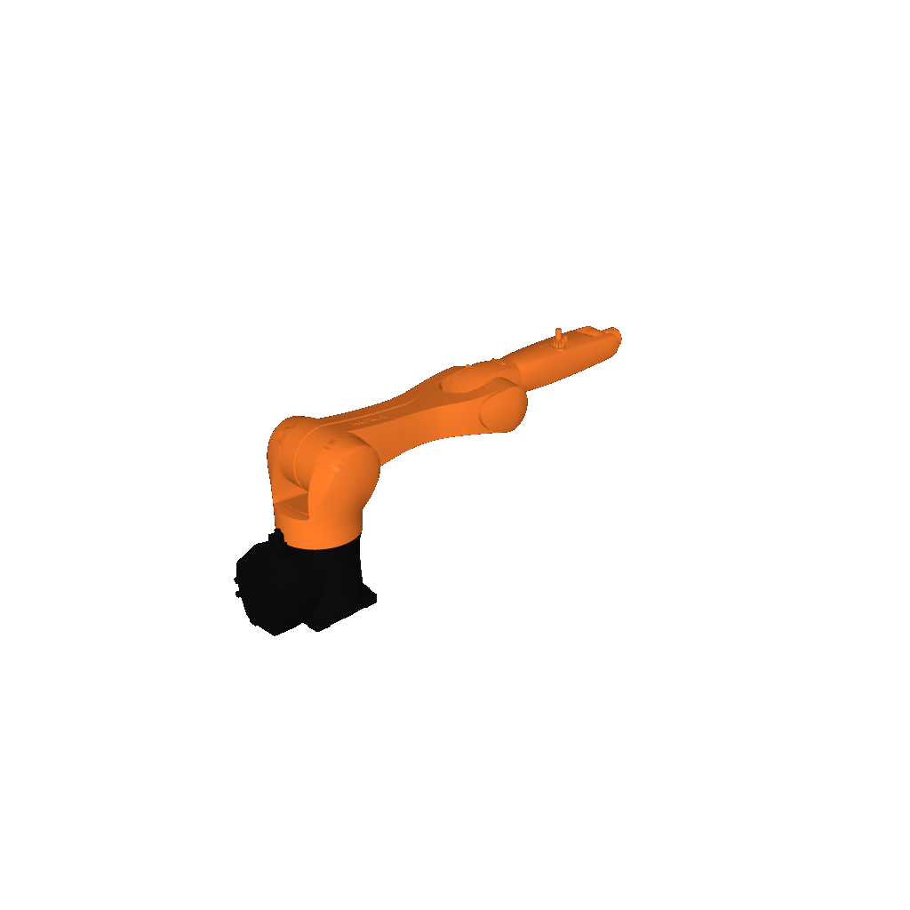</a><br>[front](mujoco/images/ros-industrial/xacro_generated/kuka/kuka_kr10_support/kr10r1100sixx/front.png) · [side](mujoco/images/ros-industrial/xacro_generated/kuka/kuka_kr10_support/kr10r1100sixx/side.png) · [top](mujoco/images/ros-industrial/xacro_generated/kuka/kuka_kr10_support/kr10r1100sixx/top.png) | <a href="pybullet/images/ros-industrial/xacro_generated/kuka/kuka_kr10_support/kr10r1100sixx/iso.png">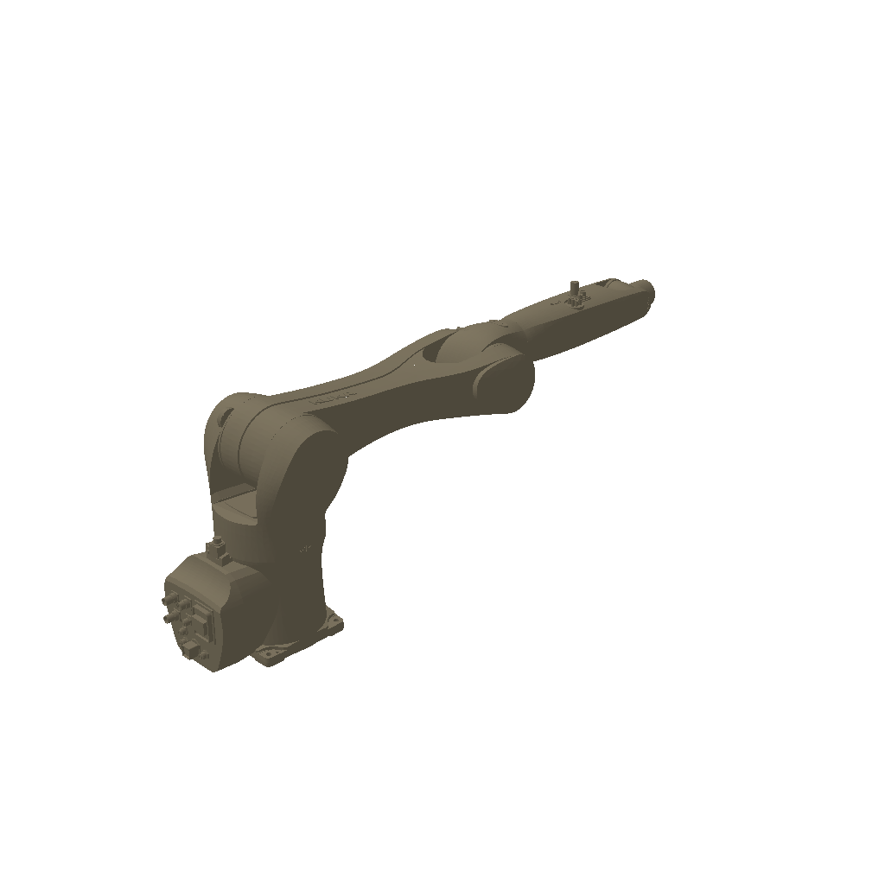</a><br>[front](pybullet/images/ros-industrial/xacro_generated/kuka/kuka_kr10_support/kr10r1100sixx/front.png) · [side](pybullet/images/ros-industrial/xacro_generated/kuka/kuka_kr10_support/kr10r1100sixx/side.png) · [top](pybullet/images/ros-industrial/xacro_generated/kuka/kuka_kr10_support/kr10r1100sixx/top.png) |
| kr10r1420 | ROS-Industrial | KUKA | <a href="mujoco/images/ros-industrial/xacro_generated/kuka/kuka_kr10_support/kr10r1420/iso.png">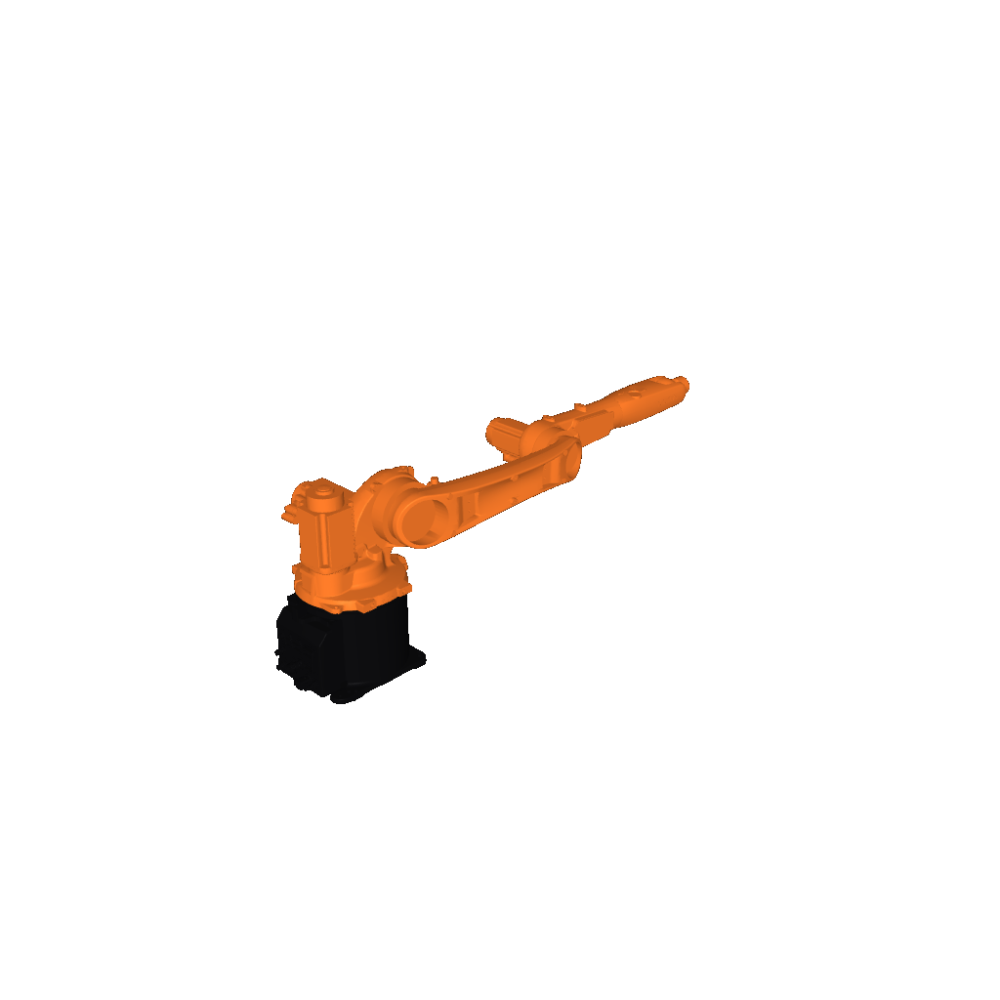</a><br>[front](mujoco/images/ros-industrial/xacro_generated/kuka/kuka_kr10_support/kr10r1420/front.png) · [side](mujoco/images/ros-industrial/xacro_generated/kuka/kuka_kr10_support/kr10r1420/side.png) · [top](mujoco/images/ros-industrial/xacro_generated/kuka/kuka_kr10_support/kr10r1420/top.png) | <a href="pybullet/images/ros-industrial/xacro_generated/kuka/kuka_kr10_support/kr10r1420/iso.png">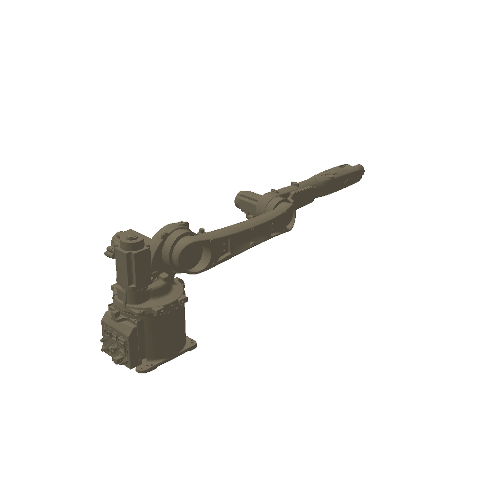</a><br>[front](pybullet/images/ros-industrial/xacro_generated/kuka/kuka_kr10_support/kr10r1420/front.png) · [side](pybullet/images/ros-industrial/xacro_generated/kuka/kuka_kr10_support/kr10r1420/side.png) · [top](pybullet/images/ros-industrial/xacro_generated/kuka/kuka_kr10_support/kr10r1420/top.png) |
| kr10r900_<wbr>2 | ROS-Industrial | KUKA | <a href="mujoco/images/ros-industrial/xacro_generated/kuka/kuka_kr10_support/kr10r900_2/iso.png">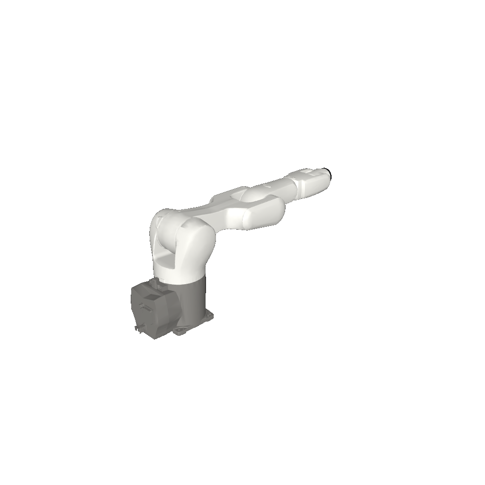</a><br>[front](mujoco/images/ros-industrial/xacro_generated/kuka/kuka_kr10_support/kr10r900_2/front.png) · [side](mujoco/images/ros-industrial/xacro_generated/kuka/kuka_kr10_support/kr10r900_2/side.png) · [top](mujoco/images/ros-industrial/xacro_generated/kuka/kuka_kr10_support/kr10r900_2/top.png) | <a href="pybullet/images/ros-industrial/xacro_generated/kuka/kuka_kr10_support/kr10r900_2/iso.png">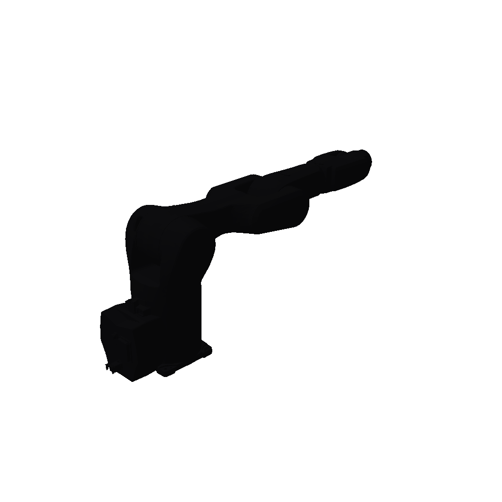</a><br>[front](pybullet/images/ros-industrial/xacro_generated/kuka/kuka_kr10_support/kr10r900_2/front.png) · [side](pybullet/images/ros-industrial/xacro_generated/kuka/kuka_kr10_support/kr10r900_2/side.png) · [top](pybullet/images/ros-industrial/xacro_generated/kuka/kuka_kr10_support/kr10r900_2/top.png) |
| kr150_<wbr>2 | ROS-Industrial | KUKA | <a href="mujoco/images/ros-industrial/xacro_generated/kuka/kuka_kr150_support/kr150_2/iso.png">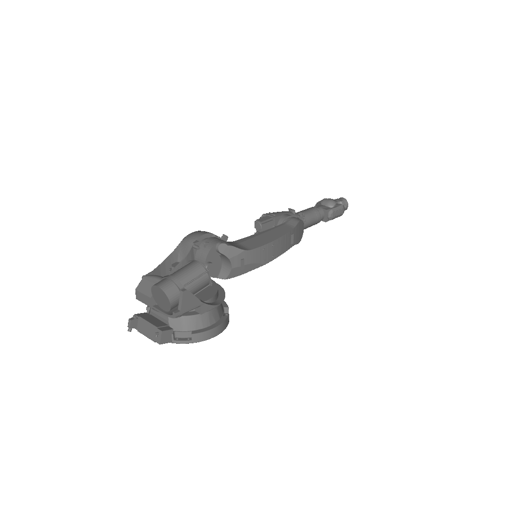</a><br>[front](mujoco/images/ros-industrial/xacro_generated/kuka/kuka_kr150_support/kr150_2/front.png) · [side](mujoco/images/ros-industrial/xacro_generated/kuka/kuka_kr150_support/kr150_2/side.png) · [top](mujoco/images/ros-industrial/xacro_generated/kuka/kuka_kr150_support/kr150_2/top.png) | <a href="pybullet/images/ros-industrial/xacro_generated/kuka/kuka_kr150_support/kr150_2/iso.png">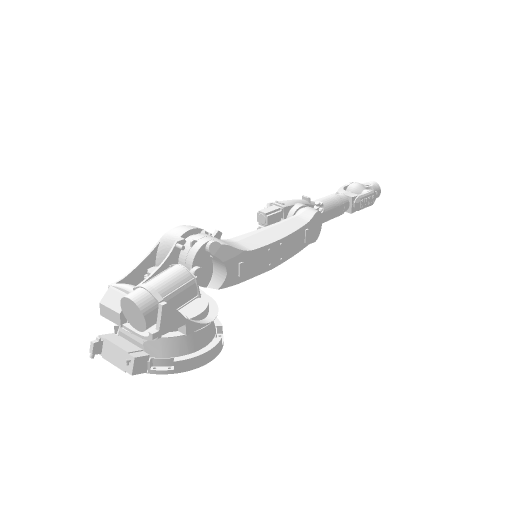</a><br>[front](pybullet/images/ros-industrial/xacro_generated/kuka/kuka_kr150_support/kr150_2/front.png) · [side](pybullet/images/ros-industrial/xacro_generated/kuka/kuka_kr150_support/kr150_2/side.png) · [top](pybullet/images/ros-industrial/xacro_generated/kuka/kuka_kr150_support/kr150_2/top.png) |
| kr150r3100_<wbr>2 | ROS-Industrial | KUKA | <a href="mujoco/images/ros-industrial/xacro_generated/kuka/kuka_kr150_support/kr150r3100_2/iso.png">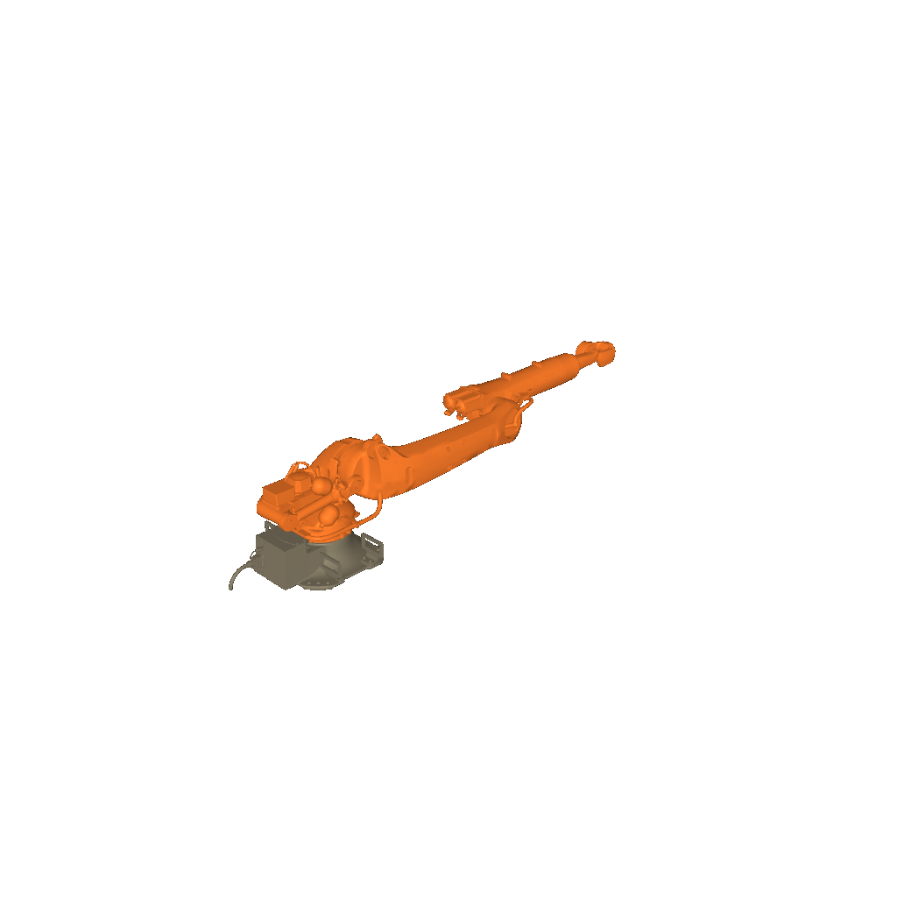</a><br>[front](mujoco/images/ros-industrial/xacro_generated/kuka/kuka_kr150_support/kr150r3100_2/front.png) · [side](mujoco/images/ros-industrial/xacro_generated/kuka/kuka_kr150_support/kr150r3100_2/side.png) · [top](mujoco/images/ros-industrial/xacro_generated/kuka/kuka_kr150_support/kr150r3100_2/top.png) | <a href="pybullet/images/ros-industrial/xacro_generated/kuka/kuka_kr150_support/kr150r3100_2/iso.png">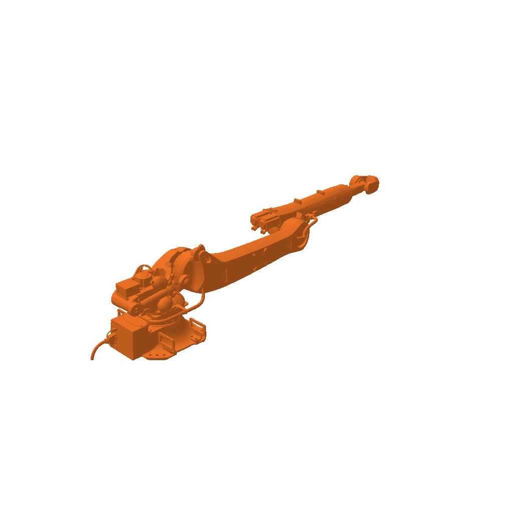</a><br>[front](pybullet/images/ros-industrial/xacro_generated/kuka/kuka_kr150_support/kr150r3100_2/front.png) · [side](pybullet/images/ros-industrial/xacro_generated/kuka/kuka_kr150_support/kr150r3100_2/side.png) · [top](pybullet/images/ros-industrial/xacro_generated/kuka/kuka_kr150_support/kr150r3100_2/top.png) |
| kr3r540 | ROS-Industrial | KUKA | <a href="mujoco/images/ros-industrial/xacro_generated/kuka/kuka_kr3_support/kr3r540/iso.png">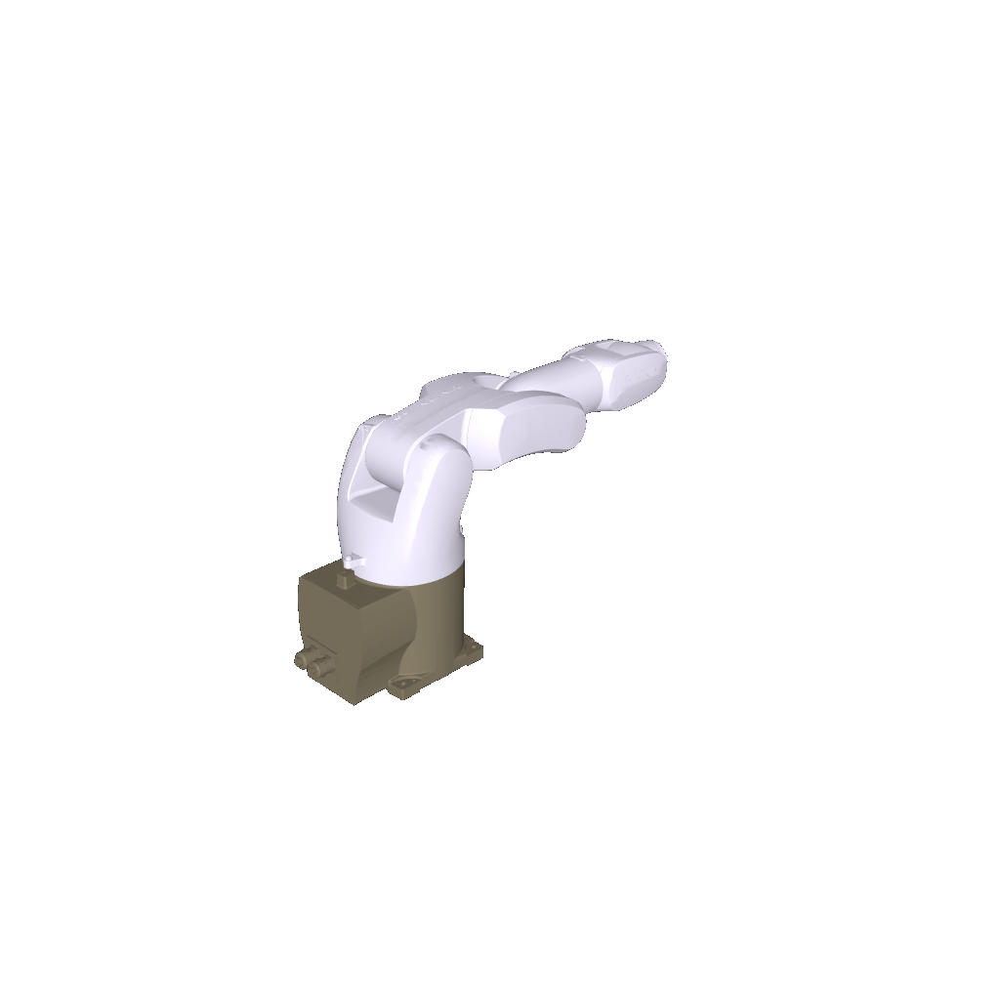</a><br>[front](mujoco/images/ros-industrial/xacro_generated/kuka/kuka_kr3_support/kr3r540/front.png) · [side](mujoco/images/ros-industrial/xacro_generated/kuka/kuka_kr3_support/kr3r540/side.png) · [top](mujoco/images/ros-industrial/xacro_generated/kuka/kuka_kr3_support/kr3r540/top.png) | <a href="pybullet/images/ros-industrial/xacro_generated/kuka/kuka_kr3_support/kr3r540/iso.png">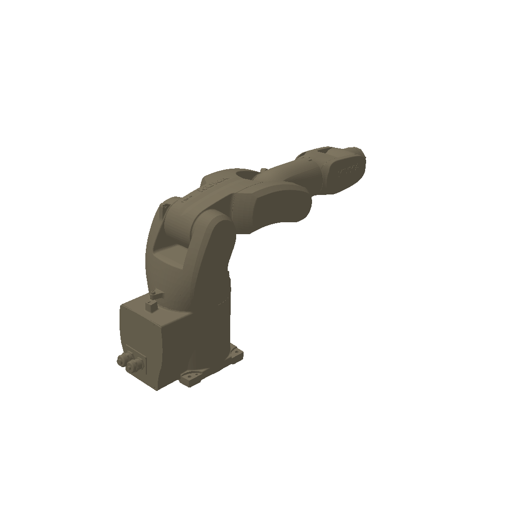</a><br>[front](pybullet/images/ros-industrial/xacro_generated/kuka/kuka_kr3_support/kr3r540/front.png) · [side](pybullet/images/ros-industrial/xacro_generated/kuka/kuka_kr3_support/kr3r540/side.png) · [top](pybullet/images/ros-industrial/xacro_generated/kuka/kuka_kr3_support/kr3r540/top.png) |
| kr5_<wbr>arc | ROS-Industrial | KUKA | <a href="mujoco/images/ros-industrial/xacro_generated/kuka/kuka_kr5_support/kr5_arc/iso.png">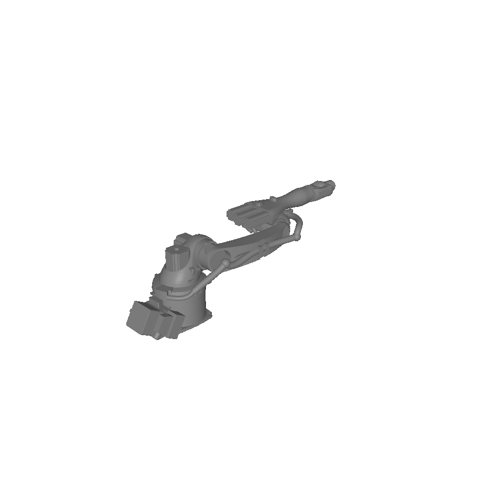</a><br>[front](mujoco/images/ros-industrial/xacro_generated/kuka/kuka_kr5_support/kr5_arc/front.png) · [side](mujoco/images/ros-industrial/xacro_generated/kuka/kuka_kr5_support/kr5_arc/side.png) · [top](mujoco/images/ros-industrial/xacro_generated/kuka/kuka_kr5_support/kr5_arc/top.png) | <a href="pybullet/images/ros-industrial/xacro_generated/kuka/kuka_kr5_support/kr5_arc/iso.png">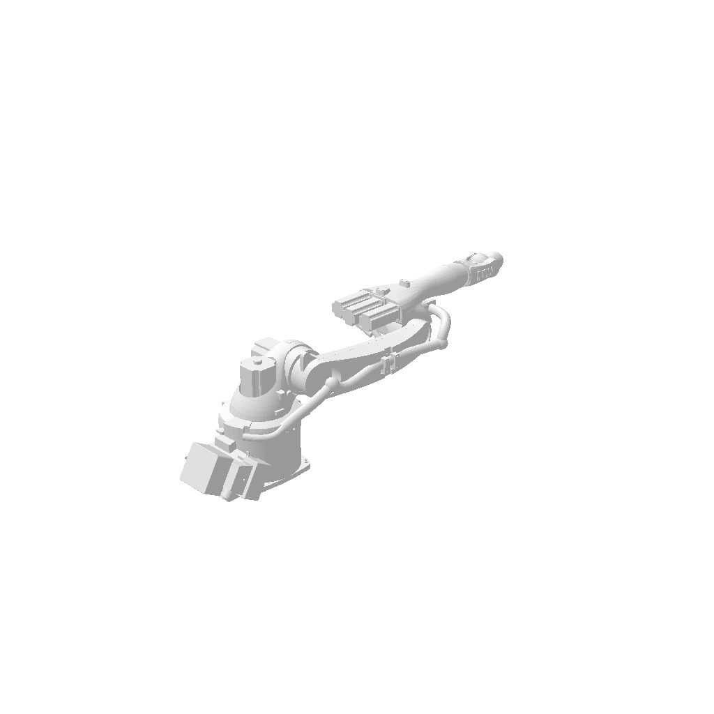</a><br>[front](pybullet/images/ros-industrial/xacro_generated/kuka/kuka_kr5_support/kr5_arc/front.png) · [side](pybullet/images/ros-industrial/xacro_generated/kuka/kuka_kr5_support/kr5_arc/side.png) · [top](pybullet/images/ros-industrial/xacro_generated/kuka/kuka_kr5_support/kr5_arc/top.png) |
| kr6r700sixx | ROS-Industrial | KUKA | <a href="mujoco/images/ros-industrial/xacro_generated/kuka/kuka_kr6_support/kr6r700sixx/iso.png">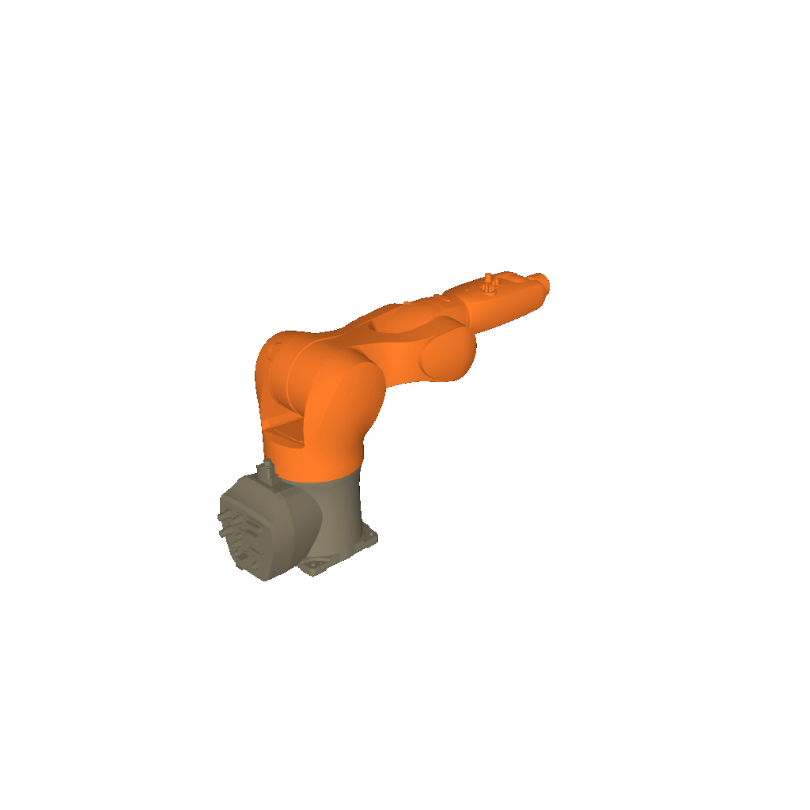</a><br>[front](mujoco/images/ros-industrial/xacro_generated/kuka/kuka_kr6_support/kr6r700sixx/front.png) · [side](mujoco/images/ros-industrial/xacro_generated/kuka/kuka_kr6_support/kr6r700sixx/side.png) · [top](mujoco/images/ros-industrial/xacro_generated/kuka/kuka_kr6_support/kr6r700sixx/top.png) | <a href="pybullet/images/ros-industrial/xacro_generated/kuka/kuka_kr6_support/kr6r700sixx/iso.png">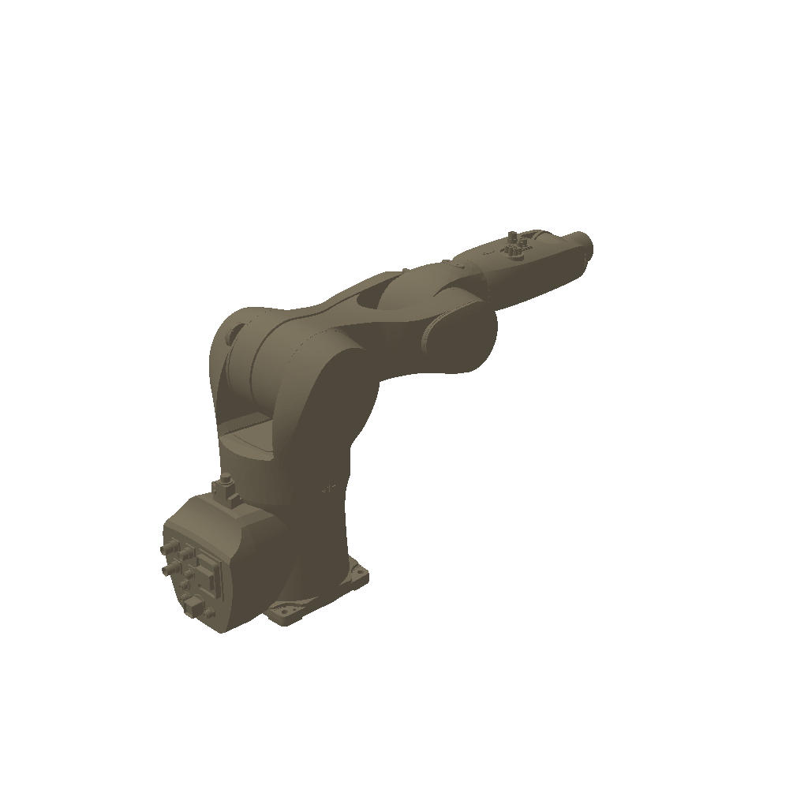</a><br>[front](pybullet/images/ros-industrial/xacro_generated/kuka/kuka_kr6_support/kr6r700sixx/front.png) · [side](pybullet/images/ros-industrial/xacro_generated/kuka/kuka_kr6_support/kr6r700sixx/side.png) · [top](pybullet/images/ros-industrial/xacro_generated/kuka/kuka_kr6_support/kr6r700sixx/top.png) |
| kr6r900_<wbr>2 | ROS-Industrial | KUKA | <a href="mujoco/images/ros-industrial/xacro_generated/kuka/kuka_kr6_support/kr6r900_2/iso.png"></a><br>[front](mujoco/images/ros-industrial/xacro_generated/kuka/kuka_kr6_support/kr6r900_2/front.png) · [side](mujoco/images/ros-industrial/xacro_generated/kuka/kuka_kr6_support/kr6r900_2/side.png) · [top](mujoco/images/ros-industrial/xacro_generated/kuka/kuka_kr6_support/kr6r900_2/top.png) | <a href="pybullet/images/ros-industrial/xacro_generated/kuka/kuka_kr6_support/kr6r900_2/iso.png"></a><br>[front](pybullet/images/ros-industrial/xacro_generated/kuka/kuka_kr6_support/kr6r900_2/front.png) · [side](pybullet/images/ros-industrial/xacro_generated/kuka/kuka_kr6_support/kr6r900_2/side.png) · [top](pybullet/images/ros-industrial/xacro_generated/kuka/kuka_kr6_support/kr6r900_2/top.png) |
| kr6r900sixx | ROS-Industrial | KUKA | <a href="mujoco/images/ros-industrial/xacro_generated/kuka/kuka_kr6_support/kr6r900sixx/iso.png">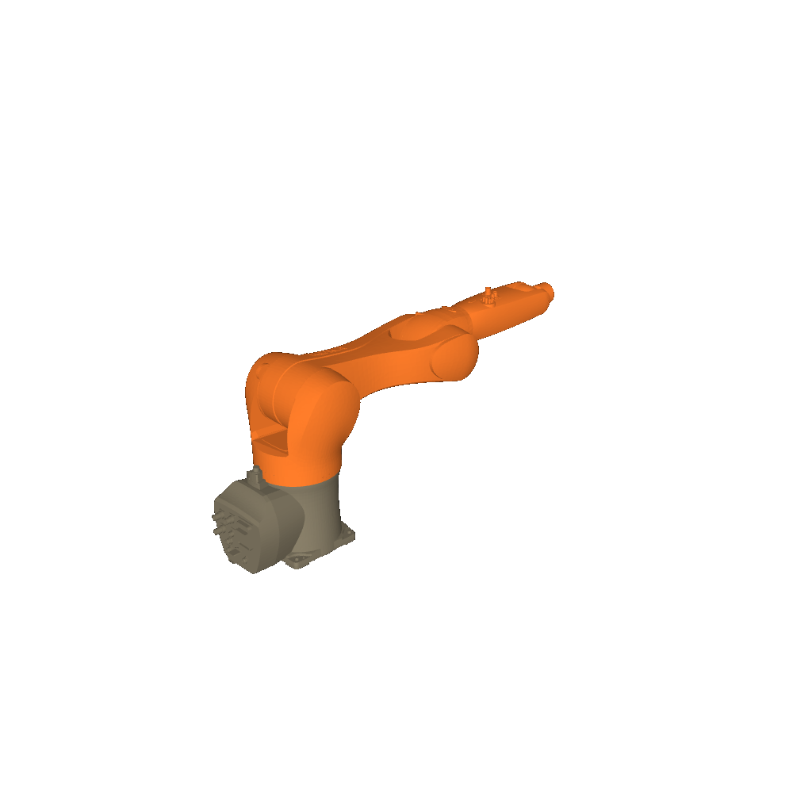</a><br>[front](mujoco/images/ros-industrial/xacro_generated/kuka/kuka_kr6_support/kr6r900sixx/front.png) · [side](mujoco/images/ros-industrial/xacro_generated/kuka/kuka_kr6_support/kr6r900sixx/side.png) · [top](mujoco/images/ros-industrial/xacro_generated/kuka/kuka_kr6_support/kr6r900sixx/top.png) | <a href="pybullet/images/ros-industrial/xacro_generated/kuka/kuka_kr6_support/kr6r900sixx/iso.png">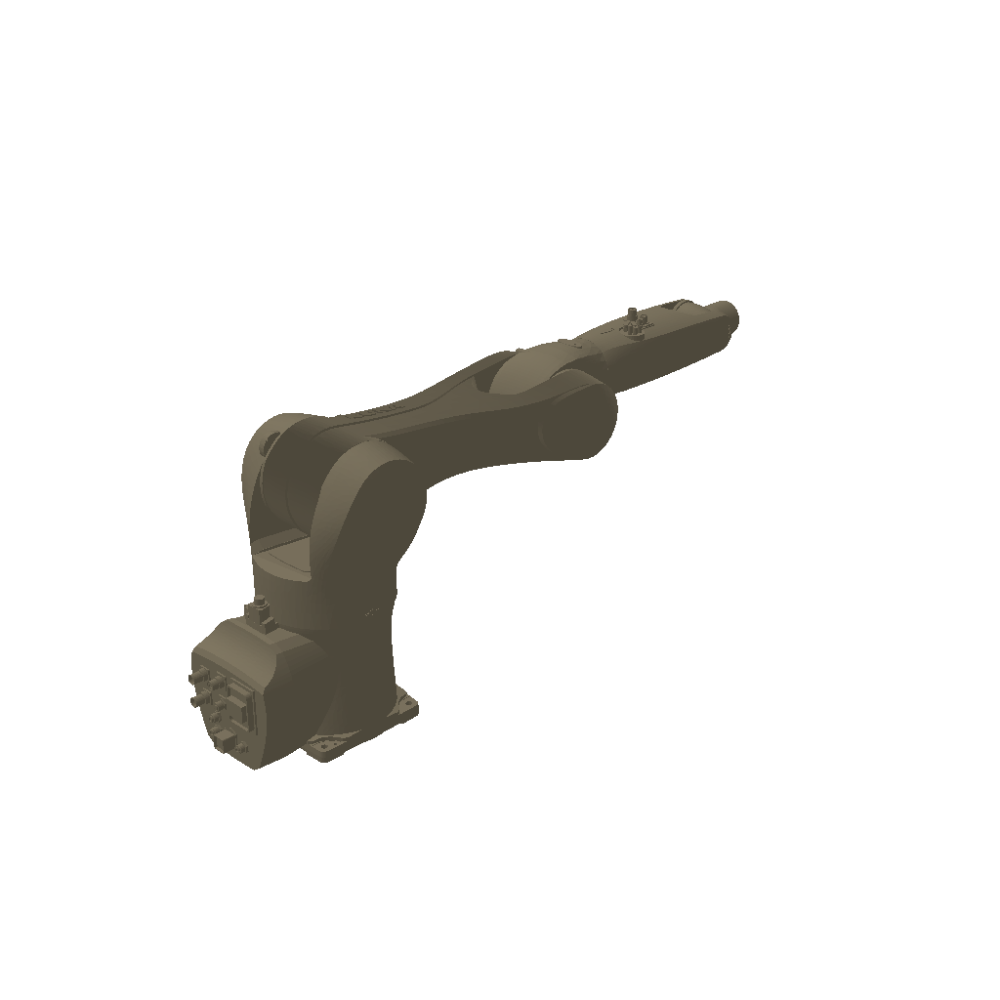</a><br>[front](pybullet/images/ros-industrial/xacro_generated/kuka/kuka_kr6_support/kr6r900sixx/front.png) · [side](pybullet/images/ros-industrial/xacro_generated/kuka/kuka_kr6_support/kr6r900sixx/side.png) · [top](pybullet/images/ros-industrial/xacro_generated/kuka/kuka_kr6_support/kr6r900sixx/top.png) |
| tx2_<wbr>60 | ROS-Industrial | Stäubli | <a href="mujoco/images/ros-industrial/xacro_generated/staubli/staubli_tx2_60_support/tx2_60/iso.png">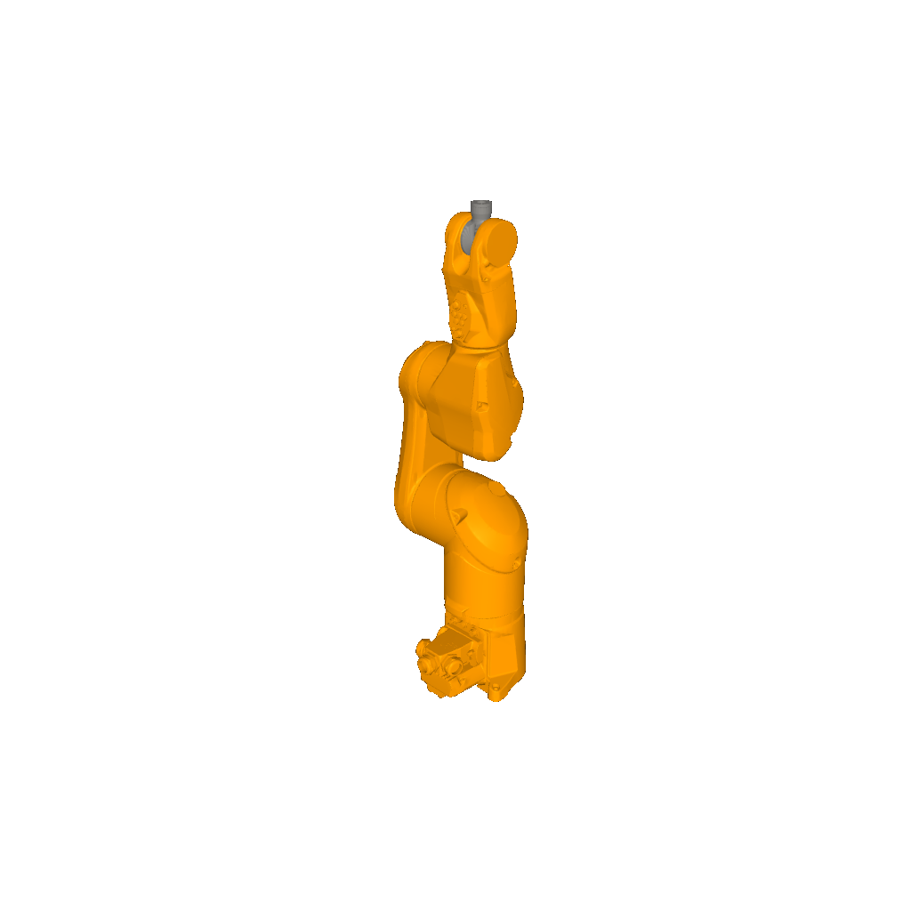</a><br>[front](mujoco/images/ros-industrial/xacro_generated/staubli/staubli_tx2_60_support/tx2_60/front.png) · [side](mujoco/images/ros-industrial/xacro_generated/staubli/staubli_tx2_60_support/tx2_60/side.png) · [top](mujoco/images/ros-industrial/xacro_generated/staubli/staubli_tx2_60_support/tx2_60/top.png) | <a href="pybullet/images/ros-industrial/xacro_generated/staubli/staubli_tx2_60_support/tx2_60/iso.png">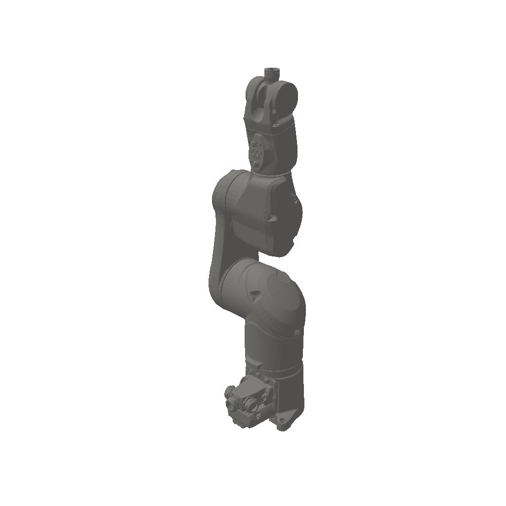</a><br>[front](pybullet/images/ros-industrial/xacro_generated/staubli/staubli_tx2_60_support/tx2_60/front.png) · [side](pybullet/images/ros-industrial/xacro_generated/staubli/staubli_tx2_60_support/tx2_60/side.png) · [top](pybullet/images/ros-industrial/xacro_generated/staubli/staubli_tx2_60_support/tx2_60/top.png) |
| tx2_<wbr>60l | ROS-Industrial | Stäubli | <a href="mujoco/images/ros-industrial/xacro_generated/staubli/staubli_tx2_60_support/tx2_60l/iso.png">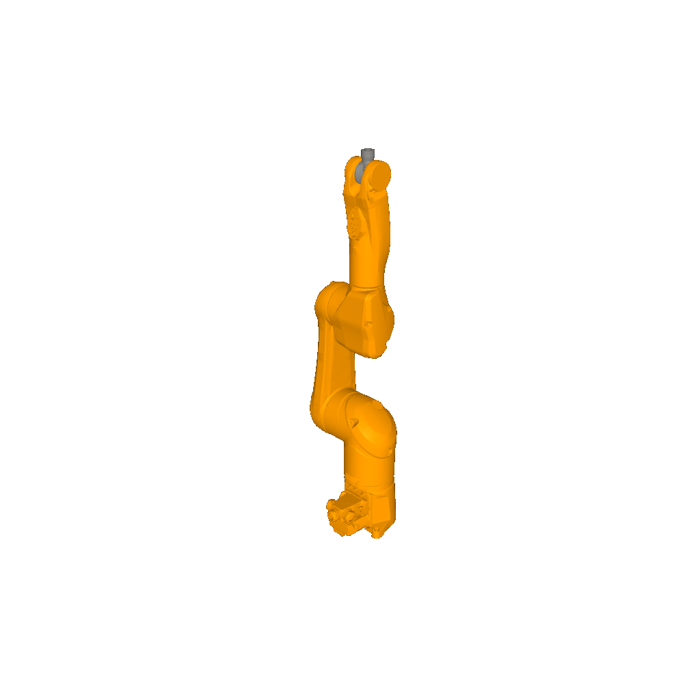</a><br>[front](mujoco/images/ros-industrial/xacro_generated/staubli/staubli_tx2_60_support/tx2_60l/front.png) · [side](mujoco/images/ros-industrial/xacro_generated/staubli/staubli_tx2_60_support/tx2_60l/side.png) · [top](mujoco/images/ros-industrial/xacro_generated/staubli/staubli_tx2_60_support/tx2_60l/top.png) | <a href="pybullet/images/ros-industrial/xacro_generated/staubli/staubli_tx2_60_support/tx2_60l/iso.png">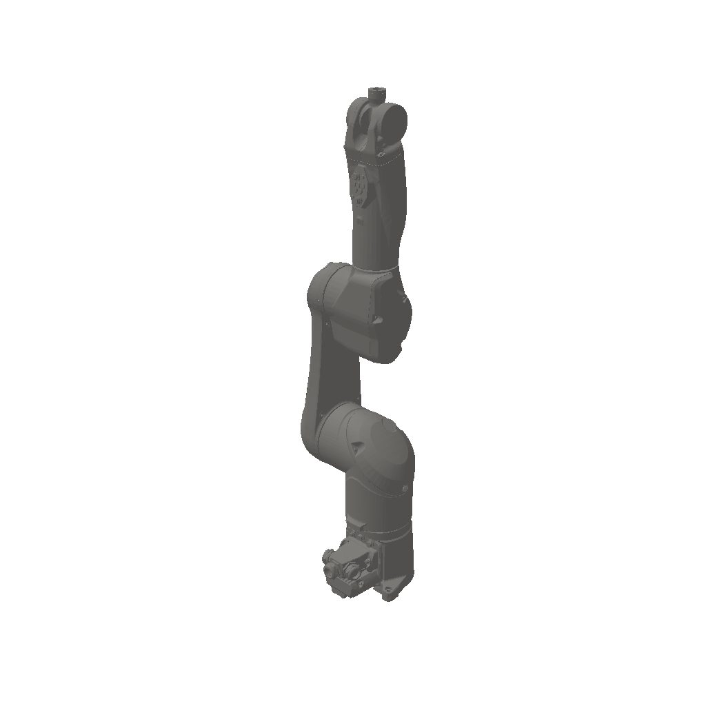</a><br>[front](pybullet/images/ros-industrial/xacro_generated/staubli/staubli_tx2_60_support/tx2_60l/front.png) · [side](pybullet/images/ros-industrial/xacro_generated/staubli/staubli_tx2_60_support/tx2_60l/side.png) · [top](pybullet/images/ros-industrial/xacro_generated/staubli/staubli_tx2_60_support/tx2_60l/top.png) |
| tx2_<wbr>90 | ROS-Industrial | Stäubli | <a href="mujoco/images/ros-industrial/xacro_generated/staubli/staubli_tx2_90_support/tx2_90/iso.png">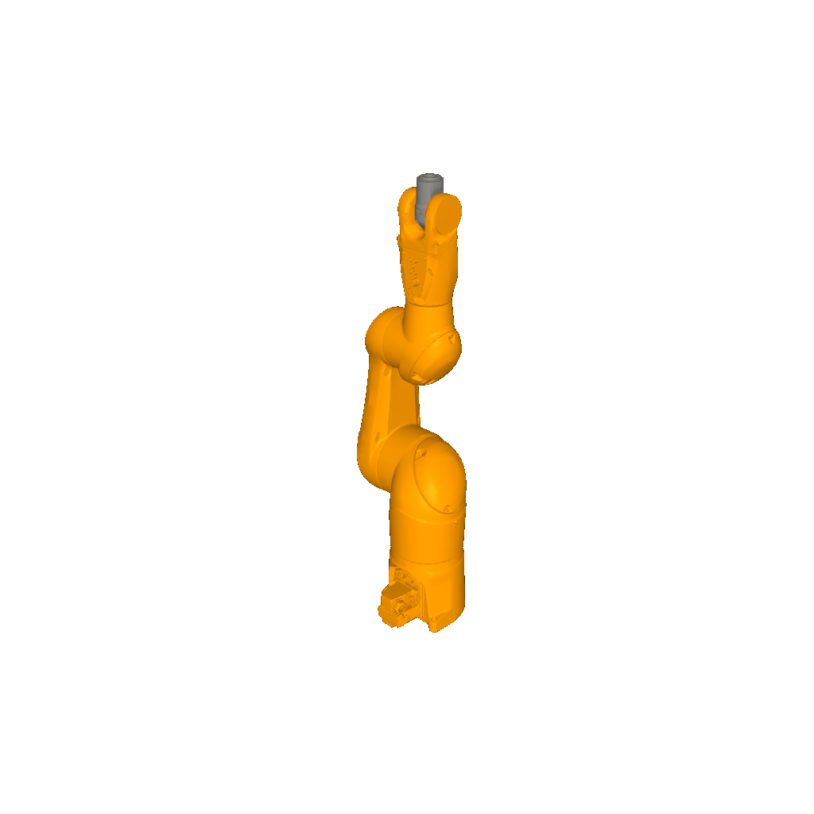</a><br>[front](mujoco/images/ros-industrial/xacro_generated/staubli/staubli_tx2_90_support/tx2_90/front.png) · [side](mujoco/images/ros-industrial/xacro_generated/staubli/staubli_tx2_90_support/tx2_90/side.png) · [top](mujoco/images/ros-industrial/xacro_generated/staubli/staubli_tx2_90_support/tx2_90/top.png) | <a href="pybullet/images/ros-industrial/xacro_generated/staubli/staubli_tx2_90_support/tx2_90/iso.png">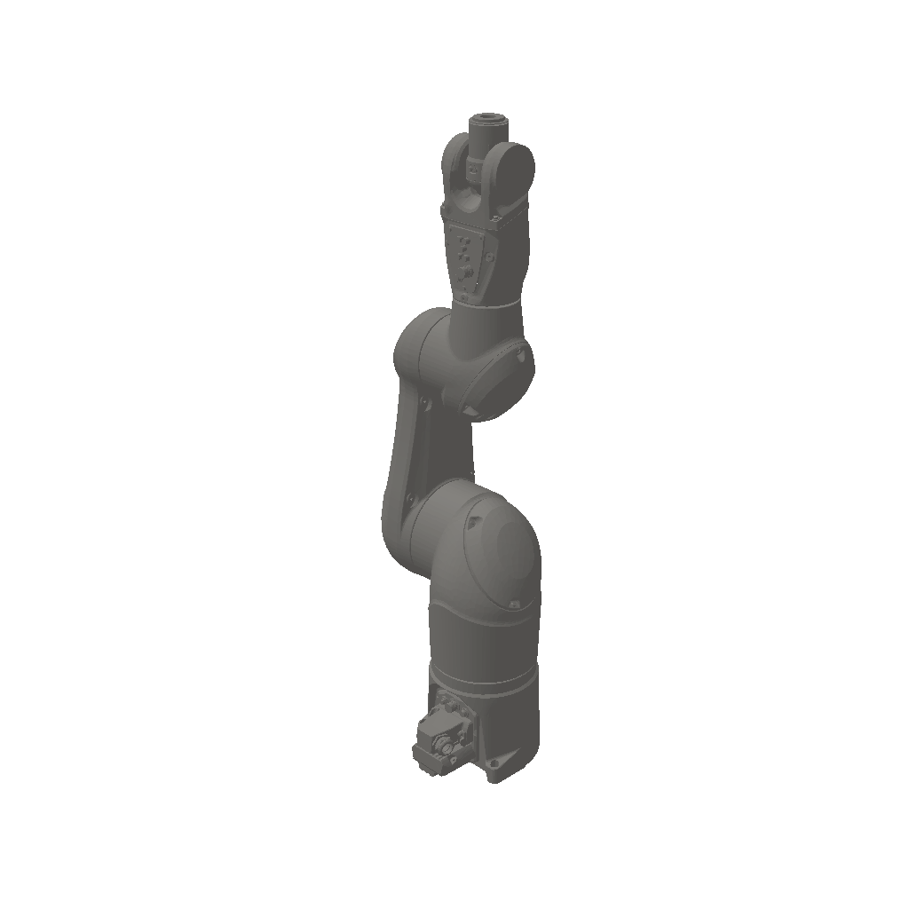</a><br>[front](pybullet/images/ros-industrial/xacro_generated/staubli/staubli_tx2_90_support/tx2_90/front.png) · [side](pybullet/images/ros-industrial/xacro_generated/staubli/staubli_tx2_90_support/tx2_90/side.png) · [top](pybullet/images/ros-industrial/xacro_generated/staubli/staubli_tx2_90_support/tx2_90/top.png) |
| tx2_<wbr>90l | ROS-Industrial | Stäubli | <a href="mujoco/images/ros-industrial/xacro_generated/staubli/staubli_tx2_90_support/tx2_90l/iso.png"></a><br>[front](mujoco/images/ros-industrial/xacro_generated/staubli/staubli_tx2_90_support/tx2_90l/front.png) · [side](mujoco/images/ros-industrial/xacro_generated/staubli/staubli_tx2_90_support/tx2_90l/side.png) · [top](mujoco/images/ros-industrial/xacro_generated/staubli/staubli_tx2_90_support/tx2_90l/top.png) | <a href="pybullet/images/ros-industrial/xacro_generated/staubli/staubli_tx2_90_support/tx2_90l/iso.png">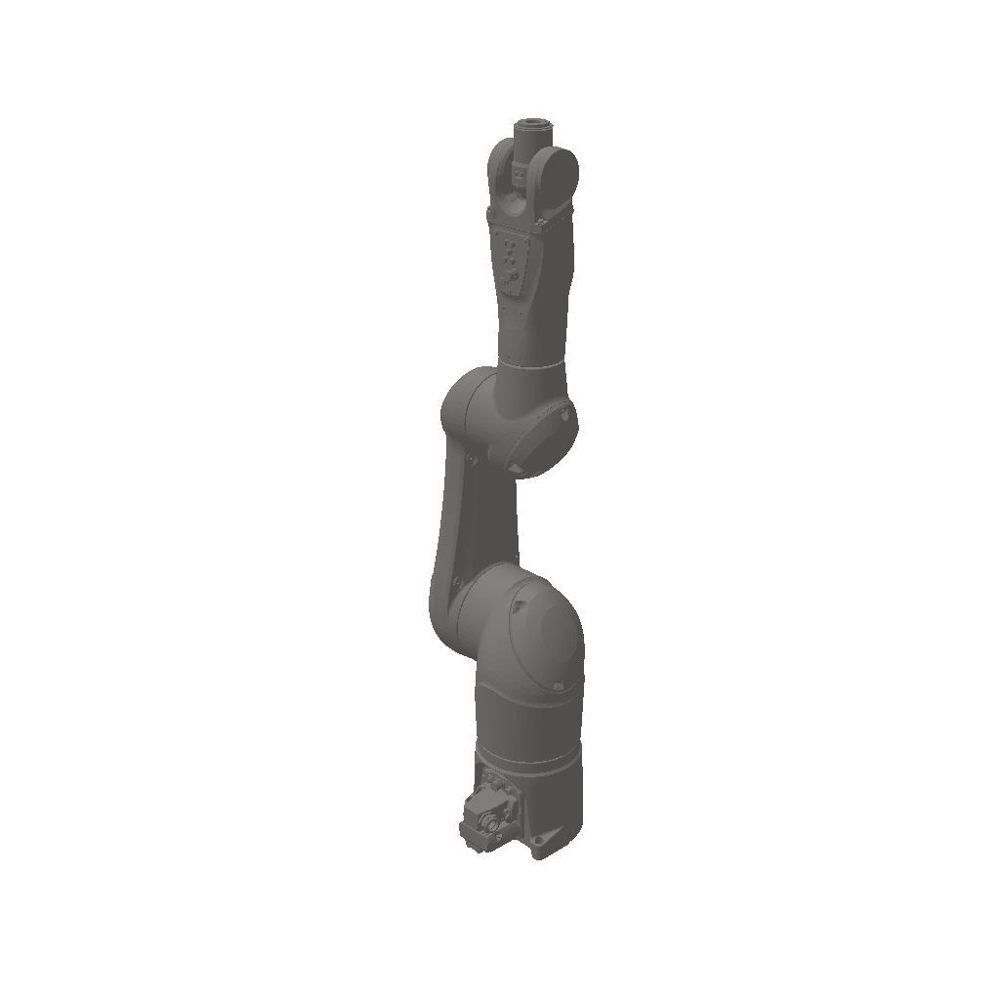</a><br>[front](pybullet/images/ros-industrial/xacro_generated/staubli/staubli_tx2_90_support/tx2_90l/front.png) · [side](pybullet/images/ros-industrial/xacro_generated/staubli/staubli_tx2_90_support/tx2_90l/side.png) · [top](pybullet/images/ros-industrial/xacro_generated/staubli/staubli_tx2_90_support/tx2_90l/top.png) |
| tx2_<wbr>90xl | ROS-Industrial | Stäubli | <a href="mujoco/images/ros-industrial/xacro_generated/staubli/staubli_tx2_90_support/tx2_90xl/iso.png">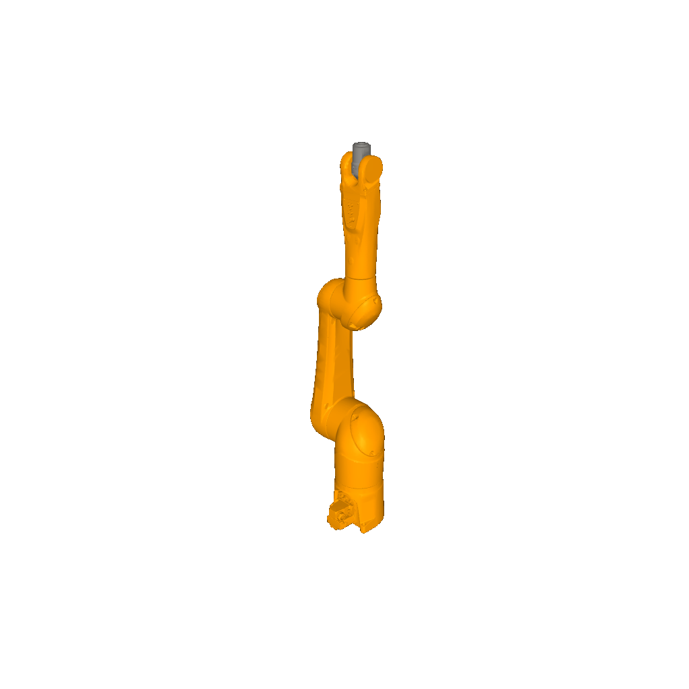</a><br>[front](mujoco/images/ros-industrial/xacro_generated/staubli/staubli_tx2_90_support/tx2_90xl/front.png) · [side](mujoco/images/ros-industrial/xacro_generated/staubli/staubli_tx2_90_support/tx2_90xl/side.png) · [top](mujoco/images/ros-industrial/xacro_generated/staubli/staubli_tx2_90_support/tx2_90xl/top.png) | <a href="pybullet/images/ros-industrial/xacro_generated/staubli/staubli_tx2_90_support/tx2_90xl/iso.png">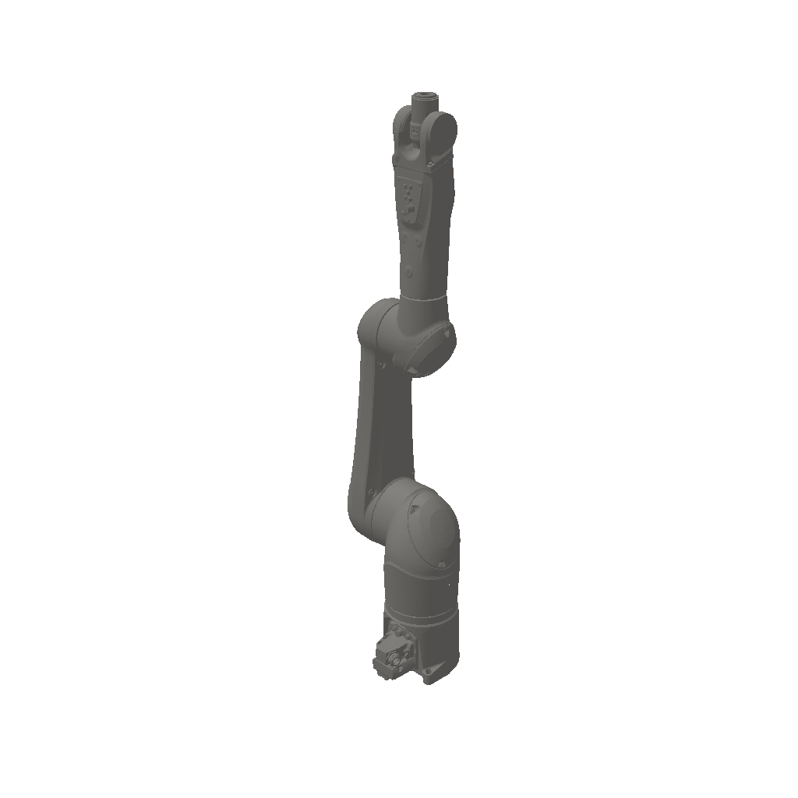</a><br>[front](pybullet/images/ros-industrial/xacro_generated/staubli/staubli_tx2_90_support/tx2_90xl/front.png) · [side](pybullet/images/ros-industrial/xacro_generated/staubli/staubli_tx2_90_support/tx2_90xl/side.png) · [top](pybullet/images/ros-industrial/xacro_generated/staubli/staubli_tx2_90_support/tx2_90xl/top.png) |
| tx60 | ROS-Industrial | Stäubli | <a href="mujoco/images/ros-industrial/xacro_generated/staubli/staubli_tx60_support/tx60/iso.png">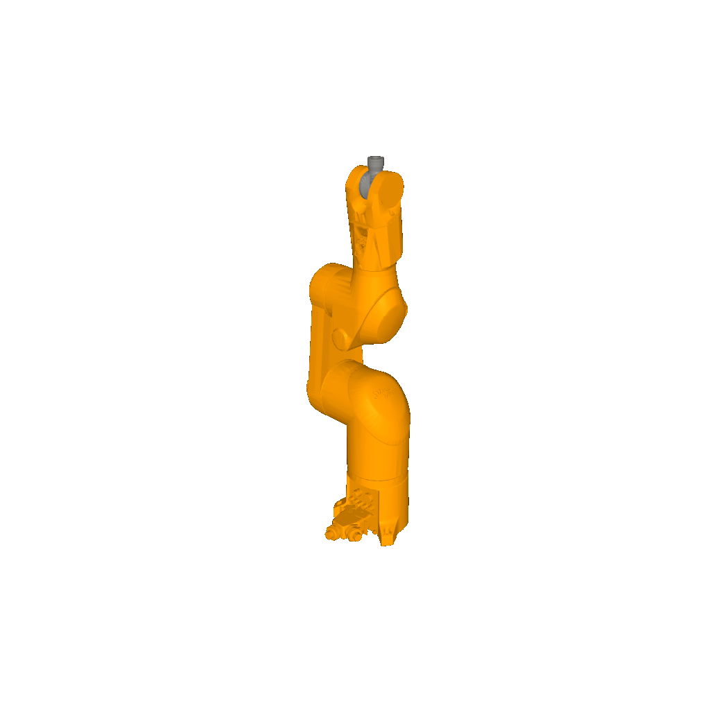</a><br>[front](mujoco/images/ros-industrial/xacro_generated/staubli/staubli_tx60_support/tx60/front.png) · [side](mujoco/images/ros-industrial/xacro_generated/staubli/staubli_tx60_support/tx60/side.png) · [top](mujoco/images/ros-industrial/xacro_generated/staubli/staubli_tx60_support/tx60/top.png) | <a href="pybullet/images/ros-industrial/xacro_generated/staubli/staubli_tx60_support/tx60/iso.png">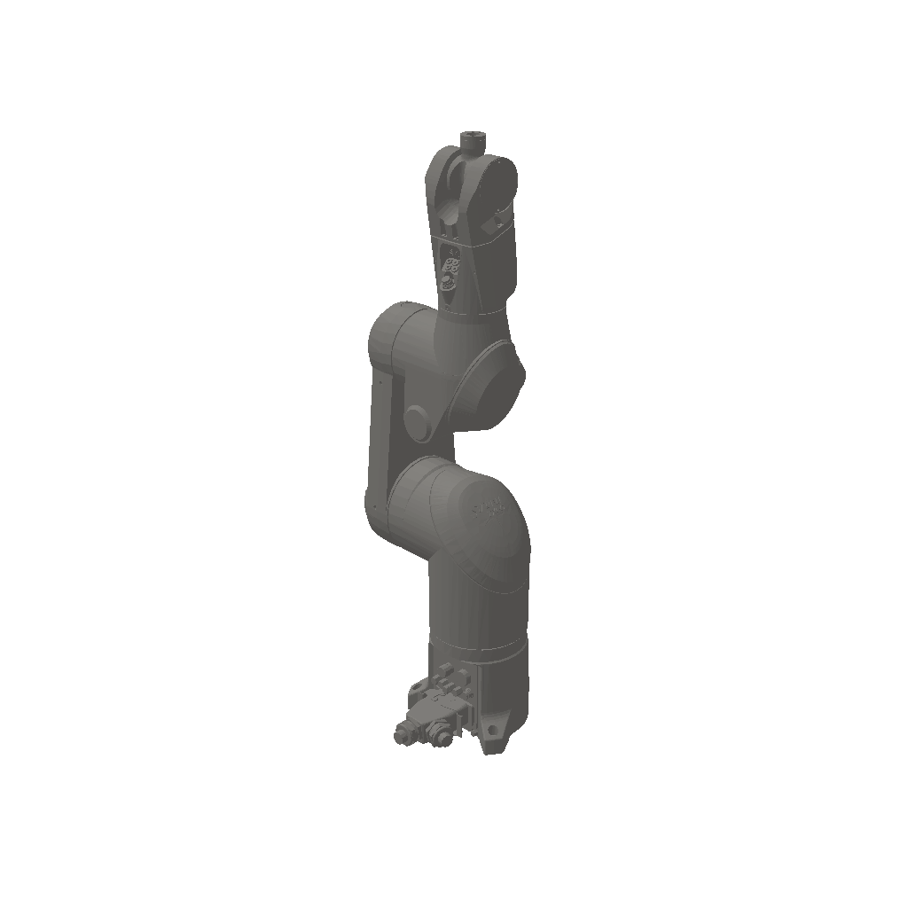</a><br>[front](pybullet/images/ros-industrial/xacro_generated/staubli/staubli_tx60_support/tx60/front.png) · [side](pybullet/images/ros-industrial/xacro_generated/staubli/staubli_tx60_support/tx60/side.png) · [top](pybullet/images/ros-industrial/xacro_generated/staubli/staubli_tx60_support/tx60/top.png) |
| tx60l | ROS-Industrial | Stäubli | <a href="mujoco/images/ros-industrial/xacro_generated/staubli/staubli_tx60_support/tx60l/iso.png">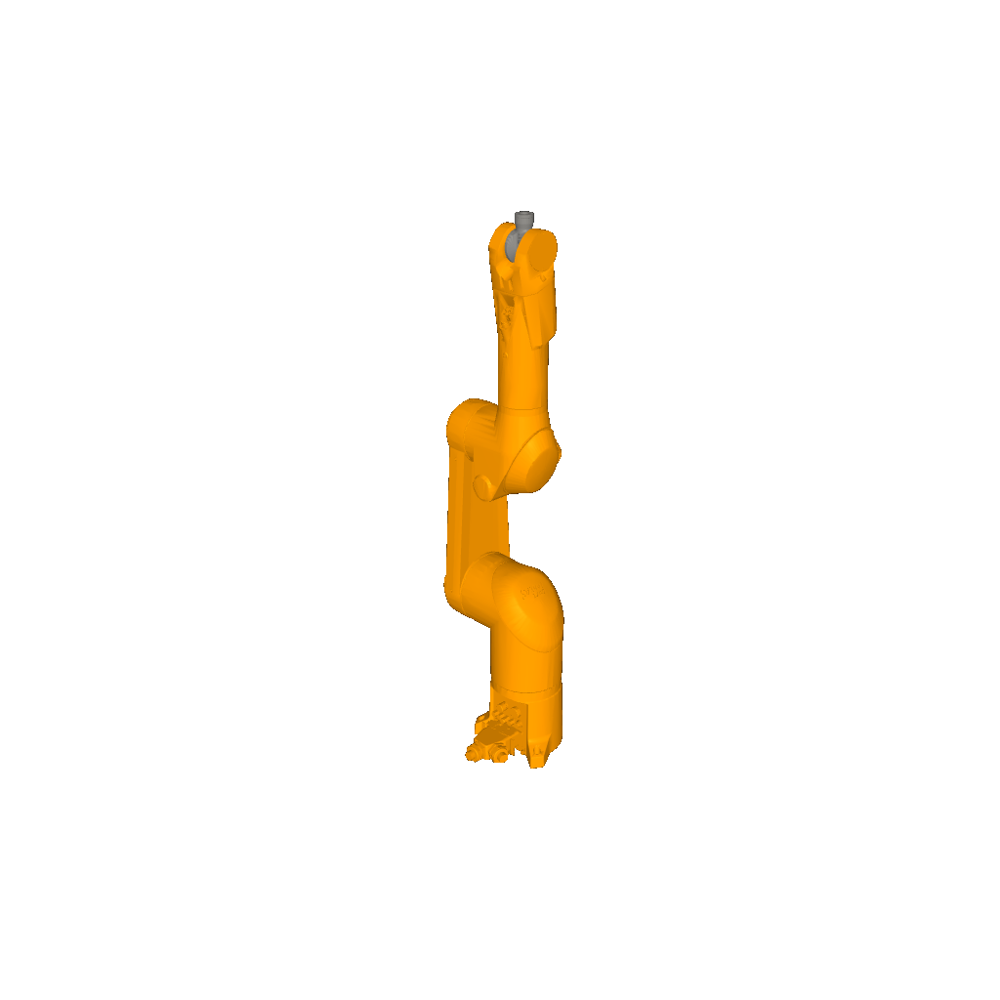</a><br>[front](mujoco/images/ros-industrial/xacro_generated/staubli/staubli_tx60_support/tx60l/front.png) · [side](mujoco/images/ros-industrial/xacro_generated/staubli/staubli_tx60_support/tx60l/side.png) · [top](mujoco/images/ros-industrial/xacro_generated/staubli/staubli_tx60_support/tx60l/top.png) | <a href="pybullet/images/ros-industrial/xacro_generated/staubli/staubli_tx60_support/tx60l/iso.png">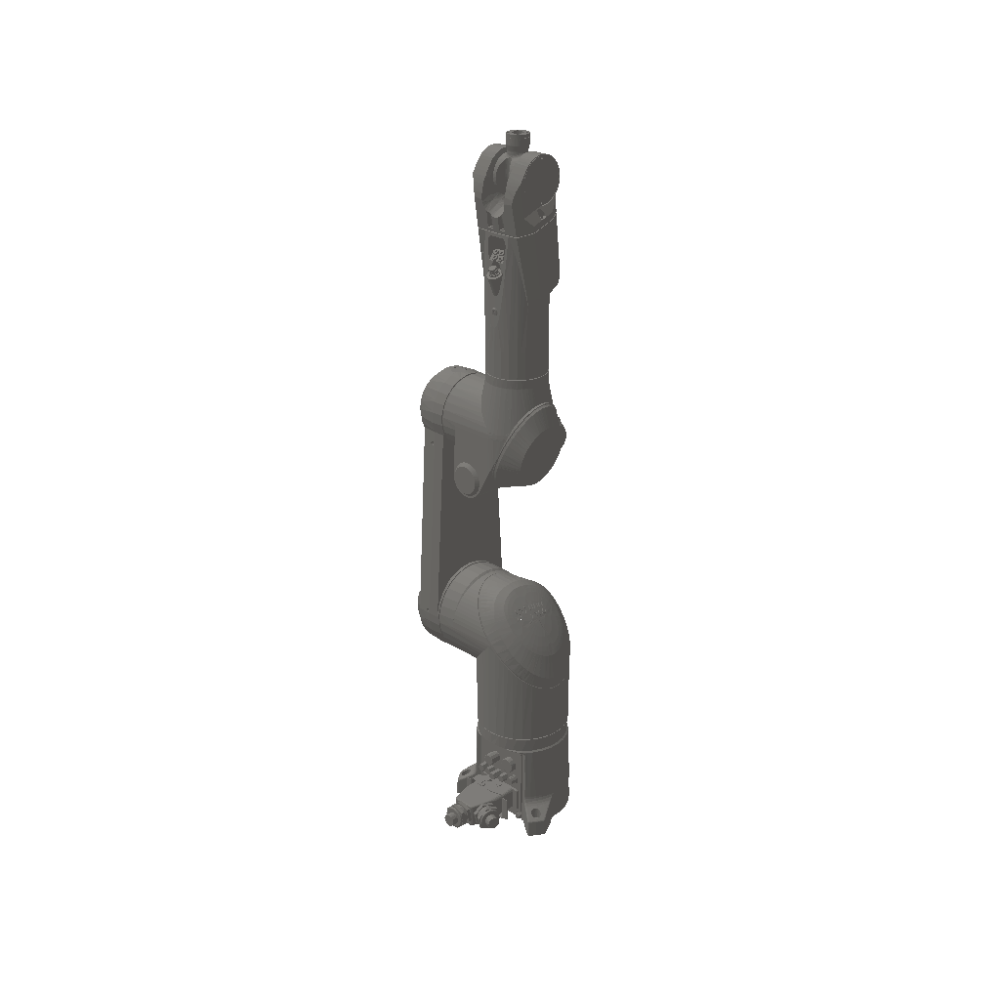</a><br>[front](pybullet/images/ros-industrial/xacro_generated/staubli/staubli_tx60_support/tx60l/front.png) · [side](pybullet/images/ros-industrial/xacro_generated/staubli/staubli_tx60_support/tx60l/side.png) · [top](pybullet/images/ros-industrial/xacro_generated/staubli/staubli_tx60_support/tx60l/top.png) |
| tx90 | ROS-Industrial | Stäubli | <a href="mujoco/images/ros-industrial/xacro_generated/staubli/staubli_tx90_support/tx90/iso.png">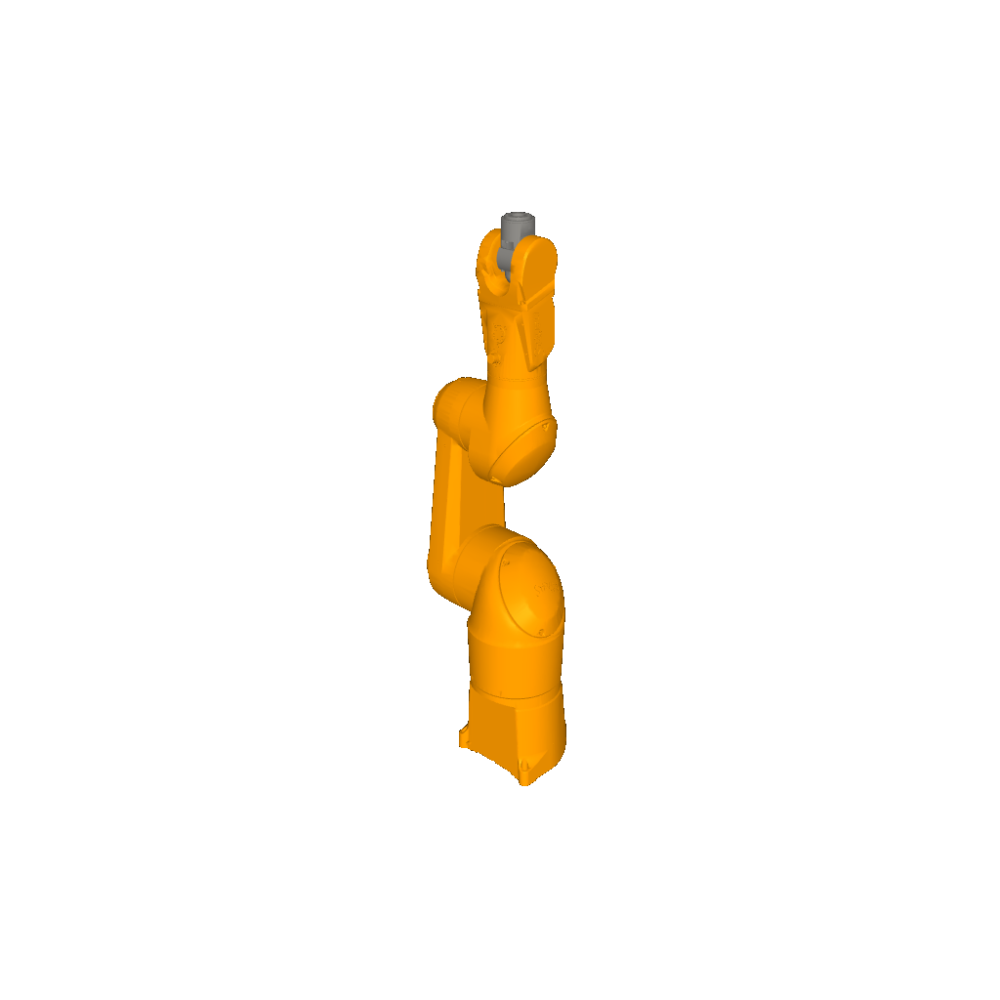</a><br>[front](mujoco/images/ros-industrial/xacro_generated/staubli/staubli_tx90_support/tx90/front.png) · [side](mujoco/images/ros-industrial/xacro_generated/staubli/staubli_tx90_support/tx90/side.png) · [top](mujoco/images/ros-industrial/xacro_generated/staubli/staubli_tx90_support/tx90/top.png) | <a href="pybullet/images/ros-industrial/xacro_generated/staubli/staubli_tx90_support/tx90/iso.png">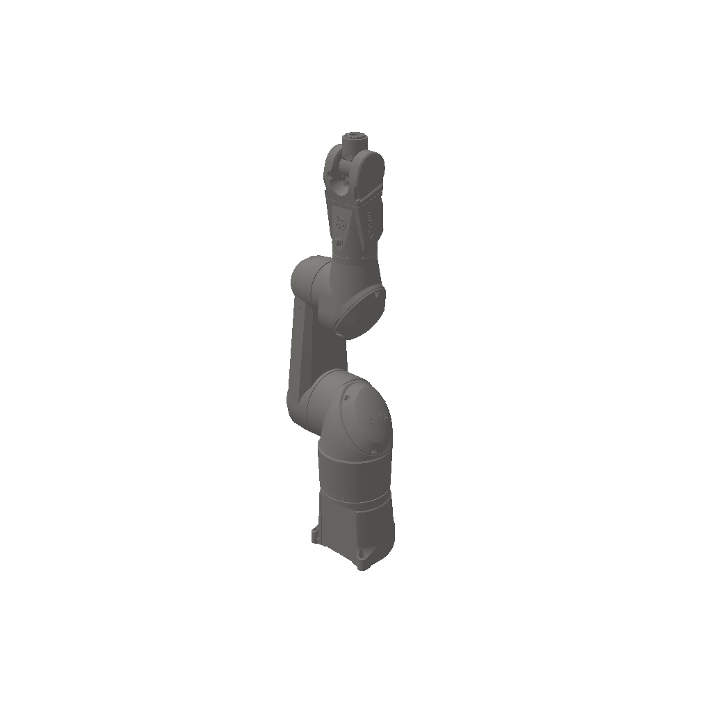</a><br>[front](pybullet/images/ros-industrial/xacro_generated/staubli/staubli_tx90_support/tx90/front.png) · [side](pybullet/images/ros-industrial/xacro_generated/staubli/staubli_tx90_support/tx90/side.png) · [top](pybullet/images/ros-industrial/xacro_generated/staubli/staubli_tx90_support/tx90/top.png) |
| tx90l | ROS-Industrial | Stäubli | <a href="mujoco/images/ros-industrial/xacro_generated/staubli/staubli_tx90_support/tx90l/iso.png">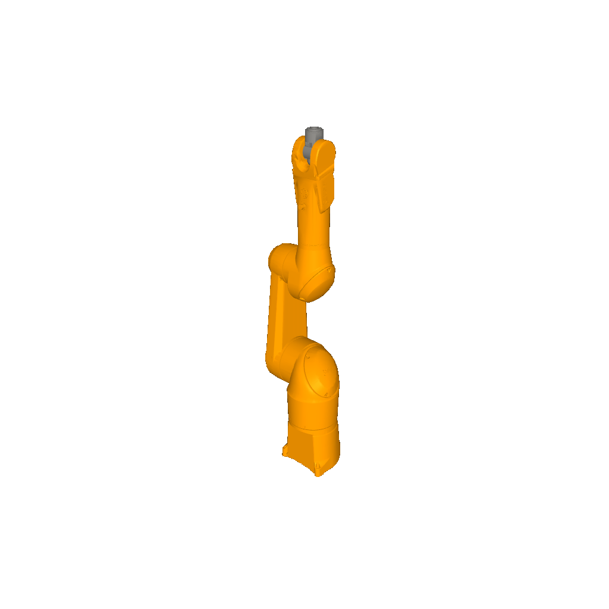</a><br>[front](mujoco/images/ros-industrial/xacro_generated/staubli/staubli_tx90_support/tx90l/front.png) · [side](mujoco/images/ros-industrial/xacro_generated/staubli/staubli_tx90_support/tx90l/side.png) · [top](mujoco/images/ros-industrial/xacro_generated/staubli/staubli_tx90_support/tx90l/top.png) | <a href="pybullet/images/ros-industrial/xacro_generated/staubli/staubli_tx90_support/tx90l/iso.png">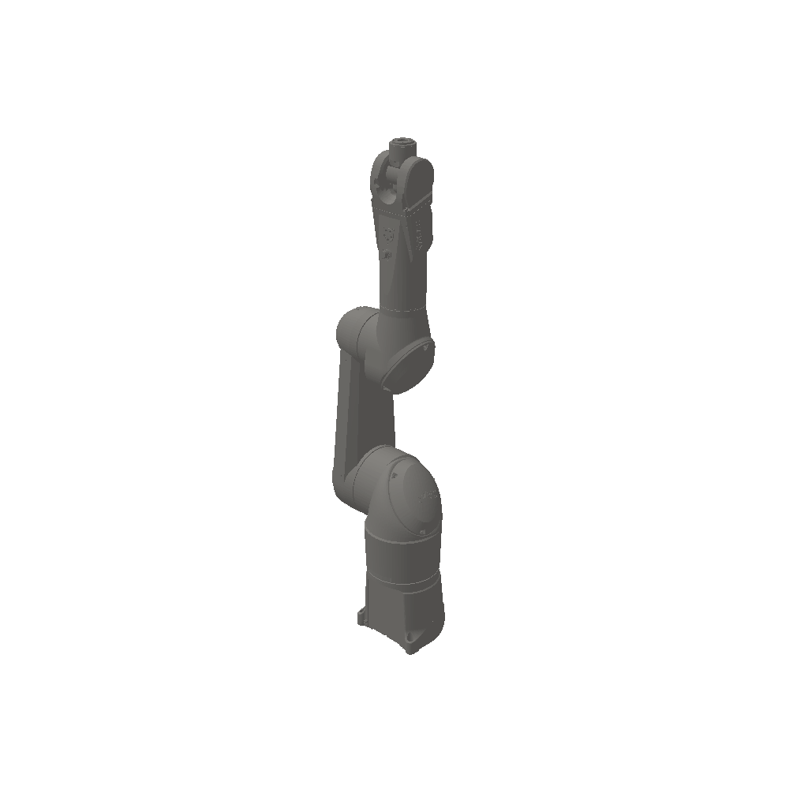</a><br>[front](pybullet/images/ros-industrial/xacro_generated/staubli/staubli_tx90_support/tx90l/front.png) · [side](pybullet/images/ros-industrial/xacro_generated/staubli/staubli_tx90_support/tx90l/side.png) · [top](pybullet/images/ros-industrial/xacro_generated/staubli/staubli_tx90_support/tx90l/top.png) |
| tx90xl | ROS-Industrial | Stäubli | <a href="mujoco/images/ros-industrial/xacro_generated/staubli/staubli_tx90_support/tx90xl/iso.png"></a><br>[front](mujoco/images/ros-industrial/xacro_generated/staubli/staubli_tx90_support/tx90xl/front.png) · [side](mujoco/images/ros-industrial/xacro_generated/staubli/staubli_tx90_support/tx90xl/side.png) · [top](mujoco/images/ros-industrial/xacro_generated/staubli/staubli_tx90_support/tx90xl/top.png) | <a href="pybullet/images/ros-industrial/xacro_generated/staubli/staubli_tx90_support/tx90xl/iso.png">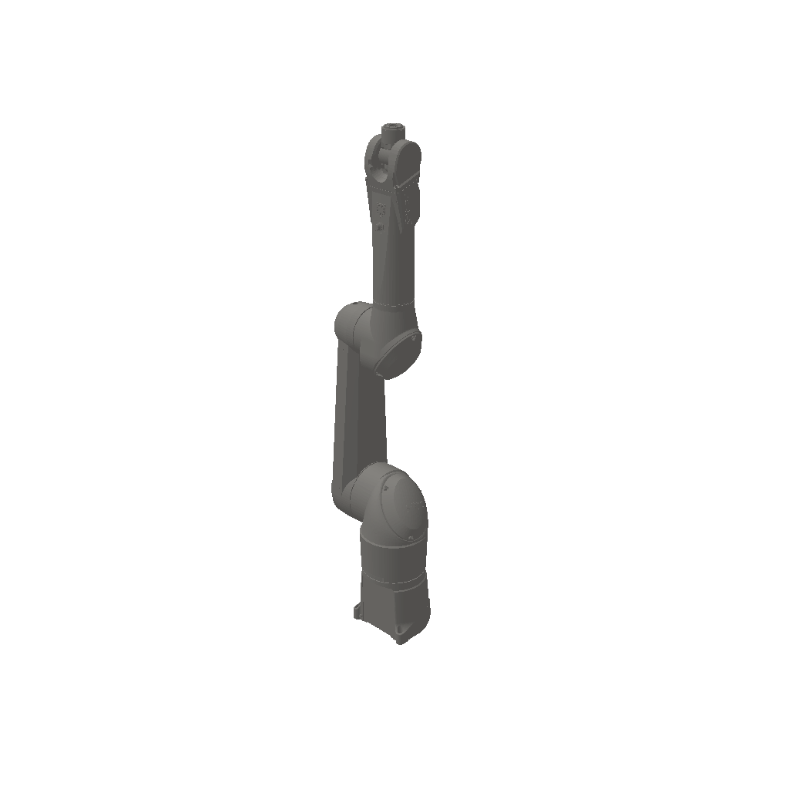</a><br>[front](pybullet/images/ros-industrial/xacro_generated/staubli/staubli_tx90_support/tx90xl/front.png) · [side](pybullet/images/ros-industrial/xacro_generated/staubli/staubli_tx90_support/tx90xl/side.png) · [top](pybullet/images/ros-industrial/xacro_generated/staubli/staubli_tx90_support/tx90xl/top.png) |
| ur10 | ROS-Industrial | Universal Robots | <a href="mujoco/images/ros-industrial/xacro_generated/universal_robots/ur_description/ur10/iso.png">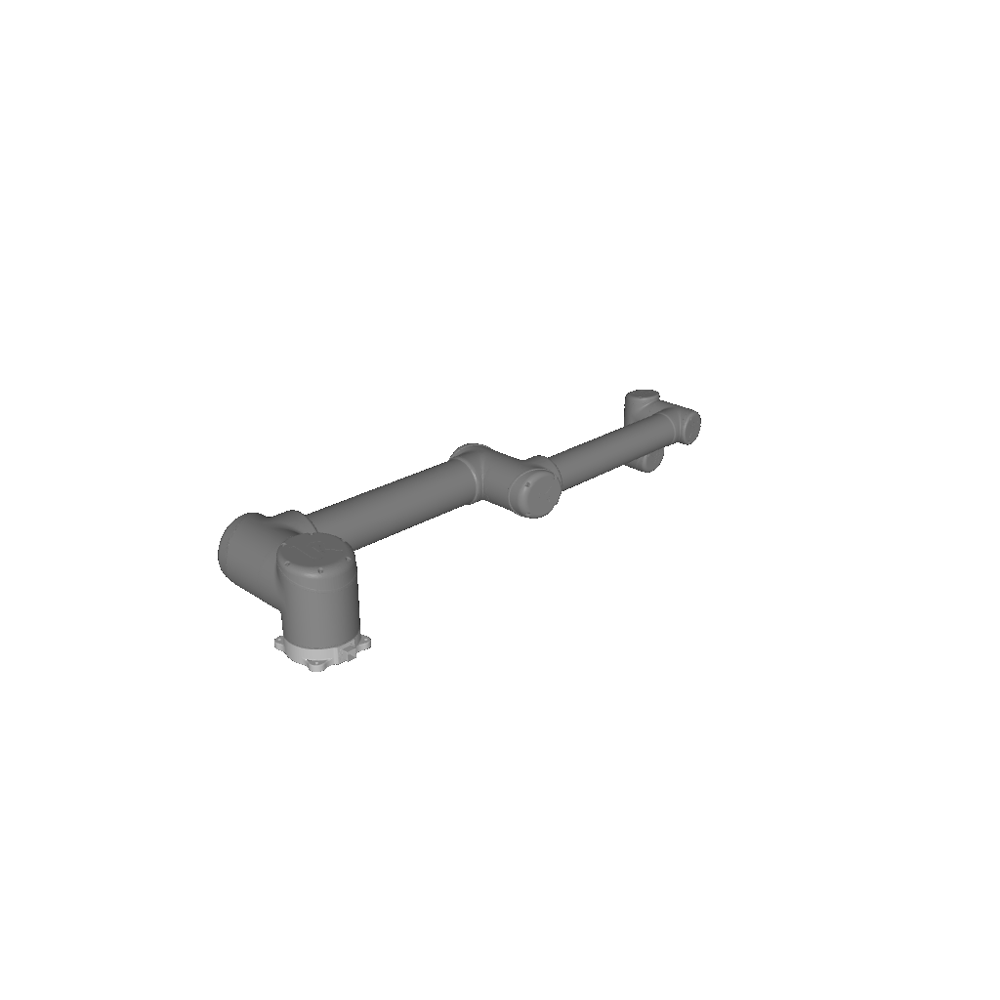</a><br>[front](mujoco/images/ros-industrial/xacro_generated/universal_robots/ur_description/ur10/front.png) · [side](mujoco/images/ros-industrial/xacro_generated/universal_robots/ur_description/ur10/side.png) · [top](mujoco/images/ros-industrial/xacro_generated/universal_robots/ur_description/ur10/top.png) | <a href="pybullet/images/ros-industrial/xacro_generated/universal_robots/ur_description/ur10/iso.png">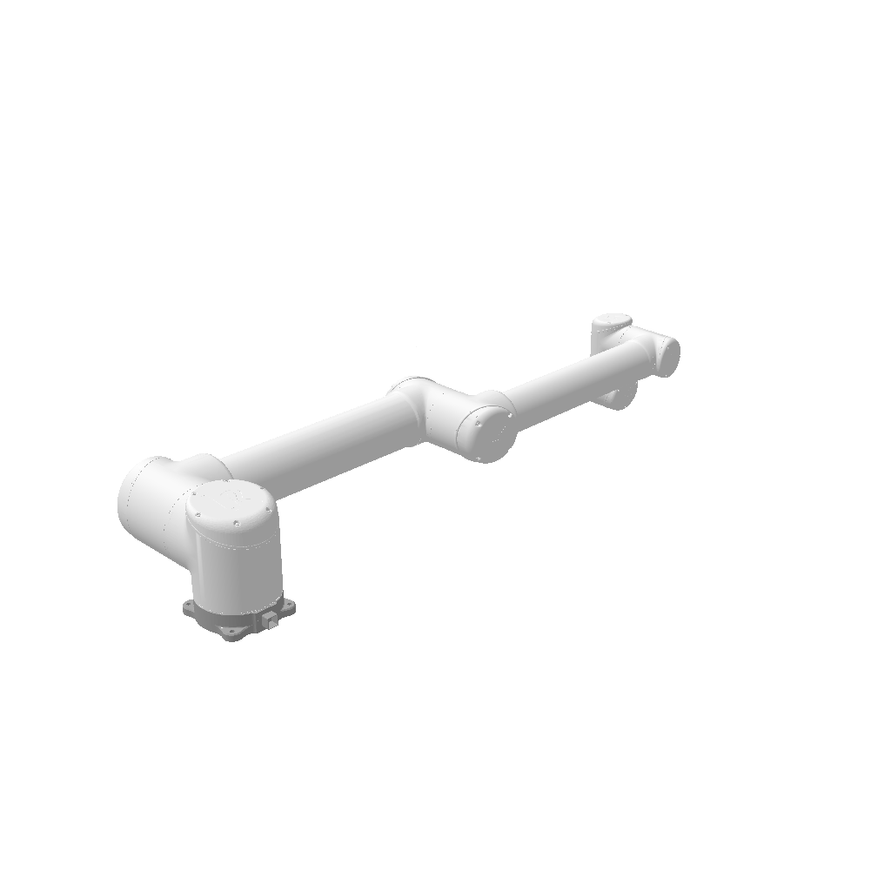</a><br>[front](pybullet/images/ros-industrial/xacro_generated/universal_robots/ur_description/ur10/front.png) · [side](pybullet/images/ros-industrial/xacro_generated/universal_robots/ur_description/ur10/side.png) · [top](pybullet/images/ros-industrial/xacro_generated/universal_robots/ur_description/ur10/top.png) |
| ur10e | ROS-Industrial | Universal Robots | <a href="mujoco/images/ros-industrial/xacro_generated/universal_robots/ur_description/ur10e/iso.png">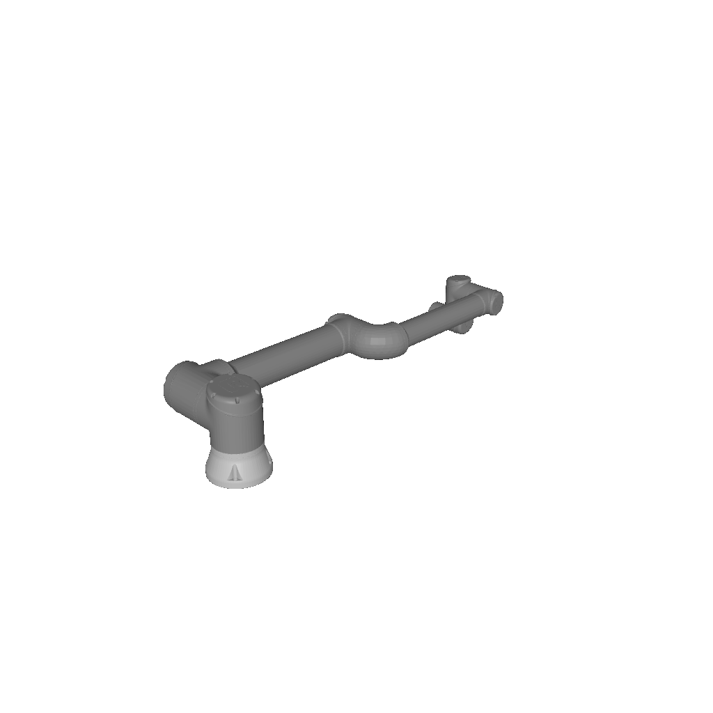</a><br>[front](mujoco/images/ros-industrial/xacro_generated/universal_robots/ur_description/ur10e/front.png) · [side](mujoco/images/ros-industrial/xacro_generated/universal_robots/ur_description/ur10e/side.png) · [top](mujoco/images/ros-industrial/xacro_generated/universal_robots/ur_description/ur10e/top.png) | <a href="pybullet/images/ros-industrial/xacro_generated/universal_robots/ur_description/ur10e/iso.png">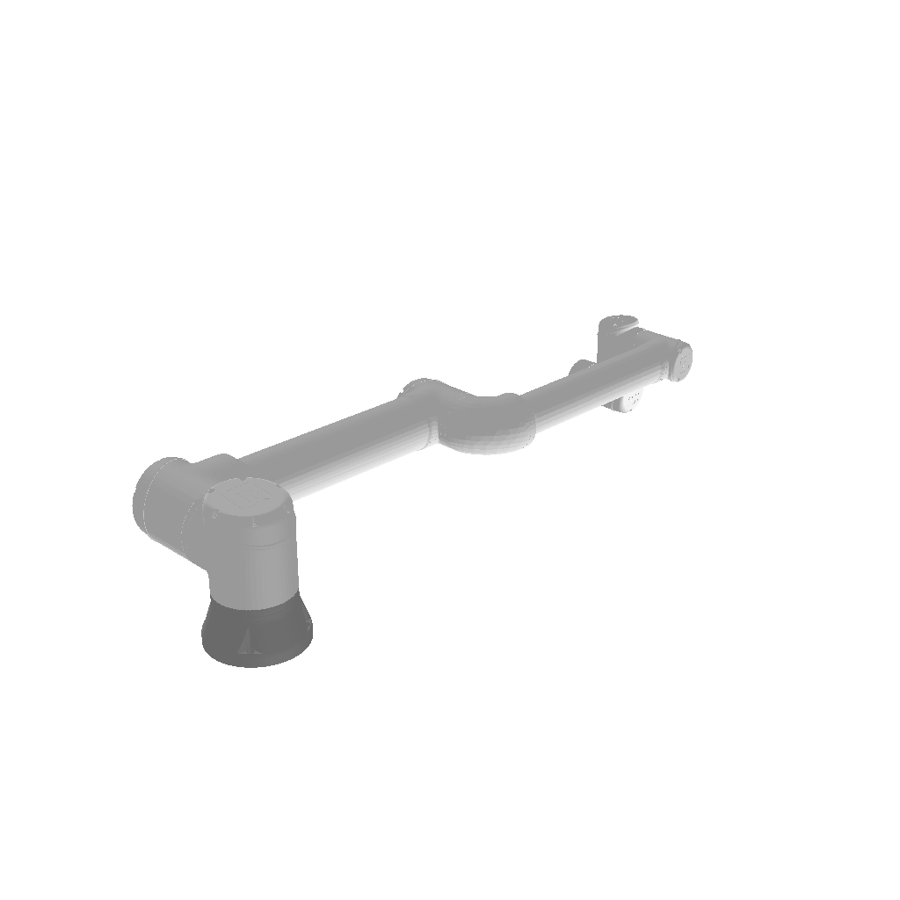</a><br>[front](pybullet/images/ros-industrial/xacro_generated/universal_robots/ur_description/ur10e/front.png) · [side](pybullet/images/ros-industrial/xacro_generated/universal_robots/ur_description/ur10e/side.png) · [top](pybullet/images/ros-industrial/xacro_generated/universal_robots/ur_description/ur10e/top.png) |
| ur16e | ROS-Industrial | Universal Robots | <a href="mujoco/images/ros-industrial/xacro_generated/universal_robots/ur_description/ur16e/iso.png">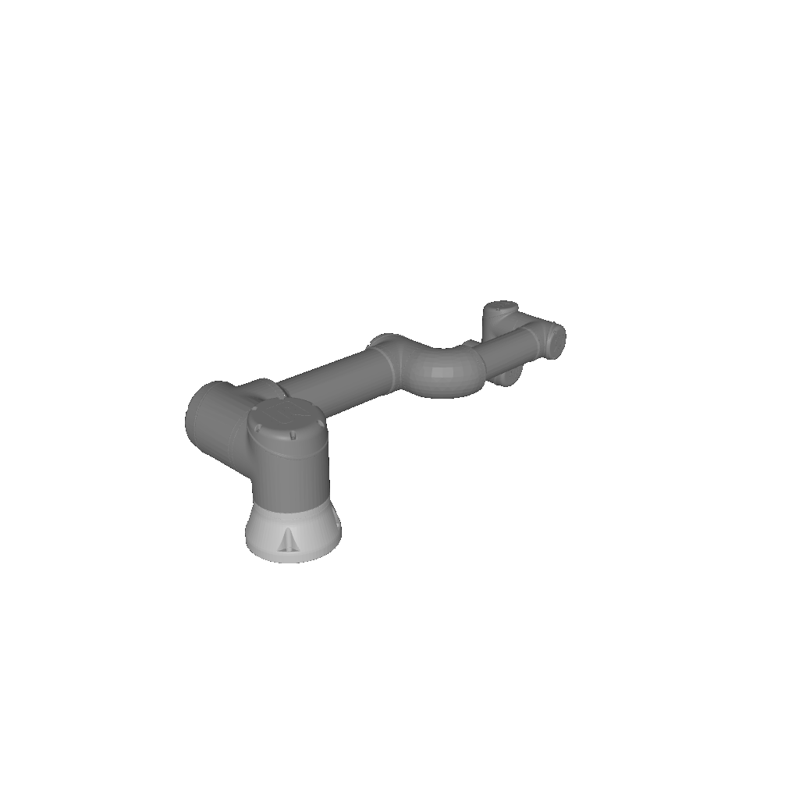</a><br>[front](mujoco/images/ros-industrial/xacro_generated/universal_robots/ur_description/ur16e/front.png) · [side](mujoco/images/ros-industrial/xacro_generated/universal_robots/ur_description/ur16e/side.png) · [top](mujoco/images/ros-industrial/xacro_generated/universal_robots/ur_description/ur16e/top.png) | <a href="pybullet/images/ros-industrial/xacro_generated/universal_robots/ur_description/ur16e/iso.png">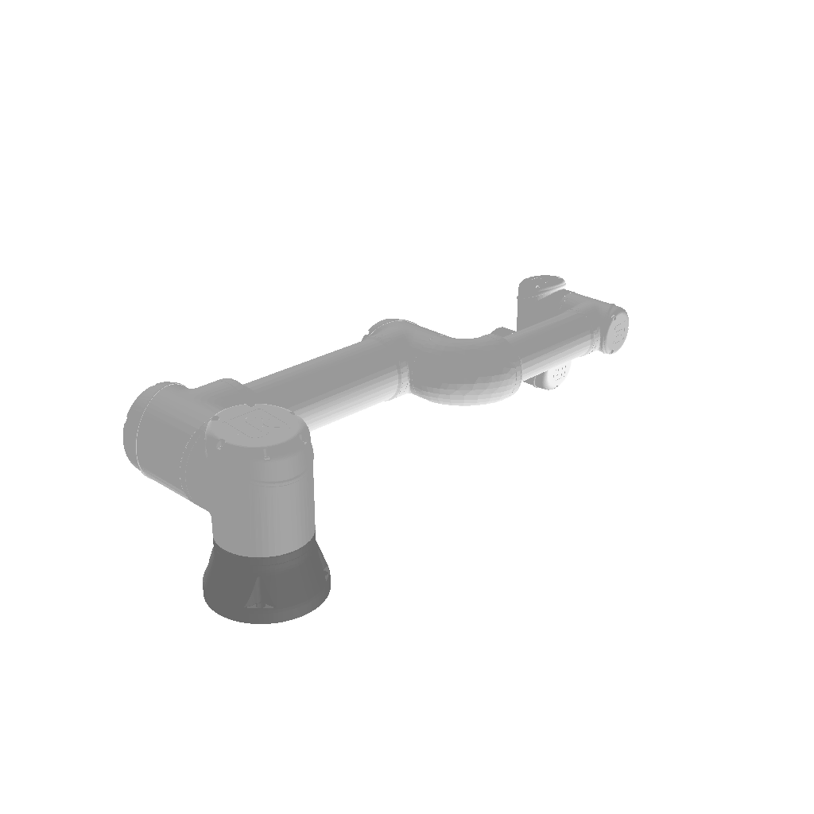</a><br>[front](pybullet/images/ros-industrial/xacro_generated/universal_robots/ur_description/ur16e/front.png) · [side](pybullet/images/ros-industrial/xacro_generated/universal_robots/ur_description/ur16e/side.png) · [top](pybullet/images/ros-industrial/xacro_generated/universal_robots/ur_description/ur16e/top.png) |
| ur3 | ROS-Industrial | Universal Robots | <a href="mujoco/images/ros-industrial/xacro_generated/universal_robots/ur_description/ur3/iso.png">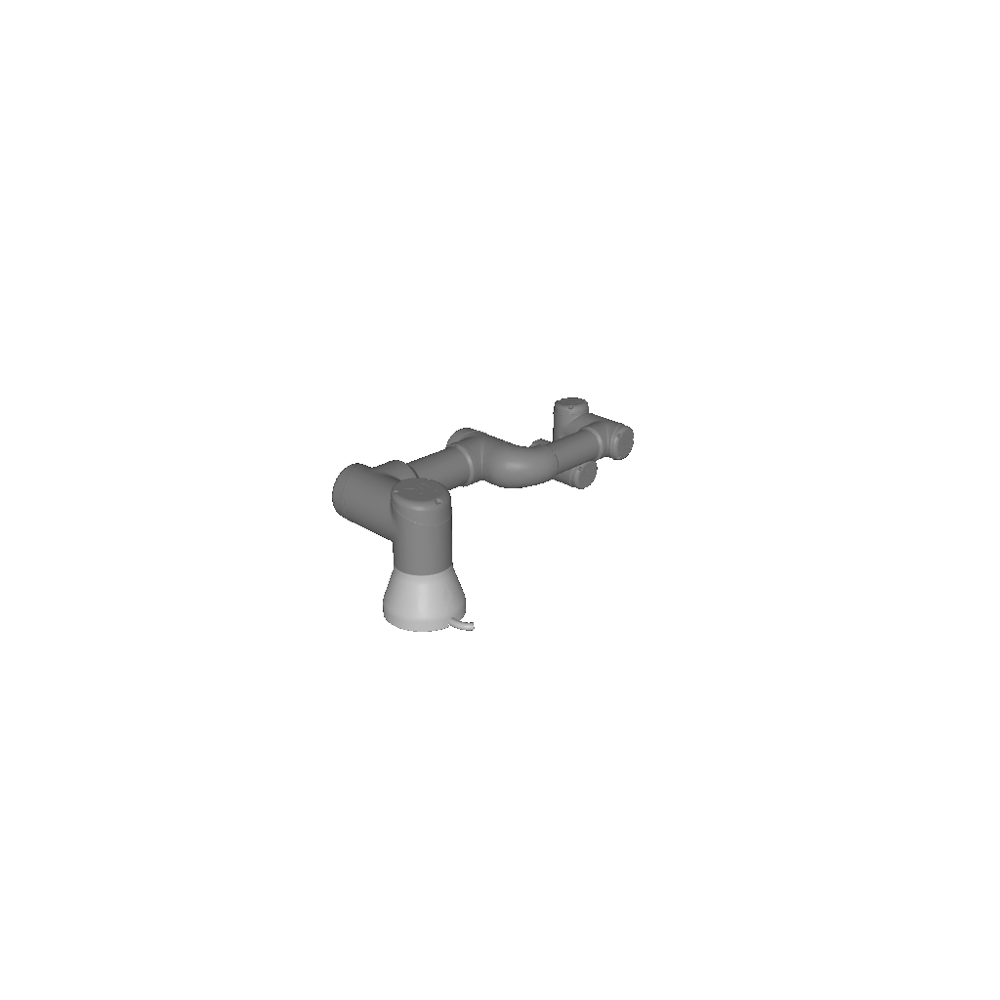</a><br>[front](mujoco/images/ros-industrial/xacro_generated/universal_robots/ur_description/ur3/front.png) · [side](mujoco/images/ros-industrial/xacro_generated/universal_robots/ur_description/ur3/side.png) · [top](mujoco/images/ros-industrial/xacro_generated/universal_robots/ur_description/ur3/top.png) | <a href="pybullet/images/ros-industrial/xacro_generated/universal_robots/ur_description/ur3/iso.png">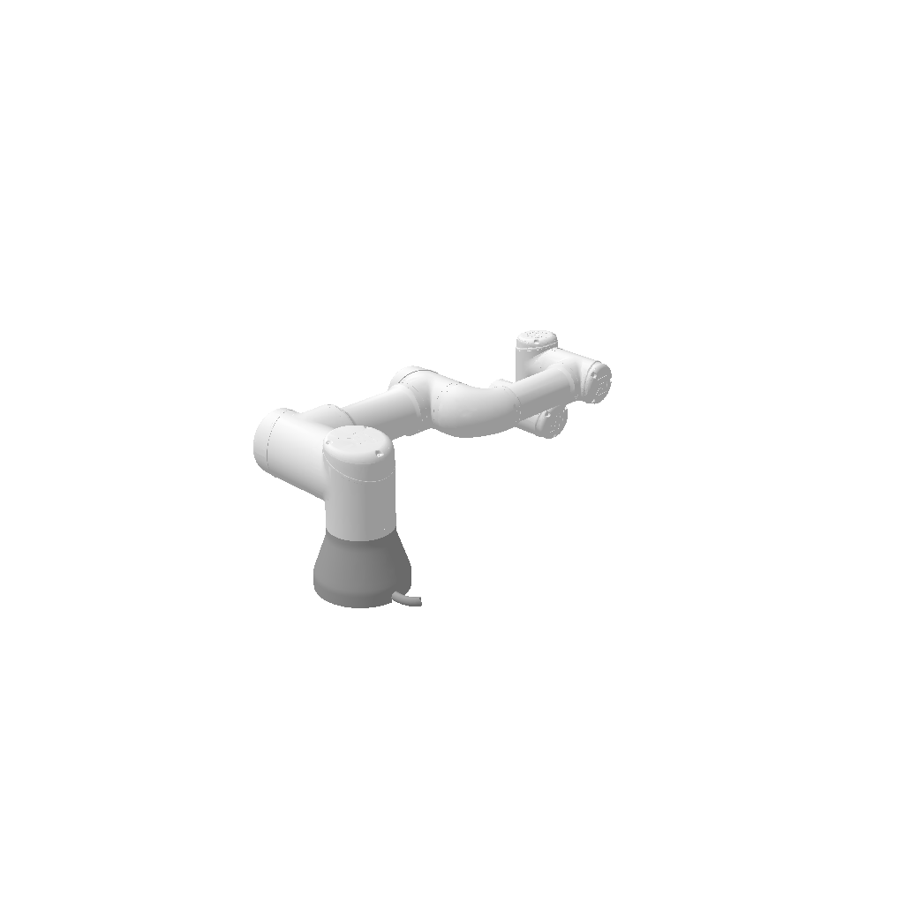</a><br>[front](pybullet/images/ros-industrial/xacro_generated/universal_robots/ur_description/ur3/front.png) · [side](pybullet/images/ros-industrial/xacro_generated/universal_robots/ur_description/ur3/side.png) · [top](pybullet/images/ros-industrial/xacro_generated/universal_robots/ur_description/ur3/top.png) |
| ur3e | ROS-Industrial | Universal Robots | <a href="mujoco/images/ros-industrial/xacro_generated/universal_robots/ur_description/ur3e/iso.png">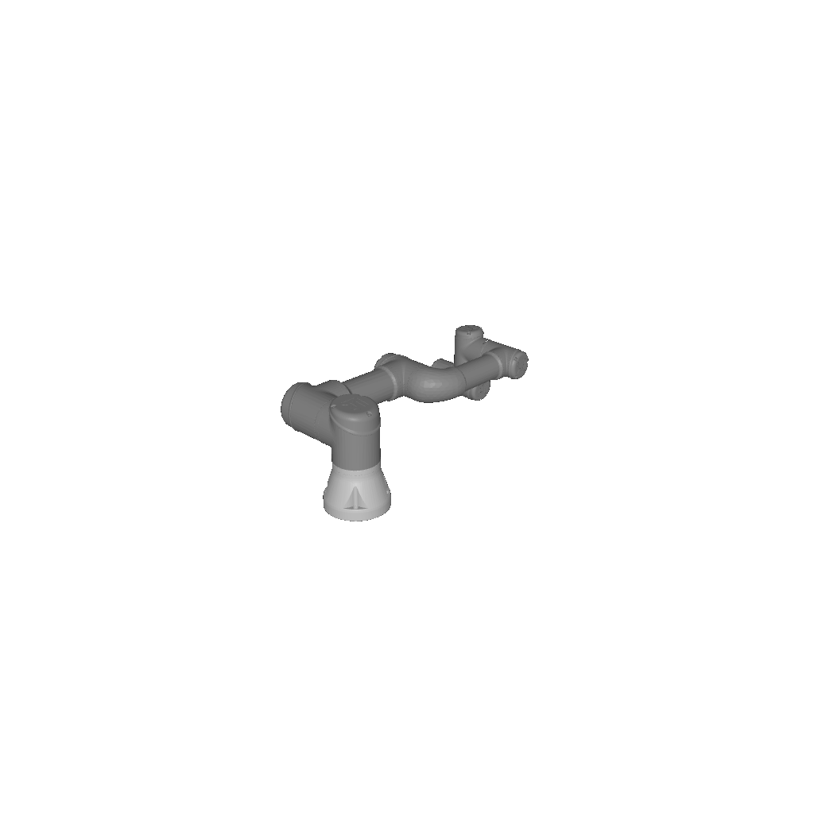</a><br>[front](mujoco/images/ros-industrial/xacro_generated/universal_robots/ur_description/ur3e/front.png) · [side](mujoco/images/ros-industrial/xacro_generated/universal_robots/ur_description/ur3e/side.png) · [top](mujoco/images/ros-industrial/xacro_generated/universal_robots/ur_description/ur3e/top.png) | <a href="pybullet/images/ros-industrial/xacro_generated/universal_robots/ur_description/ur3e/iso.png">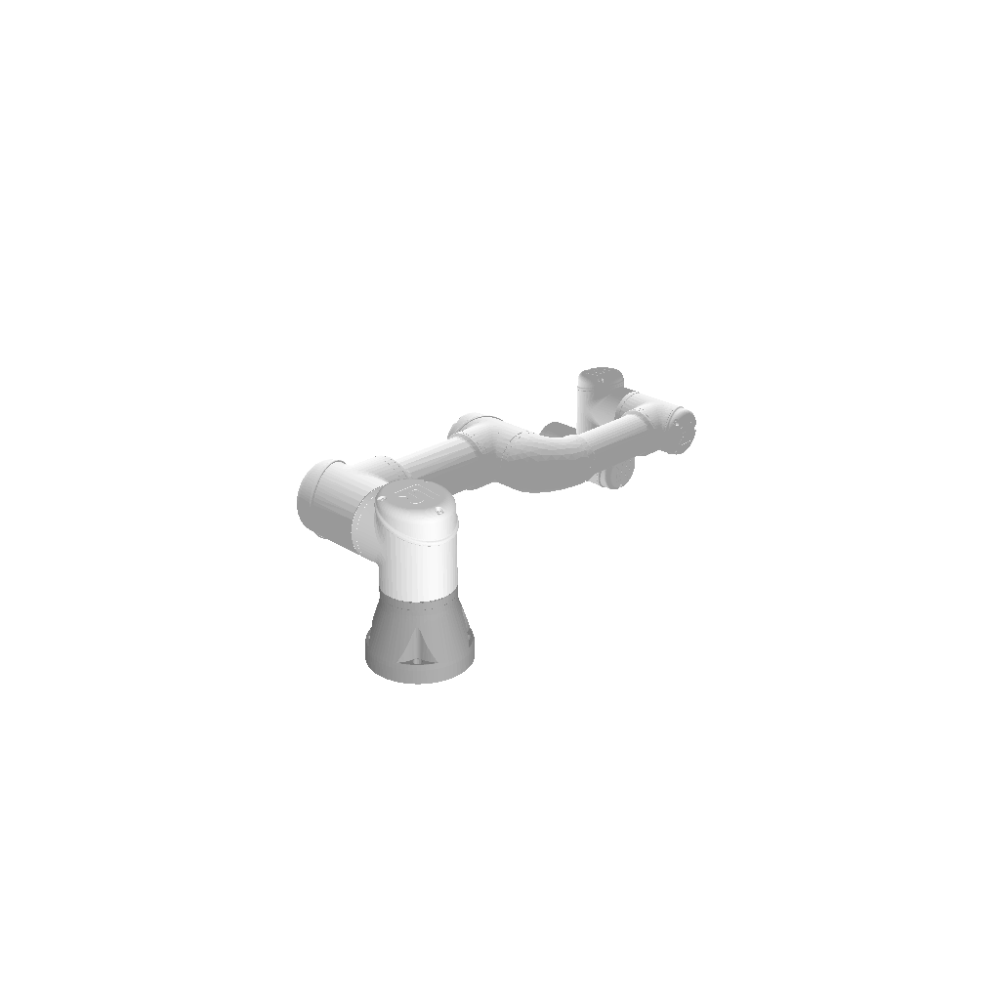</a><br>[front](pybullet/images/ros-industrial/xacro_generated/universal_robots/ur_description/ur3e/front.png) · [side](pybullet/images/ros-industrial/xacro_generated/universal_robots/ur_description/ur3e/side.png) · [top](pybullet/images/ros-industrial/xacro_generated/universal_robots/ur_description/ur3e/top.png) |
| ur5 | ROS-Industrial | Universal Robots | <a href="mujoco/images/ros-industrial/xacro_generated/universal_robots/ur_description/ur5/iso.png">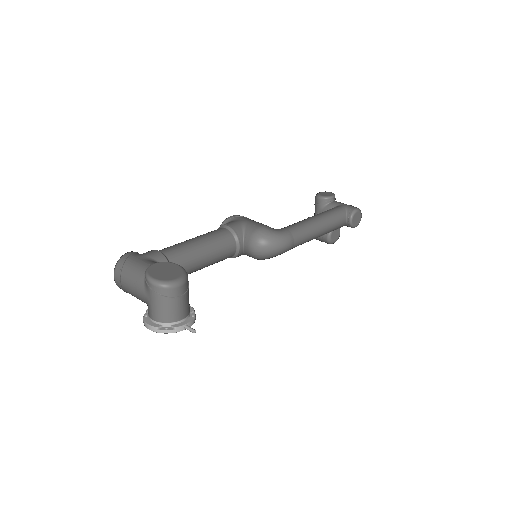</a><br>[front](mujoco/images/ros-industrial/xacro_generated/universal_robots/ur_description/ur5/front.png) · [side](mujoco/images/ros-industrial/xacro_generated/universal_robots/ur_description/ur5/side.png) · [top](mujoco/images/ros-industrial/xacro_generated/universal_robots/ur_description/ur5/top.png) | <a href="pybullet/images/ros-industrial/xacro_generated/universal_robots/ur_description/ur5/iso.png">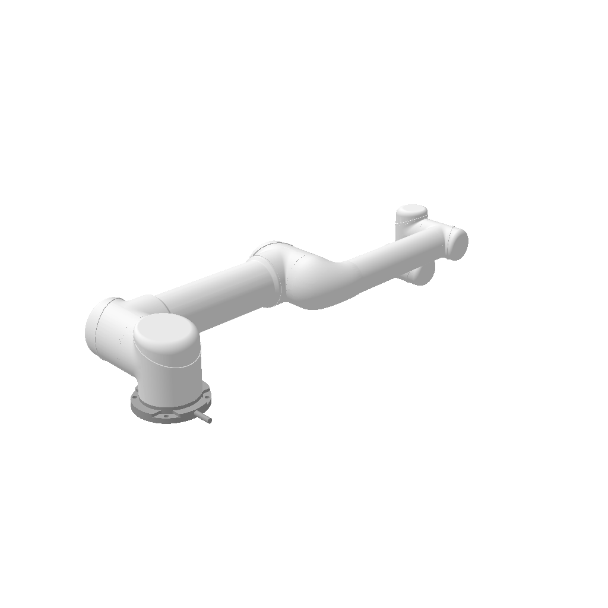</a><br>[front](pybullet/images/ros-industrial/xacro_generated/universal_robots/ur_description/ur5/front.png) · [side](pybullet/images/ros-industrial/xacro_generated/universal_robots/ur_description/ur5/side.png) · [top](pybullet/images/ros-industrial/xacro_generated/universal_robots/ur_description/ur5/top.png) |
| ur5e | ROS-Industrial | Universal Robots | <a href="mujoco/images/ros-industrial/xacro_generated/universal_robots/ur_description/ur5e/iso.png">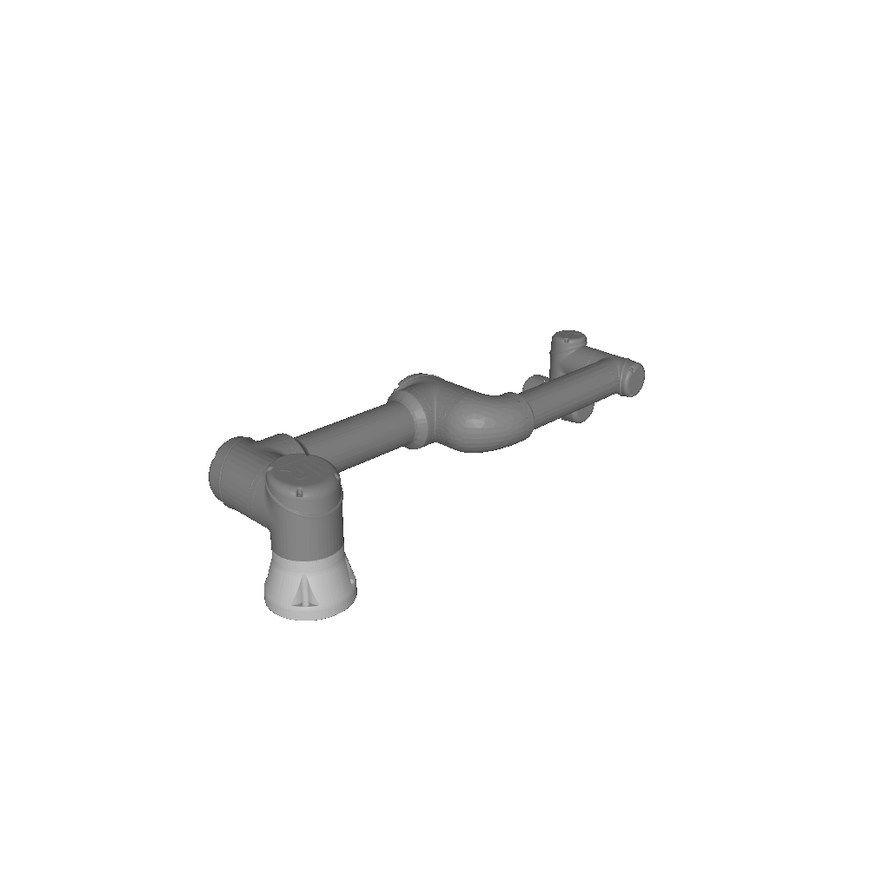</a><br>[front](mujoco/images/ros-industrial/xacro_generated/universal_robots/ur_description/ur5e/front.png) · [side](mujoco/images/ros-industrial/xacro_generated/universal_robots/ur_description/ur5e/side.png) · [top](mujoco/images/ros-industrial/xacro_generated/universal_robots/ur_description/ur5e/top.png) | <a href="pybullet/images/ros-industrial/xacro_generated/universal_robots/ur_description/ur5e/iso.png">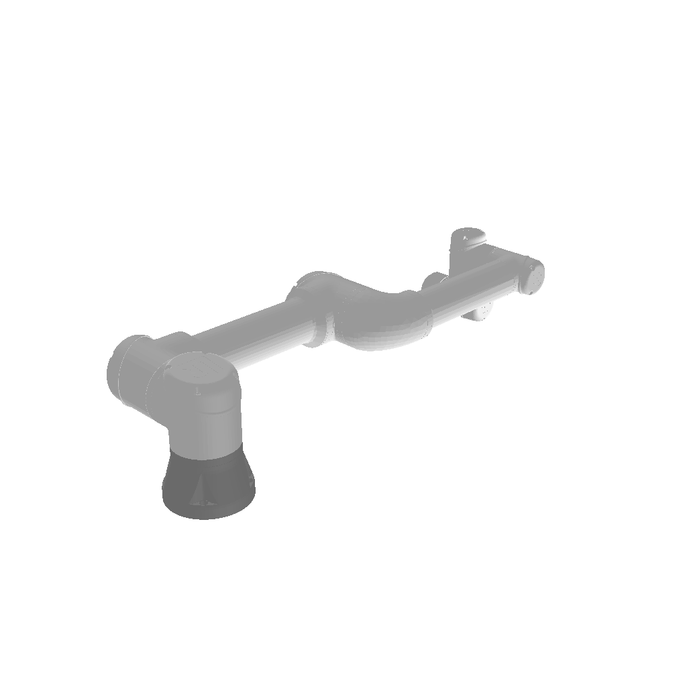</a><br>[front](pybullet/images/ros-industrial/xacro_generated/universal_robots/ur_description/ur5e/front.png) · [side](pybullet/images/ros-industrial/xacro_generated/universal_robots/ur_description/ur5e/side.png) · [top](pybullet/images/ros-industrial/xacro_generated/universal_robots/ur_description/ur5e/top.png) |
| abbIrb120 | MATLAB Robotics | ABB | <a href="mujoco/images/matlab/abb_irb120_support/abbIrb120/iso.png"></a><br>[front](mujoco/images/matlab/abb_irb120_support/abbIrb120/front.png) · [side](mujoco/images/matlab/abb_irb120_support/abbIrb120/side.png) · [top](mujoco/images/matlab/abb_irb120_support/abbIrb120/top.png) | <a href="pybullet/images/matlab/abb_irb120_support/abbIrb120/iso.png"></a><br>[front](pybullet/images/matlab/abb_irb120_support/abbIrb120/front.png) · [side](pybullet/images/matlab/abb_irb120_support/abbIrb120/side.png) · [top](pybullet/images/matlab/abb_irb120_support/abbIrb120/top.png) |
| abbIrb120T | MATLAB Robotics | ABB | <a href="mujoco/images/matlab/abb_irb120_support/abbIrb120T/iso.png">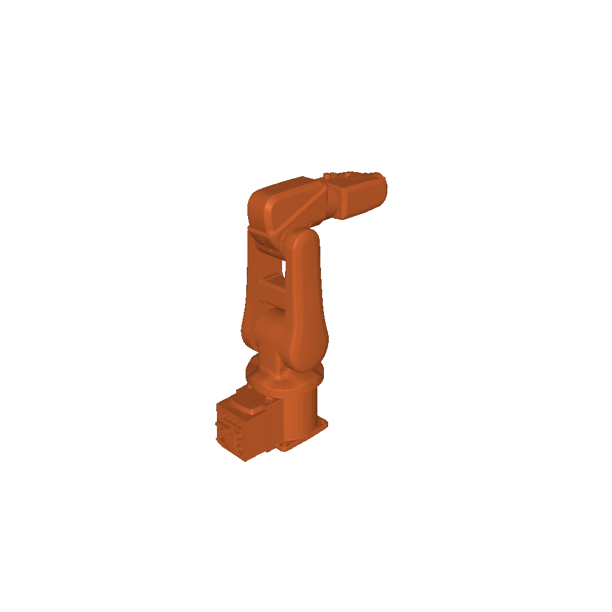</a><br>[front](mujoco/images/matlab/abb_irb120_support/abbIrb120T/front.png) · [side](mujoco/images/matlab/abb_irb120_support/abbIrb120T/side.png) · [top](mujoco/images/matlab/abb_irb120_support/abbIrb120T/top.png) | <a href="pybullet/images/matlab/abb_irb120_support/abbIrb120T/iso.png">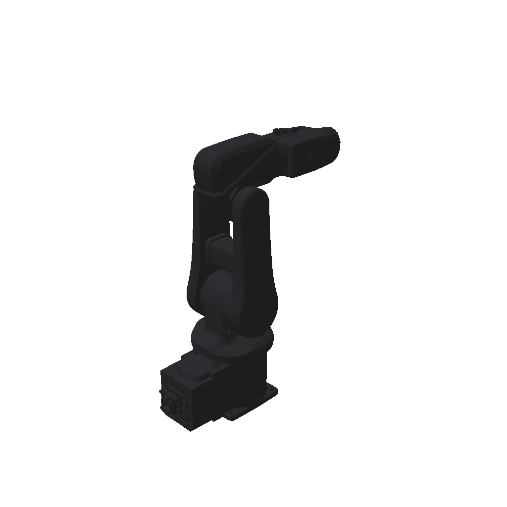</a><br>[front](pybullet/images/matlab/abb_irb120_support/abbIrb120T/front.png) · [side](pybullet/images/matlab/abb_irb120_support/abbIrb120T/side.png) · [top](pybullet/images/matlab/abb_irb120_support/abbIrb120T/top.png) |
| abbIrb1600 | MATLAB Robotics | ABB | <a href="mujoco/images/matlab/abb_irb1600_support/abbIrb1600/iso.png">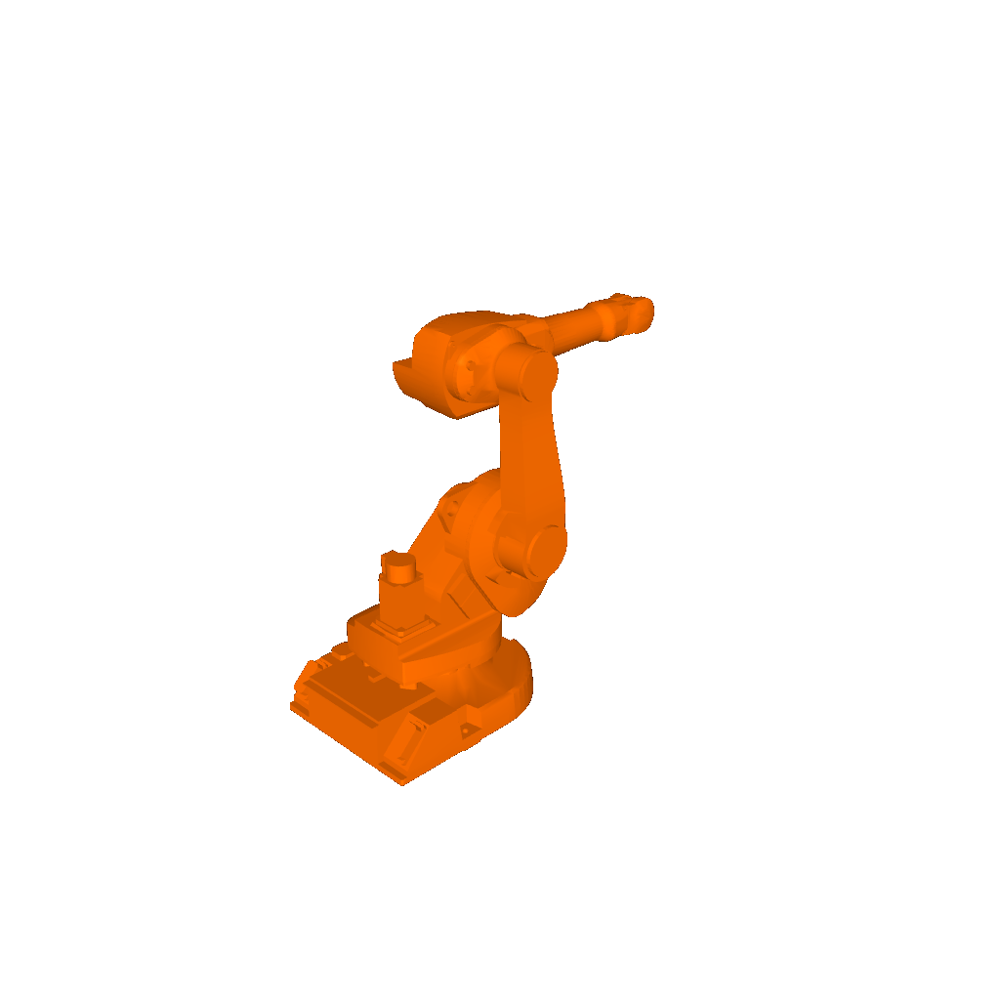</a><br>[front](mujoco/images/matlab/abb_irb1600_support/abbIrb1600/front.png) · [side](mujoco/images/matlab/abb_irb1600_support/abbIrb1600/side.png) · [top](mujoco/images/matlab/abb_irb1600_support/abbIrb1600/top.png) | <a href="pybullet/images/matlab/abb_irb1600_support/abbIrb1600/iso.png"></a><br>[front](pybullet/images/matlab/abb_irb1600_support/abbIrb1600/front.png) · [side](pybullet/images/matlab/abb_irb1600_support/abbIrb1600/side.png) · [top](pybullet/images/matlab/abb_irb1600_support/abbIrb1600/top.png) |
| abbYuMi | MATLAB Robotics | ABB | <a href="mujoco/images/matlab/yumi_description/abbYuMi/iso.png">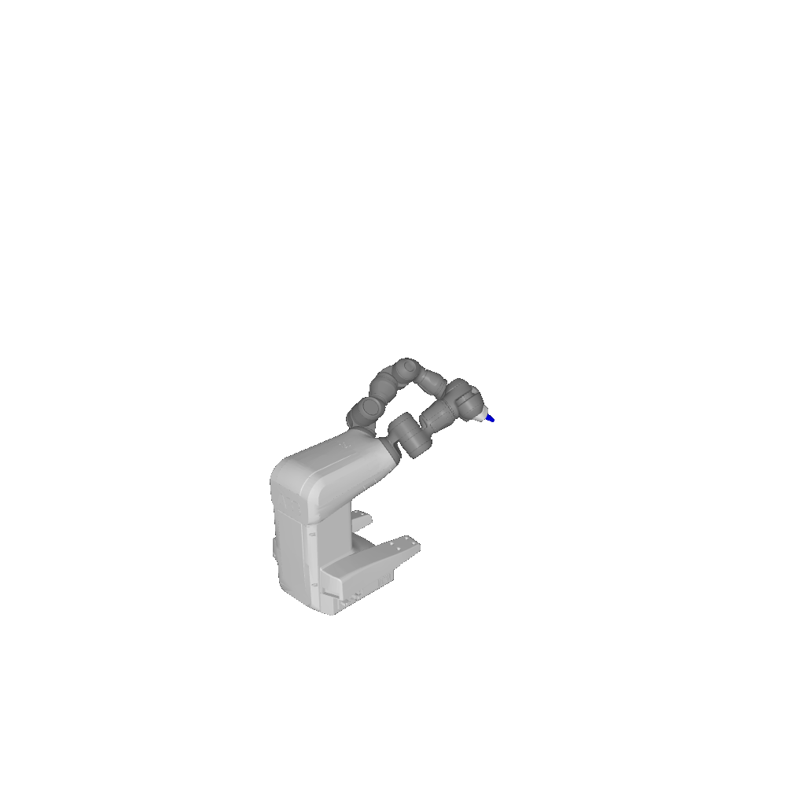</a><br>[front](mujoco/images/matlab/yumi_description/abbYuMi/front.png) · [side](mujoco/images/matlab/yumi_description/abbYuMi/side.png) · [top](mujoco/images/matlab/yumi_description/abbYuMi/top.png) | <a href="pybullet/images/matlab/yumi_description/abbYuMi/iso.png">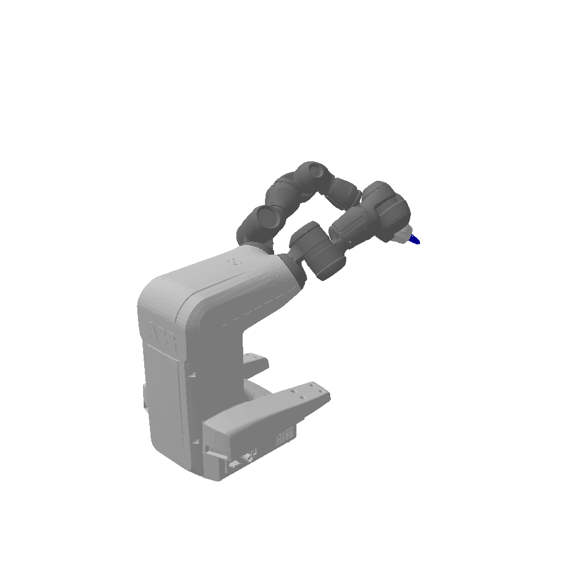</a><br>[front](pybullet/images/matlab/yumi_description/abbYuMi/front.png) · [side](pybullet/images/matlab/yumi_description/abbYuMi/side.png) · [top](pybullet/images/matlab/yumi_description/abbYuMi/top.png) |
| fanucLRMate200ib | MATLAB Robotics | FANUC | <a href="mujoco/images/matlab/fanuc_lrmate200ib_support/fanucLRMate200ib/iso.png"></a><br>[front](mujoco/images/matlab/fanuc_lrmate200ib_support/fanucLRMate200ib/front.png) · [side](mujoco/images/matlab/fanuc_lrmate200ib_support/fanucLRMate200ib/side.png) · [top](mujoco/images/matlab/fanuc_lrmate200ib_support/fanucLRMate200ib/top.png) | <a href="pybullet/images/matlab/fanuc_lrmate200ib_support/fanucLRMate200ib/iso.png">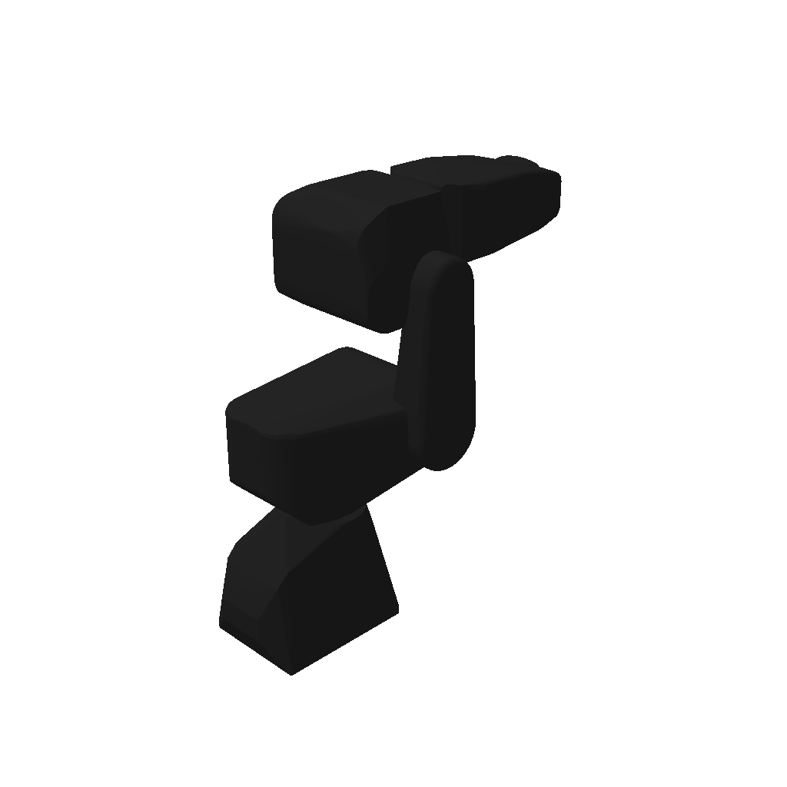</a><br>[front](pybullet/images/matlab/fanuc_lrmate200ib_support/fanucLRMate200ib/front.png) · [side](pybullet/images/matlab/fanuc_lrmate200ib_support/fanucLRMate200ib/side.png) · [top](pybullet/images/matlab/fanuc_lrmate200ib_support/fanucLRMate200ib/top.png) |
| fanucM16ib | MATLAB Robotics | FANUC | <a href="mujoco/images/matlab/fanuc_m16ib_support/fanucM16ib/iso.png">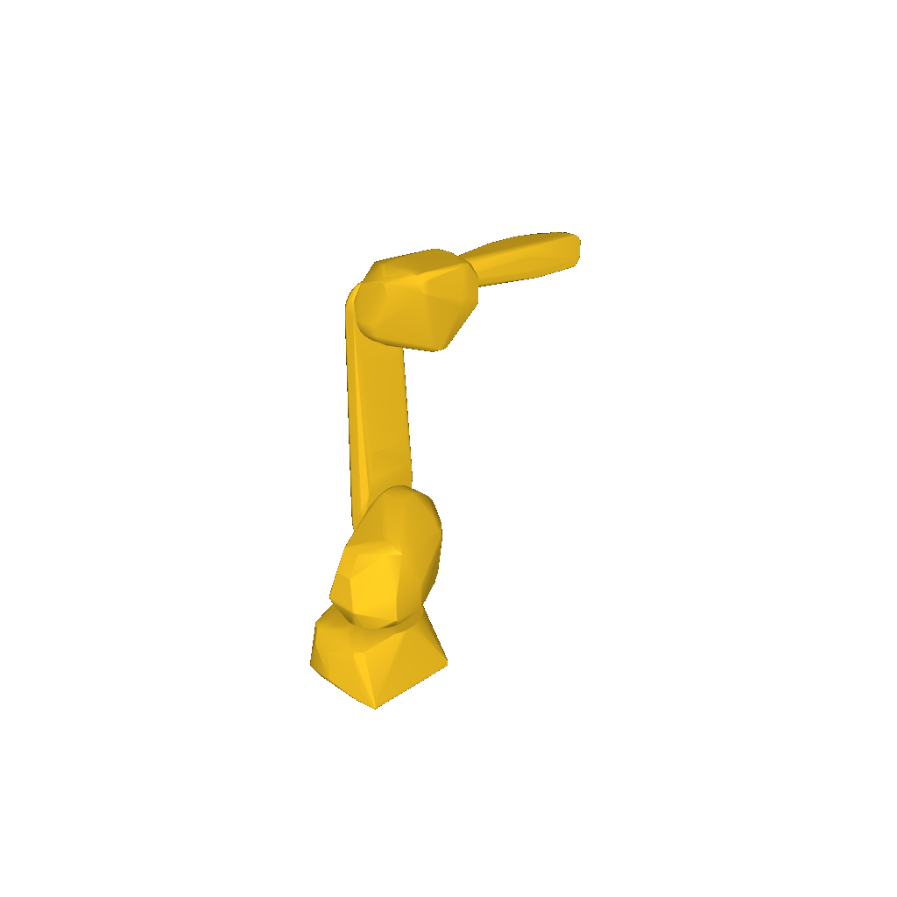</a><br>[front](mujoco/images/matlab/fanuc_m16ib_support/fanucM16ib/front.png) · [side](mujoco/images/matlab/fanuc_m16ib_support/fanucM16ib/side.png) · [top](mujoco/images/matlab/fanuc_m16ib_support/fanucM16ib/top.png) | <a href="pybullet/images/matlab/fanuc_m16ib_support/fanucM16ib/iso.png">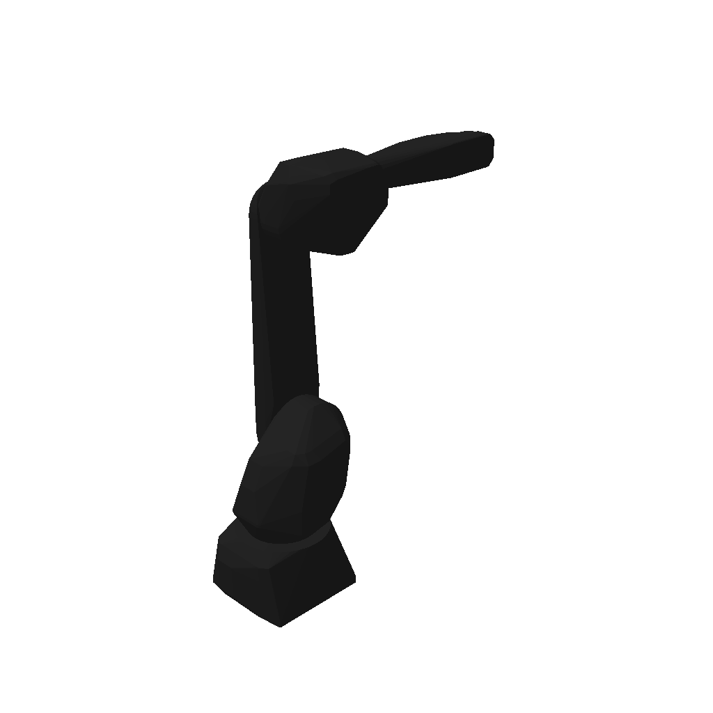</a><br>[front](pybullet/images/matlab/fanuc_m16ib_support/fanucM16ib/front.png) · [side](pybullet/images/matlab/fanuc_m16ib_support/fanucM16ib/side.png) · [top](pybullet/images/matlab/fanuc_m16ib_support/fanucM16ib/top.png) |
| frankaEmikaPanda | MATLAB Robotics | Franka Emika | <a href="mujoco/images/matlab/franka_description/robots/frankaEmikaPanda/iso.png">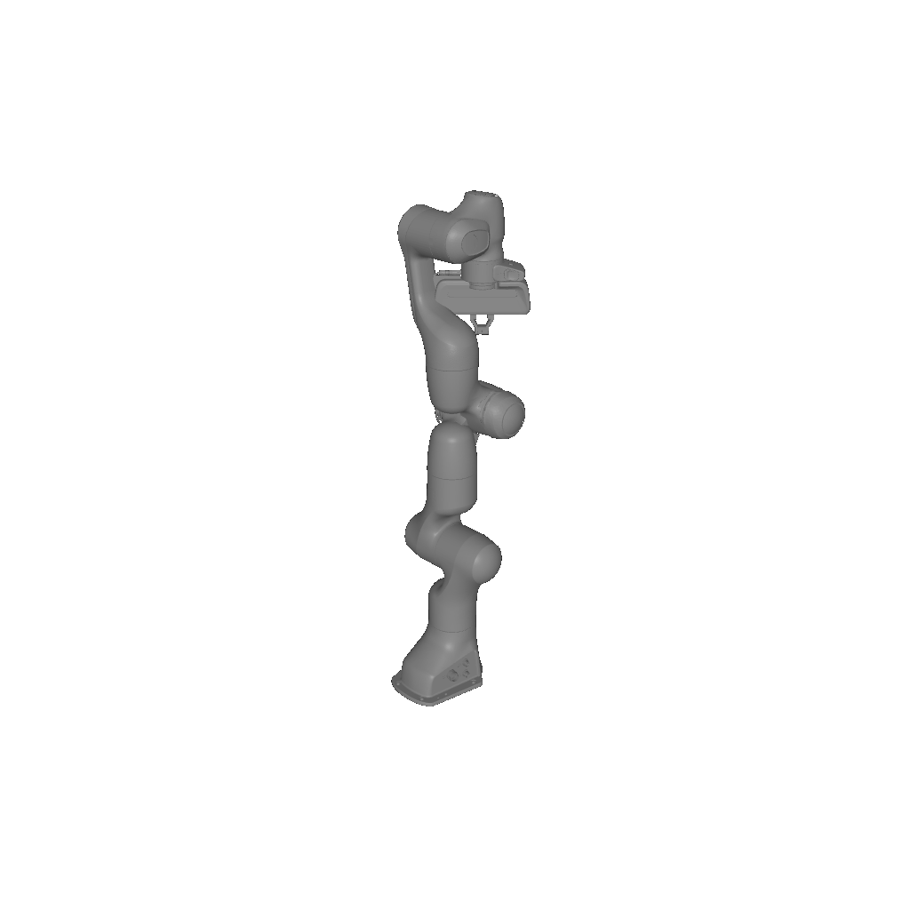</a><br>[front](mujoco/images/matlab/franka_description/robots/frankaEmikaPanda/front.png) · [side](mujoco/images/matlab/franka_description/robots/frankaEmikaPanda/side.png) · [top](mujoco/images/matlab/franka_description/robots/frankaEmikaPanda/top.png) | <a href="pybullet/images/matlab/franka_description/robots/frankaEmikaPanda/iso.png">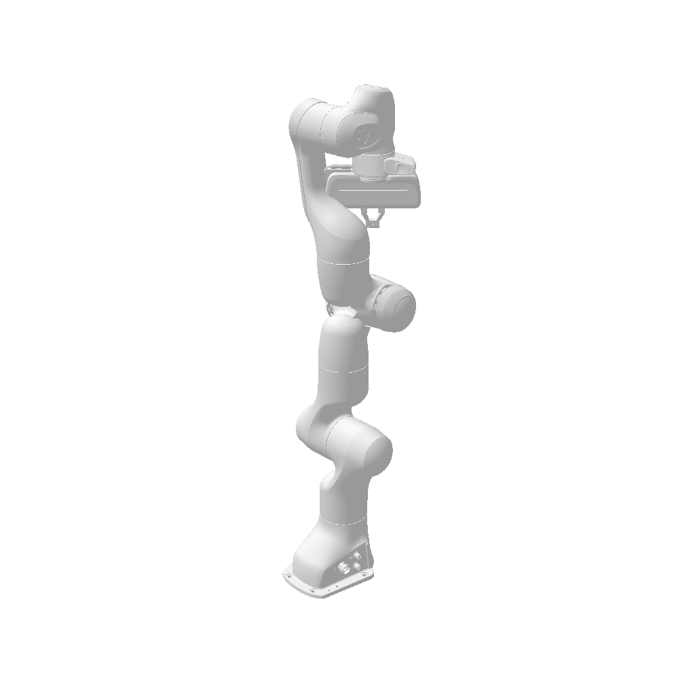</a><br>[front](pybullet/images/matlab/franka_description/robots/frankaEmikaPanda/front.png) · [side](pybullet/images/matlab/franka_description/robots/frankaEmikaPanda/side.png) · [top](pybullet/images/matlab/franka_description/robots/frankaEmikaPanda/top.png) |
| kukaIiwa14 | MATLAB Robotics | KUKA | <a href="mujoco/images/matlab/iiwa_description/kukaIiwa14/iso.png">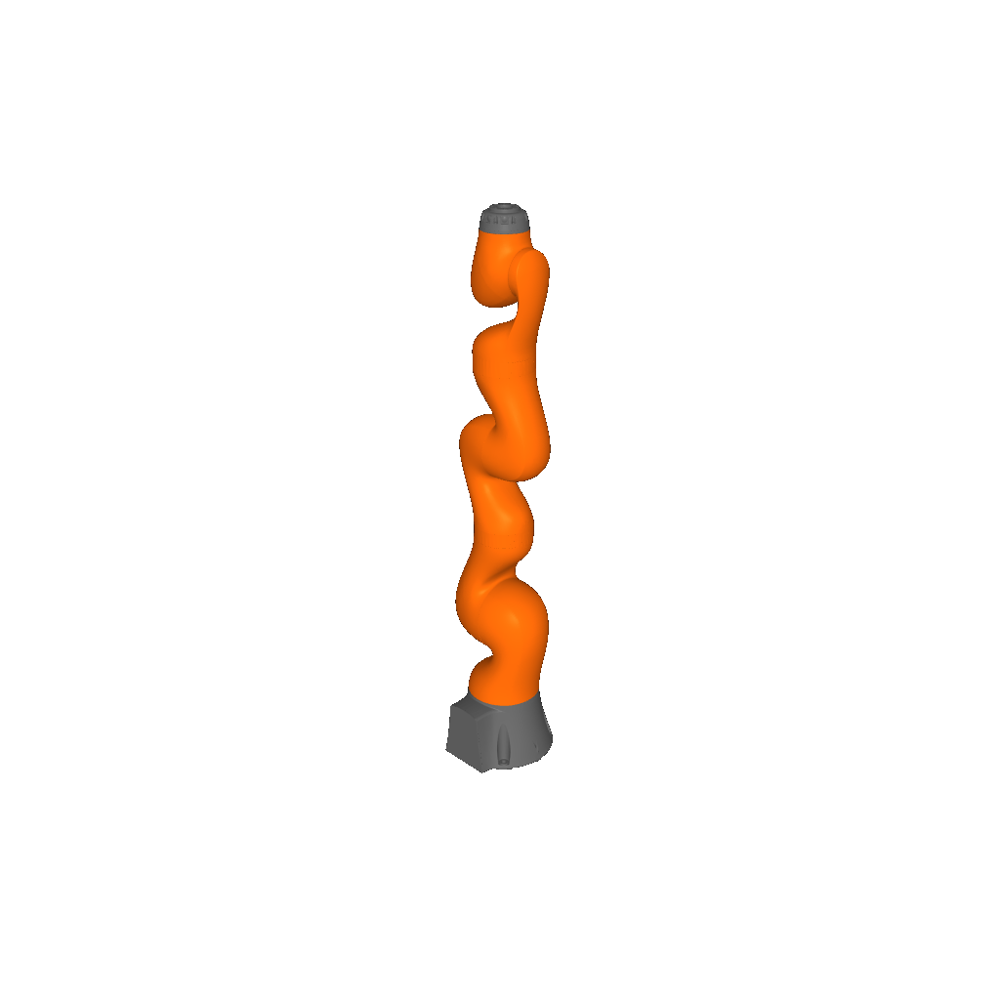</a><br>[front](mujoco/images/matlab/iiwa_description/kukaIiwa14/front.png) · [side](mujoco/images/matlab/iiwa_description/kukaIiwa14/side.png) · [top](mujoco/images/matlab/iiwa_description/kukaIiwa14/top.png) | <a href="pybullet/images/matlab/iiwa_description/kukaIiwa14/iso.png">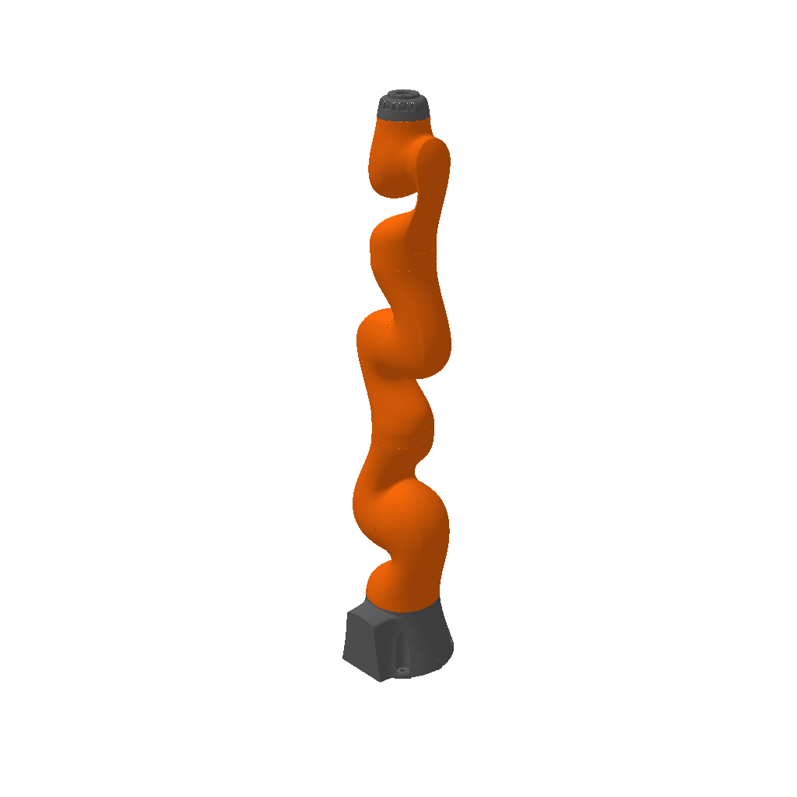</a><br>[front](pybullet/images/matlab/iiwa_description/kukaIiwa14/front.png) · [side](pybullet/images/matlab/iiwa_description/kukaIiwa14/side.png) · [top](pybullet/images/matlab/iiwa_description/kukaIiwa14/top.png) |
| kukaIiwa7 | MATLAB Robotics | KUKA | <a href="mujoco/images/matlab/iiwa_description/kukaIiwa7/iso.png">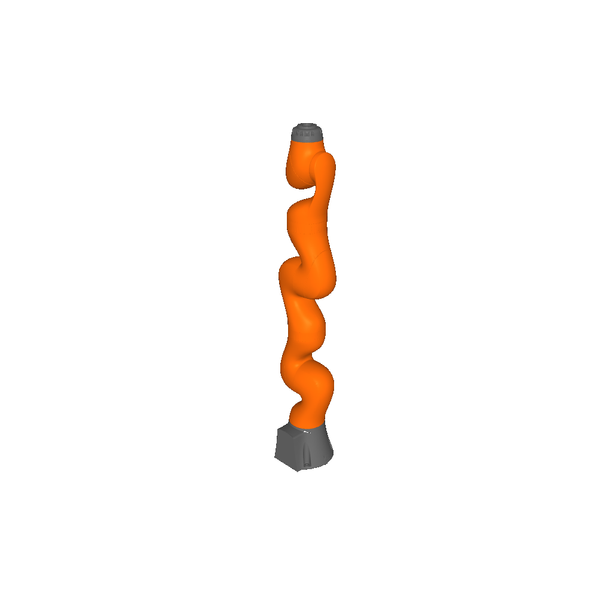</a><br>[front](mujoco/images/matlab/iiwa_description/kukaIiwa7/front.png) · [side](mujoco/images/matlab/iiwa_description/kukaIiwa7/side.png) · [top](mujoco/images/matlab/iiwa_description/kukaIiwa7/top.png) | <a href="pybullet/images/matlab/iiwa_description/kukaIiwa7/iso.png">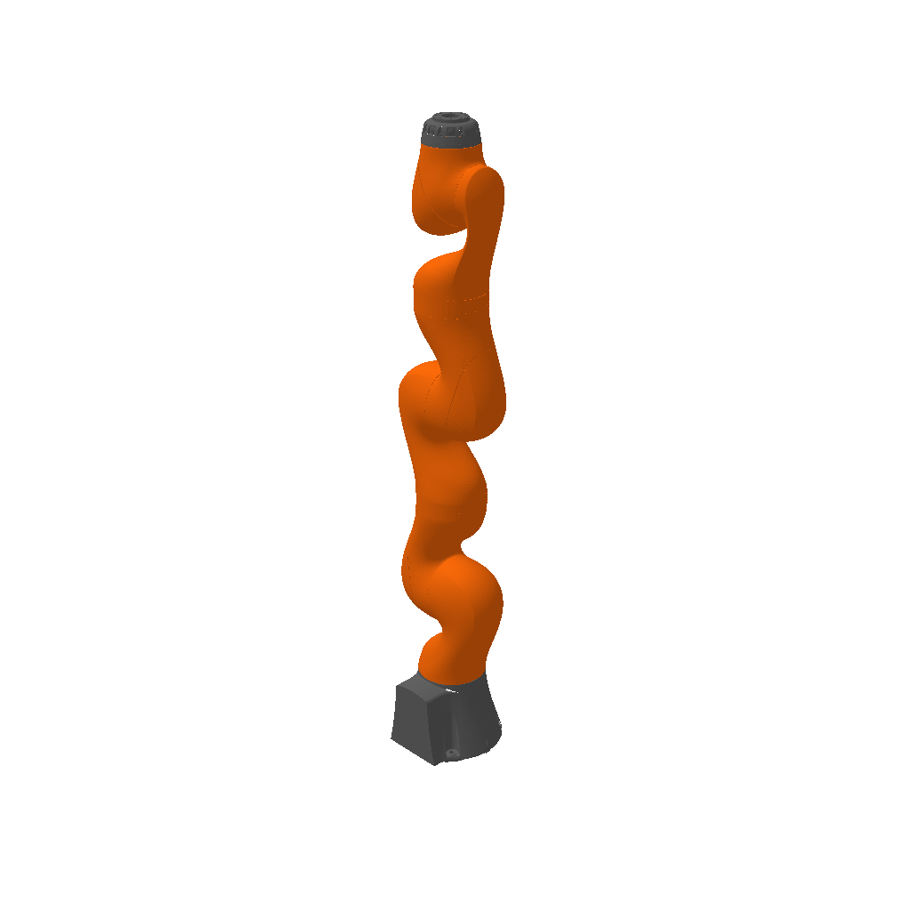</a><br>[front](pybullet/images/matlab/iiwa_description/kukaIiwa7/front.png) · [side](pybullet/images/matlab/iiwa_description/kukaIiwa7/side.png) · [top](pybullet/images/matlab/iiwa_description/kukaIiwa7/top.png) |
| meca500r3 | MATLAB Robotics | Mecademic | <a href="mujoco/images/matlab/mecademic_description/meca500r3/iso.png">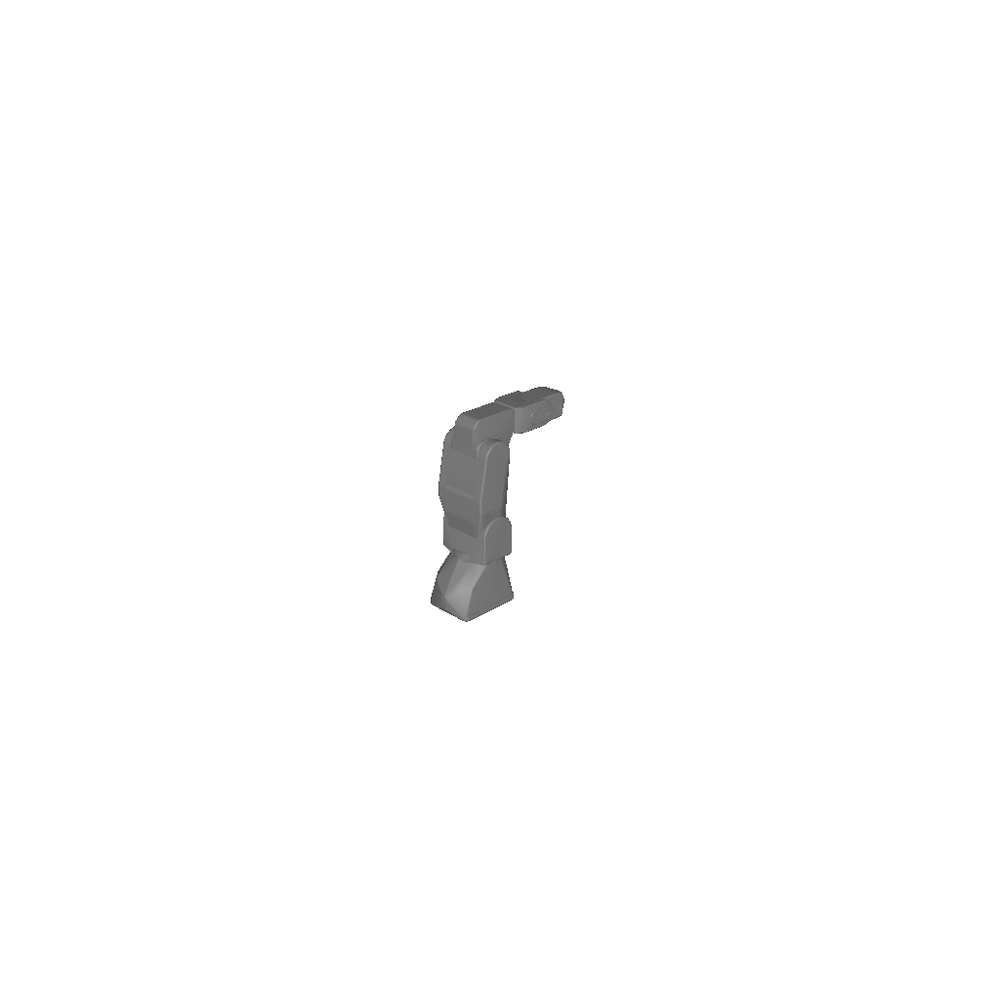</a><br>[front](mujoco/images/matlab/mecademic_description/meca500r3/front.png) · [side](mujoco/images/matlab/mecademic_description/meca500r3/side.png) · [top](mujoco/images/matlab/mecademic_description/meca500r3/top.png) | <a href="pybullet/images/matlab/mecademic_description/meca500r3/iso.png">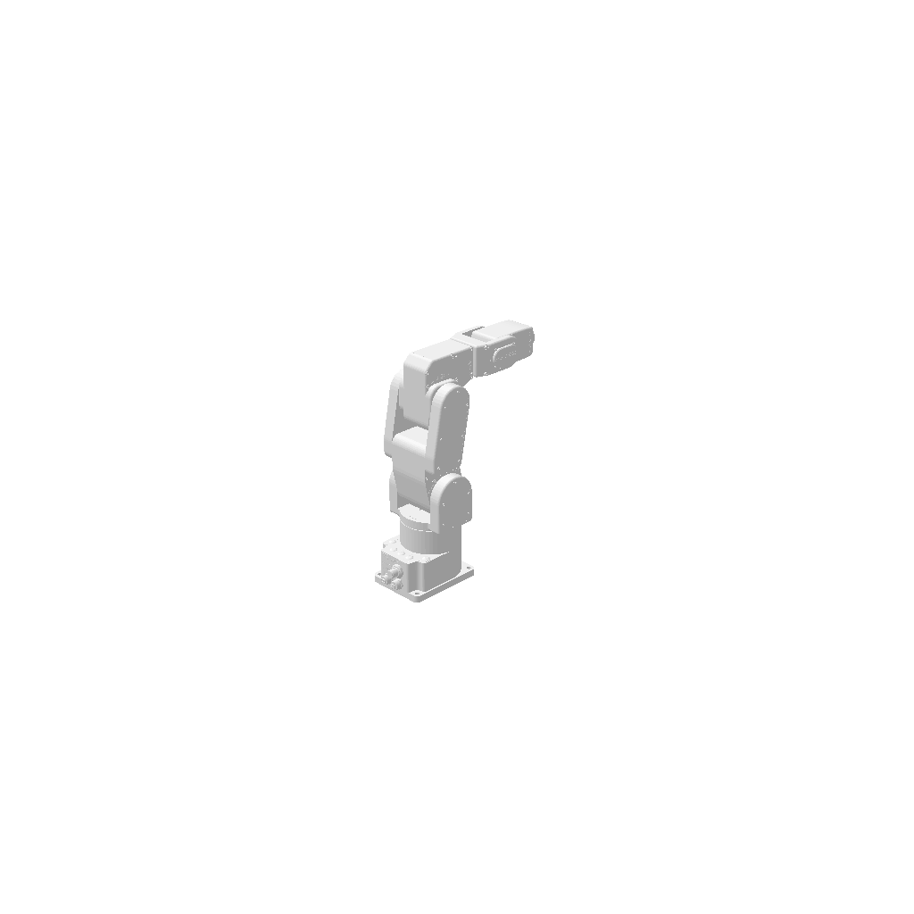</a><br>[front](pybullet/images/matlab/mecademic_description/meca500r3/front.png) · [side](pybullet/images/matlab/mecademic_description/meca500r3/side.png) · [top](pybullet/images/matlab/mecademic_description/meca500r3/top.png) |
| universalUR10e | MATLAB Robotics | Universal Robots | <a href="mujoco/images/matlab/ur_e_description/universalUR10e/iso.png">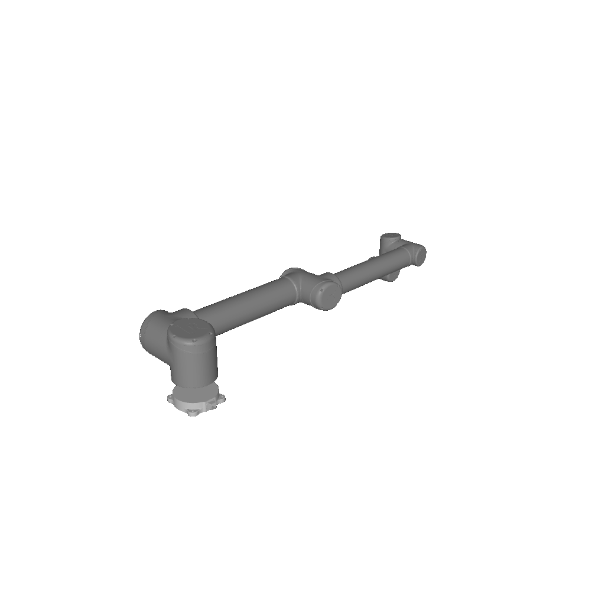</a><br>[front](mujoco/images/matlab/ur_e_description/universalUR10e/front.png) · [side](mujoco/images/matlab/ur_e_description/universalUR10e/side.png) · [top](mujoco/images/matlab/ur_e_description/universalUR10e/top.png) | <a href="pybullet/images/matlab/ur_e_description/universalUR10e/iso.png">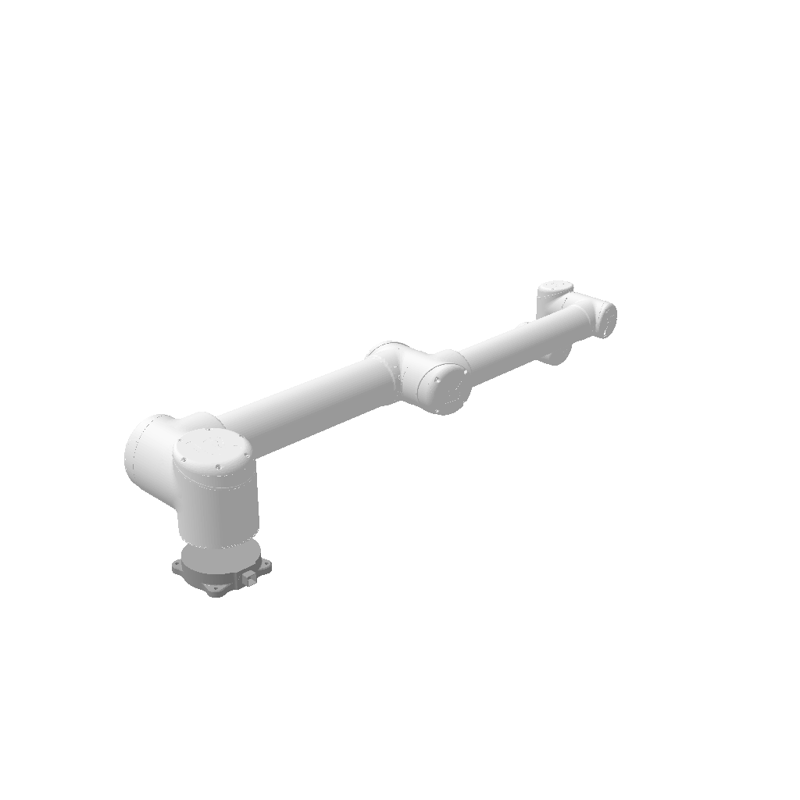</a><br>[front](pybullet/images/matlab/ur_e_description/universalUR10e/front.png) · [side](pybullet/images/matlab/ur_e_description/universalUR10e/side.png) · [top](pybullet/images/matlab/ur_e_description/universalUR10e/top.png) |
| universalUR16e | MATLAB Robotics | Universal Robots | <a href="mujoco/images/matlab/ur_e_description/universalUR16e/iso.png">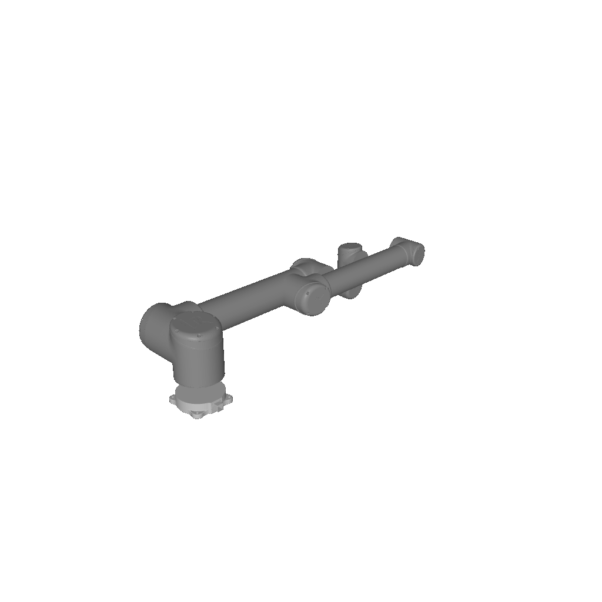</a><br>[front](mujoco/images/matlab/ur_e_description/universalUR16e/front.png) · [side](mujoco/images/matlab/ur_e_description/universalUR16e/side.png) · [top](mujoco/images/matlab/ur_e_description/universalUR16e/top.png) | <a href="pybullet/images/matlab/ur_e_description/universalUR16e/iso.png"></a><br>[front](pybullet/images/matlab/ur_e_description/universalUR16e/front.png) · [side](pybullet/images/matlab/ur_e_description/universalUR16e/side.png) · [top](pybullet/images/matlab/ur_e_description/universalUR16e/top.png) |
| universalUR3e | MATLAB Robotics | Universal Robots | <a href="mujoco/images/matlab/ur_e_description/universalUR3e/iso.png">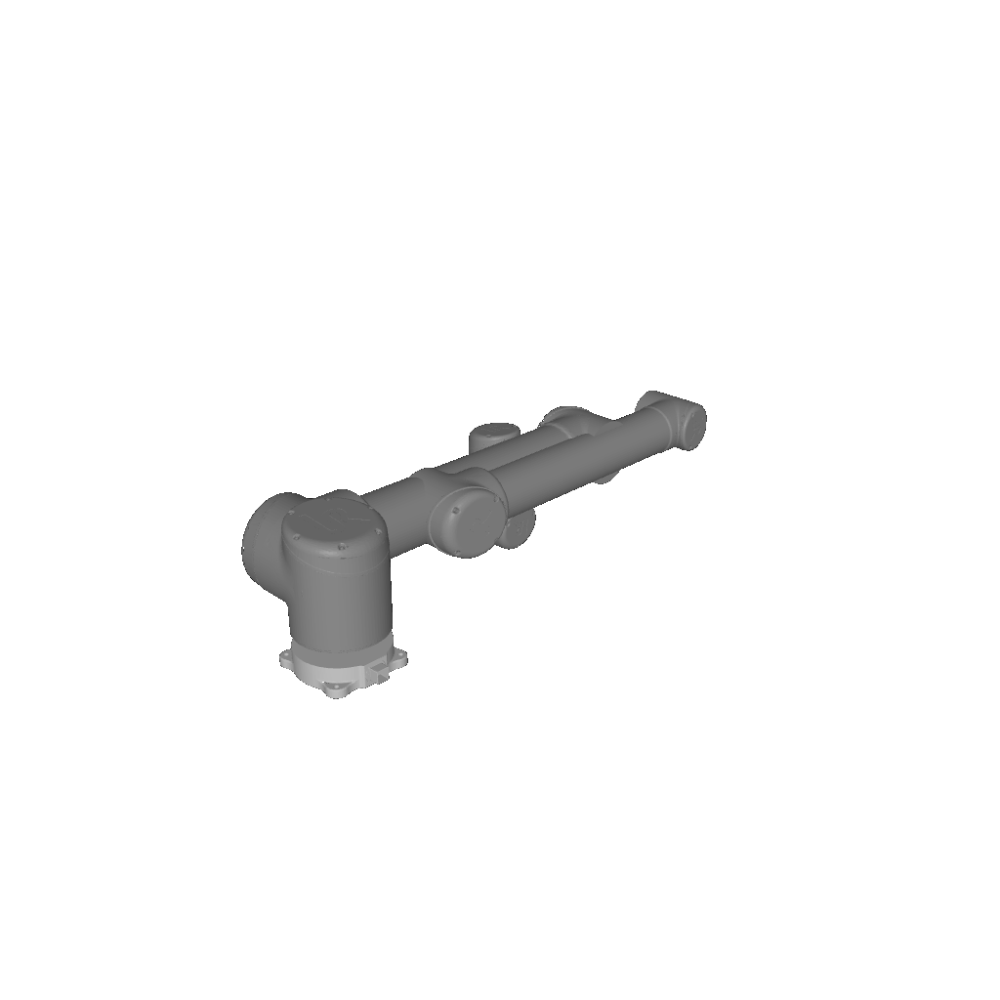</a><br>[front](mujoco/images/matlab/ur_e_description/universalUR3e/front.png) · [side](mujoco/images/matlab/ur_e_description/universalUR3e/side.png) · [top](mujoco/images/matlab/ur_e_description/universalUR3e/top.png) | <a href="pybullet/images/matlab/ur_e_description/universalUR3e/iso.png">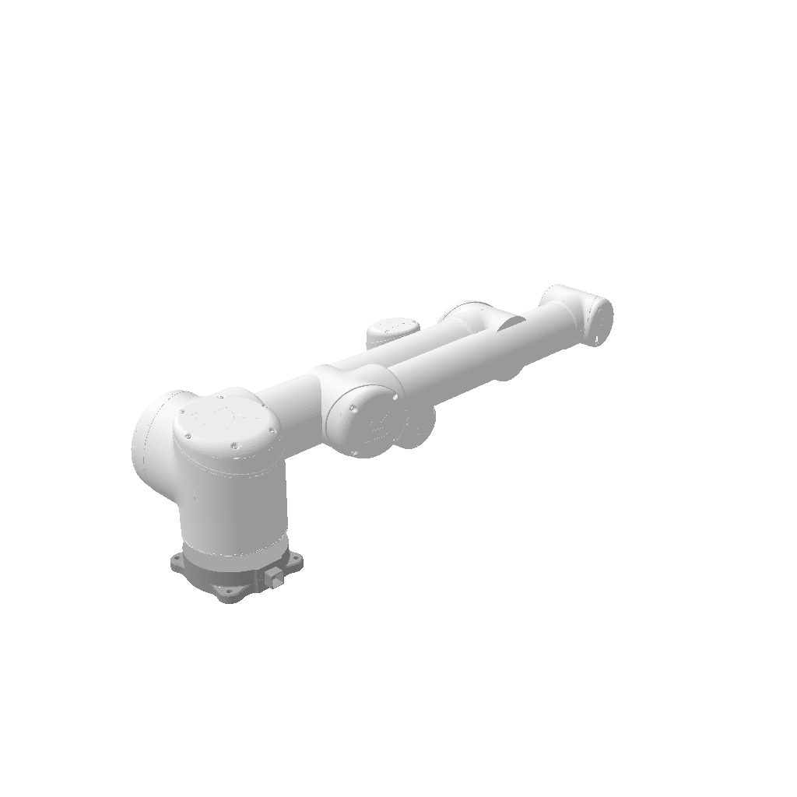</a><br>[front](pybullet/images/matlab/ur_e_description/universalUR3e/front.png) · [side](pybullet/images/matlab/ur_e_description/universalUR3e/side.png) · [top](pybullet/images/matlab/ur_e_description/universalUR3e/top.png) |
| universalUR5e | MATLAB Robotics | Universal Robots | <a href="mujoco/images/matlab/ur_e_description/universalUR5e/iso.png">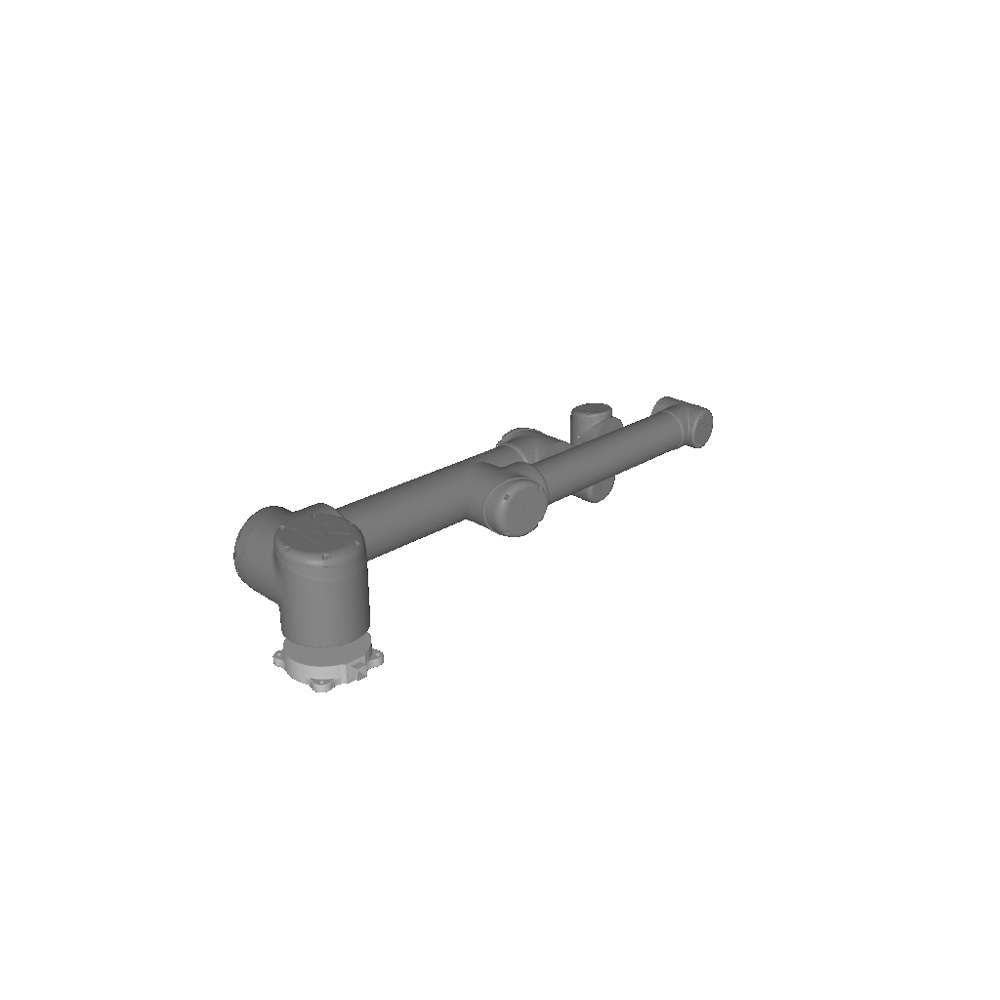</a><br>[front](mujoco/images/matlab/ur_e_description/universalUR5e/front.png) · [side](mujoco/images/matlab/ur_e_description/universalUR5e/side.png) · [top](mujoco/images/matlab/ur_e_description/universalUR5e/top.png) | <a href="pybullet/images/matlab/ur_e_description/universalUR5e/iso.png"></a><br>[front](pybullet/images/matlab/ur_e_description/universalUR5e/front.png) · [side](pybullet/images/matlab/ur_e_description/universalUR5e/side.png) · [top](pybullet/images/matlab/ur_e_description/universalUR5e/top.png) |
| yaskawaMotomanMH5 | MATLAB Robotics | Yaskawa | <a href="mujoco/images/matlab/motoman_mh5_support/yaskawaMotomanMH5/iso.png">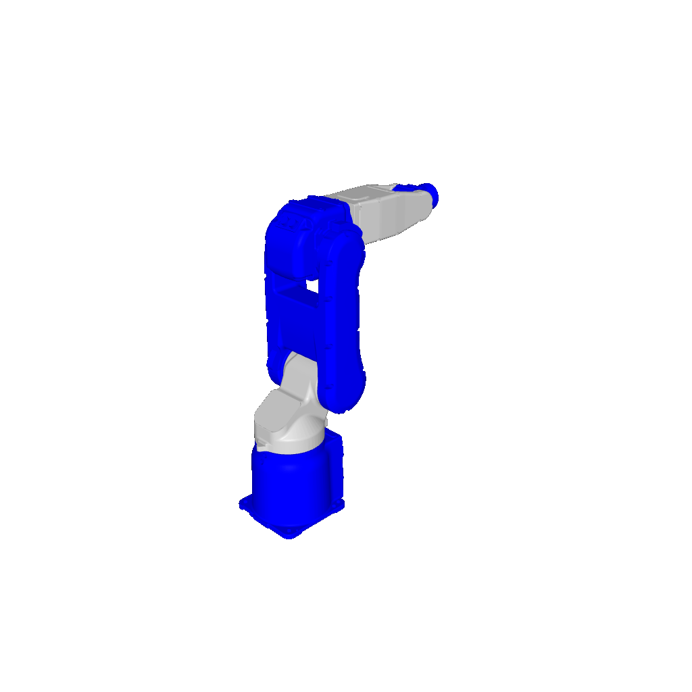</a><br>[front](mujoco/images/matlab/motoman_mh5_support/yaskawaMotomanMH5/front.png) · [side](mujoco/images/matlab/motoman_mh5_support/yaskawaMotomanMH5/side.png) · [top](mujoco/images/matlab/motoman_mh5_support/yaskawaMotomanMH5/top.png) | <a href="pybullet/images/matlab/motoman_mh5_support/yaskawaMotomanMH5/iso.png">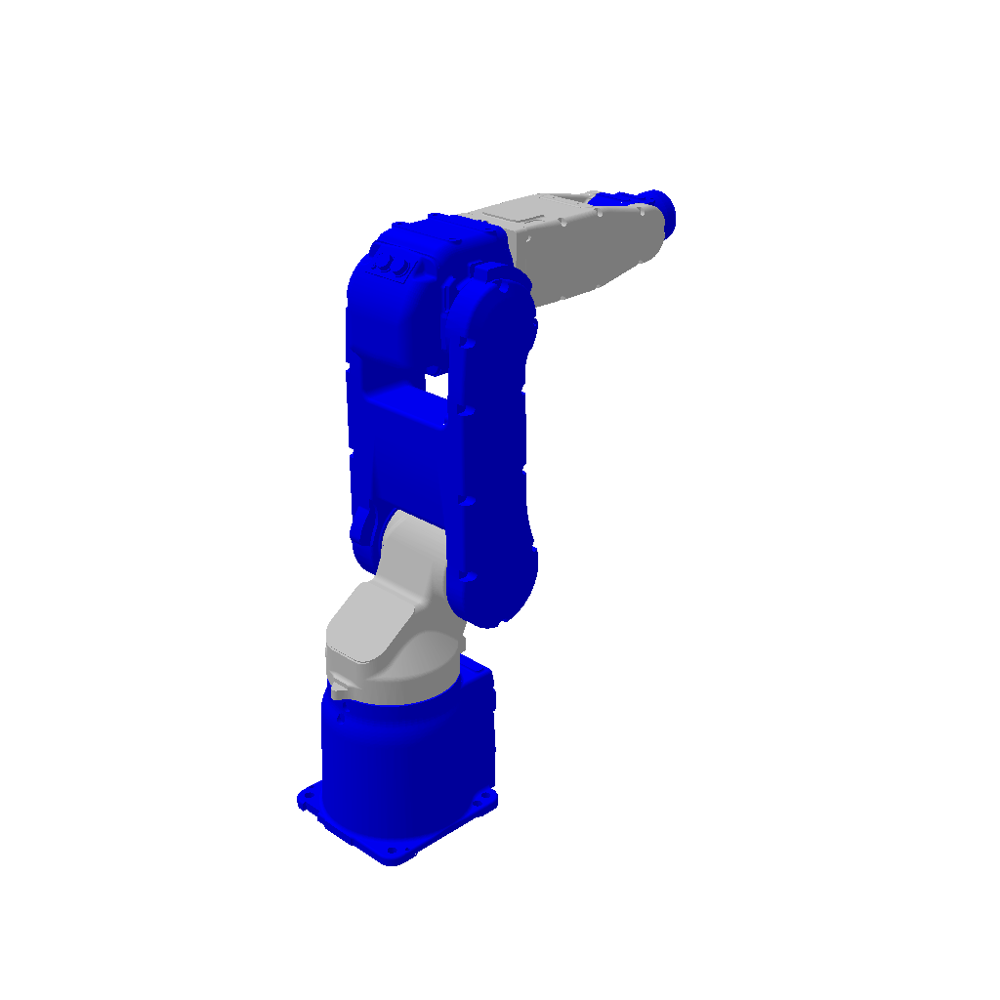</a><br>[front](pybullet/images/matlab/motoman_mh5_support/yaskawaMotomanMH5/front.png) · [side](pybullet/images/matlab/motoman_mh5_support/yaskawaMotomanMH5/side.png) · [top](pybullet/images/matlab/motoman_mh5_support/yaskawaMotomanMH5/top.png) |
| frankie | Robotics Toolbox | Franka Emika | <a href="mujoco/images/robotics-toolbox/xacro_generated/franka_description/robots/frankie/iso.png">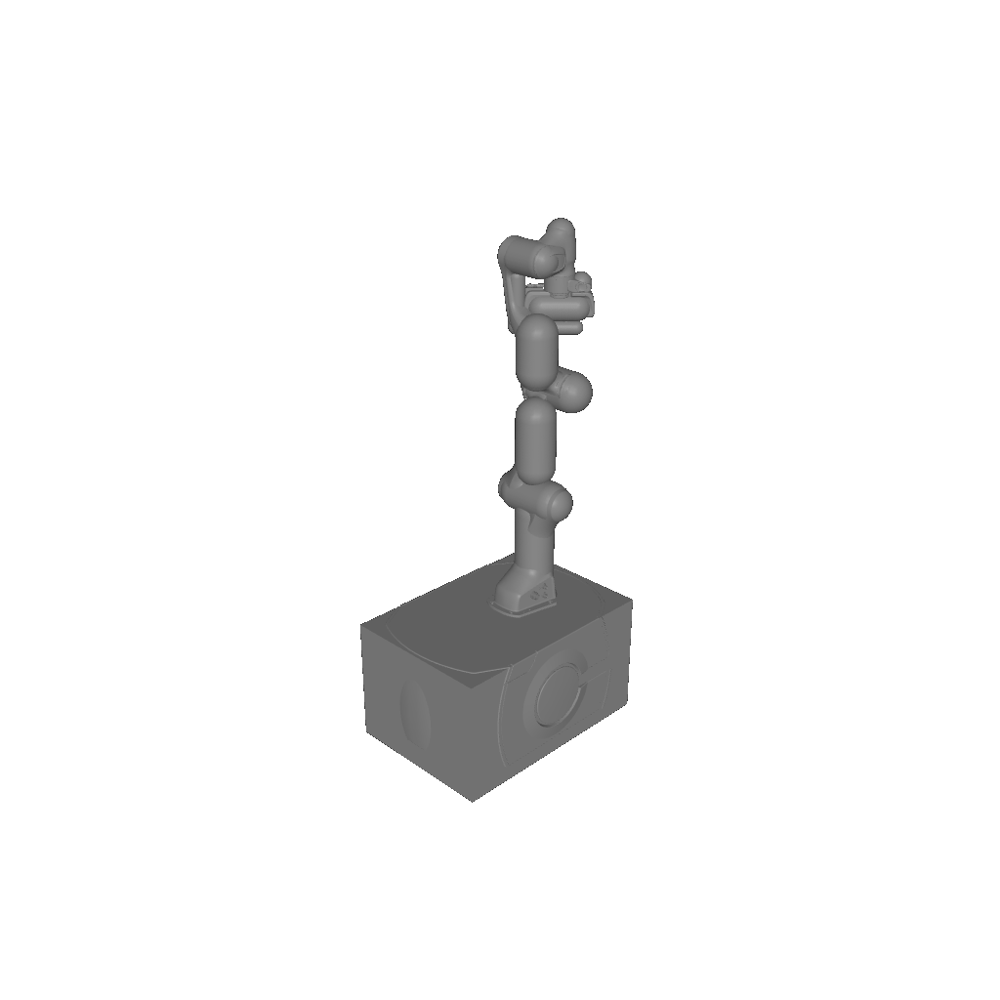</a><br>[front](mujoco/images/robotics-toolbox/xacro_generated/franka_description/robots/frankie/front.png) · [side](mujoco/images/robotics-toolbox/xacro_generated/franka_description/robots/frankie/side.png) · [top](mujoco/images/robotics-toolbox/xacro_generated/franka_description/robots/frankie/top.png) | <a href="pybullet/images/robotics-toolbox/xacro_generated/franka_description/robots/frankie/iso.png">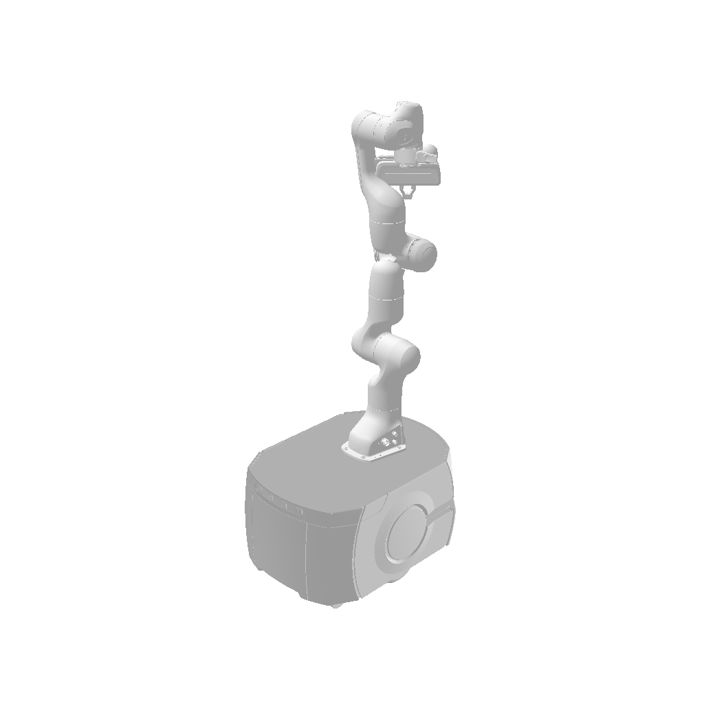</a><br>[front](pybullet/images/robotics-toolbox/xacro_generated/franka_description/robots/frankie/front.png) · [side](pybullet/images/robotics-toolbox/xacro_generated/franka_description/robots/frankie/side.png) · [top](pybullet/images/robotics-toolbox/xacro_generated/franka_description/robots/frankie/top.png) |
| panda | Robotics Toolbox | Franka Emika | <a href="mujoco/images/robotics-toolbox/xacro_generated/franka_description/robots/panda/iso.png">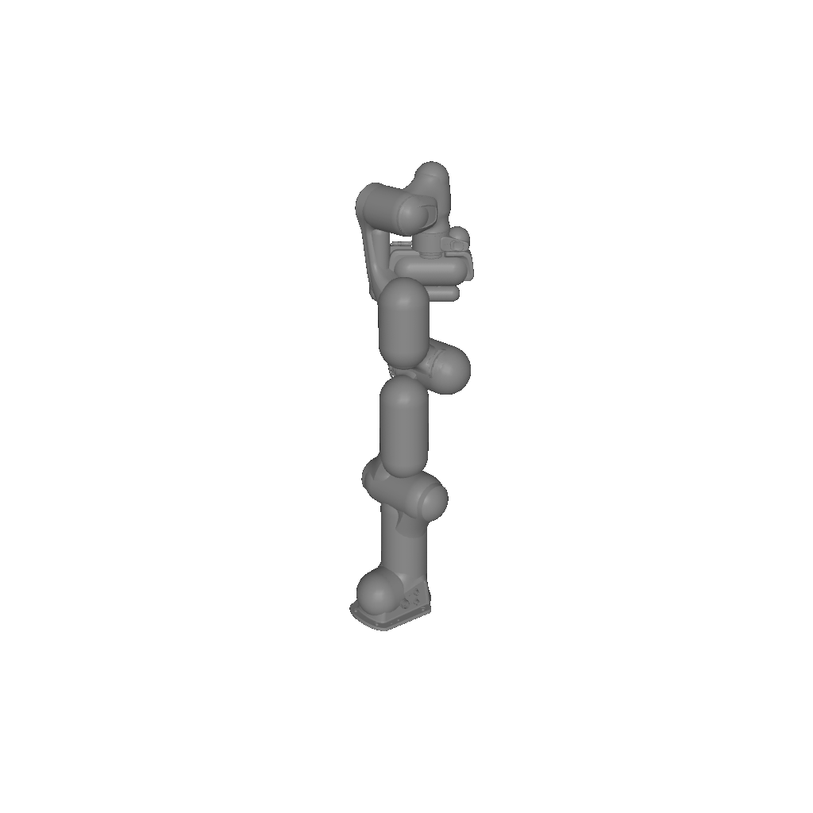</a><br>[front](mujoco/images/robotics-toolbox/xacro_generated/franka_description/robots/panda/front.png) · [side](mujoco/images/robotics-toolbox/xacro_generated/franka_description/robots/panda/side.png) · [top](mujoco/images/robotics-toolbox/xacro_generated/franka_description/robots/panda/top.png) | <a href="pybullet/images/robotics-toolbox/xacro_generated/franka_description/robots/panda/iso.png">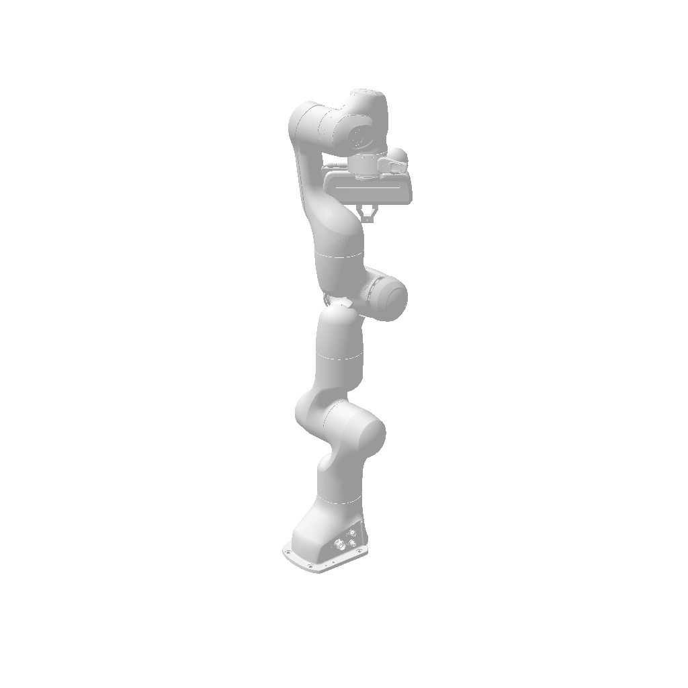</a><br>[front](pybullet/images/robotics-toolbox/xacro_generated/franka_description/robots/panda/front.png) · [side](pybullet/images/robotics-toolbox/xacro_generated/franka_description/robots/panda/side.png) · [top](pybullet/images/robotics-toolbox/xacro_generated/franka_description/robots/panda/top.png) |
| al5d_<wbr>robot | Robotics Toolbox | Lynxmotion | <a href="mujoco/images/robotics-toolbox/al5d_description/al5d_robot/iso.png">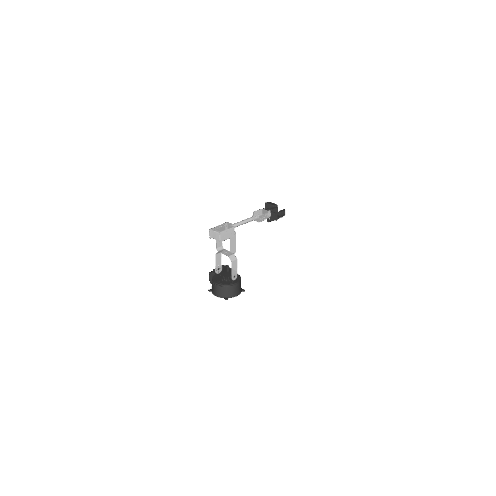</a><br>[front](mujoco/images/robotics-toolbox/al5d_description/al5d_robot/front.png) · [side](mujoco/images/robotics-toolbox/al5d_description/al5d_robot/side.png) · [top](mujoco/images/robotics-toolbox/al5d_description/al5d_robot/top.png) | <a href="pybullet/images/robotics-toolbox/al5d_description/al5d_robot/iso.png">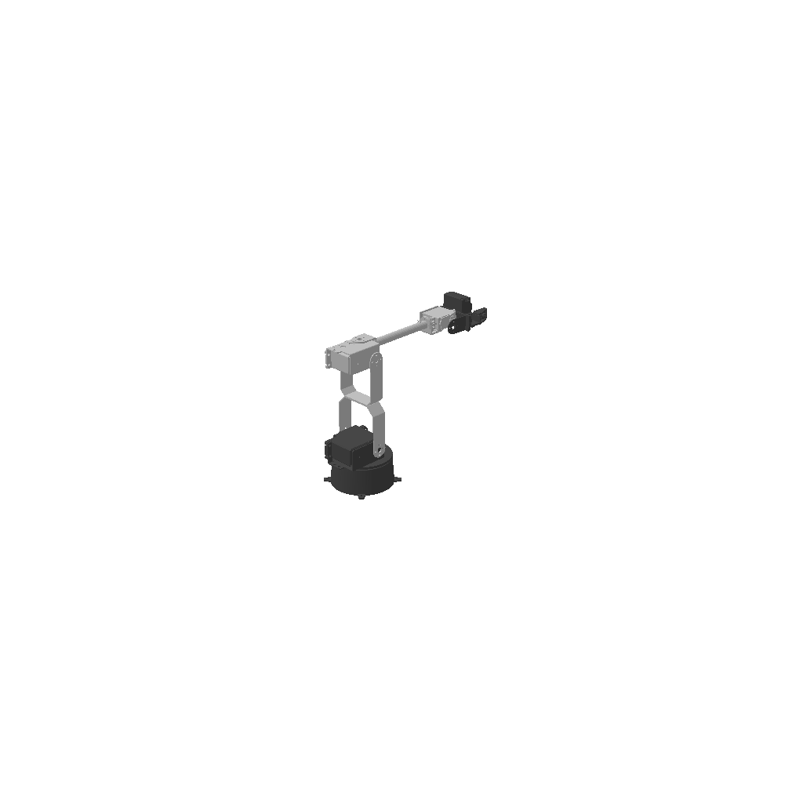</a><br>[front](pybullet/images/robotics-toolbox/al5d_description/al5d_robot/front.png) · [side](pybullet/images/robotics-toolbox/al5d_description/al5d_robot/side.png) · [top](pybullet/images/robotics-toolbox/al5d_description/al5d_robot/top.png) |
| px100 | Robotics Toolbox | Trossen Robotics / Interbotix | <a href="mujoco/images/robotics-toolbox/xacro_generated/interbotix_descriptions/px100/iso.png">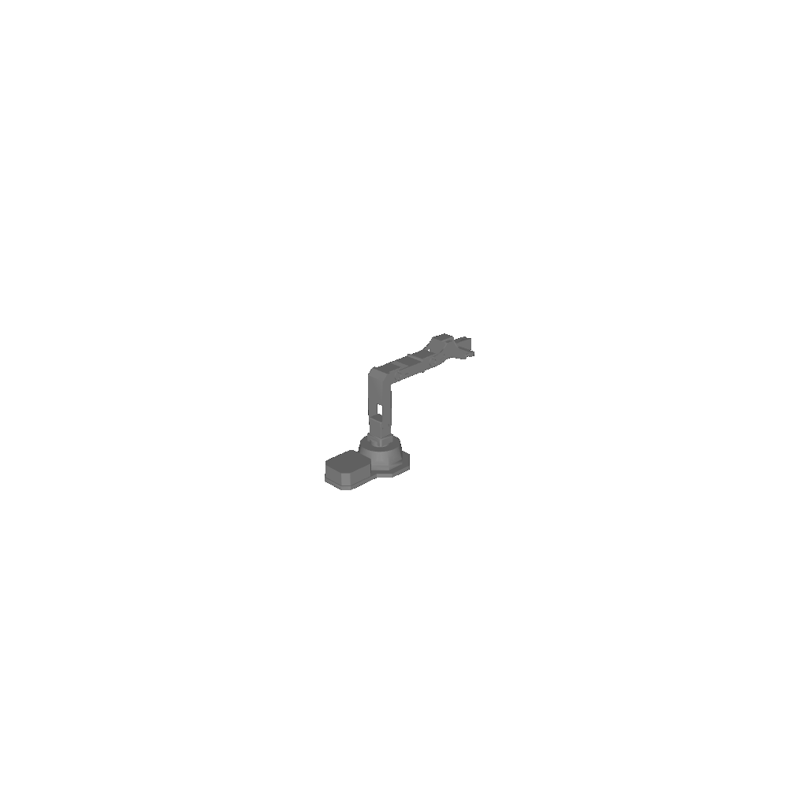</a><br>[front](mujoco/images/robotics-toolbox/xacro_generated/interbotix_descriptions/px100/front.png) · [side](mujoco/images/robotics-toolbox/xacro_generated/interbotix_descriptions/px100/side.png) · [top](mujoco/images/robotics-toolbox/xacro_generated/interbotix_descriptions/px100/top.png) | <a href="pybullet/images/robotics-toolbox/xacro_generated/interbotix_descriptions/px100/iso.png">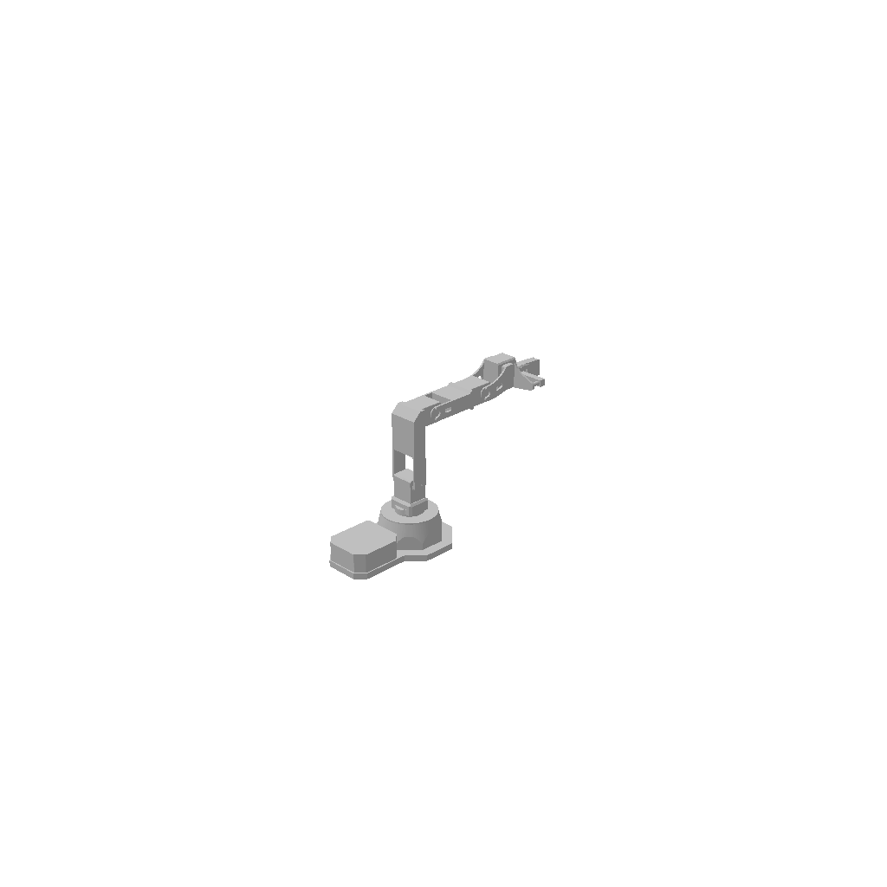</a><br>[front](pybullet/images/robotics-toolbox/xacro_generated/interbotix_descriptions/px100/front.png) · [side](pybullet/images/robotics-toolbox/xacro_generated/interbotix_descriptions/px100/side.png) · [top](pybullet/images/robotics-toolbox/xacro_generated/interbotix_descriptions/px100/top.png) |
| px150 | Robotics Toolbox | Trossen Robotics / Interbotix | <a href="mujoco/images/robotics-toolbox/xacro_generated/interbotix_descriptions/px150/iso.png">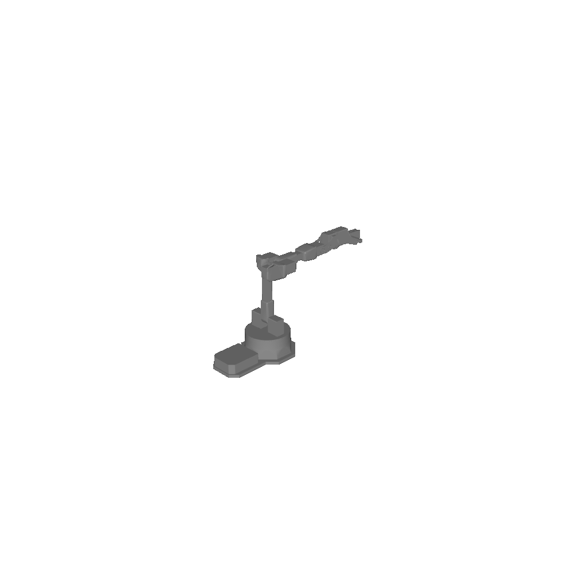</a><br>[front](mujoco/images/robotics-toolbox/xacro_generated/interbotix_descriptions/px150/front.png) · [side](mujoco/images/robotics-toolbox/xacro_generated/interbotix_descriptions/px150/side.png) · [top](mujoco/images/robotics-toolbox/xacro_generated/interbotix_descriptions/px150/top.png) | <a href="pybullet/images/robotics-toolbox/xacro_generated/interbotix_descriptions/px150/iso.png"></a><br>[front](pybullet/images/robotics-toolbox/xacro_generated/interbotix_descriptions/px150/front.png) · [side](pybullet/images/robotics-toolbox/xacro_generated/interbotix_descriptions/px150/side.png) · [top](pybullet/images/robotics-toolbox/xacro_generated/interbotix_descriptions/px150/top.png) |
| rx150 | Robotics Toolbox | Trossen Robotics / Interbotix | <a href="mujoco/images/robotics-toolbox/xacro_generated/interbotix_descriptions/rx150/iso.png">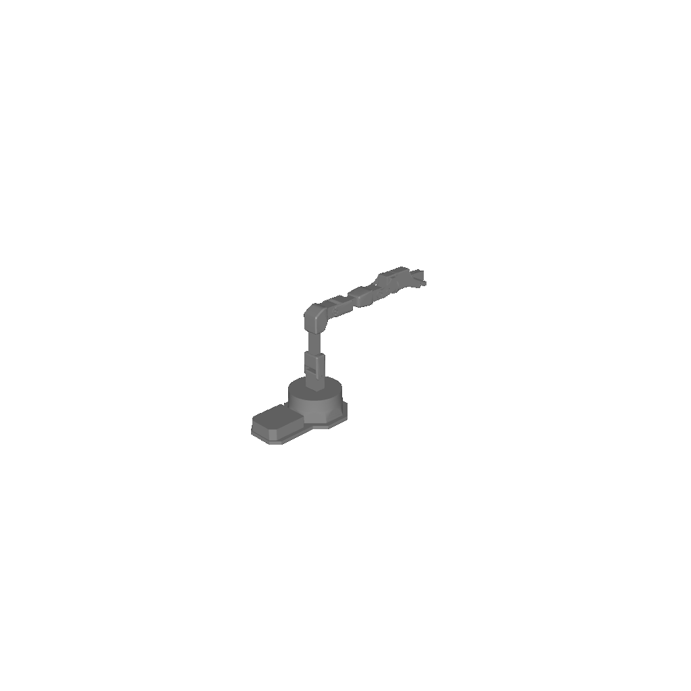</a><br>[front](mujoco/images/robotics-toolbox/xacro_generated/interbotix_descriptions/rx150/front.png) · [side](mujoco/images/robotics-toolbox/xacro_generated/interbotix_descriptions/rx150/side.png) · [top](mujoco/images/robotics-toolbox/xacro_generated/interbotix_descriptions/rx150/top.png) | <a href="pybullet/images/robotics-toolbox/xacro_generated/interbotix_descriptions/rx150/iso.png">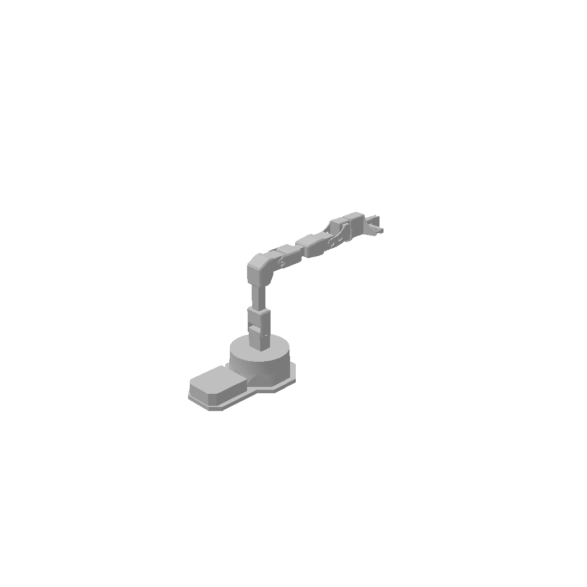</a><br>[front](pybullet/images/robotics-toolbox/xacro_generated/interbotix_descriptions/rx150/front.png) · [side](pybullet/images/robotics-toolbox/xacro_generated/interbotix_descriptions/rx150/side.png) · [top](pybullet/images/robotics-toolbox/xacro_generated/interbotix_descriptions/rx150/top.png) |
| rx200 | Robotics Toolbox | Trossen Robotics / Interbotix | <a href="mujoco/images/robotics-toolbox/xacro_generated/interbotix_descriptions/rx200/iso.png">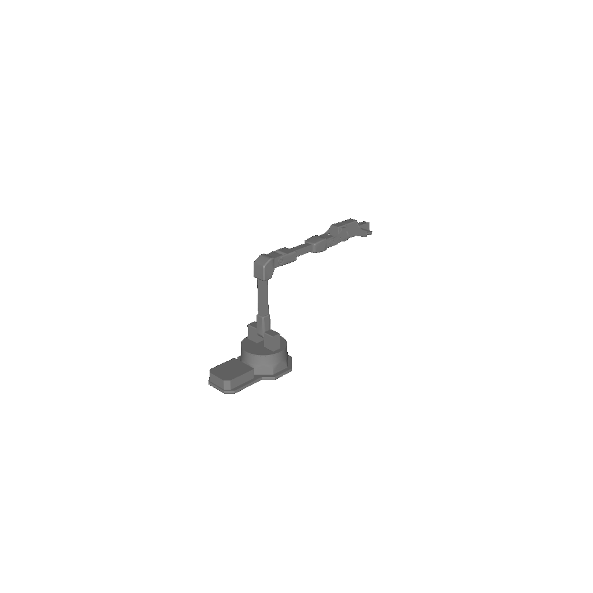</a><br>[front](mujoco/images/robotics-toolbox/xacro_generated/interbotix_descriptions/rx200/front.png) · [side](mujoco/images/robotics-toolbox/xacro_generated/interbotix_descriptions/rx200/side.png) · [top](mujoco/images/robotics-toolbox/xacro_generated/interbotix_descriptions/rx200/top.png) | <a href="pybullet/images/robotics-toolbox/xacro_generated/interbotix_descriptions/rx200/iso.png">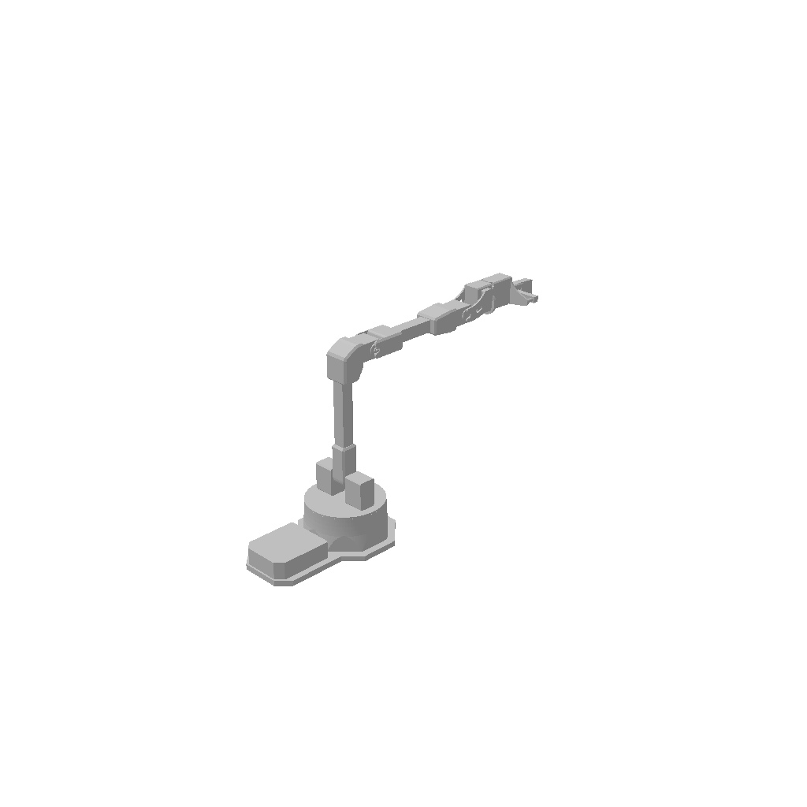</a><br>[front](pybullet/images/robotics-toolbox/xacro_generated/interbotix_descriptions/rx200/front.png) · [side](pybullet/images/robotics-toolbox/xacro_generated/interbotix_descriptions/rx200/side.png) · [top](pybullet/images/robotics-toolbox/xacro_generated/interbotix_descriptions/rx200/top.png) |
| vx300 | Robotics Toolbox | Trossen Robotics / Interbotix | <a href="mujoco/images/robotics-toolbox/xacro_generated/interbotix_descriptions/vx300/iso.png"></a><br>[front](mujoco/images/robotics-toolbox/xacro_generated/interbotix_descriptions/vx300/front.png) · [side](mujoco/images/robotics-toolbox/xacro_generated/interbotix_descriptions/vx300/side.png) · [top](mujoco/images/robotics-toolbox/xacro_generated/interbotix_descriptions/vx300/top.png) | <a href="pybullet/images/robotics-toolbox/xacro_generated/interbotix_descriptions/vx300/iso.png">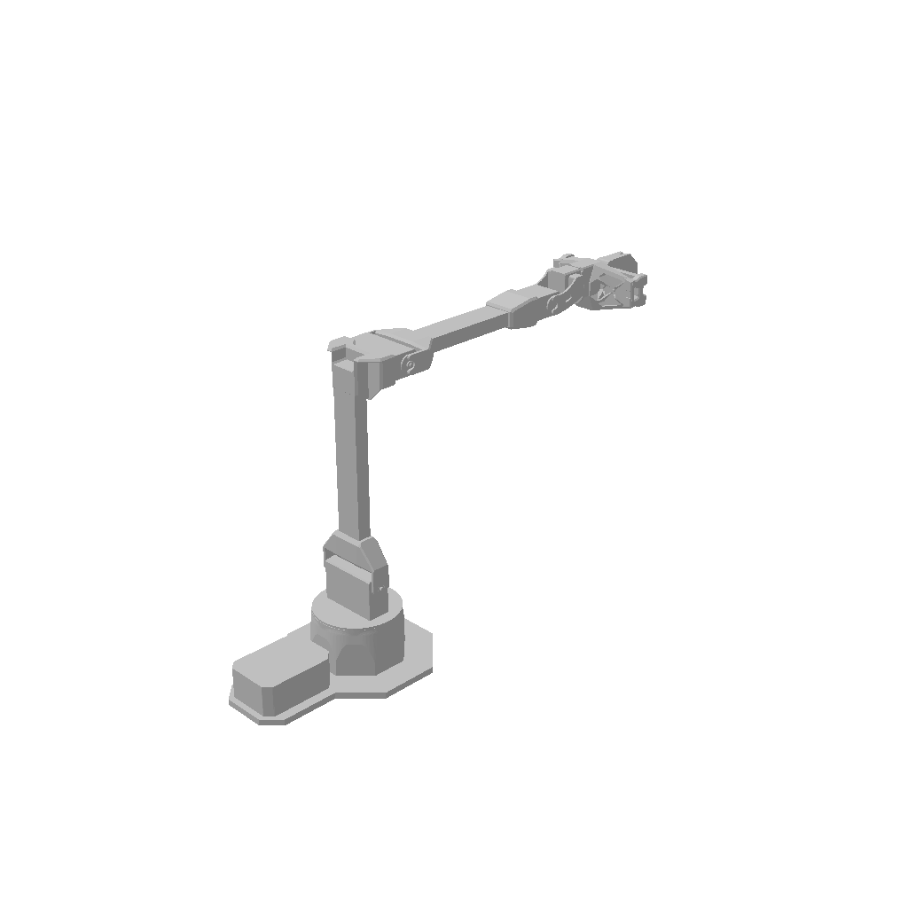</a><br>[front](pybullet/images/robotics-toolbox/xacro_generated/interbotix_descriptions/vx300/front.png) · [side](pybullet/images/robotics-toolbox/xacro_generated/interbotix_descriptions/vx300/side.png) · [top](pybullet/images/robotics-toolbox/xacro_generated/interbotix_descriptions/vx300/top.png) |
| vx300s | Robotics Toolbox | Trossen Robotics / Interbotix | <a href="mujoco/images/robotics-toolbox/xacro_generated/interbotix_descriptions/vx300s/iso.png">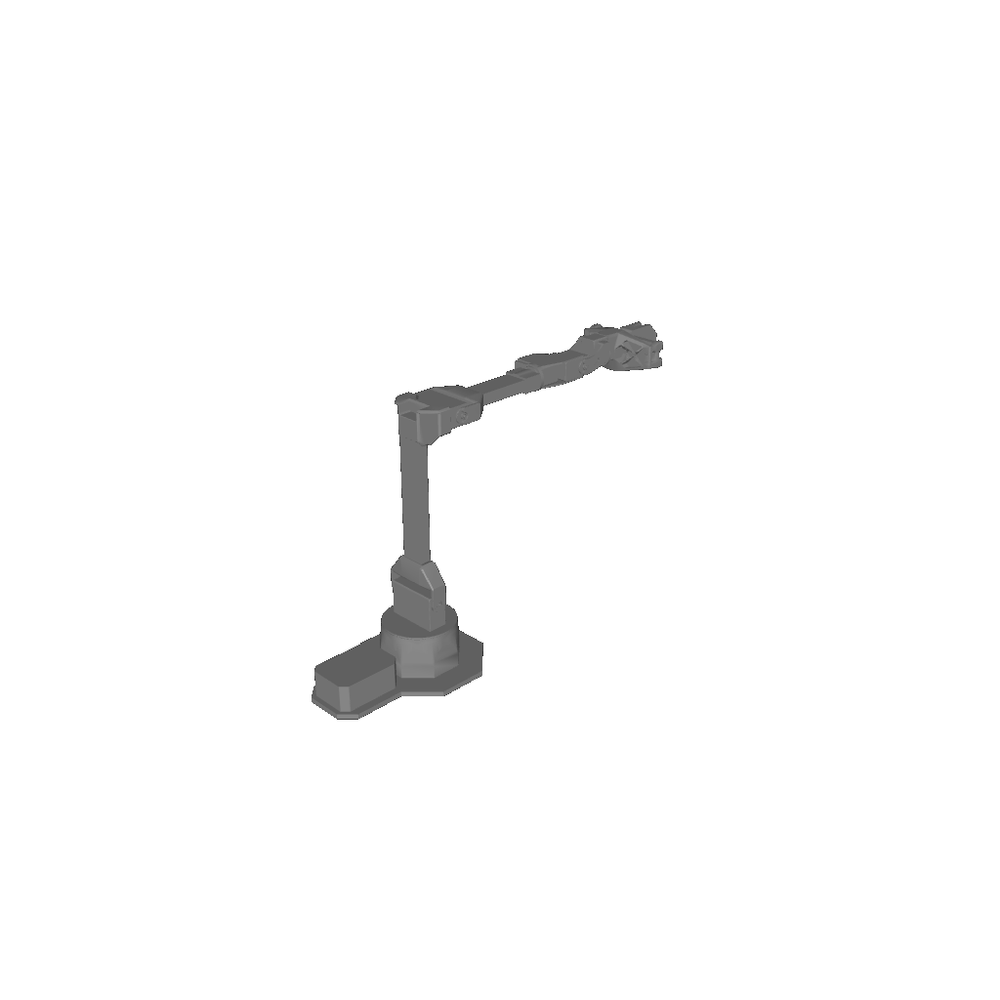</a><br>[front](mujoco/images/robotics-toolbox/xacro_generated/interbotix_descriptions/vx300s/front.png) · [side](mujoco/images/robotics-toolbox/xacro_generated/interbotix_descriptions/vx300s/side.png) · [top](mujoco/images/robotics-toolbox/xacro_generated/interbotix_descriptions/vx300s/top.png) | <a href="pybullet/images/robotics-toolbox/xacro_generated/interbotix_descriptions/vx300s/iso.png">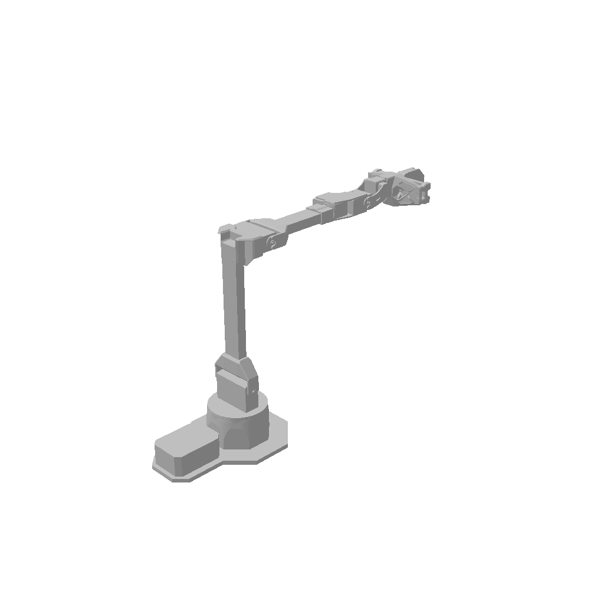</a><br>[front](pybullet/images/robotics-toolbox/xacro_generated/interbotix_descriptions/vx300s/front.png) · [side](pybullet/images/robotics-toolbox/xacro_generated/interbotix_descriptions/vx300s/side.png) · [top](pybullet/images/robotics-toolbox/xacro_generated/interbotix_descriptions/vx300s/top.png) |
| wx200 | Robotics Toolbox | Trossen Robotics / Interbotix | <a href="mujoco/images/robotics-toolbox/xacro_generated/interbotix_descriptions/wx200/iso.png">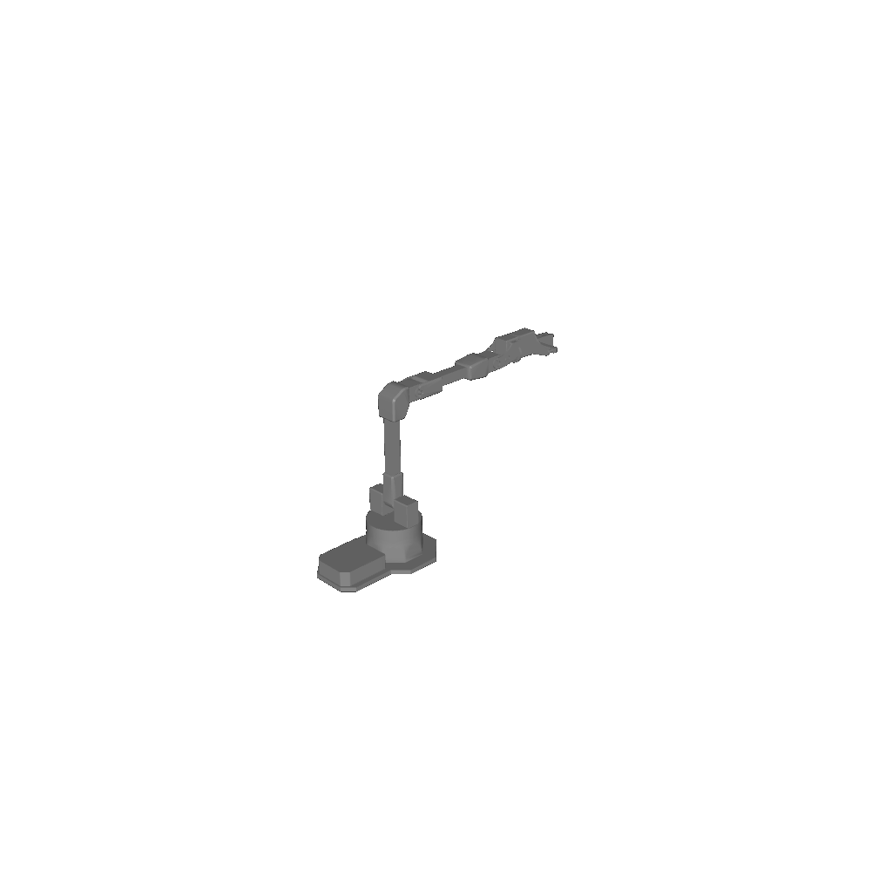</a><br>[front](mujoco/images/robotics-toolbox/xacro_generated/interbotix_descriptions/wx200/front.png) · [side](mujoco/images/robotics-toolbox/xacro_generated/interbotix_descriptions/wx200/side.png) · [top](mujoco/images/robotics-toolbox/xacro_generated/interbotix_descriptions/wx200/top.png) | <a href="pybullet/images/robotics-toolbox/xacro_generated/interbotix_descriptions/wx200/iso.png">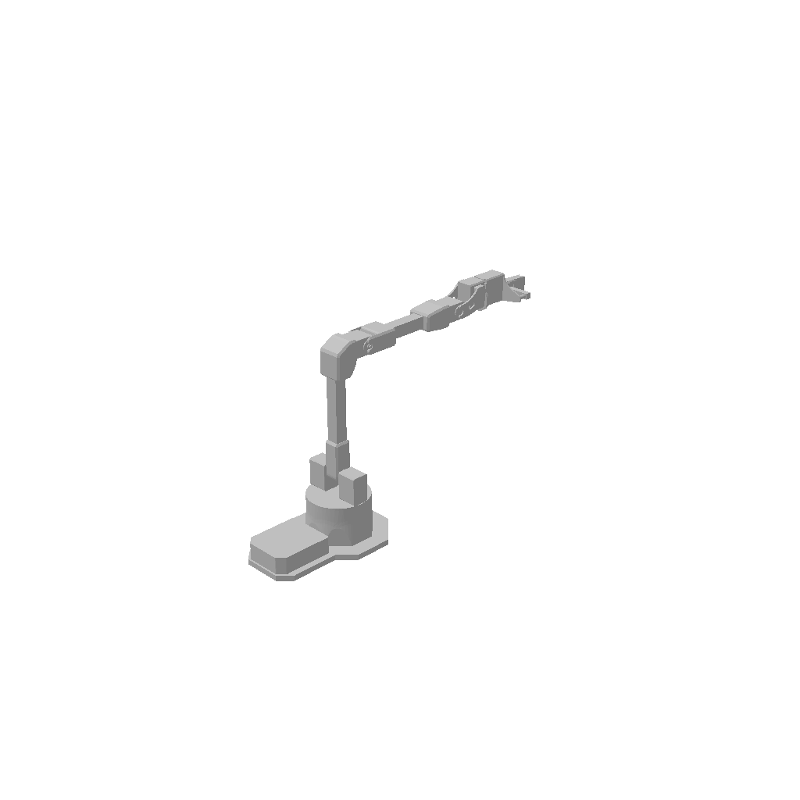</a><br>[front](pybullet/images/robotics-toolbox/xacro_generated/interbotix_descriptions/wx200/front.png) · [side](pybullet/images/robotics-toolbox/xacro_generated/interbotix_descriptions/wx200/side.png) · [top](pybullet/images/robotics-toolbox/xacro_generated/interbotix_descriptions/wx200/top.png) |
| wx250 | Robotics Toolbox | Trossen Robotics / Interbotix | <a href="mujoco/images/robotics-toolbox/xacro_generated/interbotix_descriptions/wx250/iso.png">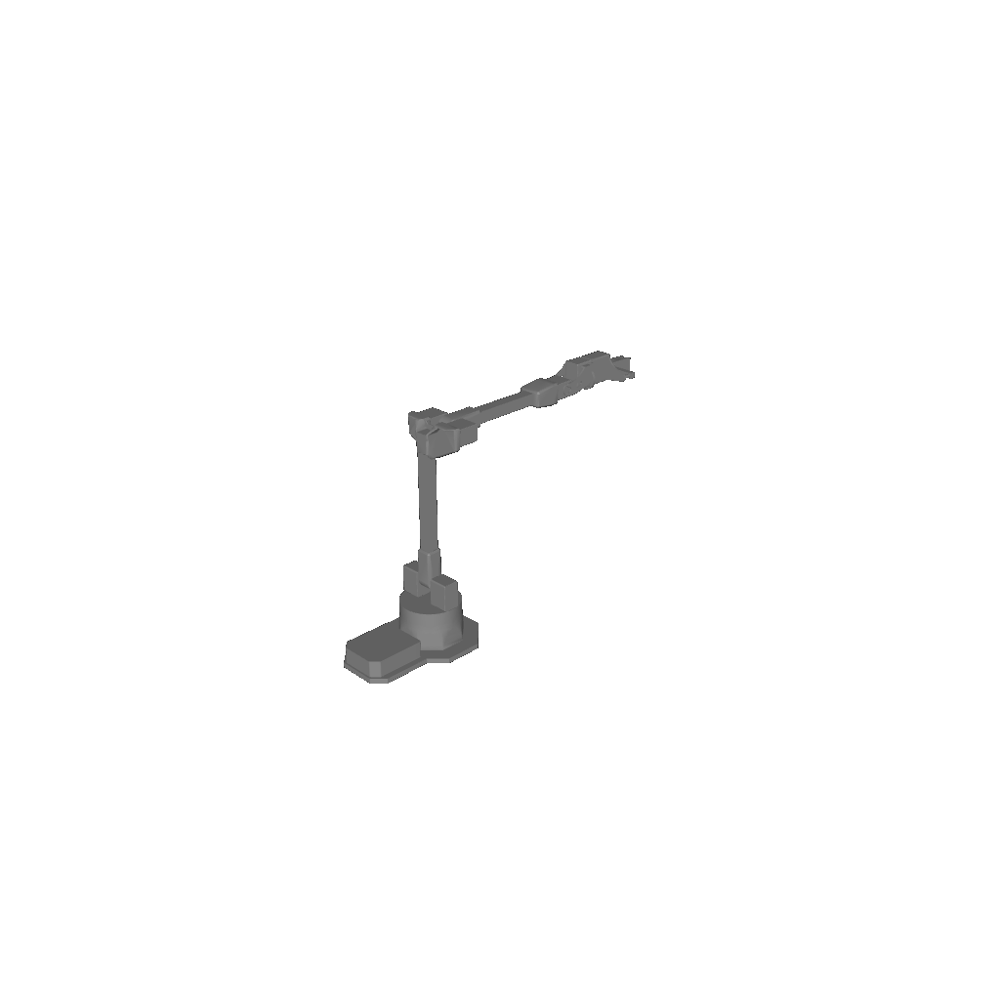</a><br>[front](mujoco/images/robotics-toolbox/xacro_generated/interbotix_descriptions/wx250/front.png) · [side](mujoco/images/robotics-toolbox/xacro_generated/interbotix_descriptions/wx250/side.png) · [top](mujoco/images/robotics-toolbox/xacro_generated/interbotix_descriptions/wx250/top.png) | <a href="pybullet/images/robotics-toolbox/xacro_generated/interbotix_descriptions/wx250/iso.png">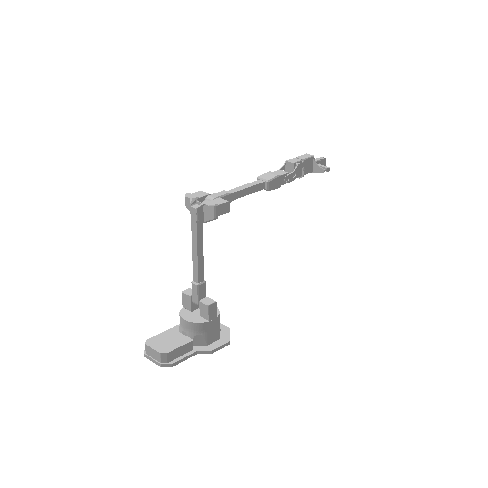</a><br>[front](pybullet/images/robotics-toolbox/xacro_generated/interbotix_descriptions/wx250/front.png) · [side](pybullet/images/robotics-toolbox/xacro_generated/interbotix_descriptions/wx250/side.png) · [top](pybullet/images/robotics-toolbox/xacro_generated/interbotix_descriptions/wx250/top.png) |
| wx250s | Robotics Toolbox | Trossen Robotics / Interbotix | <a href="mujoco/images/robotics-toolbox/xacro_generated/interbotix_descriptions/wx250s/iso.png">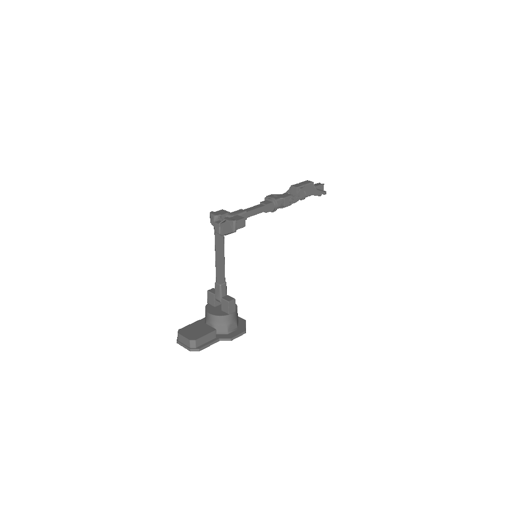</a><br>[front](mujoco/images/robotics-toolbox/xacro_generated/interbotix_descriptions/wx250s/front.png) · [side](mujoco/images/robotics-toolbox/xacro_generated/interbotix_descriptions/wx250s/side.png) · [top](mujoco/images/robotics-toolbox/xacro_generated/interbotix_descriptions/wx250s/top.png) | <a href="pybullet/images/robotics-toolbox/xacro_generated/interbotix_descriptions/wx250s/iso.png"></a><br>[front](pybullet/images/robotics-toolbox/xacro_generated/interbotix_descriptions/wx250s/front.png) · [side](pybullet/images/robotics-toolbox/xacro_generated/interbotix_descriptions/wx250s/side.png) · [top](pybullet/images/robotics-toolbox/xacro_generated/interbotix_descriptions/wx250s/top.png) |
| puma560_<wbr>robot | Robotics Toolbox | Unimation | <a href="mujoco/images/robotics-toolbox/puma560_description/puma560_robot/iso.png">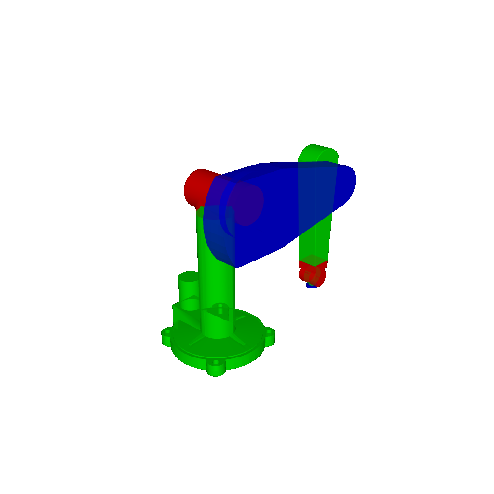</a><br>[front](mujoco/images/robotics-toolbox/puma560_description/puma560_robot/front.png) · [side](mujoco/images/robotics-toolbox/puma560_description/puma560_robot/side.png) · [top](mujoco/images/robotics-toolbox/puma560_description/puma560_robot/top.png) | <a href="pybullet/images/robotics-toolbox/puma560_description/puma560_robot/iso.png">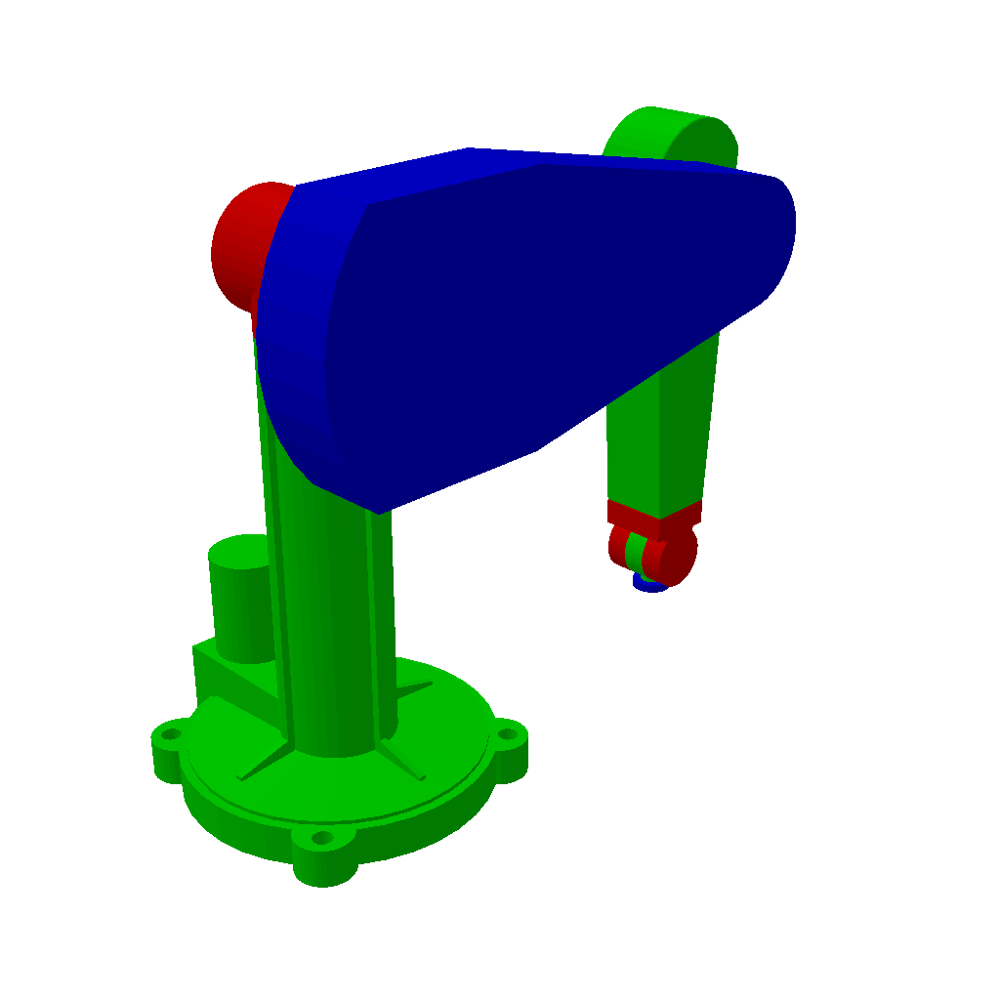</a><br>[front](pybullet/images/robotics-toolbox/puma560_description/puma560_robot/front.png) · [side](pybullet/images/robotics-toolbox/puma560_description/puma560_robot/side.png) · [top](pybullet/images/robotics-toolbox/puma560_description/puma560_robot/top.png) |
| iiwa14_<wbr>no_<wbr>collision | Drake | KUKA | <a href="mujoco/images/drake/iiwa_description/iiwa14_no_collision/iso.png"></a><br>[front](mujoco/images/drake/iiwa_description/iiwa14_no_collision/front.png) · [side](mujoco/images/drake/iiwa_description/iiwa14_no_collision/side.png) · [top](mujoco/images/drake/iiwa_description/iiwa14_no_collision/top.png) | <a href="pybullet/images/drake/iiwa_description/iiwa14_no_collision/iso.png">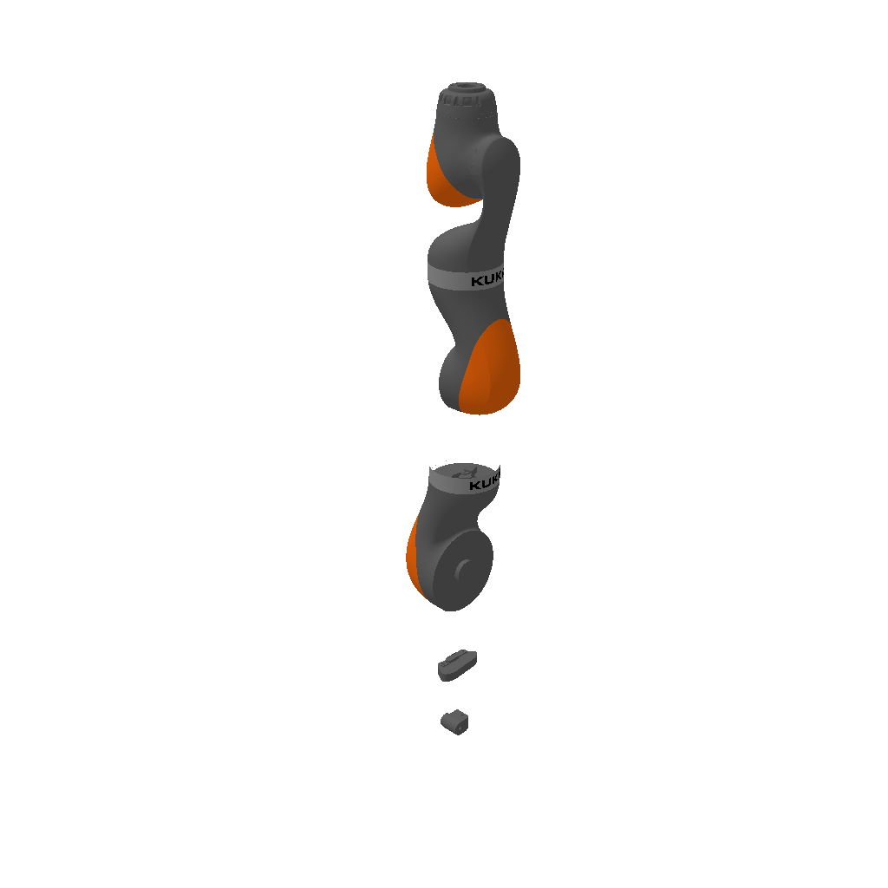</a><br>[front](pybullet/images/drake/iiwa_description/iiwa14_no_collision/front.png) · [side](pybullet/images/drake/iiwa_description/iiwa14_no_collision/side.png) · [top](pybullet/images/drake/iiwa_description/iiwa14_no_collision/top.png) |
| iiwa14_<wbr>polytope_<wbr>collision | Drake | KUKA | <a href="mujoco/images/drake/iiwa_description/iiwa14_polytope_collision/iso.png">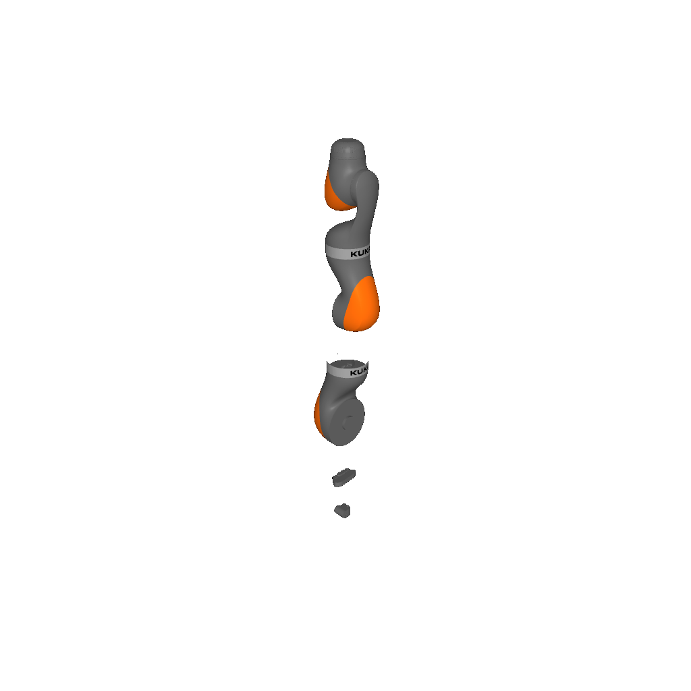</a><br>[front](mujoco/images/drake/iiwa_description/iiwa14_polytope_collision/front.png) · [side](mujoco/images/drake/iiwa_description/iiwa14_polytope_collision/side.png) · [top](mujoco/images/drake/iiwa_description/iiwa14_polytope_collision/top.png) | <a href="pybullet/images/drake/iiwa_description/iiwa14_polytope_collision/iso.png">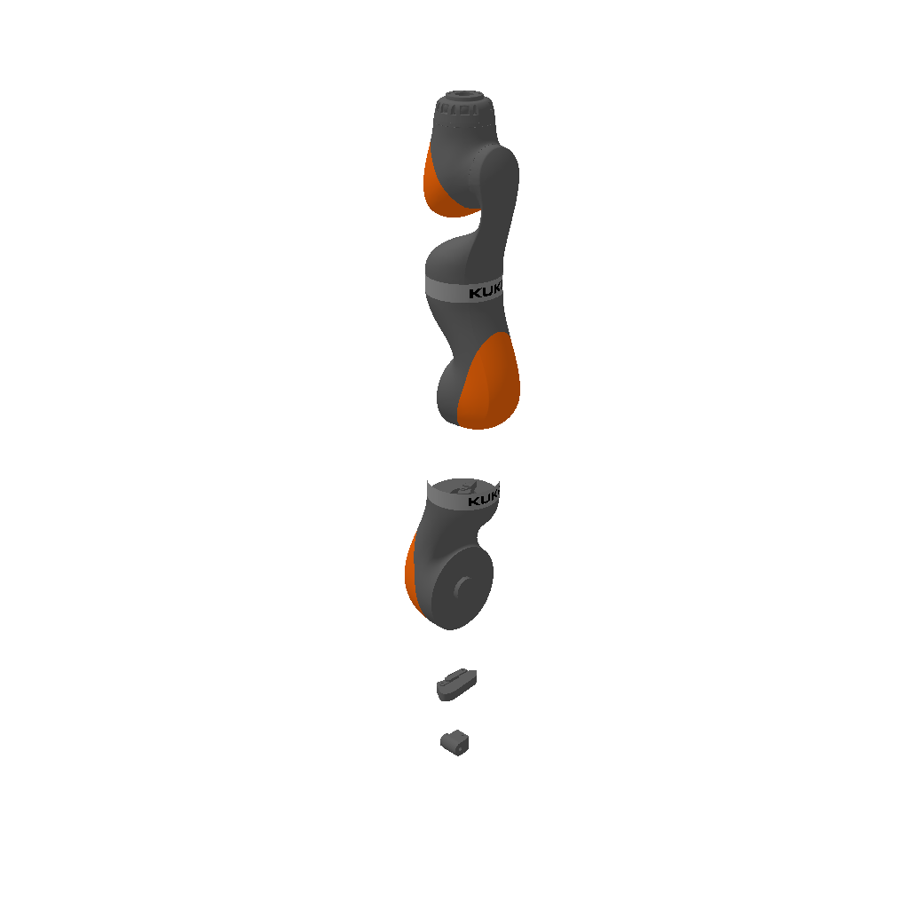</a><br>[front](pybullet/images/drake/iiwa_description/iiwa14_polytope_collision/front.png) · [side](pybullet/images/drake/iiwa_description/iiwa14_polytope_collision/side.png) · [top](pybullet/images/drake/iiwa_description/iiwa14_polytope_collision/top.png) |
| iiwa14_<wbr>primitive_<wbr>collision | Drake | KUKA | <a href="mujoco/images/drake/iiwa_description/iiwa14_primitive_collision/iso.png">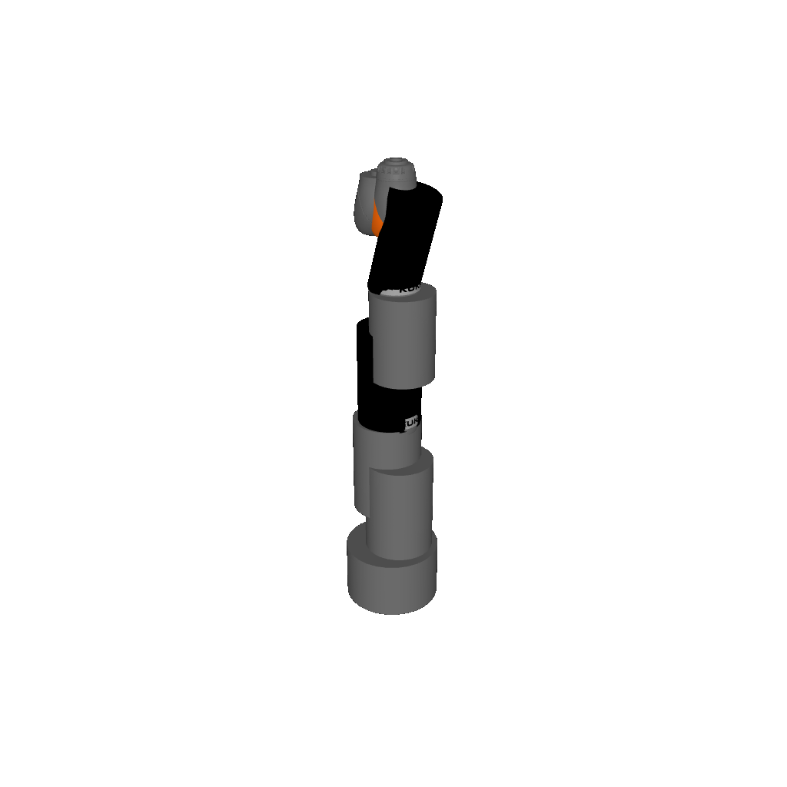</a><br>[front](mujoco/images/drake/iiwa_description/iiwa14_primitive_collision/front.png) · [side](mujoco/images/drake/iiwa_description/iiwa14_primitive_collision/side.png) · [top](mujoco/images/drake/iiwa_description/iiwa14_primitive_collision/top.png) | <a href="pybullet/images/drake/iiwa_description/iiwa14_primitive_collision/iso.png">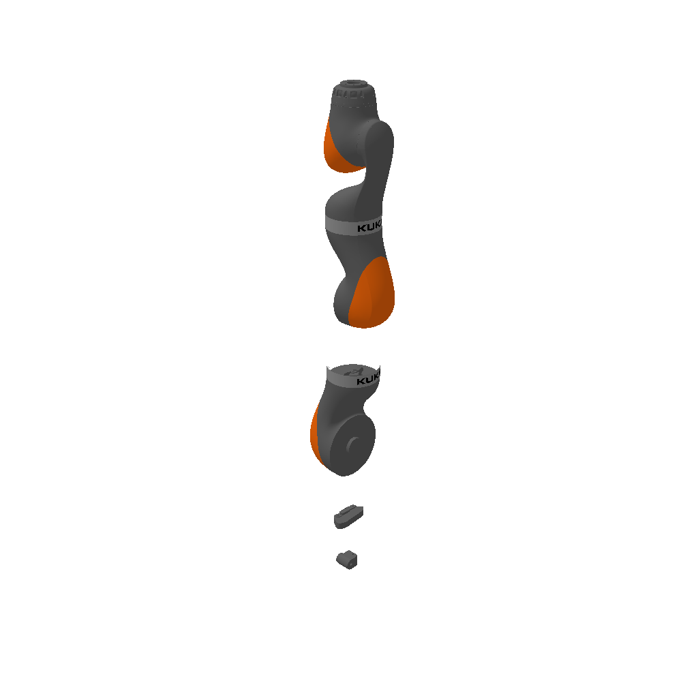</a><br>[front](pybullet/images/drake/iiwa_description/iiwa14_primitive_collision/front.png) · [side](pybullet/images/drake/iiwa_description/iiwa14_primitive_collision/side.png) · [top](pybullet/images/drake/iiwa_description/iiwa14_primitive_collision/top.png) |
| iiwa14_<wbr>spheres_<wbr>collision | Drake | KUKA | <a href="mujoco/images/drake/iiwa_description/iiwa14_spheres_collision/iso.png"></a><br>[front](mujoco/images/drake/iiwa_description/iiwa14_spheres_collision/front.png) · [side](mujoco/images/drake/iiwa_description/iiwa14_spheres_collision/side.png) · [top](mujoco/images/drake/iiwa_description/iiwa14_spheres_collision/top.png) | <a href="pybullet/images/drake/iiwa_description/iiwa14_spheres_collision/iso.png"></a><br>[front](pybullet/images/drake/iiwa_description/iiwa14_spheres_collision/front.png) · [side](pybullet/images/drake/iiwa_description/iiwa14_spheres_collision/side.png) · [top](pybullet/images/drake/iiwa_description/iiwa14_spheres_collision/top.png) |
| iiwa14_<wbr>spheres_<wbr>dense_<wbr>collision | Drake | KUKA | <a href="mujoco/images/drake/iiwa_description/iiwa14_spheres_dense_collision/iso.png">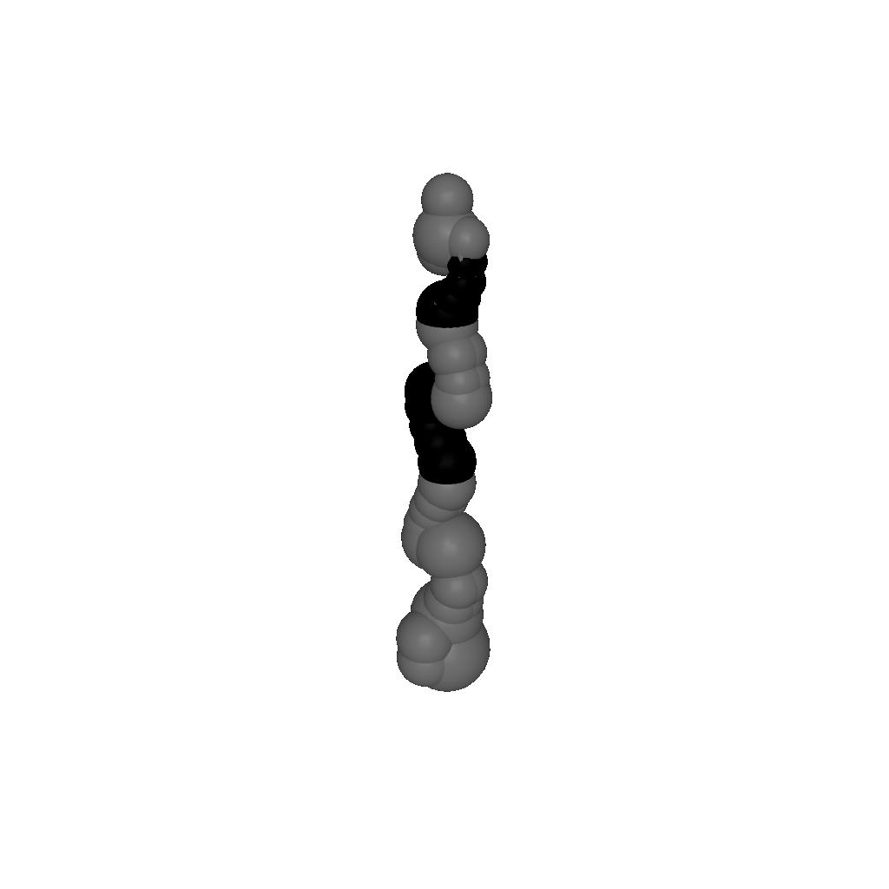</a><br>[front](mujoco/images/drake/iiwa_description/iiwa14_spheres_dense_collision/front.png) · [side](mujoco/images/drake/iiwa_description/iiwa14_spheres_dense_collision/side.png) · [top](mujoco/images/drake/iiwa_description/iiwa14_spheres_dense_collision/top.png) | <a href="pybullet/images/drake/iiwa_description/iiwa14_spheres_dense_collision/iso.png">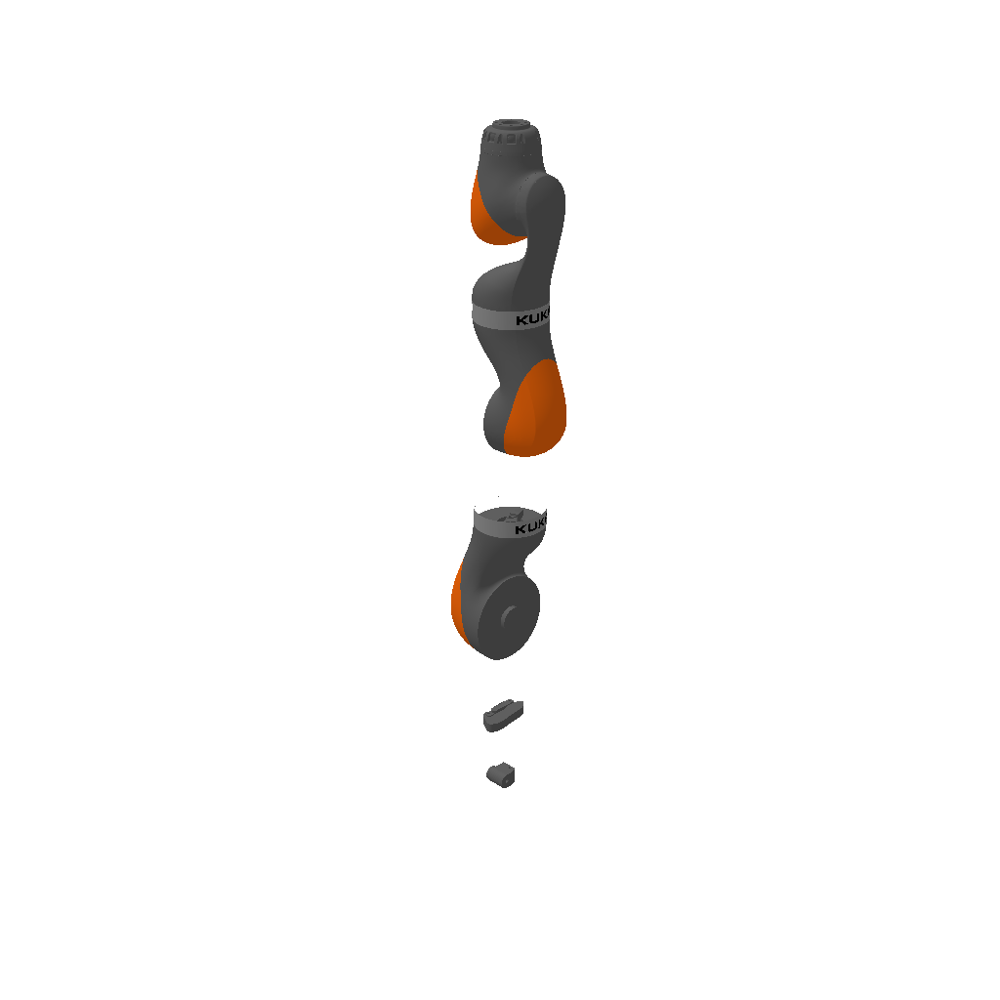</a><br>[front](pybullet/images/drake/iiwa_description/iiwa14_spheres_dense_collision/front.png) · [side](pybullet/images/drake/iiwa_description/iiwa14_spheres_dense_collision/side.png) · [top](pybullet/images/drake/iiwa_description/iiwa14_spheres_dense_collision/top.png) |
| iiwa14_<wbr>spheres_<wbr>dense_<wbr>elbow_<wbr>collision | Drake | KUKA | <a href="mujoco/images/drake/iiwa_description/iiwa14_spheres_dense_elbow_collision/iso.png"></a><br>[front](mujoco/images/drake/iiwa_description/iiwa14_spheres_dense_elbow_collision/front.png) · [side](mujoco/images/drake/iiwa_description/iiwa14_spheres_dense_elbow_collision/side.png) · [top](mujoco/images/drake/iiwa_description/iiwa14_spheres_dense_elbow_collision/top.png) | <a href="pybullet/images/drake/iiwa_description/iiwa14_spheres_dense_elbow_collision/iso.png"></a><br>[front](pybullet/images/drake/iiwa_description/iiwa14_spheres_dense_elbow_collision/front.png) · [side](pybullet/images/drake/iiwa_description/iiwa14_spheres_dense_elbow_collision/side.png) · [top](pybullet/images/drake/iiwa_description/iiwa14_spheres_dense_elbow_collision/top.png) |
| planar_<wbr>iiwa14_<wbr>spheres_<wbr>dense_<wbr>elbow_<wbr>collision | Drake | KUKA | <a href="mujoco/images/drake/iiwa_description/planar_iiwa14_spheres_dense_elbow_collision/iso.png">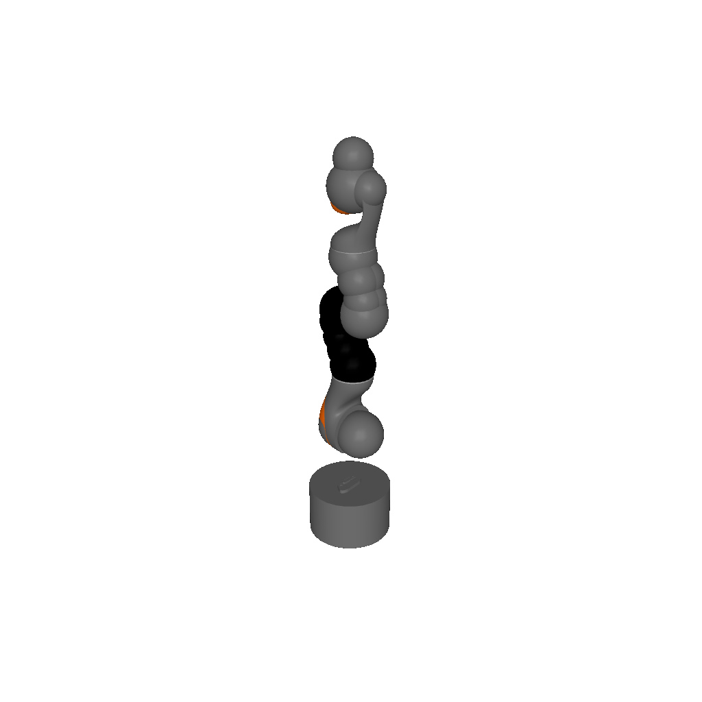</a><br>[front](mujoco/images/drake/iiwa_description/planar_iiwa14_spheres_dense_elbow_collision/front.png) · [side](mujoco/images/drake/iiwa_description/planar_iiwa14_spheres_dense_elbow_collision/side.png) · [top](mujoco/images/drake/iiwa_description/planar_iiwa14_spheres_dense_elbow_collision/top.png) | <a href="pybullet/images/drake/iiwa_description/planar_iiwa14_spheres_dense_elbow_collision/iso.png"></a><br>[front](pybullet/images/drake/iiwa_description/planar_iiwa14_spheres_dense_elbow_collision/front.png) · [side](pybullet/images/drake/iiwa_description/planar_iiwa14_spheres_dense_elbow_collision/side.png) · [top](pybullet/images/drake/iiwa_description/planar_iiwa14_spheres_dense_elbow_collision/top.png) |
| fr3 | Others | Franka Emika | <a href="mujoco/images/oems/xacro_generated/franka_emika/franka_description/robots/fr3/fr3/iso.png">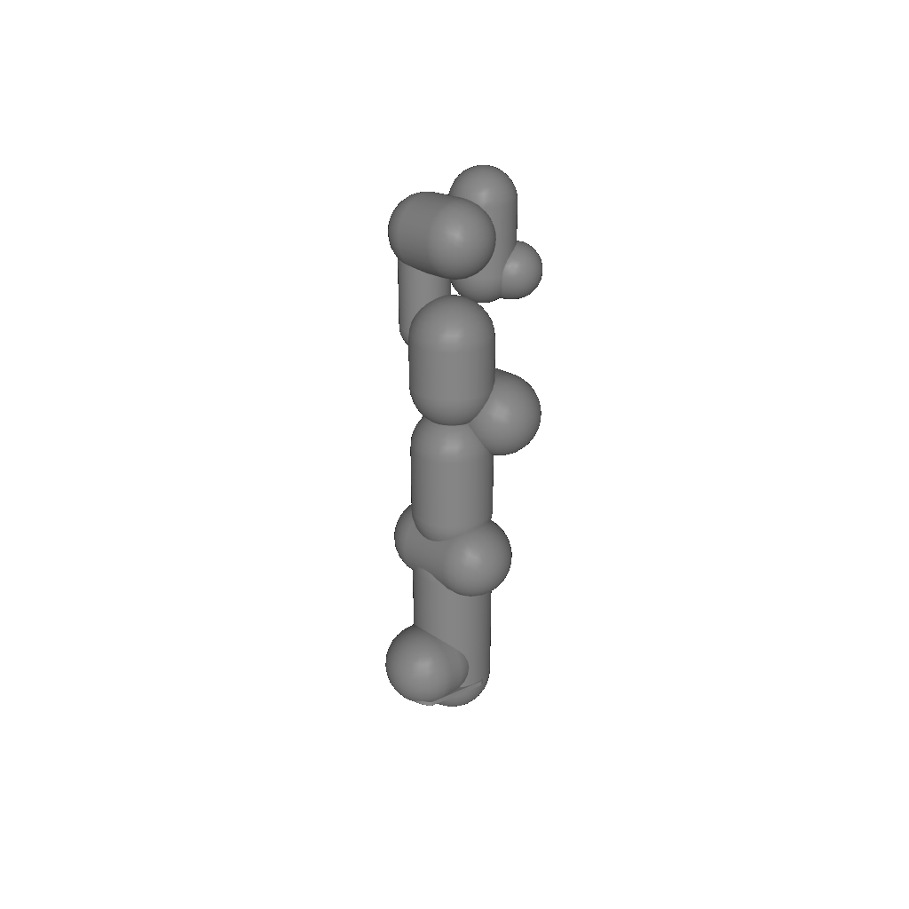</a><br>[front](mujoco/images/oems/xacro_generated/franka_emika/franka_description/robots/fr3/fr3/front.png) · [side](mujoco/images/oems/xacro_generated/franka_emika/franka_description/robots/fr3/fr3/side.png) · [top](mujoco/images/oems/xacro_generated/franka_emika/franka_description/robots/fr3/fr3/top.png) | <a href="pybullet/images/oems/xacro_generated/franka_emika/franka_description/robots/fr3/fr3/iso.png"></a><br>[front](pybullet/images/oems/xacro_generated/franka_emika/franka_description/robots/fr3/fr3/front.png) · [side](pybullet/images/oems/xacro_generated/franka_emika/franka_description/robots/fr3/fr3/side.png) · [top](pybullet/images/oems/xacro_generated/franka_emika/franka_description/robots/fr3/fr3/top.png) |
| panda | Others | Franka Emika | <a href="mujoco/images/oems/xacro_generated/franka_emika/franka_description/robots/panda/panda/iso.png"></a><br>[front](mujoco/images/oems/xacro_generated/franka_emika/franka_description/robots/panda/panda/front.png) · [side](mujoco/images/oems/xacro_generated/franka_emika/franka_description/robots/panda/panda/side.png) · [top](mujoco/images/oems/xacro_generated/franka_emika/franka_description/robots/panda/panda/top.png) | <a href="pybullet/images/oems/xacro_generated/franka_emika/franka_description/robots/panda/panda/iso.png">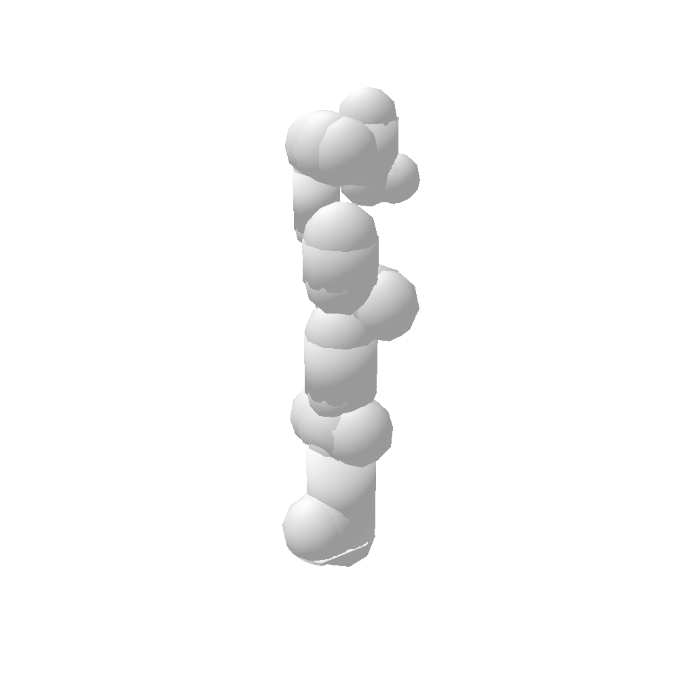</a><br>[front](pybullet/images/oems/xacro_generated/franka_emika/franka_description/robots/panda/panda/front.png) · [side](pybullet/images/oems/xacro_generated/franka_emika/franka_description/robots/panda/panda/side.png) · [top](pybullet/images/oems/xacro_generated/franka_emika/franka_description/robots/panda/panda/top.png) |
| panda | Others | Franka Emika | <a href="mujoco/images/random/robot-assets/franka_panda/panda/iso.png">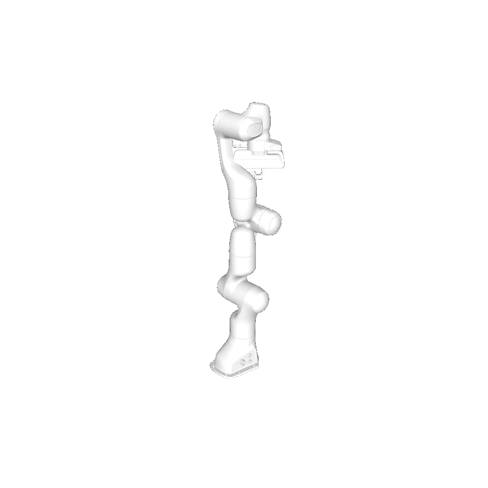</a><br>[front](mujoco/images/random/robot-assets/franka_panda/panda/front.png) · [side](mujoco/images/random/robot-assets/franka_panda/panda/side.png) · [top](mujoco/images/random/robot-assets/franka_panda/panda/top.png) | <a href="pybullet/images/random/robot-assets/franka_panda/panda/iso.png">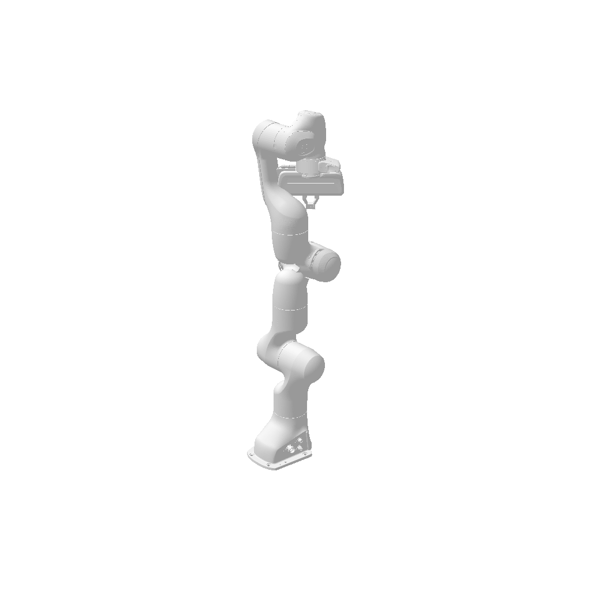</a><br>[front](pybullet/images/random/robot-assets/franka_panda/panda/front.png) · [side](pybullet/images/random/robot-assets/franka_panda/panda/side.png) · [top](pybullet/images/random/robot-assets/franka_panda/panda/top.png) |
| model | Others | KUKA | <a href="mujoco/images/random/robot-assets/kuka_iiwa/model/iso.png">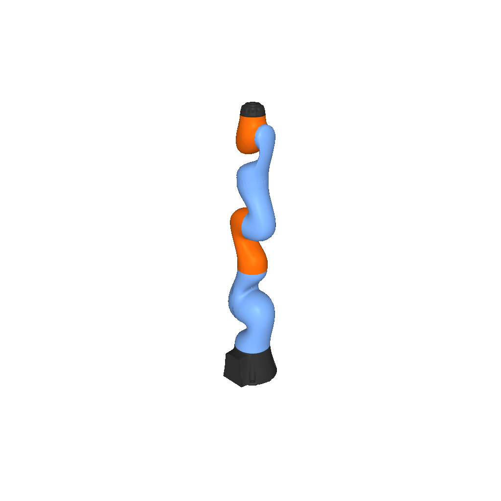</a><br>[front](mujoco/images/random/robot-assets/kuka_iiwa/model/front.png) · [side](mujoco/images/random/robot-assets/kuka_iiwa/model/side.png) · [top](mujoco/images/random/robot-assets/kuka_iiwa/model/top.png) | <a href="pybullet/images/random/robot-assets/kuka_iiwa/model/iso.png">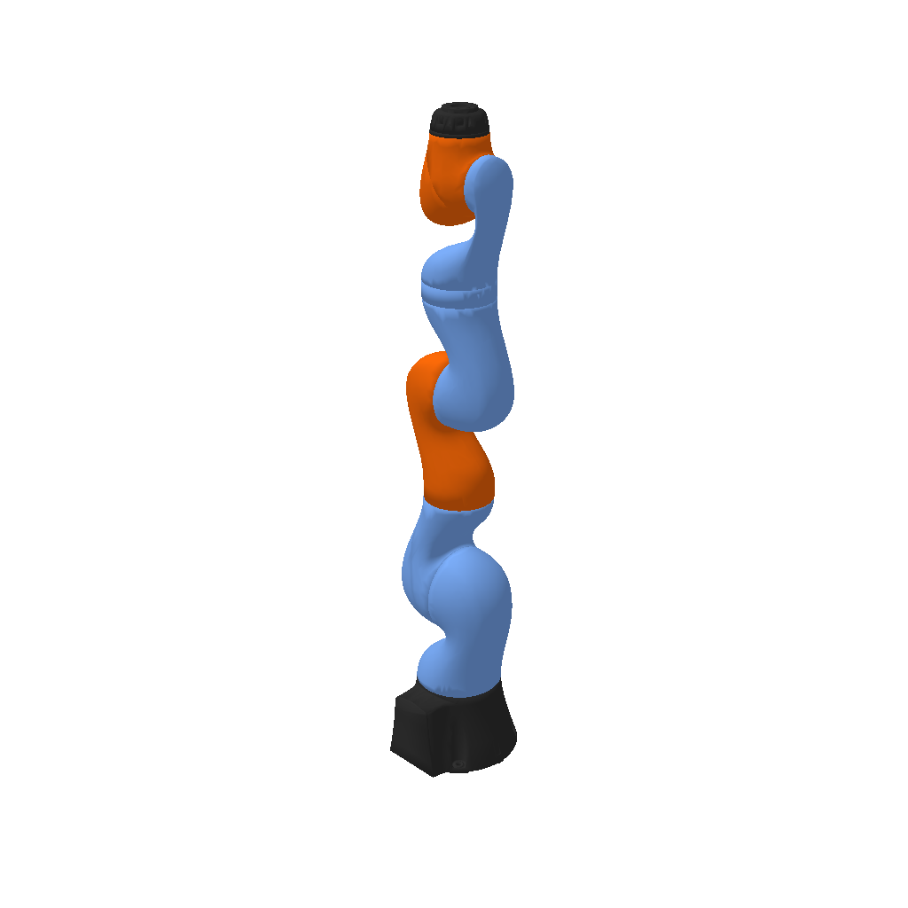</a><br>[front](pybullet/images/random/robot-assets/kuka_iiwa/model/front.png) · [side](pybullet/images/random/robot-assets/kuka_iiwa/model/side.png) · [top](pybullet/images/random/robot-assets/kuka_iiwa/model/top.png) |
| kinova | Others | Kinova | <a href="mujoco/images/random/robot-assets/kinova/kinova/iso.png">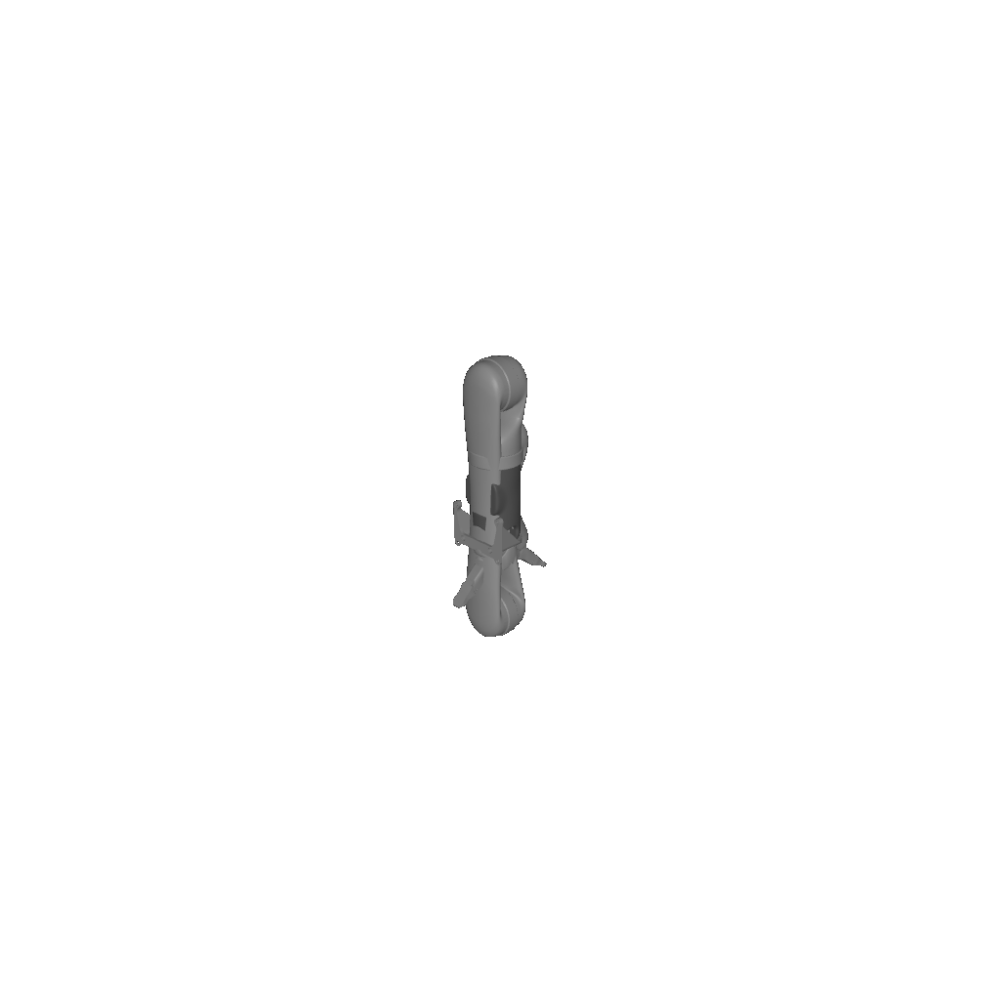</a><br>[front](mujoco/images/random/robot-assets/kinova/kinova/front.png) · [side](mujoco/images/random/robot-assets/kinova/kinova/side.png) · [top](mujoco/images/random/robot-assets/kinova/kinova/top.png) | <a href="pybullet/images/random/robot-assets/kinova/kinova/iso.png">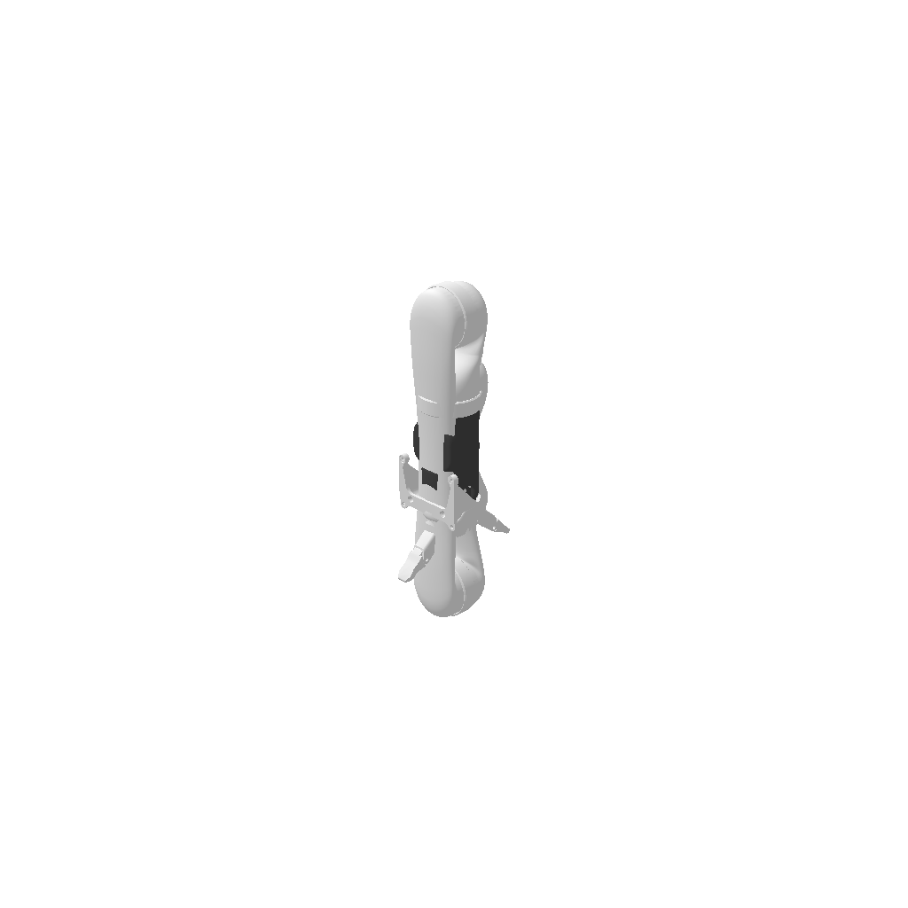</a><br>[front](pybullet/images/random/robot-assets/kinova/kinova/front.png) · [side](pybullet/images/random/robot-assets/kinova/kinova/side.png) · [top](pybullet/images/random/robot-assets/kinova/kinova/top.png) |
| onrobot_<wbr>rg2_<wbr>model | Others | OnRobot | <a href="mujoco/images/random/xacro_generated/osaka_university_onrobot/onrobot_rg2_visualization/onrobot_rg2_model/iso.png">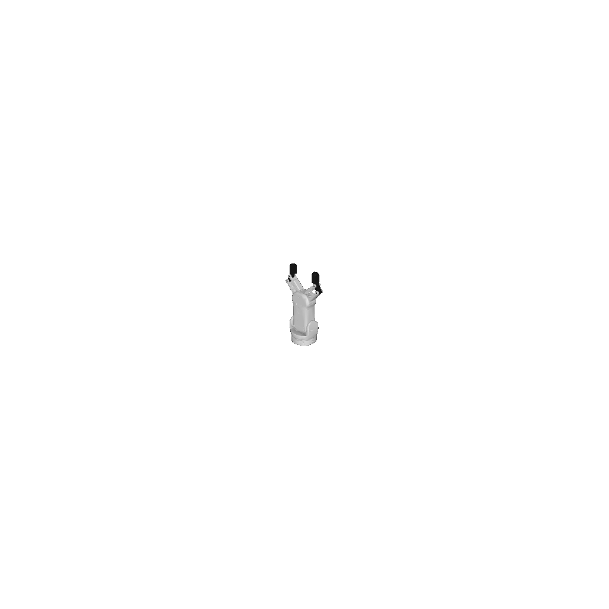</a><br>[front](mujoco/images/random/xacro_generated/osaka_university_onrobot/onrobot_rg2_visualization/onrobot_rg2_model/front.png) · [side](mujoco/images/random/xacro_generated/osaka_university_onrobot/onrobot_rg2_visualization/onrobot_rg2_model/side.png) · [top](mujoco/images/random/xacro_generated/osaka_university_onrobot/onrobot_rg2_visualization/onrobot_rg2_model/top.png) | <a href="pybullet/images/random/xacro_generated/osaka_university_onrobot/onrobot_rg2_visualization/onrobot_rg2_model/iso.png">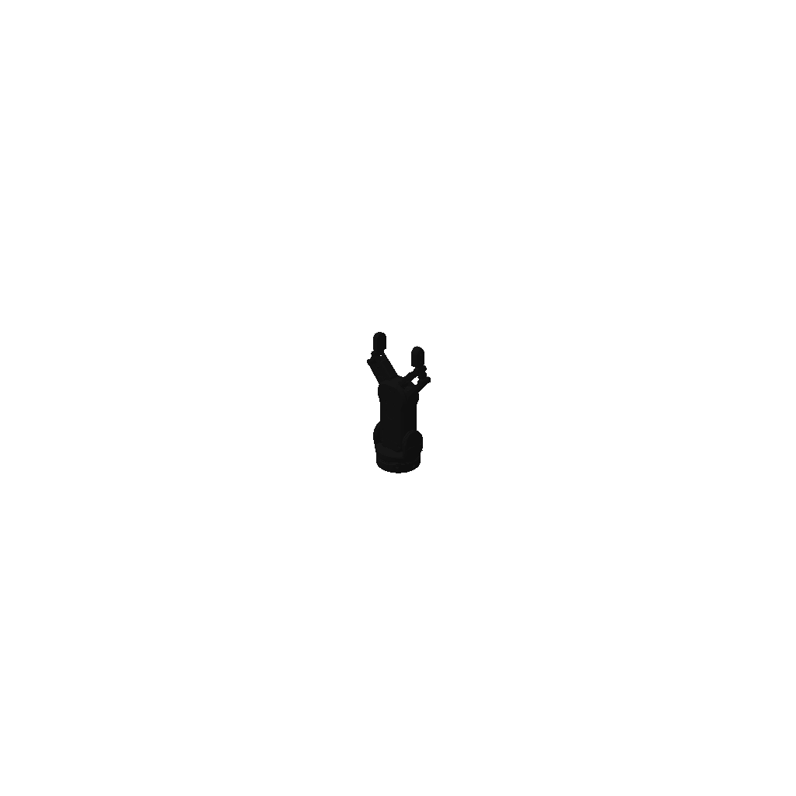</a><br>[front](pybullet/images/random/xacro_generated/osaka_university_onrobot/onrobot_rg2_visualization/onrobot_rg2_model/front.png) · [side](pybullet/images/random/xacro_generated/osaka_university_onrobot/onrobot_rg2_visualization/onrobot_rg2_model/side.png) · [top](pybullet/images/random/xacro_generated/osaka_university_onrobot/onrobot_rg2_visualization/onrobot_rg2_model/top.png) |
| onrobot_<wbr>rg6_<wbr>model | Others | OnRobot | <a href="mujoco/images/random/xacro_generated/osaka_university_onrobot/onrobot_rg6_visualization/onrobot_rg6_model/iso.png">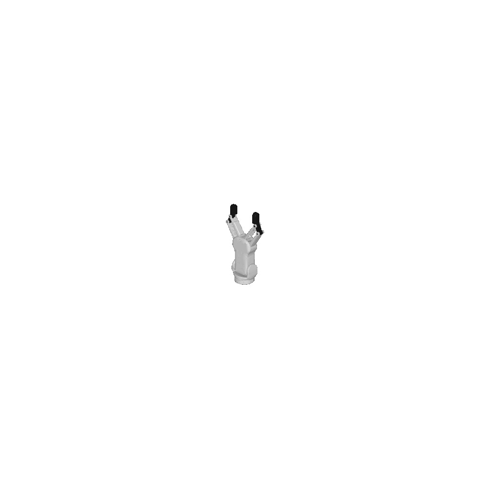</a><br>[front](mujoco/images/random/xacro_generated/osaka_university_onrobot/onrobot_rg6_visualization/onrobot_rg6_model/front.png) · [side](mujoco/images/random/xacro_generated/osaka_university_onrobot/onrobot_rg6_visualization/onrobot_rg6_model/side.png) · [top](mujoco/images/random/xacro_generated/osaka_university_onrobot/onrobot_rg6_visualization/onrobot_rg6_model/top.png) | <a href="pybullet/images/random/xacro_generated/osaka_university_onrobot/onrobot_rg6_visualization/onrobot_rg6_model/iso.png"></a><br>[front](pybullet/images/random/xacro_generated/osaka_university_onrobot/onrobot_rg6_visualization/onrobot_rg6_model/front.png) · [side](pybullet/images/random/xacro_generated/osaka_university_onrobot/onrobot_rg6_visualization/onrobot_rg6_model/side.png) · [top](pybullet/images/random/xacro_generated/osaka_university_onrobot/onrobot_rg6_visualization/onrobot_rg6_model/top.png) |
| schunk_<wbr>lwa4d | Others | SCHUNK | <a href="mujoco/images/random/xacro_generated/schunk_modular_robotics/schunk_description/schunk_lwa4d/iso.png">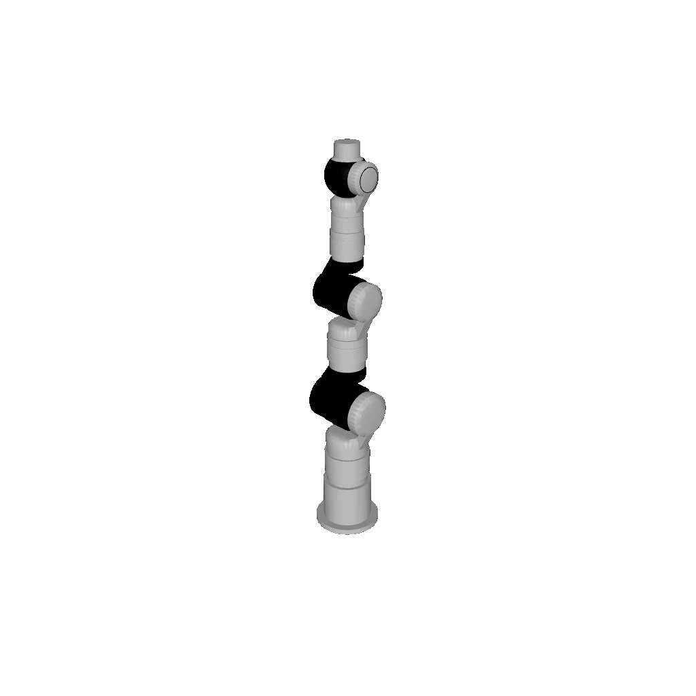</a><br>[front](mujoco/images/random/xacro_generated/schunk_modular_robotics/schunk_description/schunk_lwa4d/front.png) · [side](mujoco/images/random/xacro_generated/schunk_modular_robotics/schunk_description/schunk_lwa4d/side.png) · [top](mujoco/images/random/xacro_generated/schunk_modular_robotics/schunk_description/schunk_lwa4d/top.png) | <a href="pybullet/images/random/xacro_generated/schunk_modular_robotics/schunk_description/schunk_lwa4d/iso.png">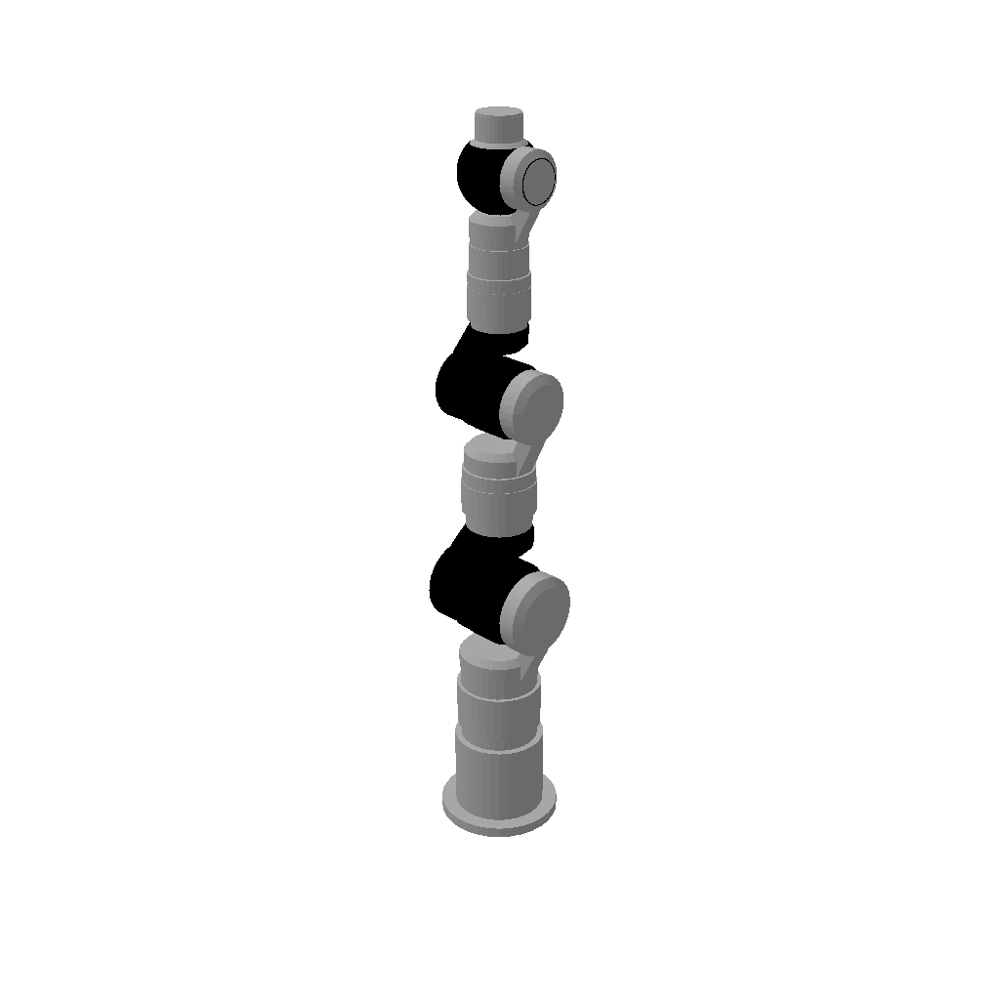</a><br>[front](pybullet/images/random/xacro_generated/schunk_modular_robotics/schunk_description/schunk_lwa4d/front.png) · [side](pybullet/images/random/xacro_generated/schunk_modular_robotics/schunk_description/schunk_lwa4d/side.png) · [top](pybullet/images/random/xacro_generated/schunk_modular_robotics/schunk_description/schunk_lwa4d/top.png) |
| schunk_<wbr>lwa4p | Others | SCHUNK | <a href="mujoco/images/random/xacro_generated/schunk_modular_robotics/schunk_description/schunk_lwa4p/iso.png">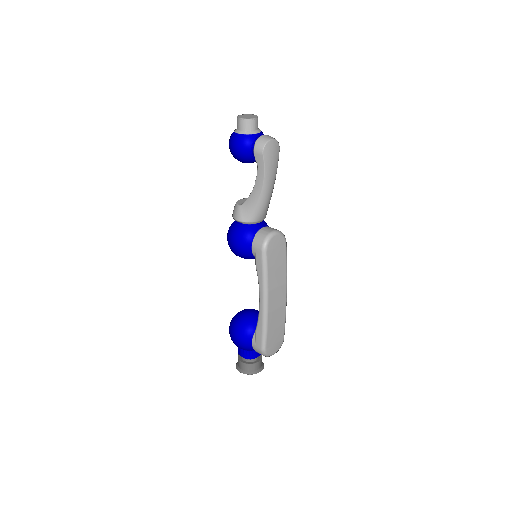</a><br>[front](mujoco/images/random/xacro_generated/schunk_modular_robotics/schunk_description/schunk_lwa4p/front.png) · [side](mujoco/images/random/xacro_generated/schunk_modular_robotics/schunk_description/schunk_lwa4p/side.png) · [top](mujoco/images/random/xacro_generated/schunk_modular_robotics/schunk_description/schunk_lwa4p/top.png) | <a href="pybullet/images/random/xacro_generated/schunk_modular_robotics/schunk_description/schunk_lwa4p/iso.png">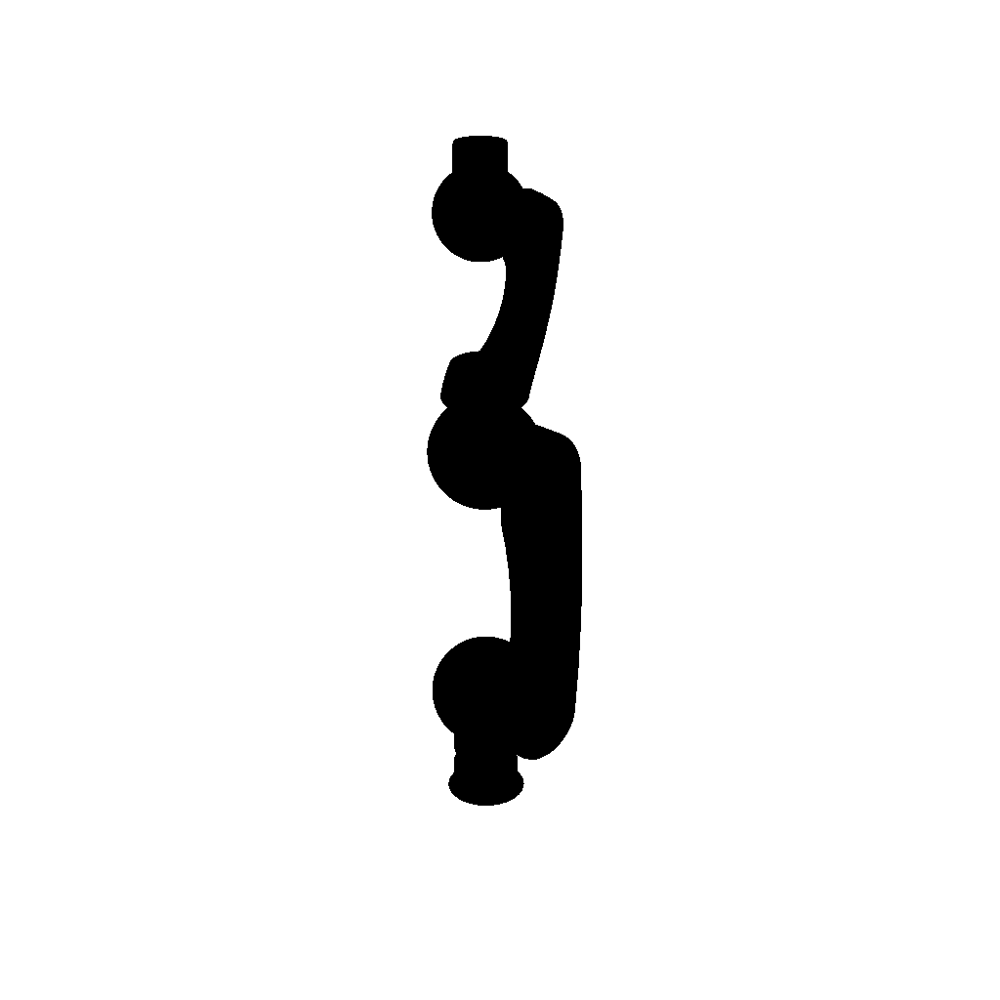</a><br>[front](pybullet/images/random/xacro_generated/schunk_modular_robotics/schunk_description/schunk_lwa4p/front.png) · [side](pybullet/images/random/xacro_generated/schunk_modular_robotics/schunk_description/schunk_lwa4p/side.png) · [top](pybullet/images/random/xacro_generated/schunk_modular_robotics/schunk_description/schunk_lwa4p/top.png) |
| schunk_<wbr>lwa4p_<wbr>extended | Others | SCHUNK | <a href="mujoco/images/random/xacro_generated/schunk_modular_robotics/schunk_description/schunk_lwa4p_extended/iso.png">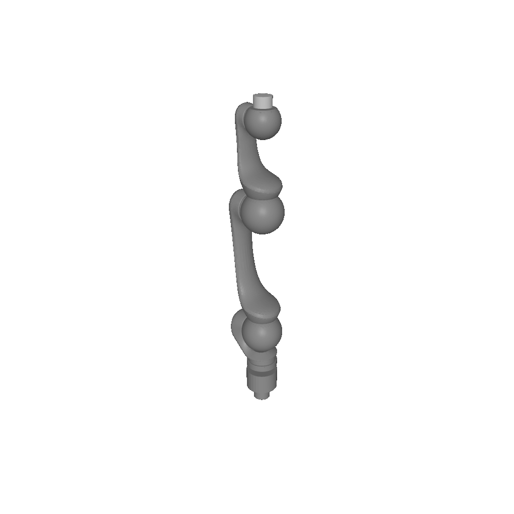</a><br>[front](mujoco/images/random/xacro_generated/schunk_modular_robotics/schunk_description/schunk_lwa4p_extended/front.png) · [side](mujoco/images/random/xacro_generated/schunk_modular_robotics/schunk_description/schunk_lwa4p_extended/side.png) · [top](mujoco/images/random/xacro_generated/schunk_modular_robotics/schunk_description/schunk_lwa4p_extended/top.png) | <a href="pybullet/images/random/xacro_generated/schunk_modular_robotics/schunk_description/schunk_lwa4p_extended/iso.png">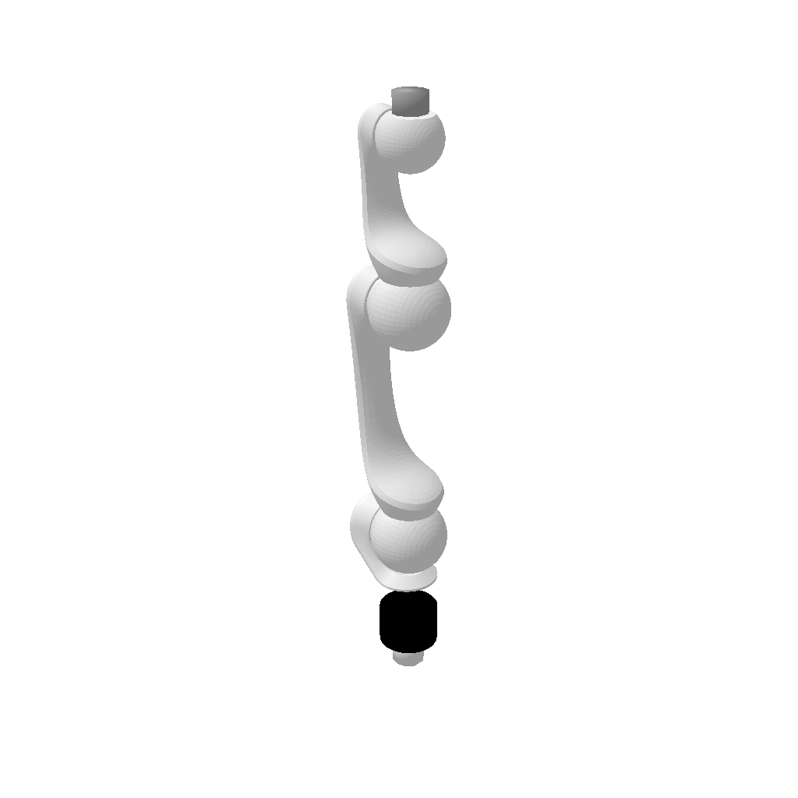</a><br>[front](pybullet/images/random/xacro_generated/schunk_modular_robotics/schunk_description/schunk_lwa4p_extended/front.png) · [side](pybullet/images/random/xacro_generated/schunk_modular_robotics/schunk_description/schunk_lwa4p_extended/side.png) · [top](pybullet/images/random/xacro_generated/schunk_modular_robotics/schunk_description/schunk_lwa4p_extended/top.png) |

## Notes

- Only paired fixed-base robotic manipulators are retained.
- Robot hands/grippers, mobile robots, humanoids/legged robots, and explicit dual-arm examples are excluded.
- Each retained robot is available in both renderer folders.
- The two renderer folders should preserve the same relative `images/` directory structure.

